# 实习

找大厂

早投

遇见做过的题,要假装思考

八股决定下限,手撕决定上限


八股

根据面试所问的场景题比较重要,因为他们是基于简历的项目和实习去问的


项目

去找网上卖课的项目,吃透文档!不用真的敲

外卖点评,来不及也能用


暑期实习是在研二下的暑假!,一般要在研二下的的开学之初就要去投递了

暑期实习是用来作为秋招的重要部分,要有产出!自己总结自己的产出


AI应用


要使用vibe coding

# 总结

**一旦题目提到常数空间**，对于链表题就是原地反转链表，对于数组题就是利用数组里元素的空间暂存元素

# 1俩数之和

[1. 两数之和](https://leetcode.cn/problems/two-sum/)

给定一个整数数组 `nums` 和一个整数目标值 `target`，请你在该数组中找出 **和为目标值** *`target`* 的那 **两个** 整数，并返回它们的数组下标。

你可以假设每种输入只会对应一个答案，并且你不能使用两次相同的元素。

你可以按任意顺序返回答案。

 

**思路:使用map集合,边判断边遍历放入,因为hashmap查找是o1**

**示例 1：**

```
输入：nums = [2,7,11,15], target = 9
输出：[0,1]
解释：因为 nums[0] + nums[1] == 9 ，返回 [0, 1] 
```

```java
    public int[] twoSum(int[] nums, int target) {
        Map<Integer,Integer> map = new HashMap<>();
        int[] result = new int[2];
        //使用map集合,边判断边遍历放入,因为hashmap查找是o1
        for(int i = 0;i<nums.length;i++){
            int value = target - nums[i];
            //如果集合中存在与之互补的,则直接返回
            if(map.containsKey(value)){
                result[0] = i;
                result[1] = map.get(value);
                return result;
            }
            map.put(nums[i],i);
        }
        return result;
    }
```


# 20有效括号

[20. 有效的括号](https://leetcode.cn/problems/valid-parentheses/)

给定一个只包括 `'('`，`')'`，`'{'`，`'}'`，`'['`，`']'` 的字符串 `s` ，判断字符串是否有效。

有效字符串需满足：

1. 左括号必须用相同类型的右括号闭合。
2. 左括号必须以正确的顺序闭合。
3. 每个右括号都有一个对应的相同类型的左括号。

**关键:使用栈即可,左括号就push右括号,右括号相同就pop,最后检查是否empty**

```java
    public boolean isValid(String s) {
        Stack<Character> stack = new Stack<>();
        for(int i=0;i<s.length();i++){
            char c = s.charAt(i);
            if(c=='(')stack.push(')');
            else if(c=='[')stack.push(']');
            else if(c=='{')stack.push('}');
            else if(stack.empty()||stack.peek()!=c)return false;
            else stack.pop();
        }
        return stack.empty();
    }
```

# 70爬楼梯

[70. 爬楼梯](https://leetcode.cn/problems/climbing-stairs/)


假设你正在爬楼梯。需要 `n` 阶你才能到达楼顶。

每次你可以爬 `1` 或 `2` 个台阶。你有多少种不同的方法可以爬到楼顶呢？

 

**示例 1：**

```
输入：n = 2
输出：2
解释：有两种方法可以爬到楼顶。
1. 1 阶 + 1 阶
2. 2 阶
```

**提示：**

- `1 <= n <= 45`

**思路:典型递归**

```java
    public int climbStairs(int n) {
         if(n <= 2){//当有0、1、2个台阶时，分别有0、1、2种方法
            return n;
        }
        int[] dp = new int[n]; //记录从1个台阶到n个台阶中，每个台阶所需要的方法。
        dp[0] = 1; //dp[0]是第一个台阶
        dp[1] = 2; //dp[1]是第二个台阶
        for(int i = 2; i < n; i++){//i=2时是第三个台阶，i=n-1时是第n个台阶。
            dp[i] = dp[i-1] + dp[i-2];
        }
        return dp[n-1]; //dp[n-1]是第n个台阶

    }
```

# 101对称二叉树

[101. 对称二叉树](https://leetcode.cn/problems/symmetric-tree/)

给你一个二叉树的根节点 `root` ， 检查它是否轴对称。

**思路:使用递归,判断里侧和外侧的子节点是否相等**

**示例 1：**


```
输入：root = [1,2,2,3,4,4,3]
输出：true
```


```java
    public boolean isSymmetric(TreeNode root) {
        if(root==null)return true;
        TreeNode left = root.left;
        TreeNode right = root.right;
        return compare(left,right);
    }
    public boolean compare(TreeNode left,TreeNode right)
    {
        if(left==null&&right==null)return true;
        else if(left==null&&right!=null)return false;
        else if(left!=null&&right==null)return false;
        else if(left.val!=right.val)return false;
        //以下情况是左右有数值且相等的情况
        boolean a = compare(left.left,right.right);
        boolean b = compare(left.right,right.left);
        return a&&b;

    }
```

# 104二叉树的最大深度

[104. 二叉树的最大深度](https://leetcode.cn/problems/maximum-depth-of-binary-tree/)

给定一个二叉树 `root` ，返回其最大深度。

二叉树的 **最大深度** 是指从根节点到最远叶子节点的最长路径上的节点数。

**思路:    后序遍历,使用递归,分别获得左节点和右节点的深度,最大深度就是俩个的最大值+1(自身节点)**

**示例 1：**


 

```
输入：root = [3,9,20,null,null,15,7]
输出：3
```

```java
     //使用递归,分别获得左节点和右节点的深度,最大深度就是俩个的最大值+1(自身节点)
    //后序遍历
    public int maxDepth(TreeNode root) {
        if(root==null)return 0;
        int left = maxDepth(root.left);
        int right = maxDepth(root.right);
        return Math.max(left,right)+1;
    }
```

# 160相交链表

[160. 相交链表](https://leetcode.cn/problems/intersection-of-two-linked-lists/)


给你两个单链表的头节点 `headA` 和 `headB` ，请你找出并返回两个单链表相交的起始节点。如果两个链表不存在相交节点，返回 `null` 。

图示两个链表在节点 `c1` 开始相交**：**


题目数据 **保证** 整个链式结构中不存在环。

**注意**，函数返回结果后，链表必须 **保持其原始结构** 。

**思路:若相交,由于俩链表的总和是一样的,想象他们是一个圆圈!连起来,一起从起点出发肯定会相遇
 如果不相遇,也会共同达到null**

```java
    //思路:若相交,由于俩链表的总和是一样的,想象他们是一个圆圈!连起来,一起从起点出发肯定会相遇
    //如果不相遇,也会共同达到null
    public ListNode getIntersectionNode(ListNode headA, ListNode headB) {
        ListNode tempA = headA;
        ListNode tempB = headB;
        while(tempA!=tempB){
            tempA=tempA==null?headB:tempA.next;
            tempB=tempB==null?headA:tempB.next;
        }
        return tempA;
    }
```

# 226翻转二叉树

[226. 翻转二叉树](https://leetcode.cn/problems/invert-binary-tree/)

给你一棵二叉树的根节点 `root` ，翻转这棵二叉树，并返回其根节点。

 **思路:使用递归,使用前序遍历,先反转根的左右,再反转左子树的,再反转右子树的**

**示例 1：**


```
输入：root = [4,2,7,1,3,6,9]
输出：[4,7,2,9,6,3,1]
```

```java
    //思路,使用递归,使用前序遍历,先反转根的左右,再反转左子树的,再反转右子树的
    public TreeNode invertTree(TreeNode root) {
        if(root==null)return null;
        swap(root);
        invertTree(root.left);
        invertTree(root.right);
        return root;
    }
    public void swap(TreeNode root){
        TreeNode temp = root.left;
        root.left = root.right;
        root.right = temp;
    }
```

# 2俩数相加

[2. 两数相加](https://leetcode.cn/problems/add-two-numbers/)

给你两个 **非空** 的链表，表示两个非负的整数。它们每位数字都是按照 **逆序** 的方式存储的，并且每个节点只能存储 **一位** 数字。

请你将两个数相加，并以相同形式返回一个表示和的链表。

你可以假设除了数字 0 之外，这两个数都不会以 0 开头。

 **思路:   使用一个进位carry进行中转,注意边界情况
长短不一,就每次判断,遇到空的,说明值是0**

**示例 1：**


```
输入：l1 = [2,4,3], l2 = [5,6,4]
输出：[7,0,8]
解释：342 + 465 = 807.
```

```java
    //思路:使用一个进位carry进行中转,注意边界情况
    //长短不一,就每次判断,遇到空的,说明值是0
    public ListNode addTwoNumbers(ListNode l1, ListNode l2) {
        if(l1==null&&l2==null)return null;
        ListNode head =null;
        ListNode tail = head;
        int carry =0;
        while(l1!=null||l2!=null){
            int val1 = l1!=null?l1.val:0;
            int val2 = l2!=null?l2.val:0;
            //注意此处sum的算法
            int sum = val1+val2+carry;
            //第一次
            if(head==null&&tail==null){
                head = tail = new ListNode(sum%10);
            }
            //之后
            else{
                tail.next = new ListNode(sum%10);
                tail= tail.next;
            }
            carry = sum/10;
            l1= l1==null?null:l1.next;
            l2= l2==null?null:l2.next;
        }
        if(carry>0){
            tail.next = new ListNode(carry);
            tail=tail.next;
        }
        return head;
    }
```

# 3无重复的最长字串

[3. 无重复字符的最长子串](https://leetcode.cn/problems/longest-substring-without-repeating-characters/)

给定一个字符串 `s` ，请你找出其中不含有重复字符的 **最长 子串** 的长度。


**示例 1:**

```
输入: s = "abcabcbb"
输出: 3 
解释: 因为无重复字符的最长子串是 "abc"，所以其长度为 3。注意 "bca" 和 "cab" 也是正确答案。
```


 **思路:使用HashMap来判断是否重复,使用滑动窗口来优化,注意start的变动**

```java
    public int lengthOfLongestSubstring(String s) {
        //使用hashMap来判断是否重复
        //使用滑动窗口来优化
        Map<Character,Integer> map =new HashMap<>();
        int cur =0;
        int start = 0;
        int res = 0;
        while(cur<s.length()){
            char curC = s.charAt(cur);
            //直接将start移到重复数字的后一位,保证范围里面的不重复
            if(map.containsKey(curC)){
                //由于map的是没有进行删除的,所以start可能会存在后退,比如abba,遇到第二个a时start会退到第一个b的位置,这样导致窗口内出现了重复元素b,所以使用max,只取后面的
                start = Math.max(map.get(curC)+1,start);
            }
            //不重复就可以放进去了
            map.put(curC,cur);
            //每次都统计结果,所以是cur和start这个范围肯定没有重复的
            res = Math.max(res,cur-start+1);
            cur++;
        }
        return res;
    }
```

# 5最长回文字串

[5. 最长回文子串](https://leetcode.cn/problems/longest-palindromic-substring/)

给你一个字符串 `s`，找到 `s` 中最长的 回文 子串。

 **思路:中心扩展法,遍历字符串,以每一个char为中心去寻找
    回文字串长度为奇数时,中心就是只有一个,偶数时,中心是俩个
    注意长度的计算,要算满足条件的**

**示例 1：**

```
输入：s = "babad"
输出："bab"
解释："aba" 同样是符合题意的答案。
```


```java
//中心扩展法,遍历字符串,以每一个char为中心去寻找
    //回文字串长度为奇数时,中心就是只有一个,偶数时,中心是俩个
    //注意长度的计算,要算满足条件的
    public String longestPalindrome(String s) {
        String res = "";
        for(int i = 0;i<s.length();i++){
            //回文为奇数时
            int l = i-1;
            int r = i+1;
            while(l>=0&&r<s.length()&&s.charAt(l)==s.charAt(r)){l--;r++;}
            //统计结果,注意是不满足才跳出的,所以是r-l+1-2
            if(res.length()<r-l-1)res=s.substring(l+1,r);//左闭右开,实际就是l+1,r-1
        
            //回文为偶数时
            l = i;
            r = i+1;
            while(l>=0&&r<s.length()&&s.charAt(l)==s.charAt(r)){l--;r++;}
            //统计结果,注意是不满足才跳出的,所以是r-l+1-2
            if(res.length()<r-l-1)res=s.substring(l+1,r);
        }
        return res;
    }
```


# 647回文子串

[647. 回文子串](https://leetcode.cn/problems/palindromic-substrings/)

中等

给你一个字符串 `s` ，请你统计并返回这个字符串中 **回文子串** 的数目。

**回文字符串** 是正着读和倒过来读一样的字符串。

**子字符串** 是字符串中的由连续字符组成的一个序列。

 

**示例 1：**

```
输入：s = "abc"
输出：3
解释：三个回文子串: "a", "b", "c"
```

````
# 回文子串

```java
public int countSubstrings(String s) {
        if(s.length()==0||s==null)return 0;
        if(s.length()==1)return 1;
        int num =0;
        for(int i =0;i<s.length();i++){
            //本身自己是一个
            num++;
            //回文序列长度为奇数
            int left = i-1;
            int right = i+1;
            while(left<right&&left>=0&&right<s.length()){
                if(s.charAt(left)==s.charAt(right)){
                    num++;
                    left--;
                    right++;
                }
                else break;
            }
            //回文序列长度为偶数
            left = i;
            right = i+1;
            while(left<right&&left>=0&&right<s.length()){
                if(s.charAt(left)==s.charAt(right)){
                    num++;
                    left--;
                    right++;
                }
                else break;    
            }
        }
        return num;
    }
```


````


# 15三数之和

[15. 三数之和](https://leetcode.cn/problems/3sum/)

给你一个整数数组 `nums` ，判断是否存在三元组 `[nums[i], nums[j], nums[k]]` 满足 `i != j`、`i != k` 且 `j != k` ，同时还满足 `nums[i] + nums[j] + nums[k] == 0` 。请你返回所有和为 `0` 且不重复的三元组。

**注意：**答案中不可以包含重复的三元组。

**示例 1：**

```
输入：nums = [-1,0,1,2,-1,-4]
输出：[[-1,-1,2],[-1,0,1]]
解释：
nums[0] + nums[1] + nums[2] = (-1) + 0 + 1 = 0 。
nums[1] + nums[2] + nums[4] = 0 + 1 + (-1) = 0 。
nums[0] + nums[3] + nums[4] = (-1) + 2 + (-1) = 0 。
不同的三元组是 [-1,0,1] 和 [-1,-1,2] 。
注意，输出的顺序和三元组的顺序并不重要。
```

```java
//思路:将数组排序后,依次遍历数组,当前为i,left为i+1,right为末尾,这样就将三元问题降为二元问题
//接下来如何移动left 和right呢， 如果nums[i] + nums[left] + nums[right] > 0 就说明 此时三数之和大了，因为数组是排序后了，所以right下标就应该向左移动，这样才能让三数之和小一些。反之可推,直到相等
//减枝:只要最左边的元素大于0了,就说明不可能了,直接结束,返回答案
//去重:对abc分别去重,即对应abc位置相邻元素相同的,直接跳过
        public List<List<Integer>> threeSum(int[] nums) {
        List<List<Integer>> result = new ArrayList<>();
        //排序
        Arrays.sort(nums);
        //遍历,降维
        for(int i=0;i<nums.length;i++){
            //减枝
            if(nums[i]>0)return result;
            //对i去重
            if(i>0&&nums[i]==nums[i-1])continue;
            //进行搜索
            int left = i+1;
            int right = nums.length-1;
            //注意不能等于,因为不能重复
            while(left<right){
                if(nums[i]+nums[left]+nums[right]>0)right--;
                else if(nums[i]+nums[left]+nums[right]<0)left++;
                else{
                    //收集结果
                    List<Integer> temp = new ArrayList<>();
                    Collections.addAll(temp,nums[i],nums[left],nums[right]);
                    result.add(temp);
                    //对left和right去重
                    while(left<right && nums[right-1]==nums[right]) right--;
                    while(left<right && nums[left+1]==nums[left]) left++;
                    //搜索下一个
                    left++;
                    right--;
                }
            }
        }
        return result;
    }
```

# 19.删除倒数第n个节点

[19. 删除链表的倒数第 N 个结点](https://leetcode.cn/problems/remove-nth-node-from-end-of-list/)

**思路:快慢指针和虚拟头节点**

给你一个链表，删除链表的倒数第 `n` 个结点，并且返回链表的头结点。

 

**示例 1：**


```
输入：head = [1,2,3,4,5], n = 2
输出：[1,2,3,5]
```

```java
//使用快慢指针,快指针先走n+1同时注意可能删除的是头节点,需要留一个虚拟头节点
    public ListNode removeNthFromEnd(ListNode head, int n) {
        ListNode prehead = new ListNode(0,head);
        ListNode slow = prehead;
        ListNode fast = prehead;

        //快指针走n+1步
        for(int i =0;i<=n;i++){
            fast=fast.next;
        }
        //快慢一起走,直到快指针到达null,此时慢指针就必然是需要删除的前一个
        while(fast!=null){
            slow=slow.next;
            fast=fast.next;
        }
        //执行删除
        slow.next=slow.next.next;
        //返回虚拟节点的下一个
        return prehead.next;
    }
```


# 二叉树的层序遍历

[102. 二叉树的层序遍历](https://leetcode.cn/problems/binary-tree-level-order-traversal/)

给你二叉树的根节点 `root` ，返回其节点值的 **层序遍历** 。 （即逐层地，从左到右访问所有节点）。

 **思路:使用双端队列**

**示例 1：**


```
输入：root = [3,9,20,null,null,15,7]
输出：[[3],[9,20],[15,7]]
```

```java
//使用双端队列
    public List<List<Integer>> levelOrder(TreeNode root) {
        List<List<Integer>> result = new ArrayList<>();
        if(root==null)return result;
        Queue<TreeNode> que = new LinkedList<>();
        que.add(root);
        while(!que.isEmpty()){
            int size = que.size();
            List<Integer>list = new ArrayList<>();
            //此处进行遍历每一层
            while(size>0){
                TreeNode node = que.poll();
                list.add(node.val);
                if(node.left!=null)que.add(node.left);
                if(node.right!=null)que.add(node.right);
                size--;
            }
            result.add(list);
        }
        return result;
    }
```


# 347前K个高频元素

[347. 前 K 个高频元素](https://leetcode.cn/problems/top-k-frequent-elements/)

给你一个整数数组 `nums` 和一个整数 `k` ，请你返回其中出现频率前 `k` 高的元素。你可以按 **任意顺序** 返回答案。

**示例 1：**

**输入：**nums = [1,1,1,2,2,3], k = 2

**输出：**[1,2]

```java
    //使用HashMap进行收集频次,并使用小顶堆遍历map集合,一旦有大于的就把顶部弹出
    public int[] topKFrequent(int[] nums, int k) {
        //收集频次
        HashMap<Integer,Integer>map = new HashMap<>();
        for(int num:nums){
            if(map.containsKey(num)){
                int count = map.get(num);
                map.put(num,++count);
            }
            else{
                map.put(num,1);
            }
        }
        //构建小顶堆,本质是一个二叉搜索树,以val升序排序
        PriorityQueue<int[]>pq = new PriorityQueue<>((o1,o2)->o1[1]-o2[1]);
        for(Map.Entry<Integer,Integer> entry:map.entrySet()){
            if(pq.size()<k){
                pq.add(new int[]{entry.getKey(),entry.getValue()});
            }
            else{
                if(entry.getValue()>pq.peek()[1]){
                    pq.poll();
                    pq.add(new int[]{entry.getKey(),entry.getValue()});
                }
            }
        }

        int[] result = new int[k];
        for(int i =0;!pq.isEmpty();i++){
            result[i]=pq.poll()[0];
        }
        return result;
    }
```

# 239滑动窗口最大值

[239. 滑动窗口最大值](https://leetcode.cn/problems/sliding-window-maximum/)


给你一个整数数组 `nums`，有一个大小为 `k` 的滑动窗口从数组的最左侧移动到数组的最右侧。你只可以看到在滑动窗口内的 `k` 个数字。滑动窗口每次只向右移动一位。

返回 *滑动窗口中的最大值* 。

 

**示例 1：**

```
输入：nums = [1,3,-1,-3,5,3,6,7], k = 3
输出：[3,3,5,5,6,7]
解释：
滑动窗口的位置                最大值
---------------               -----
[1  3  -1] -3  5  3  6  7       3
 1 [3  -1  -3] 5  3  6  7       3
 1  3 [-1  -3  5] 3  6  7       5
 1  3  -1 [-3  5  3] 6  7       5
 1  3  -1  -3 [5  3  6] 7       6
 1  3  -1  -3  5 [3  6  7]      7
```

```java
//思路:使用双端队列ArrayDeque,并维护双端队列的单调性,以及维护窗口长度
    //最后只需要取队列最左边即可
    //队列存储的是序号
    public int[] maxSlidingWindow(int[] nums, int k) {
        //只有ArrayDeque才能访问队尾,Queue不行
        ArrayDeque<Integer> adq = new ArrayDeque<>();
        int n = nums.length;
        int[]result = new int[n-k+1];
        int idx=0;
        for(int i = 0;i<n;i++){
            //当窗口长度大于了k,则需要弹出,即队列最左边序号小于i-k+1
            if(!adq.isEmpty()&&adq.peek()<i-k+1){
                adq.poll();
            }
            //保持单调性,即最左边的数要是最大的,那么在添加的时候,需要依次与last做对比,大于的将last弹出,直到小于
            while(!adq.isEmpty()&&nums[i]>nums[adq.peekLast()]){
                adq.pollLast();
            }
            //添加新的
            adq.add(i);
            //当i达到收集位置最左边k-1开始收集
            if(i>=k-1){
                result[idx++]=nums[adq.peek()];
            }
        }
        return result;
    }
```


# 94二叉树的中序遍历

[94. 二叉树的中序遍历](https://leetcode.cn/problems/binary-tree-inorder-traversal/)

给定一个二叉树的根节点 `root` ，返回 *它的 **中序** 遍历* 。

**示例 1：**


```
输入：root = [1,null,2,3]
输出：[1,3,2]
```

```java
//使用递归
    public List<Integer> inorderTraversal(TreeNode root) {
        List<Integer> result = new ArrayList<>();
        find(result,root);
        return result;
    }
    public void find(List<Integer> list,TreeNode root){
        if(root==null)return;
        find(list,root.left);
        list.add(root.val);
        find(list,root.right);
    }
```

```java
//使用统一迭代法,利用栈以及null来实现
    //使用统一迭代法,使用栈,调整入栈出栈顺序,引入null来判断什么时候收集数据
    public List<Integer> inorderTraversal(TreeNode root) {
        Stack<TreeNode> stack = new Stack<>();
        List<Integer> result = new ArrayList<>();
        if(root!=null)stack.push(root);
        while(!stack.empty()){
            TreeNode node = stack.peek();
            if(node!=null){
                stack.pop();
                if(node.right!=null)stack.push(node.right);
                stack.push(node);
                stack.push(null);
                if(node.left!=null)stack.push(node.left);
            }else{
                stack.pop();
                result.add(stack.pop().val);
            }
        }
        return result;
    }
```


# 121.买卖股票的最佳时机

[121. 买卖股票的最佳时机](https://leetcode.cn/problems/best-time-to-buy-and-sell-stock/)

给定一个数组 `prices` ，它的第 `i` 个元素 `prices[i]` 表示一支给定股票第 `i` 天的价格。

你只能选择 **某一天** 买入这只股票，并选择在 **未来的某一个不同的日子** 卖出该股票。设计一个算法来计算你所能获取的最大利润。

返回你可以从这笔交易中获取的最大利润。如果你不能获取任何利润，返回 `0` 。

 

**示例 1：**

```
输入：[7,1,5,3,6,4]
输出：5
解释：在第 2 天（股票价格 = 1）的时候买入，在第 5 天（股票价格 = 6）的时候卖出，最大利润 = 6-1 = 5 。
     注意利润不能是 7-1 = 6, 因为卖出价格需要大于买入价格；同时，你不能在买入前卖出股票。
```

```java
    //动态规划,取前i天的最低成本和前i天的最高利润
    public int maxProfit(int[] prices) {
        int cost = Integer.MAX_VALUE;
        int profit = 0;
        for(int i =0;i<prices.length;i++){
            cost = Math.min(cost,prices[i]);
            profit = Math.max(profit,prices[i]-cost);
        }
        return profit;
    }
```


# 141环形链表

[141. 环形链表](https://leetcode.cn/problems/linked-list-cycle/)

给你一个链表的头节点 `head` ，判断链表中是否有环。

如果链表中有某个节点，可以通过连续跟踪 `next` 指针再次到达，则链表中存在环。 为了表示给定链表中的环，评测系统内部使用整数 `pos` 来表示链表尾连接到链表中的位置（索引从 0 开始）。**注意：`pos` 不作为参数进行传递** 。仅仅是为了标识链表的实际情况。

*如果链表中存在环* ，则返回 `true` 。 否则，返回 `false` 。

 

**示例 1：**


```
输入：head = [3,2,0,-4], pos = 1
输出：true
解释：链表中有一个环，其尾部连接到第二个节点。
```

```java
    //快慢指针
    public boolean hasCycle(ListNode head) {
        ListNode fast = head;
        ListNode slow = head;
        while(fast!=null&&fast.next!=null){
            fast=fast.next.next;
            slow = slow.next;
            if(slow==fast)return true;
        }

        return false;
    }
```

# 142环形链表Ⅱ

[142. 环形链表 II](https://leetcode.cn/problems/linked-list-cycle-ii/)

给定一个链表的头节点  `head` ，返回链表开始入环的第一个节点。 *如果链表无环，则返回 `null`。*

如果链表中有某个节点，可以通过连续跟踪 `next` 指针再次到达，则链表中存在环。 为了表示给定链表中的环，评测系统内部使用整数 `pos` 来表示链表尾连接到链表中的位置（**索引从 0 开始**）。如果 `pos` 是 `-1`，则在该链表中没有环。**注意：`pos` 不作为参数进行传递**，仅仅是为了标识链表的实际情况。

**不允许修改** 链表。

 **思路:快慢指针**

**示例 1：**


```
输入：head = [3,2,0,-4], pos = 1
输出：返回索引为 1 的链表节点
解释：链表中有一个环，其尾部连接到第二个节点。
```

```java
    //先判断是否有环
    //一个快指针,一下子走俩,慢指针一下子走1
    //从环内相遇的地方和头节点一起出发,会在环开始节点相遇
    public ListNode detectCycle(ListNode head) {
        if(head==null||head.next==null)return null;
        ListNode preHead = head;
        ListNode fast = head;
        ListNode slow = head;
        while(fast!=null&&fast.next!=null){
            fast=fast.next.next;
            slow=slow.next;
            if(slow==fast){
                while(preHead!=fast){
                    preHead=preHead.next;
                    fast=fast.next;
                }
                return preHead;
            }
        }
        return null;
    }
```


# 236二叉树的最近公共祖先

[236. 二叉树的最近公共祖先](https://leetcode.cn/problems/lowest-common-ancestor-of-a-binary-tree/)

给定一个二叉树, 找到该树中两个指定节点的最近公共祖先。

[百度百科](https://baike.baidu.com/item/最近公共祖先/8918834?fr=aladdin)中最近公共祖先的定义为：“对于有根树 T 的两个节点 p、q，最近公共祖先表示为一个节点 x，满足 x 是 p、q 的祖先且 x 的深度尽可能大（**一个节点也可以是它自己的祖先**）。”

**示例 1：**


```
输入：root = [3,5,1,6,2,0,8,null,null,7,4], p = 5, q = 1
输出：3
解释：节点 5 和节点 1 的最近公共祖先是节点 3 。
```

**思路:使用递归,p q都能找到 返回最近公共祖先 2. p q 找到一个，返回p q 3. 都没找到 返回null**

```java
    //如果root是null或p或q都返回root
    //否则递归查看left,和right,left为null,则返回right,反之可推
    //left和right都不是null,则说明root就是最近的公共祖先
    public TreeNode lowestCommonAncestor(TreeNode root, TreeNode p, TreeNode q) {
        if(root==null||root==p||root==q)return root;
        TreeNode left = lowestCommonAncestor(root.left,p,q);
        TreeNode right = lowestCommonAncestor(root.right,p,q);
        if(left==null)return right;
        if(right==null)return left;
        //以下情况说明都不为null,即所取
        return root;
    }
```

# 反转链表

[206. 反转链表](https://leetcode.cn/problems/reverse-linked-list/)

**思路:定义一个虚假头节点null,从head开始依次反转即可
    //想象三个指针移动的过程,前,中,后,判断结束条件**

给你单链表的头节点 `head` ，请你反转链表，并返回反转后的链表。

**示例 1：**


```
输入：head = [1,2,3,4,5]
输出：[5,4,3,2,1]
```


```java
    //思路:定义一个虚假头节点null,从head开始依次反转即可
    //想象三个指针移动的过程,前,中,后,判断结束条件
    public ListNode reverseList(ListNode head) {
        if(head==null||head.next==null)return head;
        ListNode pre = null;
        ListNode cur = head;
        while(cur!=null){
            ListNode next = cur.next;
            cur.next = pre;
            pre = cur;
            cur = next;
        }
        return pre;
    }
```


# 234回文链表

[234. 回文链表](https://leetcode.cn/problems/palindrome-linked-list/)

给你一个单链表的头节点 `head` ，请你判断该链表是否为回文链表。如果是，返回 `true` ；否则，返回 `false` 。

**示例 1：**

```
输入：head = [1,2,2,1]
输出：true
```

**示例 2：**

```java
 public boolean isPalindrome(ListNode head) {
        //使用快慢指针,找到中间位置
        //之后反转后半部分链表,比较从头开始和从slow.next开始的值
        //最后将恢复链表本身
        if(head==null||head.next==null)return true;
        ListNode p1 = halfOfList(head);
        ListNode p2 = reverseList(p1.next);
        //判断是否为回文
        ListNode half = p2;
        ListNode first = head;
        while(half!=null){
            if(half.val!=first.val){
                //还原
                reverseList(p2);
                return false;
            }
            half=half.next;
            first=first.next;
        }
        reverseList(p2);
        return true;
    }

    private ListNode halfOfList(ListNode head){
        ListNode slow = head;
        ListNode fast = head;
        while(fast.next!=null&&fast.next.next!=null){
            fast = fast.next.next;
            slow=slow.next;
        }
        return slow;
    }
    private ListNode reverseList(ListNode head){
        ListNode pre =null;
        ListNode cur = head;
        while(cur !=null){
            ListNode nextTemp = cur.next;
            cur.next = pre;
            pre = cur;
            cur = nextTemp;
        }
        //返回所反转链表的开头
        return pre;
    }
```


# 739每日温度

[739. 每日温度](https://leetcode.cn/problems/daily-temperatures/)

给定一个整数数组 `temperatures` ，表示每天的温度，返回一个数组 `answer` ，其中 `answer[i]` 是指对于第 `i` 天，下一个更高温度出现在几天后。如果气温在这之后都不会升高，请在该位置用 `0` 来代替。

 

**示例 1:**

```
输入: temperatures = [73,74,75,71,69,72,76,73]
输出: [1,1,4,2,1,1,0,0]
```

```java
    //使用递减栈
    //遍历整个数组，如果栈不空，且当前数字大于栈顶元素，那么如果直接入栈的话就不是 递减栈 ，所以需要取出栈顶元素，由于当前数字大于栈顶元素的数字，而且一定是第一个大于栈顶元素的数，直接求出下标差就是二者的距离。
// 继续看新的栈顶元素，直到当前数字小于等于栈顶元素停止，然后将数字入栈，这样就可以一直保持递减栈，且每个数字和第一个大于它的数的距离也可以算出来。
    public int[] dailyTemperatures(int[] temperatures) {
        int n = temperatures.length;
        int[] res = new int[n];
        res[n-1]=0;
        Stack<Integer> stack = new Stack<>();
        for(int i =0;i<n;i++){
            //注意这里一直监测,只要大的就弹出出答案
            while(!stack.empty()&&temperatures[i]>temperatures[stack.peek()]){
                int  j = stack.pop();
                res[j] = i-j;
            }
            stack.push(i);
        }
        return res;
    }
```

# 221最大正方形

[221. 最大正方形](https://leetcode.cn/problems/maximal-square/)

在一个由 `'0'` 和 `'1'` 组成的二维矩阵内，找到只包含 `'1'` 的最大正方形，并返回其面积。

 

**示例 1：**


```
输入：matrix = [["1","0","1","0","0"],["1","0","1","1","1"],["1","1","1","1","1"],["1","0","0","1","0"]]
输出：4
```

```java
    //要先判断是否一个数字都没有,即null,行数,列数为0
    //受限于左,左上和上的三个的最小值,即
    //而第一排和第一列没有这些初始值,那么就直接先给初始的matrix补一圈0再做运算
//     if (matrix(i - 1, j - 1) == '1') {
//     dp(i, j) = min(dp(i - 1, j), dp(i, j - 1), dp(i - 1, j - 1)) + 1;
// }
    public int maximalSquare(char[][] matrix) {
        if(matrix==null||matrix.length==0||matrix[0].length==0)return 0;
        
        int height = matrix.length;
        int width = matrix[0].length;
        int maxSide = 0;
        //默认是初始值都为0
        int[][] dp = new int[height+1][width+1];
        for(int i =0;i<height;i++){
            for(int j = 0;j<width;j++){
                //注意此处dp[i+1][j+1]对应matrix[i][j]
                if(matrix[i][j]=='1'){
                    dp[i+1][j+1] = Math.min(dp[i][j],Math.min(dp[i+1][j],dp[i][j+1]))+1;
                    maxSide = Math.max(maxSide,dp[i+1][j+1]);
                }
            }
        }
        return maxSide*maxSide;
    }
```


# 215数组中的第K个最大元素

**使用小顶堆**,**也要尝试使用快排选择的方式**

[215. 数组中的第K个最大元素](https://leetcode.cn/problems/kth-largest-element-in-an-array/)


给定整数数组 `nums` 和整数 `k`，请返回数组中第 `**k**` 个最大的元素。

请注意，你需要找的是数组排序后的第 `k` 个最大的元素，而不是第 `k` 个不同的元素。

你必须设计并实现时间复杂度为 `O(n)` 的算法解决此问题。

 

**示例 1:**

```
输入: [3,2,1,5,6,4], k = 2
输出: 5
```

**示例 2:**

```
输入: [3,2,3,1,2,4,5,5,6], k = 4
输出: 4
```

```java
    public int findKthLargest(int[] nums, int k) {
        //之间上小顶堆,优先级队列,维持队列中只保留k个
        //遍历的大于顶堆,则替换,最后顶堆就是我们想要的
        PriorityQueue<Integer>pd = new PriorityQueue<>((o1,o2)->o1-o2);
        for(int i = 0;i<nums.length;i++){
            //等于了就不能添加了
            if(pd.size()<k){
                pd.add(nums[i]);
            }
            else{
                if(!pd.isEmpty()&&nums[i]>pd.peek()){
                    pd.poll();
                    pd.add(nums[i]);
                }
            }
        }
        return pd.poll();

    }
```


# 208实现Trie(前缀树)

[208. 实现 Trie (前缀树)](https://leetcode.cn/problems/implement-trie-prefix-tree/)

**[Trie](https://baike.baidu.com/item/字典树/9825209?fr=aladdin)**（发音类似 "try"）或者说 **前缀树** 是一种树形数据结构，用于高效地存储和检索字符串数据集中的键。这一数据结构有相当多的应用情景，例如自动补全和拼写检查。

请你实现 Trie 类：

- `Trie()` 初始化前缀树对象。
- `void insert(String word)` 向前缀树中插入字符串 `word` 。
- `boolean search(String word)` 如果字符串 `word` 在前缀树中，返回 `true`（即，在检索之前已经插入）；否则，返回 `false` 。
- `boolean startsWith(String prefix)` 如果之前已经插入的字符串 `word` 的前缀之一为 `prefix` ，返回 `true` ；否则，返回 `false` 。

 

**示例：**

```
输入
["Trie", "insert", "search", "search", "startsWith", "insert", "search"]
[[], ["apple"], ["apple"], ["app"], ["app"], ["app"], ["app"]]
输出
[null, null, true, false, true, null, true]

解释
Trie trie = new Trie();
trie.insert("apple");
trie.search("apple");   // 返回 True
trie.search("app");     // 返回 False
trie.startsWith("app"); // 返回 True
trie.insert("app");
trie.search("app");     // 返回 True
```


**思路:**

想象以下，包含三个单词 "sea","sells","she" 的 Trie 会长啥样呢？

它的真实情况是这样的：


Trie 中一般都含有大量的空链接，因此在绘制一棵单词查找树时一般会忽略空链接，同时为了方便理解我们可以画成这样：


接下来我们一起来实现对 Trie 的一些常用操作方法。

```java
class Trie {
    private boolean isEnd;
    private Trie[] next;

    public Trie() {
       this.isEnd = false;
       this.next = new Trie[26]; 
    }
    
    public void insert(String word) {
        Trie node = this;
        for(char c : word.toCharArray()){
            int index = c-'a';
            //要看是否需要建立连接,所以要先对node.next进行判断
            if(node.next[index]==null){
                node.next[index] =new Trie();
            }
            node = node.next[index];
        }
        node.isEnd = true;
    }
    
    public boolean search(String word) {
        Trie node = this;
        for(char c : word.toCharArray()){
            int index = c-'a';
            //是查找,所以可以直接看下一个是不是null
            node = node.next[index];
            if(node==null){
                return false;
            }
        }
        return node.isEnd;
    }
    
    public boolean startsWith(String prefix) {
        Trie node = this;
        for(char c : prefix.toCharArray()){
            int index = c-'a';
            node = node.next[index];
            if(node == null)return false;
        }
        return true;
    }
}

/**
 * Your Trie object will be instantiated and called as such:
 * Trie obj = new Trie();
 * obj.insert(word);
 * boolean param_2 = obj.search(word);
 * boolean param_3 = obj.startsWith(prefix);
 */
```


# 207课程表

[207. 课程表](https://leetcode.cn/problems/course-schedule/)

中等

你这个学期必须选修 `numCourses` 门课程，记为 `0` 到 `numCourses - 1` 。

在选修某些课程之前需要一些先修课程。 先修课程按数组 `prerequisites` 给出，其中 `prerequisites[i] = [ai, bi]` ，表示如果要学习课程 `ai` 则 **必须** 先学习课程 `bi` 。

- 例如，先修课程对 `[0, 1]` 表示：想要学习课程 `0` ，你需要先完成课程 `1` 。

请你判断是否可能完成所有课程的学习？如果可以，返回 `true` ；否则，返回 `false` 。

 

**示例 1：**

```
输入：numCourses = 2, prerequisites = [[1,0]]
输出：true
解释：总共有 2 门课程。学习课程 1 之前，你需要完成课程 0 。这是可能的。
```

**本质是判断是否为一个有向无环图!**

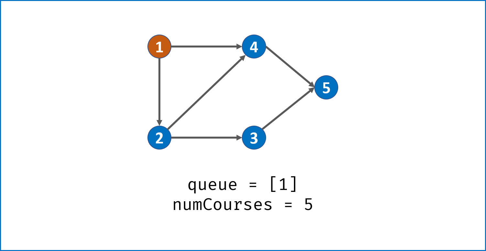

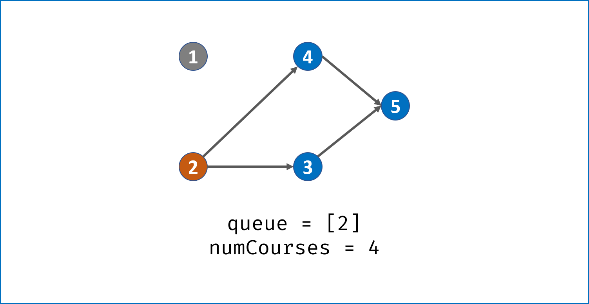

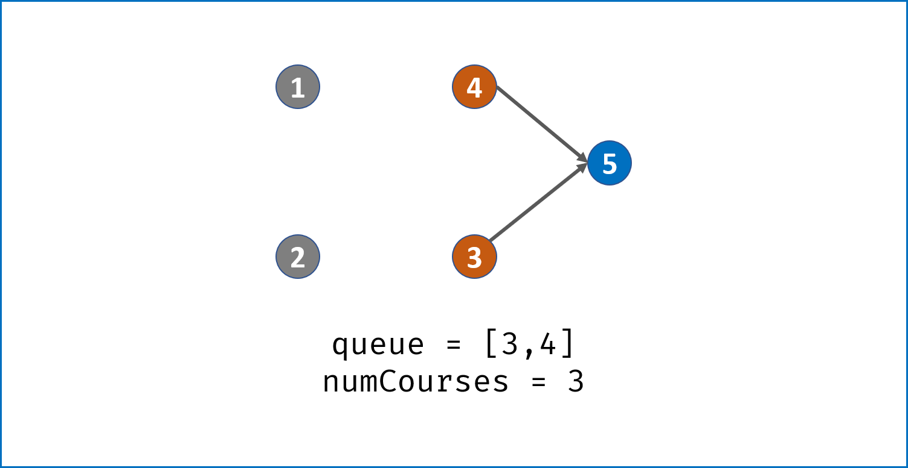

```java
    //使用BFS或DFS
    //本质是判断是否为有向无环图
    //将图转成邻接表
//     算法流程：
// 统计课程安排图中每个节点的入度，生成 入度表 indegrees。
// 借助一个队列 queue，将所有入度为 0 的节点入队。
// 当 queue 非空时，依次将队首节点出队，在课程安排图中删除此节点 pre：
// 并不是真正从邻接表中删除此节点 pre，而是将此节点对应所有邻接节点 cur 的入度 −1，即 indegrees[cur] -= 1。
// 当入度 −1后邻接节点 cur 的入度为 0，说明 cur 所有的前驱节点已经被 “删除”，此时将 cur 入队。
// 在每次 pre 出队时，执行 numCourses--；
// 若整个课程安排图是有向无环图（即可以安排），则所有节点一定都入队并出队过，即完成拓扑排序。换个角度说，若课程安排图中存在环，一定有节点的入度始终不为 0。
// 因此，拓扑排序出队次数等于课程个数，返回 numCourses == 0 判断课程是否可以成功安排。

public boolean canFinish(int numCourses, int[][] prerequisites) {
        int[] indegrees = new int[numCourses];
        //嵌套链表{cp[1]0->{cp[0]0,...},cp[1]1->...}
        //当cp[1]被删去的时候,就可以遍历这个链表将对应的节点的入度减1
        List<List<Integer>> adjacency = new ArrayList<>();
        Queue<Integer> queue = new LinkedList<>();
        for(int i = 0; i < numCourses; i++)
            adjacency.add(new ArrayList<>());
        //获取每个课程的入度和邻接点,此处写法是将每一对依次取出
        for(int[] cp : prerequisites) {
            //只要在0的位置,就说明被cp[1]指了,入度就+1,那么cp[1]的邻接节点就是cp[0]
            indegrees[cp[0]]++;
            adjacency.get(cp[1]).add(cp[0]);//对应cp[0]和cp[1]都是小于numCourses的
        }
        //初始化队列
        //获取所有入度为0的课程,加入队伍
        for(int i = 0; i < numCourses; i++)
            if(indegrees[i] == 0) queue.add(i);
        // 进行广度搜索,在队伍中的说明入度为0,可以学习,并将对应入度-1
        while(!queue.isEmpty()) {
            int pre = queue.poll();
            numCourses--;
            for(int cur : adjacency.get(pre))
                if(--indegrees[cur] == 0) queue.add(cur);
        }
        return numCourses == 0;
    }
```

# 21合并俩个有序链表

[21. 合并两个有序链表](https://leetcode.cn/problems/merge-two-sorted-lists/)

将两个升序链表合并为一个新的 **升序** 链表并返回。新链表是通过拼接给定的两个链表的所有节点组成的。 

 

**示例 1：**


```
输入：l1 = [1,2,4], l2 = [1,3,4]
输出：[1,1,2,3,4,4]
```

**示例 2：**

```
输入：l1 = [], l2 = []
输出：[]
```

```java
//遍历比较即可
    public ListNode mergeTwoLists(ListNode list1, ListNode list2) {
        ListNode preResult = new ListNode(0);
        ListNode temp = preResult;
        //开始遍历
        while(list1!=null||list2!=null){
            //若一方已经为null,直接指向另外一方,结束
            if(list1==null) {temp.next = list2;break;}
            if(list2==null) {temp.next = list1;break;}
            //选择小的数字去连接
            if(list1.val<list2.val)
            {
                temp.next=list1;
                list1=list1.next;
            }
            else{
                temp.next = list2;
                list2=list2.next;
            }
            temp = temp.next;
        }
        return preResult.next;
    }
```

**递归**

```java
//递归
public ListNode mergeTwoLists(ListNode list1, ListNode list2) {
    if(list1==null)return list2;
    if(list2==null)return list1;
    if(list1.val<list2.val){
        list1.next = mergeTwoLists(list1.next,list2);
        return list1;
    }
    else{
        list2.next = mergeTwoLists(lsit1,list2.next);
        return list2;
	}
}
```


# 148排序链表

**注意快慢指针!!**考虑只有俩个节点的情况

[148. 排序链表](https://leetcode.cn/problems/sort-list/)


给你链表的头结点 `head` ，请将其按 **升序** 排列并返回 **排序后的链表** 。

 

**示例 1：**


```
输入：head = [4,2,1,3]
输出：[1,2,3,4]
```

**我的暴力解法,使用小顶堆排序后再遍历出新的链表**

```

//使用小顶堆,排序后再遍历构建出新链表返回
    //遍历一次链表,放到数组里面,进行sort排序,再遍历数组
    public ListNode sortList(ListNode head) {
        if(head==null||head.next==null)return head; 
        PriorityQueue<Integer> pe = new  PriorityQueue<>((o1,o2)->o1-o2);
        ListNode result = null;
        ListNode pre = null;
        while(head!=null){
            pe.add(head.val);
            head = head.next;
        }
        while(!pe.isEmpty()){
            if(result==null&&pre==null)result=pre=new ListNode(pe.poll());
            else{
                pre.next = new ListNode(pe.poll());
                pre = pre.next;
            }
        }
        return result;
    }
```

**解答一：归并排序（递归法）,  使用快慢指针找到链表中点,将链表切分开**

  **再用双指针,同时指向切分链表的头部,进行链表合并**

以链表 `4 -> 2 -> 1 -> 3` 为例：

1. 分割：`4 -> 2` 和 `1 -> 3`
2. 递归左：`4 -> 2` → 分割为 `4` 和 `2` → 合并为 `2 -> 4`
3. 递归右：`1 -> 3` → 分割为 `1` 和 `3` → 合并为 `1 -> 3`
4. 合并左右：`1 -> 2 -> 3 -> 4`

- 题目要求时间空间复杂度分别为 *O*(*n**l**o**g**n*) 和 *O*(1)，根据时间复杂度我们自然想到二分法，从而联想到归并排序；

- 对数组做归并排序的空间复杂度为 *O*(*n*)，分别由新开辟数组 *O*(*n*) 和递归函数调用 *O*(*l**o**g**n*) 组成，而根据链表特性：

  - 数组额外空间：链表可以通过修改引用来更改节点顺序，无需像数组一样开辟额外空间；
  - 递归额外空间：递归调用函数将带来 *O*(*l**o**g**n*) 的空间复杂度，因此若希望达到 *O*(1) 空间复杂度，则不能使用递归。

- 通过递归实现链表归并排序，有以下两个环节：

  - 分割 cut 环节：

     

    找到当前链表中点，并从中点将链表断开（以便在下次递归cut时，链表片段拥有正确边界）；

    - 我们使用 `fast,slow` 快慢双指针法，奇数个节点找到中点，偶数个节点找到中心左边的节点。
    - 找到中点 `slow` 后，执行 `slow.next = None` 将链表切断。
    - 递归分割时，输入当前链表左端点 `head` 和中心节点 `slow` 的下一个节点 `tmp`(因为链表是从 `slow` 切断的)。
    - **cut 递归终止条件：** 当 `head.next == None` 时，说明只有一个节点了，直接返回此节点。

  - 合并 merge 环节：

    将两个排序链表合并，转化为一个排序链表。

    - 双指针法合并，建立辅助 ListNode `h` 作为头部。
    - 设置两指针 `left`, `right` 分别指向两链表头部，比较两指针处节点值大小，由小到大加入合并链表头部，指针交替前进，直至添加完两个链表。
    - 返回辅助ListNode `h` 作为头部的下个节点 `h.next`。
    - 时间复杂度 `O(l + r)`，`l, r` 分别代表两个链表长度。

  - 当题目输入的 `head == None` 时，直接返回 None。

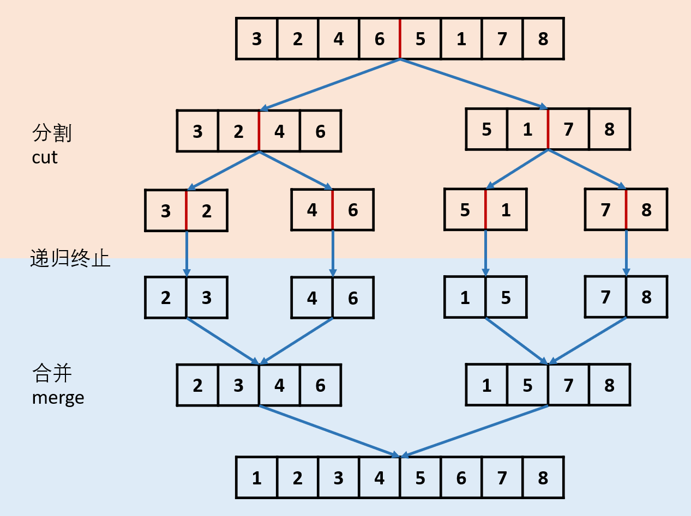

```java
public ListNode sortList(ListNode head) {
        //递归的传参就是需要分割并合并的头节点
        //递归的终止条件,节点没有了或者节点只有一个,不可再分割
        if(head==null||head.next==null)return head;
        //递归逻辑
        //每一次都将链表进行切割再合并排序

        //分割
        ListNode fast = head;
        ListNode slow = head;
        //注意此处!!考虑只有俩个节点的情况,slow需要原地不动!
        while(fast.next!=null&&fast.next.next!=null){
            fast = fast.next.next;
            slow = slow.next;
        }
        ListNode temp = slow.next;
        slow.next=null;
        ListNode left = sortList(head);
        ListNode right = sortList(temp);
        //递归返回
        //返回的就是排序好的头节点
        return mergeTwoLists(left,right);
    }
	private ListNode mergeTwoLists(ListNode l1,ListNode l2){
        ListNode preHead = new ListNode(-1);
        ListNode cur = preHead;
        while(l1!=null&&l2!=null){
            if(l1.val<l2.val){
                cur.next = l1;
                l1 = l1.next;
                cur = cur.next;
            }
            else{
                cur.next = l2;
                l2 = l2.next;
                cur = cur.next;
            }
        }
        cur.next = l1==null?l2:l1;
        cur = cur.next;
        return preHead.next;
    }
```

# 146.LRU缓存(5颗星的重要)

[146. LRU 缓存](https://leetcode.cn/problems/lru-cache/)


请你设计并实现一个满足 [LRU (最近最少使用) 缓存](https://baike.baidu.com/item/LRU) 约束的数据结构。

实现 `LRUCache` 类：

- `LRUCache(int capacity)` 以 **正整数** 作为容量 `capacity` 初始化 LRU 缓存
- `int get(int key)` 如果关键字 `key` 存在于缓存中，则返回关键字的值，否则返回 `-1` 。
- `void put(int key, int value)` 如果关键字 `key` 已经存在，则变更其数据值 `value` ；如果不存在，则向缓存中插入该组 `key-value` 。如果插入操作导致关键字数量超过 `capacity` ，则应该 **逐出** 最久未使用的关键字。

函数 `get` 和 `put` 必须以 `O(1)` 的平均时间复杂度运行。

**自己编写!!估计要**

```java
class LRUCache {
    class DLinkedNode{
        int key;
        int val;
        DLinkedNode pre;
        DLinkedNode next;
        DLinkedNode(){}
        DLinkedNode(int _key,int _val){
            key = _key;
            val = _val;
        }
    }

    //Map用于定位实现O(1)的查找,双向链表DL用于实现O(1)的删除,不然单向链表需要遍历找到前驱
    HashMap<Integer,DLinkedNode>cache = new HashMap<>();
    private int size;
    private int capacity;
    private DLinkedNode tail;
    private DLinkedNode head;

    public LRUCache(int capacity) {
        this.size = 0;
        this.capacity = capacity;
        //虚拟头和为节点,简化边界情况
        this.tail = new DLinkedNode();
        this.head = new DLinkedNode();
        head.next = tail;
        tail.pre = head; 
    }
    
    public int get(int key) {
        //先从Map去找到DLNode
        DLinkedNode node = cache.get(key);
        if(node==null){
            return -1;
        }else{
            //访问了,就将其移动到头部
            moveToHead(node);
        }
        return node.val;
    }
    
    public void put(int key, int value) {
        //先去map找有没有对应的key
        DLinkedNode node = cache.get(key);
        //找到了就更改,并移到头部
        if(node!=null){
            node.val = value;//此处map和node是绑定的!所以只用更新node的val就ok
            moveToHead(node);
        }
        //没找到就,新建一个,添加到头部,并判断是否超过容量
        //超过容量就需要移除链表尾部,并更新map
        else{
            DLinkedNode newNode = new DLinkedNode(key,value);
            cache.put(key,newNode);
            addToHead(newNode);
            ++size;
            if(size>capacity){
                //删除尾部
                DLinkedNode tailNode =  removeTail();
                //更新map
                cache.remove(tailNode.key);
                --size;
            }
        }
    }
    protected void removeNode(DLinkedNode node){
        node.pre.next = node.next;
        node.next.pre = node.pre;
    }
    protected void moveToHead(DLinkedNode node){
        removeNode(node);
        addToHead(node);
    }
    protected void addToHead(DLinkedNode node){
        node.next = head.next;
        node.pre = head;
        head.next.pre = node;
        head.next = node;
    }
    protected DLinkedNode removeTail(){
        DLinkedNode res = tail.pre;
        removeNode(res);
        return res;
    }

}
```

**使用java封装好的**

```java
class LRUCache extends LinkedHashMap<Integer, Integer>{
 //get和put要O(1),那么显然要用hash
// LinkedHashMap的有序可以按两种顺序排列，一种是按照插入的顺序，一种是按照 读取 的顺序
    private int capacity;
    
    public LRUCache(int capacity) {
        super(capacity, 0.75F, true);
        this.capacity = capacity;
    }

    public int get(int key) {
        return super.getOrDefault(key, -1);
    }

    // 这个可不写
    public void put(int key, int value) {
        super.put(key, value);
    }

    @Override
    protected boolean removeEldestEntry(Map.Entry<Integer, Integer> eldest) {
        return size() > capacity; 
    }
}

```


主体意思就是我们要继承 LinkedHashMap，然后复写 removeEldestEntry()函数，就能拥有我们自己的缓存策略！

```java
// 在插入一个新元素之后，如果是按插入顺序排序，即调用newNode()中的linkNodeLast()完成
// 如果是按照读取顺序排序，即调用afterNodeAccess()完成
// 那么这个方法是干嘛的呢，这个就是著名的 LRU 算法啦
// 在插入完成之后，需要回调函数判断是否需要移除某些元素！
// LinkedHashMap 函数部分源码

/**

 * 插入新节点才会触发该方法，因为只有插入新节点才需要内存
 * 根据 HashMap 的 putVal 方法, evict 一直是 true
 * removeEldestEntry 方法表示移除规则, 在 LinkedHashMap 里一直返回 false
 * 所以在 LinkedHashMap 里这个方法相当于什么都不做
   */
   void afterNodeInsertion(boolean evict) { // possibly remove eldest
   LinkedHashMap.Entry<K,V> first;
   // 根据条件判断是否移除最近最少被访问的节点
   if (evict && (first = head) != null && removeEldestEntry(first)) {
       K key = first.key;
       removeNode(hash(key), key, null, false, true);
   }
   }

// 移除最近最少被访问条件之一，通过覆盖此方法可实现不同策略的缓存
// LinkedHashMap是默认返回false的，我们可以继承LinkedHashMap然后复写该方法即可
// 例如 LeetCode 第 146 题就是采用该种方法，直接 return size() > capacity;
protected boolean removeEldestEntry(Map.Entry<K,V> eldest) {
    return false;
}
```


```java
//标准的如何在双向链表中将指定元素放入队尾
// LinkedHashMap 中覆写
//访问元素之后的回调方法

/**
 * 1. 使用 get 方法会访问到节点, 从而触发调用这个方法
 * 2. 使用 put 方法插入节点, 如果 key 存在, 也算要访问节点, 从而触发该方法
 * 3. 只有 accessOrder 是 true 才会调用该方法
 * 4. 这个方法会把访问到的最后节点重新插入到双向链表结尾
 */
void afterNodeAccess(Node<K,V> e) { // move node to last
    // 用 last 表示插入 e 前的尾节点
    // 插入 e 后 e 是尾节点, 所以也是表示 e 的前一个节点
    LinkedHashMap.Entry<K,V> last;
    //如果是访问序，且当前节点并不是尾节点
    //将该节点置为双向链表的尾部
    if (accessOrder && (last = tail) != e) {
        // p: 当前节点
        // b: 前一个节点
        // a: 后一个节点
        // 结构为: b <=> p <=> a
        LinkedHashMap.Entry<K,V> p =
            (LinkedHashMap.Entry<K,V>)e, b = p.before, a = p.after;
        // 结构变成: b <=> p <- a
        p.after = null;

        // 如果当前节点 p 本身是头节点, 那么头结点要改成 a
        if (b == null)
            head = a;
        // 如果 p 不是头尾节点, 把前后节点连接, 变成: b -> a
        else
            b.after = a;

        // a 非空, 和 b 连接, 变成: b <- a
        if (a != null)
            a.before = b;
        // 如果 a 为空, 说明 p 是尾节点, b 就是它的前一个节点, 符合 last 的定义
      	// 这个 else 没有意义，因为最开头if已经确保了p不是尾结点了，自然after不会是null
        else
            last = b;

        // 如果这是空链表, p 改成头结点
        if (last == null)
            head = p;
        // 否则把 p 插入到链表尾部
        else {
            p.before = last;
            last.after = p;
        }
        tail = p;
        ++modCount;
    }
}

```

# 23合并K个升序链表

[23. 合并 K 个升序链表](https://leetcode.cn/problems/merge-k-sorted-lists/)

困难

给你一个链表数组，每个链表都已经按升序排列。

请你将所有链表合并到一个升序链表中，返回合并后的链表。

 

**示例 1：**

```
输入：lists = [[1,4,5],[1,3,4],[2,6]]
输出：[1,1,2,3,4,4,5,6]
解释：链表数组如下：
[
  1->4->5,
  1->3->4,
  2->6
]
将它们合并到一个有序链表中得到。
1->1->2->3->4->4->5->6
```

**示例 2：**

```
输入：lists = []
输出：[]
```

**示例 3：**

```
输入：lists = [[]]
输出：[]
```

 

**我的暴力解法,依次俩俩合并,算法效率O(NK)**

```java
    public ListNode mergeKLists(ListNode[] lists) {
        ListNode res = null;
        for(ListNode list:lists){
            res = merge2Lists(res,list);
        }
        return res;
    }
//迭代
    private ListNode merge2Lists(ListNode l1, ListNode l2) {
        ListNode dummyHead = new ListNode(0);
        ListNode tail = dummyHead;
        while (l1 != null && l2 != null) {
            if (l1.val < l2.val) {
                tail.next = l1;
                l1 = l1.next;
            } else {
                tail.next = l2;
                l2 = l2.next;
            }
            tail = tail.next;
        }
        tail.next = l1 == null? l2: l1;
        return dummyHead.next;
    }
//归并
private ListNode merge2Lists(ListNode l1,ListNode l2){
    if(l1==null)return l2;
    if(l2==null)return l1;
    if(l1.val<l2.val){
		l1.next = merge2Lists(l1.next,l2);
        return l1;
    }else{
        l2.next = merge2Lists(l1,l2.next);
        return l2;
    }
    
} 
	
```

**全部依次一起比较,使用最小顶堆,排序效率为O(log(N),算法效率O(Nlog(K))**,

```
    //使用最小堆顶,排序按照node.val来排序,每次全部都一起比较
    public ListNode mergeKLists(ListNode[] lists) {
        int length = lists.length;
        if(length==0)return null;
        if(length==1)return lists[0];
        PriorityQueue<ListNode> que = new PriorityQueue<>((n1,n2)->n1.val-n2.val);
        for(ListNode node:lists){
            if(node!=null)que.offer(node);
        }
        ListNode result = new ListNode();
        ListNode temp = result;
        while(!que.isEmpty()){
            ListNode minNode = que.poll();
            temp.next = minNode;
            temp = temp.next;
            if(minNode.next!=null){
                que.offer(minNode.next);
            }
        }
        return result.next;
    }
```

**归并排序算法效率O(Nlog(K))**

```
 //使用归并排序,迭代法
    public ListNode mergeKLists(ListNode[] lists) {
        int length= lists.length;
        if(length==0)return null;
        //当当前需要合并的实际长度大于1时
        while(length>1){
            int index=0;
            //隔俩格进行合并
            for(int i = 0;i<length;i+=2){
                if(i==length-1){
                    lists[index++]=lists[i];
                }
                else{
                    lists[index++]=merge2Lists(lists[i],lists[i+1]);
                }
            }
            //更新需要合并的长度
            length = index;
        }
        return lists[0];
    }
    public ListNode merge2Lists(ListNode list1,ListNode list2){
        if(list1==null)return list2;
        if(list2==null)return list1;
        if(list1.val<list2.val){
            list1.next = merge2Lists(list1.next,list2);
            return list1;
        }
        else{
            list2.next = merge2Lists(list1,list2.next);
            return list2;
        }
    }
```


# 114.二叉树展开为链表

[114. 二叉树展开为链表](https://leetcode.cn/problems/flatten-binary-tree-to-linked-list/)

中等

提示


给你二叉树的根结点 `root` ，请你将它展开为一个单链表：

- 展开后的单链表应该同样使用 `TreeNode` ，其中 `right` 子指针指向链表中下一个结点，而左子指针始终为 `null` 。
- 展开后的单链表应该与二叉树 [**先序遍历**](https://baike.baidu.com/item/先序遍历/6442839?fr=aladdin) 顺序相同。

 

**示例 1：**


```
输入：root = [1,2,5,3,4,null,6]
输出：[1,null,2,null,3,null,4,null,5,null,6]

```

```java
    1
   / \
  2   5
 / \   \
3   4   6

//将 1 的左子树插入到右子树的地方
    1
     \
      2         5
     / \         \
    3   4         6        
//将原来的右子树接到左子树的最右边节点
    1
     \
      2          
     / \          
    3   4  
         \
          5
           \
            6
            
 //将 2 的左子树插入到右子树的地方
    1
     \
      2          
       \          
        3       4  
                 \
                  5
                   \
                    6   
        
 //将原来的右子树接到左子树的最右边节点
    1
     \
      2          
       \          
        3      
         \
          4  
           \
            5
             \
              6         
  
  ......

```


```
public void flatten(TreeNode root) {
        //遍历根以及根的右子树,先找到左子树的最右边节点,将根的右子树放到该节点右边
        //再直接将左子树插到根的右子树位置,直到没有右子树
        while(root!=null){
            //左节点没有,直接遍历下一个右子树
           if(root.left==null){
                root = root.right;
                continue;
           } 
           //找到当前的左子树的最右边的位置
            TreeNode pre = root.left;
            while(pre.right!=null){
                pre = pre.right;
            }
            //将当前右子树插入到左子树最右边的位置
            pre.right = root.right;
            //将左子树放到当前的右子树的位置 
            root.right = root.left;
            root.left =null; 
            //接着找下一个
            root = root.right;
        }
    }
```

# 岛屿数量

[200. 岛屿数量](https://leetcode.cn/problems/number-of-islands/)

中等

给你一个由 `'1'`（陆地）和 `'0'`（水）组成的的二维网格，请你计算网格中岛屿的数量。

岛屿总是被水包围，并且每座岛屿只能由水平方向和/或竖直方向上相邻的陆地连接形成。

此外，你可以假设该网格的四条边均被水包围。

 

**示例 1：**

```
输入：grid = [
  ['1','1','1','1','0'],
  ['1','1','0','1','0'],
  ['1','1','0','0','0'],
  ['0','0','0','0','0']
]
输出：1
```

**示例 2：**

```
输入：grid = [
  ['1','1','0','0','0'],
  ['1','1','0','0','0'],
  ['0','0','1','0','0'],
  ['0','0','0','1','1']
]
输出：3
```


```java
    //使用DFS遍历
    //递归,找一个点的上下左右四个位置
    //边界条件就是判断当前坐标是否超出范围
    //当是访问的是岛屿即为'1',使用2代替,代表已经访问
    //所以只要不是'1',那么就要return了,因为不然就是2或者0了

    //主程序就是遍历整个网格,
    //只有数值为1时才进行DFS遍历,此时DFS就将所有相邻的设置为2了
    //只要开始了DFS遍历,就证明有一个岛屿了
    //统计对应岛屿数量即可
    public int numIslands(char[][] grid) {
        int result=0;
        for(int i =0;i<grid.length;i++){
            for(int j=0;j<grid[0].length;j++){
                if(grid[i][j]=='1'){
                    dfs(grid,i,j);
                    result++;
                }
            }
        }
        return result;
    }
    private void dfs(char[][]grid,int h,int w){
        //超出边界返回
        if(!inArea(grid,h,w))return;
        //已经访问过,返回
        if(grid[h][w]!='1')return;
        //标记访问
        grid[h][w]='2';
        //访问相邻节点
        dfs(grid,h,w-1);
        dfs(grid,h,w+1);
        dfs(grid,h+1,w);
        dfs(grid,h-1,w);
        return;
    }
    private boolean inArea(char[][]grid,int h,int w){
        return h>=0&&h<grid.length && w>=0 && w<grid[0].length;
    }

```


## 岛屿原理解析

### DFS 的基本结构

网格结构要比二叉树结构稍微复杂一些，它其实是一种简化版的**图**结构。要写好网格上的 DFS 遍历，我们首先要理解二叉树上的 DFS 遍历方法，再类比写出网格结构上的 DFS 遍历。我们写的二叉树 DFS 遍历一般是这样的：

```java
void traverse(TreeNode root) {
    // 判断 base case
    if (root == null) {
        return;
    }
    // 访问两个相邻结点：左子结点、右子结点
    traverse(root.left);
    traverse(root.right);
}
```

可以看到，二叉树的 DFS 有两个要素：「**访问相邻结点**」和「**判断 base case**」。

第一个要素是**访问相邻结点**。二叉树的相邻结点非常简单，只有左子结点和右子结点两个。二叉树本身就是一个递归定义的结构：一棵二叉树，它的左子树和右子树也是一棵二叉树。那么我们的 DFS 遍历只需要递归调用左子树和右子树即可。

第二个要素是 **判断 base case**。一般来说，二叉树遍历的 base case 是 `root == null`。这样一个条件判断其实有两个含义：一方面，这表示 `root` 指向的子树为空，不需要再往下遍历了。另一方面，在 `root == null` 的时候及时返回，可以让后面的 `root.left` 和 `root.right` 操作不会出现空指针异常。

对于网格上的 DFS，我们完全可以参考二叉树的 DFS，写出网格 DFS 的两个要素：

首先，网格结构中的格子有多少相邻结点？答案是上下左右四个。对于格子 `(r, c)` 来说（r 和 c 分别代表行坐标和列坐标），四个相邻的格子分别是 `(r-1, c)`、`(r+1, c)`、`(r, c-1)`、`(r, c+1)`。换句话说，网格结构是「四叉」的。


其次，网格 DFS 中的 base case 是什么？从二叉树的 base case 对应过来，应该是网格中不需要继续遍历、`grid[r][c]` 会出现数组下标越界异常的格子，也就是那些超出网格范围的格子。

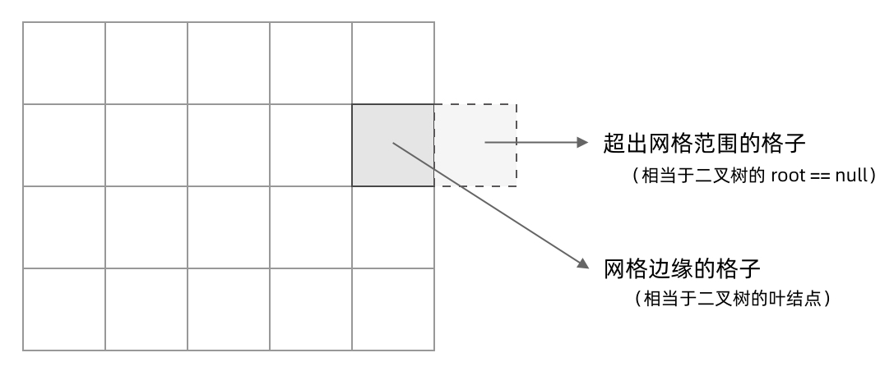

这一点稍微有些反直觉，坐标竟然可以临时超出网格的范围？这种方法我称为「先污染后治理」—— 甭管当前是在哪个格子，先往四个方向走一步再说，如果发现走出了网格范围再赶紧返回。这跟二叉树的遍历方法是一样的，先递归调用，发现 `root == null` 再返回。

这样，我们得到了网格 DFS 遍历的框架代码：

```java
void dfs(int[][] grid, int r, int c) {
    // 判断 base case
    // 如果坐标 (r, c) 超出了网格范围，直接返回
    if (!inArea(grid, r, c)) {
        return;
    }
    // 访问上、下、左、右四个相邻结点
    dfs(grid, r - 1, c);
    dfs(grid, r + 1, c);
    dfs(grid, r, c - 1);
    dfs(grid, r, c + 1);
}

// 判断坐标 (r, c) 是否在网格中
boolean inArea(int[][] grid, int r, int c) {
    return 0 <= r && r < grid.length 
        	&& 0 <= c && c < grid[0].length;
}
```

### 如何避免重复遍历

网格结构的 DFS 与二叉树的 DFS 最大的不同之处在于，遍历中可能遇到遍历过的结点。这是因为，网格结构本质上是一个「图」，我们可以把每个格子看成图中的结点，每个结点有向上下左右的四条边。在图中遍历时，自然可能遇到重复遍历结点。

这时候，DFS 可能会不停地「兜圈子」，永远停不下来，如下图所示：

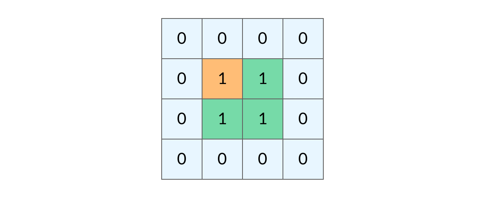

如何避免这样的重复遍历呢？答案是标记已经遍历过的格子。以岛屿问题为例，我们需要在所有值为 1 的陆地格子上做 DFS 遍历。每走过一个陆地格子，就把格子的值改为 2，这样当我们遇到 2 的时候，就知道这是遍历过的格子了。也就是说，每个格子可能取三个值：

- 0 —— 海洋格子
- 1 —— 陆地格子（未遍历过）
- 2 —— 陆地格子（已遍历过）

我们在框架代码中加入避免重复遍历的语句：

```java
void dfs(int[][] grid, int r, int c) {
    // 判断 base case
    if (!inArea(grid, r, c)) {
        return;
    }
    // 如果这个格子不是岛屿，直接返回
    if (grid[r][c] != 1) {
        return;
    }
    grid[r][c] = 2; // 将格子标记为「已遍历过」
    
    // 访问上、下、左、右四个相邻结点
    dfs(grid, r - 1, c);
    dfs(grid, r + 1, c);
    dfs(grid, r, c - 1);
    dfs(grid, r, c + 1);
}

// 判断坐标 (r, c) 是否在网格中
boolean inArea(int[][] grid, int r, int c) {
    return 0 <= r && r < grid.length 
        	&& 0 <= c && c < grid[0].length;
}
```


这样，我们就得到了一个岛屿问题、乃至各种网格问题的通用 DFS 遍历方法。以下所讲的几个例题，其实都只需要在 DFS 遍历框架上稍加修改而已。

> **小贴士：**
>
> 在一些题解中，可能会把「已遍历过的陆地格子」标记为和海洋格子一样的 0，美其名曰「陆地沉没方法」，即遍历完一个陆地格子就让陆地「沉没」为海洋。这种方法看似很巧妙，但实际上有很大隐患，因为这样我们就无法区分「海洋格子」和「已遍历过的陆地格子」了。如果题目更复杂一点，这很容易出 bug。


### 岛屿问题的解法

理解了网格结构的 DFS 遍历方法以后，岛屿问题就不难解决了。下面我们分别看看三个题目该如何用 DFS 遍历来求解。

#### 例题 1：岛屿的最大面积

[LeetCode 695. Max Area of Island](https://leetcode.cn/problems/max-area-of-island/) （Medium）

> 给定一个包含了一些 0 和 1 的非空二维数组 `grid`，一个岛屿是一组相邻的 1（代表陆地），这里的「相邻」要求两个 1 必须在水平或者竖直方向上相邻。你可以假设 `grid` 的四个边缘都被 0（代表海洋）包围着。
>
> 找到给定的二维数组中最大的岛屿面积。如果没有岛屿，则返回面积为 0 。

这道题目只需要对每个岛屿做 DFS 遍历，求出每个岛屿的面积就可以了。求岛屿面积的方法也很简单，代码如下，每遍历到一个格子，就把面积加一。

```java
int area(int[][] grid, int r, int c) {  
    return 1 
        + area(grid, r - 1, c)
        + area(grid, r + 1, c)
        + area(grid, r, c - 1)
        + area(grid, r, c + 1);
}
```

最终我们得到的完整题解代码如下：

```java
public int maxAreaOfIsland(int[][] grid) {
    int res = 0;
    for (int r = 0; r < grid.length; r++) {
        for (int c = 0; c < grid[0].length; c++) {
            if (grid[r][c] == 1) {
                int a = area(grid, r, c);
                res = Math.max(res, a);
            }
        }
    }
    return res;
}

int area(int[][] grid, int r, int c) {
    if (!inArea(grid, r, c)) {
        return 0;
    }
    if (grid[r][c] != 1) {
        return 0;
    }
    grid[r][c] = 2;
    
    return 1 
        + area(grid, r - 1, c)
        + area(grid, r + 1, c)
        + area(grid, r, c - 1)
        + area(grid, r, c + 1);
}

boolean inArea(int[][] grid, int r, int c) {
    return 0 <= r && r < grid.length 
        	&& 0 <= c && c < grid[0].length;
}
```

#### 例题 2：填海造陆问题

[LeetCode 827. Making A Large Island](https://leetcode.cn/problems/making-a-large-island/) （Hard）

> 在二维地图上， 0 代表海洋，1代表陆地，我们最多只能将一格 0 （海洋）变成 1 （陆地）。进行填海之后，地图上最大的岛屿面积是多少？

这道题是岛屿最大面积问题的升级版。现在我们有填海造陆的能力，可以把一个海洋格子变成陆地格子，进而让两块岛屿连成一块。那么填海造陆之后，最大可能构造出多大的岛屿呢？

大致的思路我们不难想到，我们先计算出所有岛屿的面积，在所有的格子上标记出岛屿的面积。然后搜索哪个海洋格子相邻的两个岛屿面积最大。例如下图中红色方框内的海洋格子，上边、左边都与岛屿相邻，我们可以计算出它变成陆地之后可以连接成的岛屿面积为 7+1+2=10。

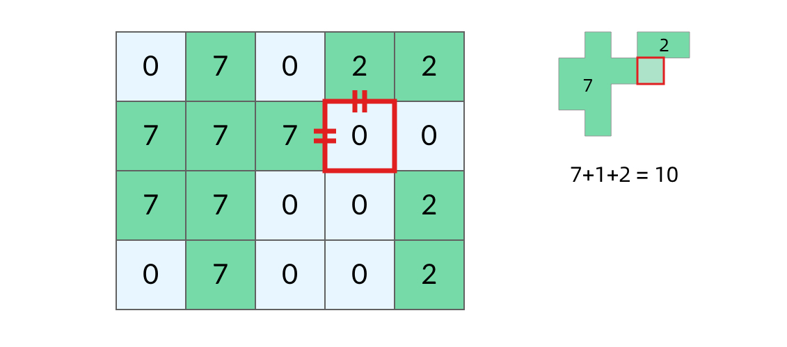

然而，这种做法可能遇到一个问题。如下图中红色方框内的海洋格子，它的上边、左边都与岛屿相邻，这时候连接成的岛屿面积难道是 7+1+7 ？显然不是。这两个 7 来自同一个岛屿，所以填海造陆之后得到的岛屿面积应该只有 7+1=8。

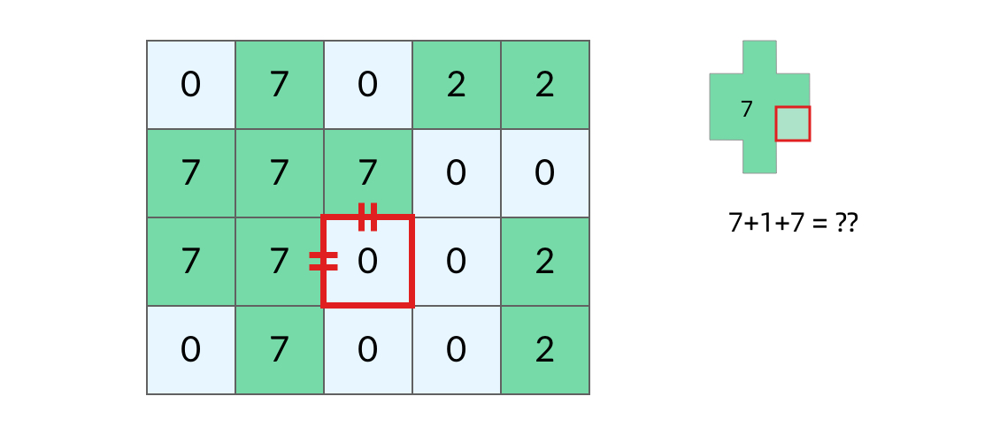

可以看到，要让算法正确，我们得能区分一个海洋格子相邻的两个 7 是不是来自同一个岛屿。那么，我们不能在方格中标记岛屿的面积，而应该标记岛屿的索引（下标），另外用一个数组记录每个岛屿的面积，如下图所示。这样我们就可以发现红色方框内的海洋格子，它的「两个」相邻的岛屿实际上是同一个。

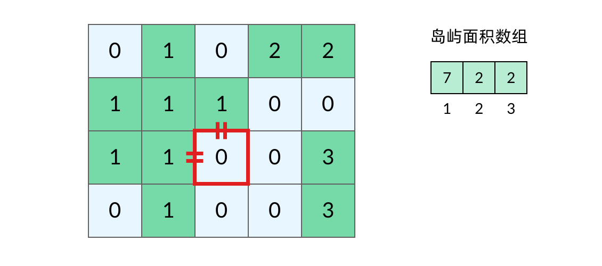

可以看到，这道题实际上是对网格做了两遍 DFS：第一遍 DFS 遍历陆地格子，计算每个岛屿的面积并标记岛屿；第二遍 DFS 遍历海洋格子，观察每个海洋格子相邻的陆地格子。

这道题的基本思路就是这样，具体的代码还有一些需要注意的细节，但和本文的主题已经联系不大。各位可以自己思考一下如何把上述思路转化为代码。

#### 例题 3：岛屿的周长

[LeetCode 463. Island Perimeter](https://leetcode.cn/problems/island-perimeter/) （Easy）

> 给定一个包含 0 和 1 的二维网格地图，其中 1 表示陆地，0 表示海洋。网格中的格子水平和垂直方向相连（对角线方向不相连）。整个网格被水完全包围，但其中恰好有一个岛屿（一个或多个表示陆地的格子相连组成岛屿）。
>
> 岛屿中没有“湖”（“湖” 指水域在岛屿内部且不和岛屿周围的水相连）。格子是边长为 1 的正方形。计算这个岛屿的周长。
>
> 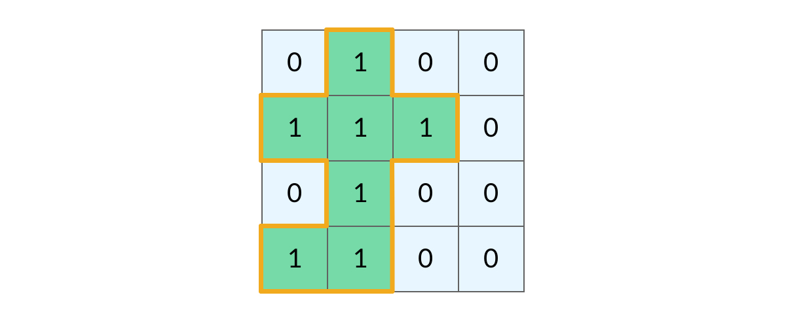

实话说，这道题用 DFS 来解并不是最优的方法。对于岛屿，直接用数学的方法求周长会更容易。不过这道题是一个很好的理解 DFS 遍历过程的例题，不信你跟着我往下看。

我们再回顾一下 网格 DFS 遍历的基本框架：

```java
void dfs(int[][] grid, int r, int c) {
    // 判断 base case
    if (!inArea(grid, r, c)) {
        return;
    }
    // 如果这个格子不是岛屿，直接返回
    if (grid[r][c] != 1) {
        return;
    }
    grid[r][c] = 2; // 将格子标记为「已遍历过」
    
    // 访问上、下、左、右四个相邻结点
    dfs(grid, r - 1, c);
    dfs(grid, r + 1, c);
    dfs(grid, r, c - 1);
    dfs(grid, r, c + 1);
}

// 判断坐标 (r, c) 是否在网格中
boolean inArea(int[][] grid, int r, int c) {
    return 0 <= r && r < grid.length 
        	&& 0 <= c && c < grid[0].length;
}
```

可以看到，`dfs` 函数直接返回有这几种情况：

- `!inArea(grid, r, c)`，即坐标 `(r, c)` 超出了网格的范围，也就是我所说的「先污染后治理」的情况

- ```
  grid[r][c] != 1
  ```

  ，即当前格子不是岛屿格子，这又分为两种情况：

  - `grid[r][c] == 0`，当前格子是海洋格子
  - `grid[r][c] == 2`，当前格子是已遍历的陆地格子

那么这些和我们岛屿的周长有什么关系呢？实际上，岛屿的周长是计算岛屿全部的「边缘」，而这些边缘就是我们在 DFS 遍历中，`dfs` 函数返回的位置。观察题目示例，我们可以将岛屿的周长中的边分为两类，如下图所示。黄色的边是与网格边界相邻的周长，而蓝色的边是与海洋格子相邻的周长。

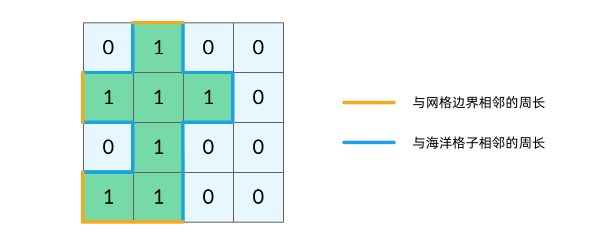

当我们的 `dfs` 函数因为「坐标 `(r, c)` 超出网格范围」返回的时候，实际上就经过了一条黄色的边；而当函数因为「当前格子是海洋格子」返回的时候，实际上就经过了一条蓝色的边。这样，我们就把岛屿的周长跟 DFS 遍历联系起来了，我们的题解代码也呼之欲出：

```java
public int islandPerimeter(int[][] grid) {
    for (int r = 0; r < grid.length; r++) {
        for (int c = 0; c < grid[0].length; c++) {
            if (grid[r][c] == 1) {
                // 题目限制只有一个岛屿，计算一个即可
                return dfs(grid, r, c);
            }
        }
    }
    return 0;
}

int dfs(int[][] grid, int r, int c) {
    // 函数因为「坐标 (r, c) 超出网格范围」返回，对应一条黄色的边
    if (!inArea(grid, r, c)) {
        return 1;
    }
    // 函数因为「当前格子是海洋格子」返回，对应一条蓝色的边
    if (grid[r][c] == 0) {
        return 1;
    }
    // 函数因为「当前格子是已遍历的陆地格子」返回，和周长没关系
    if (grid[r][c] != 1) {
        return 0;
    }
    grid[r][c] = 2;
    return dfs(grid, r - 1, c)
        + dfs(grid, r + 1, c)
        + dfs(grid, r, c - 1)
        + dfs(grid, r, c + 1);
}

// 判断坐标 (r, c) 是否在网格中
boolean inArea(int[][] grid, int r, int c) {
    return 0 <= r && r < grid.length 
        	&& 0 <= c && c < grid[0].length;
}
```

#### 总结

对比完三个例题的题解代码，你会发现网格问题的代码真的都非常相似。其实这一类问题属于「会了不难」类型。了解树、图的基本遍历方法，再学会一点小技巧，掌握网格 DFS 遍历就一点也不难了。

# 617合并二叉树

[617. 合并二叉树](https://leetcode.cn/problems/merge-two-binary-trees/)

简单

给你两棵二叉树： `root1` 和 `root2` 。

想象一下，当你将其中一棵覆盖到另一棵之上时，两棵树上的一些节点将会重叠（而另一些不会）。你需要将这两棵树合并成一棵新二叉树。合并的规则是：如果两个节点重叠，那么将这两个节点的值相加作为合并后节点的新值；否则，**不为** null 的节点将直接作为新二叉树的节点。

返回合并后的二叉树。

**注意:** 合并过程必须从两个树的根节点开始。

 

**示例 1：**

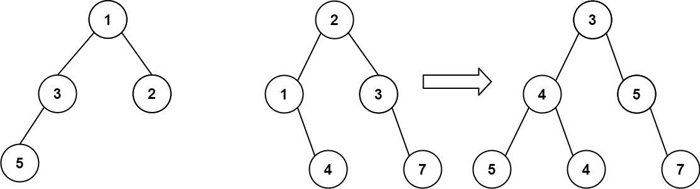

```
输入：root1 = [1,3,2,5], root2 = [2,1,3,null,4,null,7]
输出：[3,4,5,5,4,null,7]
```

```
    public TreeNode mergeTrees(TreeNode root1, TreeNode root2) {
        if(root1==null&&root2==null)return null;
        if(root1==null)return root2;
        if(root2==null)return root1;
        root1.val +=root2.val;
        root1.left =  mergeTrees(root1.left,root2.left);
        root1.right = mergeTrees(root1.right,root2.right);
        return root1;
    }
```


# 打家劫舍Ⅲ

[337. 打家劫舍 III](https://leetcode.cn/problems/house-robber-iii/)

中等

小偷又发现了一个新的可行窃的地区。这个地区只有一个入口，我们称之为 `root` 。

除了 `root` 之外，每栋房子有且只有一个“父“房子与之相连。一番侦察之后，聪明的小偷意识到“这个地方的所有房屋的排列类似于一棵二叉树”。 如果 **两个直接相连的房子在同一天晚上被打劫** ，房屋将自动报警。

给定二叉树的 `root` 。返回 ***在不触动警报的情况下** ，小偷能够盗取的最高金额* 。


**示例 1:**

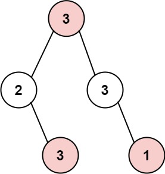

```
输入: root = [3,2,3,null,3,null,1]
输出: 7 
解释: 小偷一晚能够盗取的最高金额 3 + 3 + 1 = 7
```

## 递归(超时)

```java
//     单个节点的钱该怎么算
// 4 个孙子偷的钱 + 爷爷的钱 VS 两个儿子偷的钱 哪个组合钱多，就当做当前节点能偷的最大钱数。这就是动态规划里面的最优子结构

// 由于是二叉树，这里可以选择计算所有子节点

// 4 个孙子投的钱加上爷爷的钱如下
// int method1 = root.val + rob(root.left.left) + rob(root.left.right) + rob(root.right.left) + rob(root.right.right)
// 两个儿子偷的钱如下
// int method2 = rob(root.left) + rob(root.right);
// 挑选一个钱数多的方案则
// int result = Math.max(method1, method2);
    public int rob(TreeNode root) {
        if(root==null)return 0;
        //计算爷爷和孙子的钱
        int money = root.val;
        if(root.left!=null){
            money+=rob(root.left.left)+rob(root.left.right);
        }
        if(root.right!=null){
            money+=rob(root.right.left)+rob(root.right.right);
        }
        //儿子的钱就是rob(root.left) + rob(root.right)
        //返回最大的即可
        return Math.max(money,rob(root.left)+rob(root.right));
    }
```

## 使用哈希表记忆,进行优化

  针对解法一种速度太慢的问题，经过分析其实现，我们发现爷爷在计算自己能偷多少钱的时候，同时计算了 4 个孙子能偷多少钱，也计算了 2 个儿子能偷多少钱。**这样在儿子当爷爷时，就会产生重复计算一**遍孙子节点。**

于是乎我们发现了一个动态规划的关键优化点

重复子问题

我们这一步针对重复子问题进行优化，我们在做斐波那契数列时，使用的优化方案是记忆化，但是之前的问题都是使用数组解决的，把每次计算的结果都存起来，下次如果再来计算，就从缓存中取，不再计算了，这样就保证每个数字只计算一次。

由于二叉树不适合拿数组当缓存，我们这次**使用哈希表来存储结果，TreeNode 当做 key，能偷的钱当做 value,将当前节点的能打劫的最多钱保存!**

```
    public int rob(TreeNode root) {
        HashMap<TreeNode,Integer>memo = new HashMap<>();
        return robMemo(root,memo);
    }
    private int robMemo(TreeNode root, HashMap<TreeNode,Integer>memo){
        if(root==null)return 0;
        //优先去找这个节点的有没有遍历过
        if(memo.get(root)!=null)return memo.get(root);
        int money = root.val;
        if(root.left!=null){
            money+= robMemo(root.left.left,memo)+ robMemo(root.left.right,memo);
        }
        if(root.right!=null){
            money+= robMemo(root.right.left,memo)+ robMemo(root.right.right,memo);
        }
        int maxMoney = Math.max(money,robMemo(root.left,memo)+robMemo(root.right,memo));
        //将最大的钱存进去
        memo.put(root,maxMoney);
        return maxMoney;
    }
```

## 引入偷或不偷状态

上面两种解法用到了孙子节点，计算爷爷节点能偷的钱**还要同时去计算孙子节点投的钱，虽然有了记忆化，但是还是有性能损耗。**

我们换一种办法来定义此问题

每个节点可选择偷或者不偷两种状态，根据题目意思，相连节点不能一起偷

**转变为当前偷能最大获得多少?不偷又是多少   取偷与不偷俩个方案的最大值**

当前节点选择偷时，那么两个孩子节点就不能选择偷了
当前节点选择不偷时，两个孩子节点只需要拿最多的钱出来就行(两个孩子节点偷不偷没关系)
我们使用一个**大小为 2 的数组来表示 int[] res = new int[2] 0 代表不偷，1 代表偷**
任何一个节点能偷到的最大钱的状态可以定义为

**当前节点选择不偷：当前节点能偷到的最大钱数 = 左孩子能偷到的最大钱数 + 右孩子能偷到的最大钱数**
**当前节点选择偷：当前节点能偷到的最大钱数 = 左孩子选择自己不偷时能得到的钱 + 右孩子选择不偷时能得到的钱 + 当前节点的钱数**

```
    public int rob(TreeNode root) {
        //定义偷与不偷0,1
        int[]result = robInternal(root);
        return Math.max(result[0],result[1]);
    }
    private int[] robInternal(TreeNode root){
        if(root==null)return new int[2];
        int[]result = new int[2];
        int[]left = robInternal(root.left);
        int[]right = robInternal(root.right);

        result[0] = Math.max(left[0],left[1])+Math.max(right[0],right[1]);
        result[1] = left[0]+right[0]+root.val;
        
        return result;
    }
```

# 打家劫舍

[198. 打家劫舍](https://leetcode.cn/problems/house-robber/)

中等

你是一个专业的小偷，计划偷窃沿街的房屋。每间房内都藏有一定的现金，影响你偷窃的唯一制约因素就是相邻的房屋装有相互连通的防盗系统，**如果两间相邻的房屋在同一晚上被小偷闯入，系统会自动报警**。

给定一个代表每个房屋存放金额的非负整数数组，计算你 **不触动警报装置的情况下** ，一夜之内能够偷窃到的最高金额。

 

**示例 1：**

```
输入：[1,2,3,1]
输出：4
解释：偷窃 1 号房屋 (金额 = 1) ，然后偷窃 3 号房屋 (金额 = 3)。
     偷窃到的最高金额 = 1 + 3 = 4 。
```

**递归**

```
    public int rob(int[] nums) {
        int[]result = robMax(nums,0);
        return result[0]>result[1]?result[0]:result[1];
    }
    //偷或者不偷的问题
    //结束条件就是当前越界
    //逻辑:如果当前偷,那么获取的就是下一个不偷的最大收益+当前偷
    //不偷,获取的就是下一个偷的最大收益
    //最后返回偷与不偷的最大值!
    //返回如果偷或者不偷的数组
    private int[] robMax(int[] nums,int i){
        if(i>=nums.length) return new int[2];
        int[] result = new int[2];
        int[] robNext = i+1>=nums.length?new int[2]:robMax(nums,i+1); 
        result[0] = nums[i]+robNext[1];
        result[1] =Math.max(robNext[0],robNext[1]);; 
        return result;
    }
```

**动态规划**

```
    //使用动态规划的dp
    //dp[i]代表当前节点的最大收益
    public int rob(int[] nums) {
        if(nums.length==0||nums==null)return 0;
        if(nums.length==1)return nums[0];
        int[] dp =new int[nums.length];
        dp[0] = nums[0];
        dp[1] = Math.max(nums[0],nums[1]);
        for(int i=2;i<nums.length;i++){
            dp[i] = Math.max(dp[i-1],nums[i]+dp[i-2]);
        }
        return dp[nums.length-1];
    }
```


# 124二叉树的最大路径和

[124. 二叉树中的最大路径和](https://leetcode.cn/problems/binary-tree-maximum-path-sum/)

困难

二叉树中的 **路径** 被定义为一条节点序列，序列中每对相邻节点之间都存在一条边。同一个节点在一条路径序列中 **至多出现一次** 。该路径 **至少包含一个** 节点，且不一定经过根节点。

**路径和** 是路径中各节点值的总和。

给你一个二叉树的根节点 `root` ，返回其 **最大路径和** 。


**示例 1：**


```
输入：root = [1,2,3]
输出：6
解释：最优路径是 2 -> 1 -> 3 ，路径和为 2 + 1 + 3 = 6
```

```
    //   a
    //  / \
    // b   c
    //只有俩种情况,就选左右子树还是只选左或者右 ,都要加上自己,但是要注意小于0的舍去
    // 1.b + a + c。
    // 2.b + a + a 的父结点。
    // 3.a + c + a 的父结点
    //其中父节点是在递归的时候加上的,
    //所以本质上返回的是当前节点对于父节点的贡献即return a+max(0,max(b,c)),左右只能取一个,因为不能分叉选,即最大的链和
    //而当前最大路径统计是在三种情况中选一个,并不是我们要返回的,而是我们要统计的
    private int val = Integer.MIN_VALUE;
    public int maxPathSum(TreeNode root) {
        dfs(root);
        return val;
    }
    private int dfs(TreeNode root){
        if(root==null)return 0;
        int left = dfs(root.left);
        int right = dfs(root.right);
        int one = root.val+Math.max(0,left)+Math.max(0,right);//one包含了twoThree
        val = Math.max(val,one);
        int twoThree = root.val+Math.max(0,Math.max(left,right));
        return twoThree;
    }
```


# 543二叉树的直径

**总结路径问题!!!就是要选左右哪个边的问题!**

[543. 二叉树的直径](https://leetcode.cn/problems/diameter-of-binary-tree/)

简单

给你一棵二叉树的根节点，返回该树的 **直径** 。

二叉树的 **直径** 是指树中任意两个节点之间最长路径的 **长度** 。这条路径可能经过也可能不经过根节点 `root` 。

两节点之间路径的 **长度** 由它们之间边数表示。

 

**示例 1：**


```
输入：root = [1,2,3,4,5]
输出：3
解释：3 ，取路径 [4,2,1,3] 或 [5,2,1,3] 的长度。
```

**示例 2：**

```
输入：root = [1,2]
输出：1 
```

```
//     本题有两个关键概念：
// 链：从 node 子树中的叶子节点到 node 的路径。把 node 子树中的最长链的长度，作为 dfs(node) 的返回值。根据这一定义，空节点的链长是 −1，叶子节点的链长是 0。

// 直径：等价于由两条（或者一条）链拼成的路径。我们枚举二叉树的每个 node，假设直径在这里「拐弯」，也就是计算由左右两条从下面的叶子节点到 node 的链的节点值之和，去更新答案的最大值。
    //直径可能不经过根节点!!
    //所以要返回的就是链的长度
    private int ans=0;
    public int diameterOfBinaryTree(TreeNode root) {
        dfs(root);
        return ans;
    }
    private int dfs(TreeNode root){
        if(root==null)return -1;
        int left = dfs(root.left)+1;
        int right = dfs(root.right)+1;
        ans = Math.max(ans,left+right);//都假设从该节点拐进去!看看是不是最大的
        return Math.max(left,right);//返回的是当前节点的最大链长,即选择哪边
    }
```


# 105.从前序和中序遍历序列构造二叉树

[105. 从前序与中序遍历序列构造二叉树](https://leetcode.cn/problems/construct-binary-tree-from-preorder-and-inorder-traversal/)

中等

给定两个整数数组 `preorder` 和 `inorder` ，其中 `preorder` 是二叉树的**先序遍历**， `inorder` 是同一棵树的**中序遍历**，请构造二叉树并返回其根节点。

 

**示例 1:**


```
输入: preorder = [3,9,20,15,7], inorder = [9,3,15,20,7]
输出: [3,9,20,null,null,15,7]
```

**递归函数就是找先序和中序在同一范围内的根,并建立其左子树和右子树,所以要找左子树和右子数在先序和中序的范围**

```
class Solution {
    private Map<Integer, Integer> indexMap;

    public TreeNode myBuildTree(int[] preorder, int[] inorder, int preorder_left, int preorder_right, int inorder_left, int inorder_right) {
        if (preorder_left > preorder_right) {
            return null;
        }

        // 前序遍历中的第一个节点就是根节点
        int preorder_root = preorder_left;
        // 在中序遍历中定位根节点
        int inorder_root = indexMap.get(preorder[preorder_root]);
        
        // 先把根节点建立出来
        TreeNode root = new TreeNode(preorder[preorder_root]);
        // 得到左子树中的节点数目
        int size_left_subtree = inorder_root - inorder_left;
        // 递归地构造左子树，并连接到根节点
        // 先序遍历中「从 左边界+1 开始到 左边界+size_left_subtree」个元素就对应了中序遍历中「从 左边界 开始到 根节点定位-1」的元素
        root.left = myBuildTree(preorder, inorder, preorder_left + 1, preorder_left + size_left_subtree, inorder_left, inorder_root - 1);
        // 递归地构造右子树，并连接到根节点
        // 先序遍历中「从 左边界+1+左子树节点数目 开始到 右边界」的元素就对应了中序遍历中「从 根节点定位+1 到 右边界」的元素
        root.right = myBuildTree(preorder, inorder, preorder_left + size_left_subtree + 1, preorder_right, inorder_root + 1, inorder_right);
        return root;
    }

    public TreeNode buildTree(int[] preorder, int[] inorder) {
        int n = preorder.length;
        // 构造哈希映射，帮助我们快速定位根节点
        indexMap = new HashMap<Integer, Integer>();
        for (int i = 0; i < n; i++) {
            indexMap.put(inorder[i], i);
        }
        return myBuildTree(preorder, inorder, 0, n - 1, 0, n - 1);
    }
}

```


# 169多数元素

[169. 多数元素](https://leetcode.cn/problems/majority-element/)

简单

给定一个大小为 `n` 的数组 `nums` ，返回其中的多数元素。多数元素是指在数组中出现次数 **大于** `⌊ n/2 ⌋` 的元素。

你可以假设数组是非空的，并且给定的数组总是存在多数元素。

 

**示例 1：**

```
输入：nums = [3,2,3]
输出：3
```

**投票算法!**

```java
    //投票算法!!
//     我们维护一个候选众数 candidate 和它出现的次数 count。初始时 candidate 可以为任意值，count 为 0；

// 我们遍历数组 nums 中的所有元素，对于每个元素 x，在判断 x 之前，如果 count 的值为 0，我们先将 x 的值赋予 candidate，随后我们判断 x：

// 如果 x 与 candidate 相等，那么计数器 count 的值增加 1；

// 如果 x 与 candidate 不等，那么计数器 count 的值减少 1。

// 在遍历完成后，candidate 即为整个数组的众数。

    public int majorityElement(int[] nums) {
        int candidate=0;
        int count=0;
        for(int i=0;i<nums.length;i++){
            if(count==0)candidate=nums[i];
            if(nums[i]==candidate)count++;
            else count--;
        }
        return candidate;
    }
```

**遍历放进hashMap**

```java
    public int majorityElement(int[] nums) {
        if(nums.length==1)return nums[0];
        HashMap<Integer,Integer> map = new HashMap<>();
        int length = nums.length;
        for(int i =0;i<length;i++){
            if(map.containsKey(nums[i])){
                int num = map.get(nums[i]);
                map.put(nums[i],++num);
                if(num>length/2)return nums[i]; 
                
            }
            else map.put(nums[i],1);
        }
        return 0;
    }
```

**排序后直接取中位数**

```java
    public int majorityElement(int[] nums) {
        Arrays.sort(nums);
        return nums[nums.length/2];
    }
```

# 238.除了自身以外数组的乘积

[238. 除了自身以外数组的乘积](https://leetcode.cn/problems/product-of-array-except-self/)

中等

给你一个整数数组 `nums`，返回 数组 `answer` ，其中 `answer[i]` 等于 `nums` 中除了 `nums[i]` 之外其余各元素的乘积 。

题目数据 **保证** 数组 `nums`之中任意元素的全部前缀元素和后缀的乘积都在 **32 位** 整数范围内。

请 **不要使用除法，**且在 `O(n)` 时间复杂度内完成此题。

 

**示例 1:**

```
输入: nums = [1,2,3,4]
输出: [24,12,8,6]
```

**示例 2:**

```
输入: nums = [-1,1,0,-3,3]
输出: [0,0,9,0,0] 
```

```
    //动态规划
    //dpBefore[i]为前面所有的乘积不包括自己->0:1,,i:dp[0]*nums[i-1];
    //dpAfter[i]为后面所有的乘积不包括自己->end:1,i:dp[end]*nums[i+1]
    //而answer[i]就是dp1[i]*dp2[i]
    public int[] productExceptSelf(int[] nums) {
        int length = nums.length;
        int[] dpBefore = new int[length+1];
        int[] dpAfter = new int[length];
        int[] answer = new int[length];
        dpBefore[0]=1;
        dpAfter[length-1]=1;
        answer[0]=1;

        for(int i =1;i<length;i++){
            dpBefore[i]=dpBefore[i-1]*nums[i-1];
            answer[i] = dpBefore[i];
        }

        for(int i = length-2;i>=0;i--){
            dpAfter[i] = dpAfter[i+1]*nums[i+1];
            answer[i]*=dpAfter[i];
        }
        return answer;
    }
```


# 155.最小栈

[155. 最小栈](https://leetcode.cn/problems/min-stack/)

中等

设计一个支持 `push` ，`pop` ，`top` 操作，并能在常数时间内检索到最小元素的栈。

实现 `MinStack` 类:

- `MinStack()` 初始化堆栈对象。
- `void push(int val)` 将元素val推入堆栈。
- `void pop()` 删除堆栈顶部的元素。
- `int top()` 获取堆栈顶部的元素。
- `int getMin()` 获取堆栈中的最小元素。

 

**示例 1:**

```
输入：
["MinStack","push","push","push","getMin","pop","top","getMin"]
[[],[-2],[0],[-3],[],[],[],[]]

输出：
[null,null,null,null,-3,null,0,-2]

解释：
MinStack minStack = new MinStack();
minStack.push(-2);
minStack.push(0);
minStack.push(-3);
minStack.getMin();   --> 返回 -3.
minStack.pop();
minStack.top();      --> 返回 0.
minStack.getMin();   --> 返回 -2.
```

 

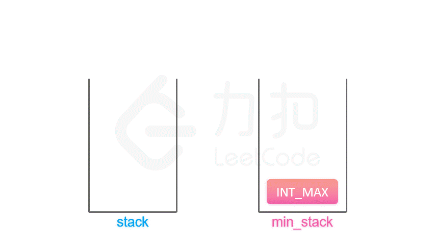

```java
class MinStack {
//最小顶堆问题
//使用一个辅助的栈,记录当前最小的数值
//初始化最小栈为一个最大的值,不然无法记录一开始的值    
    Stack<Integer> curStack;
    Stack<Integer> minStack;
    public MinStack() {
        curStack = new Stack<Integer>();
        minStack = new Stack<>();
        minStack.push(Integer.MAX_VALUE);
    }
    
    public void push(int val) {
        if(val<minStack.peek())minStack.push(val);
        else minStack.push(minStack.peek());
        curStack.push(val);
    }
    
    public void pop() {
        curStack.pop();
        minStack.pop();
    }
    
    public int top() {
       return curStack.peek();
    }
    
    public int getMin() {
      return  minStack.peek();
    }
}
```


# 152.乘积最大子数组

[152. 乘积最大子数组](https://leetcode.cn/problems/maximum-product-subarray/)

中等


给你一个整数数组 `nums` ，请你找出数组中乘积最大的非空连续 子数组（该子数组中至少包含一个数字），并返回该子数组所对应的乘积。

测试用例的答案是一个 **32-位** 整数。

**请注意**，一个只包含一个元素的数组的乘积是这个元素的值。

 

**示例 1:**

```
输入: nums = [2,3,-2,4]
输出: 6
解释: 子数组 [2,3] 有最大乘积 6。
```

**示例 2:**

```
输入: nums = [-2,0,-1]
输出: 0
解释: 结果不能为 2, 因为 [-2,-1] 不是子数组。 
```

```java
    //动态规划

    //candidate1:dpMax[i],dpMax记录当前以及往前的最大子数组->0:cur;i->dpMax[i-1]*cur
    //candidate2:daMin[i],dpMIn记录当前往后的最小子数组,来应对负负得正的情况,0:cur;i->dpMin[i-1]*cur
    //candidate3:cur,同时记录当前节点的数->i:cur,应对遇到为0的,代表重新开始了
    //比较三个候选人取最大进行记录,并与全局最大比较,更新全局最大

    //如果当前是正数,就用前面最大的乘自己,故要记录前面的最大
    //如果当前是负数,就用前面最小的乘自己,故要记录前面的最小
    //如果当前是0,将会重置,当前的最大最小都变成0了,
    //那么下一个位置的最大值就是它自己或者0,故要记录自己
    //所以当前位置的最大值,将会是以上三种情况的一种,因为不确定当前是正数,负数还是0
    public int maxProduct(int[] nums) {
        if(nums==null||nums.length==0)return 0;
        int[] dpMax = new int[nums.length];
        int[] dpMin = new int[nums.length];
        int result = nums[0];
        dpMax[0]=nums[0];
        dpMin[0]=nums[0];
        for(int i = 1;i<nums.length;i++){
            int candidate1 = dpMax[i-1]*nums[i];
            int candidate2 = dpMin[i-1]*nums[i];
            int candidate3 = nums[i];

            dpMax[i] = Math.max(candidate1,Math.max(candidate2,candidate3));
            dpMin[i] = Math.min(candidate1,Math.min(candidate2,candidate3));
            result = Math.max(result,dpMax[i]); 
        }
        return result;
    }
```


# 139.单词拆分

[139. 单词拆分](https://leetcode.cn/problems/word-break/)

中等

给你一个字符串 `s` 和一个字符串列表 `wordDict` 作为字典。如果可以利用字典中出现的一个或多个单词拼接出 `s` 则返回 `true`。

**注意：**不要求字典中出现的单词全部都使用，并且字典中的单词可以重复使用。

 

**示例 1：**

```
输入: s = "leetcode", wordDict = ["leet", "code"]
输出: true
解释: 返回 true 因为 "leetcode" 可以由 "leet" 和 "code" 拼接成。
```

**示例 2：**

```
输入: s = "applepenapple", wordDict = ["apple", "pen"]
输出: true
解释: 返回 true 因为 "applepenapple" 可以由 "apple" "pen" "apple" 拼接成。
     注意，你可以重复使用字典中的单词。
```

**示例 3：**

```
输入: s = "catsandog", wordDict = ["cats", "dog", "sand", "and", "cat"]
输出: false
```

 

```java
//动态规划
    //默认dp全是false
    //dp[i],表示s的前i个字符(不包括自己)能不能利用字典拼出来,所以最后返回的就是dp[length]
    //dp[i] = j从0到i,依次遍历dp[j]&&wordDict.contains(s.substring(j,i))
    //就是在i之前寻找一个中间点,满足前面能用字典拼写出,即dp[j],后面到i能在字典找到即wordDict.containsKey(s.subString(j,i))
    public boolean wordBreak(String s, List<String> wordDict) {
        //将字典放入Hash,方便查找
        HashSet<String> set = new HashSet(wordDict);
        //默认dp全为false;
        boolean[] dp = new boolean[s.length()+1];
        //空字符默认是能在字典找到
        dp[0] = true;

        //开始遍历s
        for(int i = 1;i<=s.length();i++){
            for(int j=0;j<i;j++){
                if(dp[j]&&set.contains(s.substring(j,i))){
                    dp[i] =true;
                    break;
                }
            }
        }
        return dp[s.length()];
    }
```

**枚举字典**

```
    //dp[i]还是代表前i个能不能拼出来
    //但是我们采用遍历字典,看当前i以及i后面的len个数能不能匹配上字典的,len就是字典中每个词的长度,匹配上了,那么说明dp[i+len]=true
    //当然前提是当前的dp[i]是true
    public boolean wordBreak(String s, List<String> wordDict) {
        boolean[] dp =new boolean[s.length()+1];
        dp[0] =true;
        for(int i =0;i<s.length();i++){
            if(dp[i]==false)continue;
            for(int j =0;j<wordDict.size();j++){
                String temp = wordDict.get(j);
                int len = temp.length();
                //防止溢出,因为字典的长度可以很长
                if(i+len<=s.length()){
                    if(temp.equals(s.substring(i,i+len))){
                        dp[i+len]=true;
                    }
                }
            }
        }
        return dp[s.length()];
    }
```


# 136只出现一次的数字

[136. 只出现一次的数字](https://leetcode.cn/problems/single-number/)

已解答

简单

给你一个 **非空** 整数数组 `nums` ，除了某个元素只出现一次以外，其余每个元素均出现两次。找出那个只出现了一次的元素。

你必须设计并实现线性时间复杂度的算法来解决此问题，且该算法只使用常量额外空间。

 

**示例 1 ：**

**输入：**nums = [2,2,1]

**输出：**1

```java
    public int singleNumber(int[] nums) {
        //使用异或,其余的只出现俩次!相同值异或为0,且异或运算具有交换律
        //故有
        int result = 0;
        for(int num:nums){
            result^=num;
        }
        return result;

    }
```


# 128.最长连续序列

[128. 最长连续序列](https://leetcode.cn/problems/longest-consecutive-sequence/)

中等

给定一个未排序的整数数组 `nums` ，找出数字连续的最长序列（不要求序列元素在原数组中连续）的长度。

请你设计并实现时间复杂度为 `O(n)` 的算法解决此问题。

 

**示例 1：**

```
输入：nums = [100,4,200,1,3,2]
输出：4
解释：最长数字连续序列是 [1, 2, 3, 4]。它的长度为 4。
```

```java
    //先使用Hash集合获取存放全部的
    //遍历Set,如果i-1在集合中,就跳过i,因为从i-1开始的序列肯定大于从i开始的!!!
    public int longestConsecutive(int[] nums) {
        HashSet<Integer> set = new HashSet<>();
        int result =0;
        for(int i : nums){
            set.add(i);
        }
        for(int num:set){
            if(set.contains(num-1))continue;
            //以num为起点的最长序列
            int count=1;
            //每次都找下一个是否存在
            while(set.contains(++num))++count;
            result = Math.max(result,count);
        }
        return result;
    }
```


# 322零钱兑换

[322. 零钱兑换](https://leetcode.cn/problems/coin-change/)

中等

给你一个整数数组 `coins` ，表示不同面额的硬币；以及一个整数 `amount` ，表示总金额。

计算并返回可以凑成总金额所需的 **最少的硬币个数** 。如果没有任何一种硬币组合能组成总金额，返回 `-1` 。

你可以认为每种硬币的数量是无限的。

 

**示例 1：**

```
输入：coins = [1, 2, 5], amount = 11
输出：3 
解释：11 = 5 + 5 + 1
```

```java
    //动态规划,完全背包问题,硬币可以无限使用,所以可以正序
    //dp[i],金额i所需要的最小硬币数量,故返回dp[amount]即可
    //更新逻辑就是,遍历硬币面额j,当i-coins[j]>0时,说明还有的剩,
    //剩的金额所需最小硬币数目就是dp[i-coins[j]]
    //当这个dp小于记录的min的时候,才记录新的min为dp[i-coins[j]]+1,表示加上目前这个硬币
    public int coinChange(int[] coins, int amount) {
        if(amount==0)return 0;
        int max = amount+1;
        int[] dp = new int[amount+1];
        Arrays.fill(dp,max);
        dp[0]=0;
        
        for(int i=1;i<=amount;i++){
            //用来找当前金额的最小硬币数量
            for(int j=0;j<coins.length;j++){
                if(i-coins[j]>=0){
                    dp[i] = Math.min(dp[i],dp[i-coins[j]]+1);
                }
            }
        }
        return dp[amount]==max?-1:dp[amount];
    }
```


# 416.分割等和子集

[416. 分割等和子集](https://leetcode.cn/problems/partition-equal-subset-sum/)

中等

给你一个 **只包含正整数** 的 **非空** 数组 `nums` 。请你判断是否可以将这个数组分割成两个子集，使得两个子集的元素和相等。

 

**示例 1：**

```
输入：nums = [1,5,11,5]
输出：true
解释：数组可以分割成 [1, 5, 5] 和 [11] 。
```

**示例 2：**

```
输入：nums = [1,2,3,5]
输出：false
解释：数组不能分割成两个元素和相等的子集。
```

 

**提示：**

- `1 <= nums.length <= 200`
- `1 <= nums[i] <= 100`

```
class Solution {
    //背包问题
    //该题本质是找,数组中有无数字可以拼成数字的和除以2,即sum/2,如果sum不能整除,也说明不可能分割
    //即target是sum/2
    //dp[j]表示,在容量为j的情况下,数组能拼成的最大数
    //那么只要判断dp[target]==target即可
    public boolean canPartition(int[] nums) {
        if(nums.length==1)return false;
        int sum = 0;
        for(int i = 0;i<nums.length;i++){
            sum+=nums[i];
        }
        if(sum%2!=0)return false;
        int target = sum/2;
        int[] dp = new int[target+1];
        for(int i =0;i<nums.length;i++){
            for(int j = target;j>=nums[i];j--){
                dp[j] = Math.max(dp[j],dp[j-nums[i]]+nums[i]);
            }
        }
        return dp[target]==target;
    }
}
```

# 494.目标和

[力扣题目链接(opens new window)](https://leetcode.cn/problems/target-sum/)

难度：中等

给定一个非负整数数组，a1, a2, ..., an, 和一个目标数，S。现在你有两个符号 + 和 -。对于数组中的任意一个整数，你都可以从 + 或 -中选择一个符号添加在前面。

返回可以使最终数组和为目标数 S 的所有添加符号的方法数。

示例：

- 输入：nums: [1, 1, 1, 1, 1], S: 3
- 输出：5

解释：

- -1+1+1+1+1 = 3
- +1-1+1+1+1 = 3
- +1+1-1+1+1 = 3
- +1+1+1-1+1 = 3
- +1+1+1+1-1 = 3

一共有5种方法让最终目标和为3。

提示：

- 数组非空，且长度不会超过 20 。
- 初始的数组的和不会超过 1000 。
- 保证返回的最终结果能被 32 位整数存下。


**思考**


本题要如何使表达式结果为target，

**既然为target，那么就一定有 left组合 - right组合 = target。**

**left的求法:left+right =sum,left-right =target-->left = (sum+targer)/2**

其中sum就是数组中数字的总和

**此时问题就是在集合nums中找出和为left的组合,对应right就是全是负号**。

```java
class Solution {

//dp[j]就是,left之和为j时的最大组合数
//递推:当遍历到数字i时,left之和为j的最大组合,当然选择数字nums[i]的前提是,容量j>=num[i]
//不选择数字i的方案:就是没有遍历到数字i时的dp[j],即之前的自己
//加上选择数字i的方案:就是把数字i的空间排出去,即没有遍历到数字i的dp[j-nums[i]]
//综上为:dp[j] = dp[j]+dp[j-nums[i]];

//边界,容量0->dp[0]=1即不选择任何数字,选择数字0的方案会在递推过程中去加入进去
//减枝:当target>sum时,或者target+sum无法整除2时,代表left不是一个整数了,,返回0
    public int findTargetSumWays(int[] nums, int target) {
        int sum=0;
        for(int i =0;i<nums.length;i++){
            sum+=nums[i];
        }
        if((sum+target)%2!=0||sum<Math.abs(target))return 0;
        int left = (sum+target)/2;
        int[] dp = new int[left+1];
        dp[0]=1;
        for(int i =0;i<nums.length;i++){
            for(int j = left;j>=nums[i];j--){
                dp[j] = dp[j] + dp[j-nums[i]];
            }
        }
        return dp[left];
    }
}
```

# 62.不同路径

[62. 不同路径](https://leetcode.cn/problems/unique-paths/)

中等

一个机器人位于一个 `m x n` 网格的左上角 （起始点在下图中标记为 “Start” ）。

机器人每次只能向下或者向右移动一步。机器人试图达到网格的右下角（在下图中标记为 “Finish” ）。

问总共有多少条不同的路径？

 

**示例 1：**


```
输入：m = 3, n = 7
输出：28
```

**示例 2：**

```
输入：m = 3, n = 2
输出：3
解释：
从左上角开始，总共有 3 条路径可以到达右下角。
1. 向右 -> 向下 -> 向下
2. 向下 -> 向下 -> 向右
3. 向下 -> 向右 -> 向下
```

**示例 3：**

```
输入：m = 7, n = 3
输出：28
```

**示例 4：**

```
输入：m = 3, n = 3
输出：6
```

 

**提示：**

- `1 <= m, n <= 100`
- 题目数据保证答案小于等于 `2 * 109`

```java
    public int uniquePaths(int m, int n) {
        //可以化简乘一个数学问题,本质就是,向下走m-1次,向右走n-1次
        //就是排列组合,无关顺序,一共有m+n-2个位置
        //确认了向下的步数,就确认了右的,故C(m+n-2,m-1)
        
        //但这题也明显是一个动态规划题
        //dp[i][j]代表从0,0到达i,j坐标的路径数目
        //递推式子,就是i,j从上面的格子往下走,或者从左边的格子往右走,即二者之和
        //即 dp[i][j] = dp[i-1][j]+dp[i][j-1]
        //初始条件,从递推式可以知道,i-1可能为0,即需初始化dp[0][j],同理dp[i][0]
        //可以容易得到,从00到0j,只能一直往右边走一条路径,即dp[0][j]=1
        //遍历的,就从1,1从左到右遍历到m,n
        int[][] dp = new int[m][n];
        for(int i=0;i<m;i++)dp[i][0] = 1;
        for(int j=0;j<n;j++)dp[0][j] = 1;
        for(int i =1;i<m;i++){
            for(int j = 1;j<n;j++){
                dp[i][j] = dp[i-1][j]+dp[i][j-1];
            }
        }
        return dp[m-1][n-1];
    }
```

## 63. 不同路径 II

**注意初始条件,以及递推式的判断!!**

[力扣题目链接(opens new window)](https://leetcode.cn/problems/unique-paths-ii/)

一个机器人位于一个 m x n 网格的左上角 （起始点在下图中标记为“Start” ）。

机器人每次只能向下或者向右移动一步。机器人试图达到网格的右下角（在下图中标记为“Finish”）。

现在考虑网格中有障碍物。那么从左上角到右下角将会有多少条不同的路径？


网格中的障碍物和空位置分别用 1 和 0 来表示。

示例 1：


- 输入：obstacleGrid = [[0,0,0],[0,1,0],[0,0,0]]
- 输出：2 解释：
- 3x3 网格的正中间有一个障碍物。
- 从左上角到右下角一共有 2 条不同的路径：
  1. 向右 -> 向右 -> 向下 -> 向下
  2. 向下 -> 向下 -> 向右 -> 向右

```
    public int uniquePathsWithObstacles(int[][] obstacleGrid) {
        //dp[i][j]代表从0,0到达i,j坐标的路径数目
        //递推式子,就是i,j从上面的格子往下走,或者从左边的格子往右走,即二者之和
        //即 dp[i][j] = dp[i-1][j]+dp[i][j-1]
        //但是如果当前格子是障碍物,那么dp[i][j]=0,代表无法到达!
        //初始条件,从递推式可以知道,i-1可能为0,即需初始化dp[0][j],同理dp[i][0]

        //可以容易得到,从00到0j,只能一直往右边走一条路径,即dp[0][j]=1
        //但是只要中途有障碍物,那么那一条线的后面以及这个点都为0!
        //遍历的,就从1,1从左到右遍历到m,n
        int m = obstacleGrid.length;
        int n = obstacleGrid[0].length;
        int[][] dp = new int[m][n];
        for(int i =0;i<m;i++){
            if(obstacleGrid[i][0]==1)break;//dp默认填充的是0,且后面连带都是0
            dp[i][0] = 1;
        }
        for(int j =0;j<n;j++){
            if(obstacleGrid[0][j]==1)break;//dp默认填充的是0,且后面连带都是0
            dp[0][j] = 1;
        }
        for(int i =1;i<m;i++){
            for(int j = 1;j<n;j++){
                if(obstacleGrid[i][j]==1)continue;
                dp[i][j] = dp[i-1][j]+dp[i][j-1];//如果为0,加上去也不影响
            }
        }
        return dp[m-1][n-1];
    }
```

# 96.不同的二叉搜索树

[力扣题目链接(opens new window)](https://leetcode.cn/problems/unique-binary-search-trees/)

给定一个整数 n，求以 1 ... n 为节点组成的二叉搜索树有多少种？

示例:


了解了二叉搜索树之后，我们应该先举几个例子，画画图，看看有没有什么规律，如图：


n为1的时候有一棵树，n为2有两棵树，这个是很直观的。


来看看n为3的时候，有哪几种情况。

当1为头结点的时候，其右子树有两个节点，看这两个节点的布局，是不是和 n 为2的时候两棵树的布局是一样的啊！

（可能有同学问了，这布局不一样啊，节点数值都不一样。别忘了我们就是求不同树的数量，并不用把搜索树都列出来，所以不用关心其具体数值的差异）

当3为头结点的时候，其左子树有两个节点，看这两个节点的布局，是不是和n为2的时候两棵树的布局也是一样的啊！

当2为头结点的时候，其左右子树都只有一个节点，布局是不是和n为1的时候只有一棵树的布局也是一样的啊！

发现到这里，其实我们就找到了重叠子问题了，其实也就是发现可以通过dp[1] 和 dp[2] 来推导出来dp[3]的某种方式。

思考到这里，这道题目就有眉目了。

dp[3]，就是 元素1为头结点搜索树的数量 + 元素2为头结点搜索树的数量 + 元素3为头结点搜索树的数量

元素1为头结点搜索树的数量 = 右子树有2个元素的搜索树数量 * 左子树有0个元素的搜索树数量

元素2为头结点搜索树的数量 = 右子树有1个元素的搜索树数量 * 左子树有1个元素的搜索树数量

元素3为头结点搜索树的数量 = 右子树有0个元素的搜索树数量 * 左子树有2个元素的搜索树数量

有2个元素的搜索树数量就是dp[2]。

有1个元素的搜索树数量就是dp[1]。

有0个元素的搜索树数量就是dp[0]。

所以dp[3] = dp[2] * dp[0] + dp[1] * dp[1] + dp[0] * dp[2]

如图所示：


```java
    public int numTrees(int n) {
        //动态规划
        //dp[i]表示i个节点的二叉搜索树有几种可能
       int[] dp = new int[n+1];
       dp[0] = 1;
       dp[1] = 1;
        for(int i =2;i<=n;i++){
            for(int j =1;j<=i;j++){
                dp[i] += dp[j-1]*dp[i-j];
            }
        }
        return dp[n];
    }
```


# 461汉明距离

[461. 汉明距离](https://leetcode.cn/problems/hamming-distance/)

简单

两个整数之间的 [汉明距离](https://baike.baidu.com/item/汉明距离) 指的是这两个数字对应二进制位不同的位置的数目。

给你两个整数 `x` 和 `y`，计算并返回它们之间的汉明距离。

 

**示例 1：**

```
输入：x = 1, y = 4
输出：2
解释：
1   (0 0 0 1)
4   (0 1 0 0)
       ↑   ↑
上面的箭头指出了对应二进制位不同的位置。
```

```java
class Solution {
//使用异或,并逐一看末尾是不是1
    public int hammingDistance(int x, int y) {
        int temp = x^y;
        int result=0;
        while(temp>0){
            result +=  temp%2==0?0:1;
            temp/=2;
        }
        return result;
    }
}
```

# 338比特位计数

[338. 比特位计数](https://leetcode.cn/problems/counting-bits/)

简单

给你一个整数 `n` ，对于 `0 <= i <= n` 中的每个 `i` ，计算其二进制表示中 **`1` 的个数** ，返回一个长度为 `n + 1` 的数组 `ans` 作为答案。

 

**示例 1：**

```
输入：n = 2
输出：[0,1,1]
解释：
0 --> 0
1 --> 1
2 --> 10
```

```
class Solution {
    //看当前能否整除2,
    //能整除dp[i] = dp[i/2];
    //不能整除dp[i] = dp[i/2]+1;

    public int[] countBits(int n) {
        int[] dp =new int[n+1];
        dp[0] = 0;
        for(int i=1;i<=n;i++){
            int halfI =i/2;
            dp[i] = i%2==0?dp[halfI]:dp[halfI]+1;
        }
        return dp;
    }
}
```

# 312戳气球

[312. 戳气球](https://leetcode.cn/problems/burst-balloons/)

困难

有 `n` 个气球，编号为`0` 到 `n - 1`，每个气球上都标有一个数字，这些数字存在数组 `nums` 中。

现在要求你戳破所有的气球。戳破第 `i` 个气球，你可以获得 `nums[i - 1] * nums[i] * nums[i + 1]` 枚硬币。 这里的 `i - 1` 和 `i + 1` 代表和 `i` 相邻的两个气球的序号。如果 `i - 1`或 `i + 1` 超出了数组的边界，那么就当它是一个数字为 `1` 的气球。

求所能获得硬币的最大数量。

 

**示例 1：**

```
输入：nums = [3,1,5,8]
输出：167
解释：
nums = [3,1,5,8] --> [3,5,8] --> [3,8] --> [8] --> []
coins =  3*1*5    +   3*5*8   +  1*3*8  + 1*8*1 = 167
```

```java
class Solution {

    //dp[l][r]表示在区间lr范围内的戳爆的最大方式的数,不包含l和r
    //那么我们需要扩展nums[0,n-1]到nums[0,n+1],其中nums[0]=nums[n+1]=1,表示一个虚拟的气球,不会被戳爆,只是用于计数
    //我们需要在l,r选择一个最后被戳爆的k,代表此处的最优顺序选择,那么有dp[l][r] = max(dp[l][r],dp[l][k]+dp[k][r]+arr[l]*arr[k]*arr[r]);
    //而大区间的lr,需要依赖小区间算出来的最优数,所以我们区间要从小到大去遍历寻找,最小区间为3(至少需要lkr三个气球),最大区间就是n+2
    public int maxCoins(int[] nums) {
        int n = nums.length;
        int[] arr = new int[n+2];
        arr[0]=arr[n+1] = 1;
        for(int i=1;i<=n;i++){
            arr[i] = nums[i-1];
        }
        int[][] dp =new int[n+2][n+2];
        for(int len = 3;len<=n+2;len++){
            for(int l = 0;l+len-1<=n+1;l++){
                int r = l+len-1;
                for(int k = l+1;k<r;k++){
                    dp[l][r] = Math.max(dp[l][r],dp[l][k]+dp[k][r]+arr[l]*arr[k]*arr[r]);
                }
            }
        }
        return dp[0][n+1];
    }
}

```


# 309买卖股票的最佳时机含冷冻期

[309. 买卖股票的最佳时机含冷冻期](https://leetcode.cn/problems/best-time-to-buy-and-sell-stock-with-cooldown/)

中等

给定一个整数数组`prices`，其中第 `prices[i]` 表示第 `*i*` 天的股票价格 。

设计一个算法计算出最大利润。在满足以下约束条件下，你可以尽可能地完成更多的交易（多次买卖一支股票）:

- 卖出股票后，你无法在第二天买入股票 (即冷冻期为 1 天)。

**注意：**你不能同时参与多笔交易（你必须在再次购买前出售掉之前的股票）。

 

**示例 1:**

```
输入: prices = [1,2,3,0,2]
输出: 3 
解释: 对应的交易状态为: [买入, 卖出, 冷冻期, 买入, 卖出]
```

```
class Solution {
    public int maxProfit(int[] prices) {
        if (prices.length == 0) {
            return 0;
        }

        int n = prices.length;
        // f[i][0]: 手上持有股票的最大收益
        // f[i][1]: 第i天结束后,手上不持有股票，并且处于冷冻期中的累计最大收益
        // f[i][2]: 手上不持有股票，并且不在冷冻期中的累计最大收益
        int[][] f = new int[n][3];
        f[0][0] = -prices[0];
        for (int i = 1; i < n; ++i) {
            f[i][0] = Math.max(f[i - 1][0], f[i - 1][2] - prices[i]);
            f[i][1] = f[i - 1][0] + prices[i];
            f[i][2] = Math.max(f[i - 1][1], f[i - 1][2]);
        }
        return Math.max(f[n - 1][1], f[n - 1][2]);
    }
}
```


# 300最长递增子序列

[300. 最长递增子序列](https://leetcode.cn/problems/longest-increasing-subsequence/)

中等

给你一个整数数组 `nums` ，找到其中最长严格递增子序列的长度。

**子序列** 是由数组派生而来的序列，删除（或不删除）数组中的元素而不改变其余元素的顺序。例如，`[3,6,2,7]` 是数组 `[0,3,1,6,2,2,7]` 的子序列。

**示例 1：**

```
输入：nums = [10,9,2,5,3,7,101,18]
输出：4
解释：最长递增子序列是 [2,3,7,101]，因此长度为 4 。
```

```java
class Solution {
    //定义 dp[i] 为考虑前 i 个元素，以第 i 个数字结尾的最长上升子序列的长度
    //遍历以nums[0]-nums[i]的各个dp,以nums[i]作为最大结尾
    public int lengthOfLIS(int[] nums) {
        if(nums.length==1)return 1;
        int max =1;
        int n = nums.length;
        int[]dp =new int[n];
        dp[0] = 1;
        for(int i =1;i<n;i++){
            dp[i] = 1;
            for(int j = 0;j<i;j++){
                if(nums[i]>nums[j]){
                    dp[i] = Math.max(dp[i],dp[j]+1);//次处承接前面的单调递增dp[j]
                }
            }
            max = Math.max(max,dp[i]);
        }
        return max;
    }
}
```


# 279完全平方数

[279. 完全平方数](https://leetcode.cn/problems/perfect-squares/)

已解答

中等

给你一个整数 `n` ，返回 *和为 `n` 的完全平方数的最少数量* 。

**完全平方数** 是一个整数，其值等于另一个整数的平方；换句话说，其值等于一个整数自乘的积。例如，`1`、`4`、`9` 和 `16` 都是完全平方数，而 `3` 和 `11` 不是。

 

**示例 1：**

```
输入：n = 12
输出：3 
解释：12 = 4 + 4 + 4
```

```java
class Solution {
    //dp[i]表示和为 i 的完全平方数的最少数量
    //递推式就是,将i拆解成对应所需最小数量的dp[i-j*j],其中j*j<=i,dp[0]=0;,而dp[i]=dp[i-j*j]+1
    //故需要枚举j=i到j*j<=i
    public int numSquares(int n) {
        int[] dp = new int[n+1];
        dp[0]=0;
        for(int i = 1;i<=n;i++){
            dp[i] = Integer.MAX_VALUE;
            for(int j=1;j<=(int)Math.sqrt(i);j++){
                dp[i] = Math.min(dp[i],dp[i-j*j]+1);
            }
        }
        return dp[n];
    }
}
```


# 22括号生成(学习回溯)

[22. 括号生成](https://leetcode.cn/problems/generate-parentheses/)

中等

数字 `n` 代表生成括号的对数，请你设计一个函数，用于能够生成所有可能的并且 **有效的** 括号组合。

 

**示例 1：**

```
输入：n = 3
输出：["((()))","(()())","(())()","()(())","()()()"]
```

```java
class Solution {
    // "(" + 【i=left时所有括号的排列组合】 + ")" + 【i=right时所有括号的排列组合】
    // 其中 left + right = n-1，且 p q 均为非负整数。
    public List<String> generateParenthesis(int n) {
        List<List<String>> dp = new ArrayList<>();
        dp.add(new ArrayList<>()); // 0组括号
        
        List<String> first = new ArrayList<>();
        first.add("()");
        dp.add(first); // 1组括号
        
        for (int i = 2; i <= n; i++) {
            List<String> curr = new ArrayList<>();
            
            //(left)right
            for (int j = 0; j < i; j++) {
                List<String> left = dp.get(j);
                List<String> right = dp.get(i - 1 - j);
                
                // 处理 j=0 的情况（left没有括号）
                if (j == 0) {
                    for (String r : right) {
                        curr.add("()" + r);
                    }
                } 
                // 处理 i-1-j=0 的情况(right没有括号)
                else if (i - 1 - j == 0) {
                    for (String l : left) {
                        curr.add("(" + l + ")");
                    }
                } 
                // 一般情况
                else {
                    for (String l : left) {
                        for (String r : right) {
                            curr.add("(" + l + ")" + r);
                        }
                    }
                }
            }
            dp.add(curr);
        }
        
        return dp.get(n);
    }
}
```


[72. 编辑距离](https://leetcode.cn/problems/edit-distance/)

中等

给你两个单词 `word1` 和 `word2`， *请返回将 `word1` 转换成 `word2` 所使用的最少操作数* 。

你可以对一个单词进行如下三种操作：

- 插入一个字符
- 删除一个字符
- 替换一个字符

 

**示例 1：**

```
输入：word1 = "horse", word2 = "ros"
输出：3
解释：
horse -> rorse (将 'h' 替换为 'r')
rorse -> rose (删除 'r')
rose -> ros (删除 'e')
```

**动态规划：**

`dp[i][j]` 代表 `word1` 到 `i` 位置转换成 `word2` 到 `j` 位置需要最少步数

所以，

当 `word1[i] == word2[j]`，`dp[i][j] = dp[i-1][j-1]`；

当 `word1[i] != word2[j]`，`dp[i][j] = min(dp[i-1][j-1], dp[i-1][j], dp[i][j-1]) + 1`

其中，`dp[i-1][j-1]` 表示替换操作，`dp[i-1][j]` 表示删除操作，`dp[i][j-1]` 表示插入操作。

插入为什么是 `dp[i][j-1]`？

1. **先完成前面部分的转换**：
   - `dp[i][j-1]` 表示：word1的前i个字符 → word2的前j-1个字符
   - 这已经是一个完成的子问题
2. **然后插入第j个字符**：
   - word2的第j个字符还没匹配上
   - 在word1的末尾插入word2的第j个字符
   - 插入操作计数 +1

注意，针对第一行，第一列要单独考虑，我们引入 `''` 下图所示：

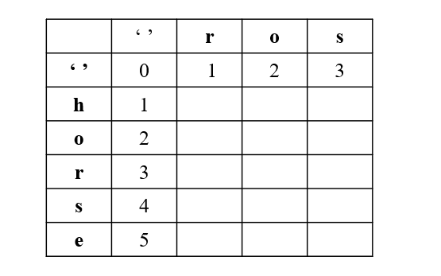
{:align=center}

第一行，是 `word1` 为空变成 `word2` 最少步数，就是插入操作

第一列，是 `word2` 为空，需要的最少步数，就是删除操作


```java
class Solution {
    public int minDistance(String word1, String word2) {
        int n1 = word1.length();
        int n2 = word2.length();
        int[][] dp = new int[n1 + 1][n2 + 1];
        // 第一行
        for (int j = 1; j <= n2; j++) dp[0][j] = dp[0][j - 1] + 1;
        // 第一列
        for (int i = 1; i <= n1; i++) dp[i][0] = dp[i - 1][0] + 1;

        for (int i = 1; i <= n1; i++) {
            for (int j = 1; j <= n2; j++) {
                if (word1.charAt(i - 1) == word2.charAt(j - 1)) dp[i][j] = dp[i - 1][j - 1];
                else dp[i][j] = Math.min(Math.min(dp[i - 1][j - 1], dp[i][j - 1]), dp[i - 1][j]) + 1;
            }
        }
        return dp[n1][n2];  
    }
}

```


# 64最小路径

[64. 最小路径和](https://leetcode.cn/problems/minimum-path-sum/)

中等

给定一个包含非负整数的 `*m* x *n*` 网格 `grid` ，请找出一条从左上角到右下角的路径，使得路径上的数字总和为最小。

**说明：**每次只能向下或者向右移动一步。

 

**示例 1：**

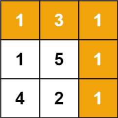

```
输入：grid = [[1,3,1],[1,5,1],[4,2,1]]
输出：7
解释：因为路径 1→3→1→1→1 的总和最小。
```

```java
class Solution {
    //跟不同路径相似
    public int minPathSum(int[][] grid) {
        int m = grid.length;
        int n = grid[0].length;
        int[][] dp = new int[m][n];
        dp[0][0] = grid[0][0];
        for(int i=1;i<m;i++){
            dp[i][0] = dp[i-1][0]+grid[i][0];
        }
        for(int j=1;j<n;j++){
            dp[0][j] = dp[0][j-1]+grid[0][j];
        }
        for(int i =1;i<m;i++){
            for(int j=1;j<n;j++){
                dp[i][j] = Math.min(dp[i-1][j],dp[i][j-1])+grid[i][j];
            }
        }
        return dp[m-1][n-1];
    }
}
```

# 55.跳跃游戏

[55. 跳跃游戏](https://leetcode.cn/problems/jump-game/)

中等

给你一个非负整数数组 `nums` ，你最初位于数组的 **第一个下标** 。数组中的每个元素代表你在该位置可以跳跃的最大长度。

判断你是否能够到达最后一个下标，如果可以，返回 `true` ；否则，返回 `false` 。

 

**示例 1：**

```
输入：nums = [2,3,1,1,4]
输出：true
解释：可以先跳 1 步，从下标 0 到达下标 1, 然后再从下标 1 跳 3 步到达最后一个下标。
```

给你一个非负整数数组 `nums` ，你最初位于数组的 **第一个下标** 。数组中的每个元素代表你在该位置可以跳跃的最大长度。

判断你是否能够到达最后一个下标，如果可以，返回 `true` ；否则，返回 `false` 。

 

**示例 1：**

```java
输入：nums = [2,3,1,1,4]
输出：true
解释：可以先跳 1 步，从下标 0 到达下标 1, 然后再从下标 1 跳 3 步到达最后一个下标。
```


```java
public class Solution {
    public boolean canJump(int[] nums) {
        int n = nums.length;
        int rightmost = 0;
        for (int i = 0; i < n; ++i) {
            //只要当前遍历的位置不大于最远到达距离
            //就实时维护最远到达距离,即i+nums[i],依次基准所能达到的最远
            //一旦当前所能到达最远已经能到数组最后一个位置,就直接返回true
            if (i <= rightmost) {
                rightmost = Math.max(rightmost, i + nums[i]);
                if (rightmost >= n - 1) {
                    return true;
                }
            }
        }
        return false;
    }
}
```

**可以用动态规划,但是贪心算法更快**

```java
class Solution {
    public boolean canJump(int[] nums) {
        boolean[] dp = new boolean[nums.length];
        dp[0] = true;
        for(int i =1;i<nums.length;i++){
            for(int j = i-1;j>=0;j--){
                if(dp[j]==true){
                    if(nums[j]>=i-j){
                        dp[i]=true;
                        break;
                    }    
                }
            }
        }
        return dp[nums.length-1];
    }
}
```

# 53.最大子数组和

[53. 最大子数组和](https://leetcode.cn/problems/maximum-subarray/)

中等

给你一个整数数组 `nums` ，请你找出一个具有最大和的连续子数组（子数组最少包含一个元素），返回其最大和。

**子数组**是数组中的一个连续部分。

 

**示例 1：**

```
输入：nums = [-2,1,-3,4,-1,2,1,-5,4]
输出：6
解释：连续子数组 [4,-1,2,1] 的和最大，为 6 。
```

**示例 2：**

```
输入：nums = [1]
输出：1
```

```java
class Solution {
    //自己大还是连起来大
    //Math.max(pre + x, x)
    public int maxSubArray(int[] nums) {
        int pre = 0, maxAns = nums[0];
        for (int x : nums) {
            pre = Math.max(pre + x, x);
            maxAns = Math.max(maxAns, pre);
        }
        return maxAns;
    }
}
```


# 448.找到所有数组中消失的数字

[448. 找到所有数组中消失的数字](https://leetcode.cn/problems/find-all-numbers-disappeared-in-an-array/)

简单

给你一个含 `n` 个整数的数组 `nums` ，其中 `nums[i]` 在区间 `[1, n]` 内。请你找出所有在 `[1, n]` 范围内但没有出现在 `nums` 中的数字，并以数组的形式返回结果。

 

**示例 1：**

```
输入：nums = [4,3,2,7,8,2,3,1]
输出：[5,6]
```

**示例 2：**

```
输入：nums = [1,1]
输出：[2]
```

将原数组当哈希表去用,将nums[nums[i]-1]+nums.length,进行标记

注意，当我们遍历到某个位置时，其中的数可能已经被增加过，因此需要对 *n* 取模来还原出它本来的值。

```
class Solution {
    public List<Integer> findDisappearedNumbers(int[] nums) {
        int n = nums.length;
        for (int num : nums) {
            int x = (num - 1) % n;
            if (nums[x] <= n) {
                nums[x] += n;
            }
        }
        List<Integer> ret = new ArrayList<Integer>();
        for (int i = 0; i < n; i++) {
            if (nums[i] <= n) {
                ret.add(i + 1);
            }
        }
        return ret;
    }
}

```


```java
class Solution {
    //遍历在新数组标记
    public List<Integer> findDisappearedNumbers(int[] nums) {
        int[] numsCount = new int[nums.length+1];
        List<Integer>result =new ArrayList<Integer>();
        for(int i=0;i<nums.length;i++){
            numsCount[nums[i]] =1; 
        }
        for(int i=1;i<=nums.length;i++){
            if(numsCount[i]==0)result.add(i);
        }
        return result;
    }
}
```

# 238移动零

[283. 移动零](https://leetcode.cn/problems/move-zeroes/)

简单


给定一个数组 `nums`，编写一个函数将所有 `0` 移动到数组的末尾，同时保持非零元素的相对顺序。

**请注意** ，必须在不复制数组的情况下原地对数组进行操作。

 

**示例 1:**

```
输入: nums = [0,1,0,3,12]
输出: [1,3,12,0,0]
```

```java
class Solution {
    //快慢指针,右指针遇到非0数,左指针才动,而右指针一直往前遍历
    public void moveZeroes(int[] nums) {
        int n = nums.length;
        int left =0;
        int right=0;
        while(right<n){
            if(nums[right]!=0){
                swap(nums,left,right);
                left++;
            }
            right++;
        }
    }
        public void swap(int[] nums, int left, int right) {
        int temp = nums[left];
        nums[left] = nums[right];
        nums[right] = temp;
    }

}
```


# 560和为K的子数组

[560. 和为 K 的子数组](https://leetcode.cn/problems/subarray-sum-equals-k/)

中等

给你一个整数数组 `nums` 和一个整数 `k` ，请你统计并返回 *该数组中和为 `k` 的子数组的个数* 。

子数组是数组中元素的连续非空序列。

 

**示例 1：**

```
输入：nums = [1,1,1], k = 2
输出：2
```

**示例 2：**

```
输入：nums = [1,2,3], k = 3
输出：2
```

```java
class Solution {
    public int subarraySum(int[] nums, int k) {
        Map<Integer,Integer>map = new HashMap<>();
        int sum =0;
        int result =0;
        for(int num:nums){
            //防止前缀和本身就是
            if(!map.containsKey(sum))map.put(sum,1);
            else {
                int cnt = map.get(sum);
                map.put(sum,++cnt);
            }
            sum+=num;
            result += map.getOrDefault(sum-k,0);
        }
        return result;
    }
}
```


# 437.路径总和Ⅲ

[437. 路径总和 III](https://leetcode.cn/problems/path-sum-iii/)

中等

给定一个二叉树的根节点 `root` ，和一个整数 `targetSum` ，求该二叉树里节点值之和等于 `targetSum` 的 **路径** 的数目。

**路径** 不需要从根节点开始，也不需要在叶子节点结束，但是路径方向必须是向下的（只能从父节点到子节点）。

 

**示例 1：**


```
输入：root = [10,5,-3,3,2,null,11,3,-2,null,1], targetSum = 8
输出：3
解释：和等于 8 的路径有 3 条，如图所示。
```

**示例 2：**

```
输入：root = [5,4,8,11,null,13,4,7,2,null,null,5,1], targetSum = 22
输出：3
```

```java
class Solution {
   int res = 0;
   Map<Long, Integer> map = new HashMap<>();   
    // map用来存放当前递归分支上已经出现过的前缀和。注意节点的取值范围要使用Long

   public int pathSum(TreeNode root, int targetSum) {
       map.put(0L, 1);  // 注意先在map中放入0，不然当前缀和正好等于 targerSum 时没法被计入 res。注意这里要做 int -> Long 的类型转换
       traversal(root, targetSum, 0L); // 这里也要做 int -> Long 的类型转换
       return res;
   }

   public void traversal(TreeNode node, int targetSum, Long sum){  // 由于节点值的范围是Long，所以节点的和的类型也应该是Long
       // 参数sum表示前缀和（从根节点到当前节点的所有节点之和）
       if(node==null) return ;

       sum += node.val;
       //先找,再put,因为有可能target为0,那么先放的话,就变成找到自己了
       if(map.containsKey(sum-targetSum)){
           res += map.get(sum-targetSum);
       }
       map.put(sum, map.getOrDefault(sum, 0)+1);

       traversal(node.left, targetSum, sum);   // sum不能是全局变量，而必须是递归函数的参数。否则在这里向左递归后，sum的值的变化会影响到接下来向右递归时sum的大小
       traversal(node.right, targetSum, sum);

       // 回溯。因为sum是递归函数参数，每个递归分支的sum之间互相独立，所以不用再手动回溯sum的值，只需要手动回溯map就够了
       map.put(sum, map.get(sum)-1);
   }
}
```

# 17.电话号码的字母组合

[17. 电话号码的字母组合](https://leetcode.cn/problems/letter-combinations-of-a-phone-number/)

中等

给定一个仅包含数字 `2-9` 的字符串，返回所有它能表示的字母组合。答案可以按 **任意顺序** 返回。

给出数字到字母的映射如下（与电话按键相同）。注意 1 不对应任何字母。


 

**示例 1：**

```
输入：digits = "23"
输出：["ad","ae","af","bd","be","bf","cd","ce","cf"]
```

**示例 2：**

```
输入：digits = "2"
输出：["a","b","c"]
```

```java
class Solution {
    private List<String> result = new ArrayList<>();
    private StringBuilder sb = new StringBuilder();
    private String[] numString = {"","","abc","def","ghi","jkl","mno","pqrs","tuv","wxyz"};
    public List<String> letterCombinations(String digits) {
        backtracking(digits,0);
        return result;
    }
    //num表示当前遍历到的digits位数
    private void backtracking(String digits,int num){
        if(sb.length() == digits.length()){
            result.add(sb.toString());
            return;
        }
        String str = numString[digits.charAt(num)-'0'];
        for(int i=0;i<str.length();i++){
            sb.append(str.charAt(i));
            //递归
            backtracking(digits,num+1);
            //回溯
            sb.deleteCharAt(sb.length()-1);
        }
    }

}
```

# 39组合总和

[39. 组合总和](https://leetcode.cn/problems/combination-sum/)

中等

给你一个 **无重复元素** 的整数数组 `candidates` 和一个目标整数 `target` ，找出 `candidates` 中可以使数字和为目标数 `target` 的 所有 **不同组合** ，并以列表形式返回。你可以按 **任意顺序** 返回这些组合。

`candidates` 中的 **同一个** 数字可以 **无限制重复被选取** 。如果至少一个数字的被选数量不同，则两种组合是不同的。 

对于给定的输入，保证和为 `target` 的不同组合数少于 `150` 个。

 

**示例 1：**

```
输入：candidates = [2,3,6,7], target = 7
输出：[[2,2,3],[7]]
解释：
2 和 3 可以形成一组候选，2 + 2 + 3 = 7 。注意 2 可以使用多次。
7 也是一个候选， 7 = 7 。
仅有这两种组合。
```

```java
class Solution {
    private List<List<Integer>>result = new ArrayList<>();
    private LinkedList<Integer>path = new LinkedList<>();
    public List<List<Integer>> combinationSum(int[] candidates, int target) {
        //先排序,有利于及时减枝
        Arrays.sort(candidates);
        backtracking(0,candidates,target,0);
        return result;
    }
    private void backtracking(int startIndex,int[] candidates,int target,int sum){
        if(sum==target){
            result.add(new ArrayList(path));
            return;
        }
        for(int i=startIndex;i<candidates.length;i++){
            if(sum+candidates[i]>target)break;
            path.offer(candidates[i]);
            //递归
            backtracking(i,candidates,target,sum+candidates[i]);
            //回溯
            //由于传了sum的参数,所以sum不用手动回溯
            path.removeLast();
        }
    }
}
```


# 78.子集

[78. 子集](https://leetcode.cn/problems/subsets/)

中等

给你一个整数数组 `nums` ，数组中的元素 **互不相同** 。返回该数组所有可能的子集（幂集）。

解集 **不能** 包含重复的子集。你可以按 **任意顺序** 返回解集。

 

**示例 1：**

```
输入：nums = [1,2,3]
输出：[[],[1],[2],[1,2],[3],[1,3],[2,3],[1,2,3]]
```

**示例 2：**

```
输入：nums = [0]
输出：[[],[0]]
```

 

```java
class Solution {
    List<List<Integer>> result = new ArrayList<>();// 存放符合条件结果的集合
    LinkedList<Integer> path = new LinkedList<>();// 用来存放符合条件结果
    public List<List<Integer>> subsets(int[] nums) {
        subsetsHelper(nums, 0);
        return result;
    }

    private void subsetsHelper(int[] nums, int startIndex){
        result.add(new ArrayList<>(path));//「遍历这个树的时候，把所有节点都记录下来，就是要求的子集集合」。
        if (startIndex >= nums.length){ //终止条件可不加
            return;
        }
        for (int i = startIndex; i < nums.length; i++){
            path.add(nums[i]);
            subsetsHelper(nums, i + 1);
            path.removeLast();
        }
    }
}
```


[46. 全排列](https://leetcode.cn/problems/permutations/)

中等

给定一个不含重复数字的数组 `nums` ，返回其 *所有可能的全排列* 。你可以 **按任意顺序** 返回答案。

 

**示例 1：**

```
输入：nums = [1,2,3]
输出：[[1,2,3],[1,3,2],[2,1,3],[2,3,1],[3,1,2],[3,2,1]]
```

**示例 2：**

```
输入：nums = [0,1]
输出：[[0,1],[1,0]]
```

```java
class Solution {
    private List<List<Integer>>result = new ArrayList<>();
    private LinkedList<Integer>path = new LinkedList<>();
    
    public List<List<Integer>> permute(int[] nums) {
        boolean[] cnt=new boolean[nums.length];
        if(nums.length==0)return result;
        backtracking(nums,cnt);
        return result;
    }
    private void backtracking(int[] nums,boolean[] cnt){
        if(path.size()==nums.length){
            result.add(new ArrayList(path));
            return;
        }
        //for循环从0开始,因为是全排列,每一个都要重新从头开始列入
        for(int i =0;i<nums.length;i++){
            // if(path.contains(nums[i])){
            //     //虽然说从头开始,但是不能重复
            //     continue;
            // }
            //使用标记法,更快
            if(cnt[i]==false){
                cnt[i] = true;
                path.add(nums[i]);
                backtracking(nums,cnt);
                path.removeLast();
                cnt[i] = false;
            }
        }
    }
}
```


# 438找到字符串中所有的字母异位词

[438. 找到字符串中所有字母异位词](https://leetcode.cn/problems/find-all-anagrams-in-a-string/)

中等

给定两个字符串 `s` 和 `p`，找到 `s` 中所有 `p` 的 **异位词** 的子串，返回这些子串的起始索引。不考虑答案输出的顺序。

 

**示例 1:**

```
输入: s = "cbaebabacd", p = "abc"
输出: [0,6]
解释:
起始索引等于 0 的子串是 "cba", 它是 "abc" 的异位词。
起始索引等于 6 的子串是 "bac", 它是 "abc" 的异位词。
```

```java
class Solution {
    public List<Integer> findAnagrams(String s, String p) {
        List<Integer> result = new ArrayList<>();
        if (s.length() < p.length()) return result;
        
        int[] pCount = new int[26];
        // 统计p中字符频率
        for (int i = 0; i < p.length(); i++) {
            pCount[p.charAt(i) - 'a']++;
        }
        
        int[] sCount = new int[26];  // 创建对比窗口
        // 滑动窗口
        for (int right = 0; right < s.length(); right++) {
            //每次都加入右端点
            sCount[s.charAt(right)-'a']++;
            //并寻找窗口的左端点
            int left = right -p.length()+1;
            //窗口不够长
            if(left<0){
                continue;
            }
            // 比较两个频率数组
            if (Arrays.equals(pCount, sCount)) {
                result.add(left);
            }
            //每次准备右移前,取出左端点
            sCount[s.charAt(left)-'a']--;
        }
        return result;
    }
}
```


# 538.把二叉树转换为累加树

[538. 把二叉搜索树转换为累加树](https://leetcode.cn/problems/convert-bst-to-greater-tree/)

中等

给出二叉 **搜索** 树的根节点，该树的节点值各不相同，请你将其转换为累加树（Greater Sum Tree），使每个节点 `node` 的新值等于原树中大于或等于 `node.val` 的值之和。

提醒一下，二叉搜索树满足下列约束条件：

- 节点的左子树仅包含键 **小于** 节点键的节点。
- 节点的右子树仅包含键 **大于** 节点键的节点。
- 左右子树也必须是二叉搜索树。

**注意：**本题和 1038: https://leetcode.cn/problems/binary-search-tree-to-greater-sum-tree/ 相同

 

**示例 1：**

**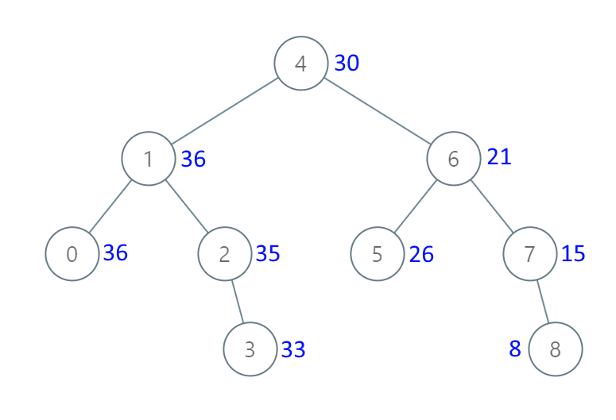**

```
输入：[4,1,6,0,2,5,7,null,null,null,3,null,null,null,8]
输出：[30,36,21,36,35,26,15,null,null,null,33,null,null,null,8]
```

```java
class Solution {
    private int sum=0;
    //中序遍历,右中左
    public TreeNode convertBST(TreeNode root) {
        if(root == null)return root;
        convertBST(root.right);
        sum+=root.val;
        root.val = sum;
        convertBST(root.left);
        return root;
    }
}
```


# 98验证二叉搜索树

[98. 验证二叉搜索树](https://leetcode.cn/problems/validate-binary-search-tree/)

中等

给你一个二叉树的根节点 `root` ，判断其是否是一个有效的二叉搜索树。

**有效** 二叉搜索树定义如下：

- 节点的左子树只包含 **严格小于** 当前节点的数。
- 节点的右子树只包含 **严格大于** 当前节点的数。
- 所有左子树和右子树自身必须也是二叉搜索树。

 

**示例 1：**


```
输入：root = [2,1,3]
输出：true
```

```java
class Solution {
    private long prev = Long.MIN_VALUE;
    
    public boolean isValidBST(TreeNode root) {
        if (root == null) return true;
        
        // 1. 检查左子树
        boolean left = isValidBST(root.left);
        
        // 2. 检查当前节点
        boolean current;
        if (root.val > prev) {
            current = true;
            prev = root.val;
        } else {
            current = false;
        }
        
        // 3. 检查右子树
        boolean right = isValidBST(root.right);
        
        // 4. 返回所有结果的与运算
        return left && current && right;
    }
}
```


# 297二叉树的序列化和反序列化

[297. 二叉树的序列化与反序列化](https://leetcode.cn/problems/serialize-and-deserialize-binary-tree/)

已解答

困难

序列化是将一个数据结构或者对象转换为连续的比特位的操作，进而可以将转换后的数据存储在一个文件或者内存中，同时也可以通过网络传输到另一个计算机环境，采取相反方式重构得到原数据。

请设计一个算法来实现二叉树的序列化与反序列化。这里不限定你的序列 / 反序列化算法执行逻辑，你只需要保证一个二叉树可以被序列化为一个字符串并且将这个字符串反序列化为原始的树结构。

**提示:** 输入输出格式与 LeetCode 目前使用的方式一致，详情请参阅 [LeetCode 序列化二叉树的格式](https://leetcode.cn/help-center/3812581/)。你并非必须采取这种方式，你也可以采用其他的方法解决这个问题。

 

**示例 1：**

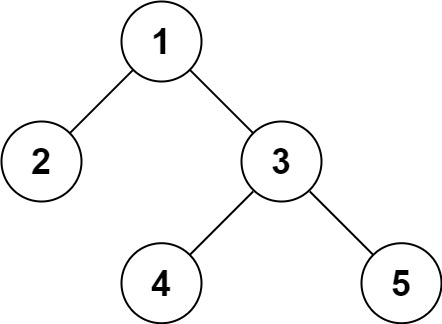

```
输入：root = [1,2,3,null,null,4,5]
输出：[1,2,3,null,null,4,5]
```

**示例 2：**

```
输入：root = []
输出：[]
```

```java
public class Codec {

    // Encodes a tree to a single string.
    public String serialize(TreeNode root) {
        if(root==null)return "[]";
        //层序遍历
        Queue<TreeNode> que = new LinkedList<>();
        StringBuilder sb = new StringBuilder();
        sb.append("[");
        que.add(root);
        while(!que.isEmpty()){
            TreeNode node = que.poll();
            if(node == null) sb.append("null");
            else{
                que.add(node.left);
                que.add(node.right);
                sb.append(node.val);
            }
            //目前不是最后一个
            if(!que.isEmpty())sb.append(",");
        }
        String result = sb.toString();
        return result+"]";
    }

    // Decodes your encoded data to tree.
    public TreeNode deserialize(String data) {
        if (data.equals("[]")) return null;
        
        //去除[]和,并取对应的节点值,"数字"或"null"
        String[] vals = data.substring(1, data.length() - 1).split(",");
        
        TreeNode root = new TreeNode(Integer.parseInt(vals[0]));
        Queue<TreeNode> que = new LinkedList<>();
        que.offer(root);
        
        int i = 1;
        while (!que.isEmpty() && i < vals.length) {
            TreeNode node = que.poll();
            
            // 处理左子节点
            if (i < vals.length && !vals[i].equals("null")) {
                node.left = new TreeNode(Integer.parseInt(vals[i]));
                que.offer(node.left);
            }
            i++;
            
            // 处理右子节点
            if (i < vals.length && !vals[i].equals("null")) {
                node.right = new TreeNode(Integer.parseInt(vals[i]));
                que.offer(node.right);
            }
            i++;
        }
        
        return root;
    }
}
```


# 406根据身高重建队列

[406. 根据身高重建队列](https://leetcode.cn/problems/queue-reconstruction-by-height/)

中等

假设有打乱顺序的一群人站成一个队列，数组 `people` 表示队列中一些人的属性（不一定按顺序）。每个 `people[i] = [hi, ki]` 表示第 `i` 个人的身高为 `hi` ，前面 **正好** 有 `ki` 个身高大于或等于 `hi` 的人。

请你重新构造并返回输入数组 `people` 所表示的队列。返回的队列应该格式化为数组 `queue` ，其中 `queue[j] = [hj, kj]` 是队列中第 `j` 个人的属性（`queue[0]` 是排在队列前面的人）。

 

**示例 1：**

```
输入：people = [[7,0],[4,4],[7,1],[5,0],[6,1],[5,2]]
输出：[[5,0],[7,0],[5,2],[6,1],[4,4],[7,1]]
解释：
编号为 0 的人身高为 5 ，没有身高更高或者相同的人排在他前面。
编号为 1 的人身高为 7 ，没有身高更高或者相同的人排在他前面。
编号为 2 的人身高为 5 ，有 2 个身高更高或者相同的人排在他前面，即编号为 0 和 1 的人。
编号为 3 的人身高为 6 ，有 1 个身高更高或者相同的人排在他前面，即编号为 1 的人。
编号为 4 的人身高为 4 ，有 4 个身高更高或者相同的人排在他前面，即编号为 0、1、2、3 的人。
编号为 5 的人身高为 7 ，有 1 个身高更高或者相同的人排在他前面，即编号为 1 的人。
因此 [[5,0],[7,0],[5,2],[6,1],[4,4],[7,1]] 是重新构造后的队列。
```

**示例 2：**

```
输入：people = [[6,0],[5,0],[4,0],[3,2],[2,2],[1,4]]
输出：[[4,0],[5,0],[2,2],[3,2],[1,4],[6,0]]
```

```java
class Solution {
    //先排序再插空
    public int[][] reconstructQueue(int[][] people) {
        //先按照身高降序排序,身高相同,按照ki升序排序
        Arrays.sort(people,(a,b)->{
            if(a[0]==b[0])return a[1]-b[1];
            return b[0]-a[0];
        });
        //再按照对应的序号依次插入到数组列表中
        List<int[]>list = new ArrayList<>();
        for(int[] person:people){
            list.add(person[1],person);
        }

        //转为二维数组返回
        return list.toArray(new int[list.size()][]);
    }
}
```

# 31下一个排列

[31. 下一个排列](https://leetcode.cn/problems/next-permutation/)

中等


相关标签

相关企业


整数数组的一个 **排列** 就是将其所有成员以序列或线性顺序排列。

- 例如，`arr = [1,2,3]` ，以下这些都可以视作 `arr` 的排列：`[1,2,3]`、`[1,3,2]`、`[3,1,2]`、`[2,3,1]` 。

整数数组的 **下一个排列** 是指其整数的下一个字典序更大的排列。更正式地，如果数组的所有排列根据其字典顺序从小到大排列在一个容器中，那么数组的 **下一个排列** 就是在这个有序容器中排在它后面的那个排列。如果不存在下一个更大的排列，那么这个数组必须重排为字典序最小的排列（即，其元素按升序排列）。

- 例如，`arr = [1,2,3]` 的下一个排列是 `[1,3,2]` 。
- 类似地，`arr = [2,3,1]` 的下一个排列是 `[3,1,2]` 。
- 而 `arr = [3,2,1]` 的下一个排列是 `[1,2,3]` ，因为 `[3,2,1]` 不存在一个字典序更大的排列。

给你一个整数数组 `nums` ，找出 `nums` 的下一个排列。

必须**[ 原地 ](https://baike.baidu.com/item/原地算法)**修改，只允许使用额外常数空间。

 

**示例 1：**

```
输入：nums = [1,2,3]
输出：[1,3,2]
```

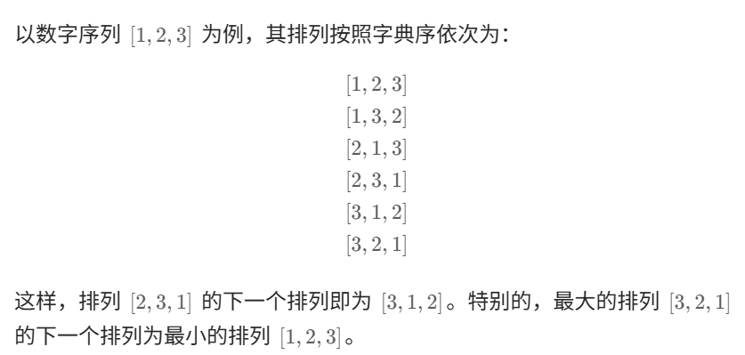

具体地，我们这样描述该算法，对于长度为 *n* 的排列 *a*：

1. 首先从后向前查找第一个顺序对 (*i*,*i*+1)，满足 *a*[*i*]<*a*[*i*+1]。这样「较小数」即为 *a*[*i*]。此时 [*i*+1,*n*) 必然是下降序列。
2. 如果找到了顺序对，那么在区间 [*i*+1,*n*) 中从后向前查找第一个元素 *j* 满足 *a*[*i*]<*a*[*j*]。这样「较大数」即为 *a*[*j*]。
3. 交换 *a*[*i*] 与 *a*[*j*]，此时可以证明区间 [*i*+1,*n*) 必为降序。我们可以直接使用双指针反转区间 [*i*+1,*n*) 使其变为升序，而无需对该区间进行排序。

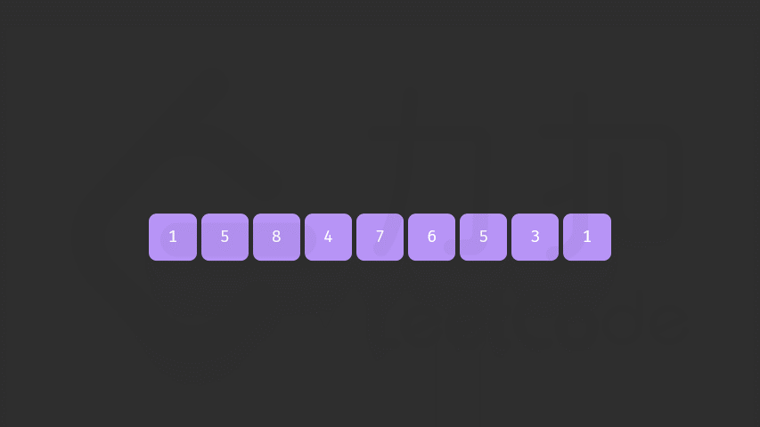

**注意**

如果在步骤 1 找不到顺序对，说明当前序列已经是一个降序序列，即最大的序列，我们直接跳过步骤 2 执行步骤 3，即可得到最小的升序序列。

该方法支持序列中存在重复元素，且在 C++ 的标准库函数 [`next_permutation`](https://leetcode.cn/link/?target=https%3A%2F%2Fen.cppreference.com%2Fw%2Fcpp%2Falgorithm%2Fnext_permutation) 中被采用。

```java
class Solution {
    public void nextPermutation(int[] nums) {
        //从后往前找,找到第一个小于后面的数
        int i;
        for(i = nums.length-2;i>=0;i--){
            if(nums[i]<nums[i+1])break;
        }
        //只要找到了较小数nums[i],就需要找对应的较大数nums[j],大于
        if(i>=0){
            for(int j=nums.length-1;j>=0;j--){
                if(nums[j]>nums[i]){
                    swap(nums,i,j);
                    break;
                }
            }
        }
        //没找到i,说明整个序列都是降序的,例如321,说明要重新开始了,则将整个数组反转,此时i+1=0
        reverse(nums,i+1);
    }

    public void swap(int[] nums, int i, int j) {
        int temp = nums[i];
        nums[i] = nums[j];
        nums[j] = temp;
    }

    public void reverse(int[] nums, int start) {
        int left = start, right = nums.length - 1;
        while (left < right) {
            swap(nums, left, right);
            left++;
            right--;
        }
    }

}
```


# 394字符串解码

[394. 字符串解码](https://leetcode.cn/problems/decode-string/)

中等

给定一个经过编码的字符串，返回它解码后的字符串。

编码规则为: `k[encoded_string]`，表示其中方括号内部的 `encoded_string` 正好重复 `k` 次。注意 `k` 保证为正整数。

你可以认为输入字符串总是有效的；输入字符串中没有额外的空格，且输入的方括号总是符合格式要求的。

此外，你可以认为原始数据不包含数字，所有的数字只表示重复的次数 `k` ，例如不会出现像 `3a` 或 `2[4]` 的输入。

测试用例保证输出的长度不会超过 `105`。

 

**示例 1：**

```
输入：s = "3[a]2[bc]"
输出："aaabcbc"
```

- 本题难点在于括号内嵌套括号，需要**从内向外**生成与拼接字符串，这与栈的**先入后出**特性对应。

- **算法流程：**

  1. 构建辅助栈stack， 遍历字符串s中每个字符c；

     - 当 `c` 为数字时，将数字字符转化为数字 `multi`，用于后续倍数计算；

     - 当 `c` 为字母时，在 `res` 尾部添加 `c`；

     - 当c为[时，将当前multi和res入栈，并分别置空置0：

       - 记录此 `[` 前的临时结果 `res` 至栈，用于发现对应 `]` 后的拼接操作；
       - 记录此 `[` 前的倍数 `multi` 至栈，用于发现对应 `]` 后，获取 `multi × [...]` 字符串。
       - 进入到新 `[` 后，`res` 和 `multi` 重新记录。

     - 当c 为]时，stack出栈，拼接字符串

        res = last_res + cur_multi * res，其中:

       - `last_res`是上个 `[` 到当前 `[` 的字符串，例如 `"3[a2[c]]"` 中的 `a`；
       - `cur_multi`是当前 `[` 到 `]` 内字符串的重复倍数，例如 `"3[a2[c]]"` 中的 `2`。

  2. 返回字符串 `res`。

- **复杂度分析：**

  - 时间复杂度 *O*(*N*)，一次遍历 `s`；

  - 空间复杂度 *O*(*N*)，辅助栈在极端情况下需要线性空间，例如 `2[2[2[a]]]`。

  - ```java
    class Solution {
        public String decodeString(String s) {
            Stack<Integer>multi_stack = new Stack<>();
            Stack<String>res_stack = new Stack<>();
            StringBuilder res = new StringBuilder();
            int multi=0;
            for(char c : s.toCharArray()){
                if(c=='['){
                    //存储当前的multi和res到stack
                    res_stack.push(res.toString());
                    multi_stack.push(multi);
                    //清空multi和stack为下一次存储做准备
                    res = new StringBuilder();
                    multi = 0;
                }
                else if(c==']'){
                    StringBuilder temp = new StringBuilder();
                    //最上面的才是当前的multi
                    int cur_multi = multi_stack.pop();
                    //拼凑multi个res最后一个字符串,还未被加入到stack.res,而是在res中
                    for(int i=0;i<cur_multi;i++){
                        temp.append(res);
                    }
                    //更新res,取出上一层的字符串合并当前multi过的字符串为res
                    res =new StringBuilder(res_stack.pop()+temp);
                }
                else if(c>='0'&&c<='9'){
                    //更新multi
                    multi = multi*10+Integer.parseInt(c+"");
                }
                else{
                    res.append(c);
                }
            }
            return res.toString();
        }
    }
    ```

  # 287寻找重复数

  [287. 寻找重复数](https://leetcode.cn/problems/find-the-duplicate-number/)

  中等

  给定一个包含 `n + 1` 个整数的数组 `nums` ，其数字都在 `[1, n]` 范围内（包括 `1` 和 `n`），可知至少存在一个重复的整数。

  假设 `nums` 只有 **一个重复的整数** ，返回 **这个重复的数** 。

  你设计的解决方案必须 **不修改** 数组 `nums` 且只用常量级 `O(1)` 的额外空间。

   

  **示例 1：**

  ```
  输入：nums = [1,3,4,2,2]
  输出：2
  ```

  **示例 2：**

  ```
  输入：nums = [3,1,3,4,2]
  输出：3
  ```

  ```
  class Solution {
      public int findDuplicate(int[] nums) {
          //跟找环类似,因为这里说明了,nums里面的值不会大于其长度
          int slow = 0, fast = 0;
          do {
              slow = nums[slow];
              fast = nums[nums[fast]];
          } while (slow != fast);
          slow = 0;
          while (slow != fast) {
              slow = nums[slow];
              fast = nums[fast];
          }
          return slow;
      }
  }
  
  ```

# 49.字母异位词

[49. 字母异位词分组](https://leetcode.cn/problems/group-anagrams/)

中等

给你一个字符串数组，请你将 字母异位词 组合在一起。可以按任意顺序返回结果列表。

 

**示例 1:**

**输入:** strs = ["eat", "tea", "tan", "ate", "nat", "bat"]

**输出:** [["bat"],["nat","tan"],["ate","eat","tea"]]

**解释：**

- 在 strs 中没有字符串可以通过重新排列来形成 `"bat"`。
- 字符串 `"nat"` 和 `"tan"` 是字母异位词，因为它们可以重新排列以形成彼此。
- 字符串 `"ate"` ，`"eat"` 和 `"tea"` 是字母异位词，因为它们可以重新排列以形成彼此。

**排序+哈希表**

由于互为字母异位词的两个字符串包含的字母相同，因此对两个字符串分别进行排序之后得到的字符串一定是相同的，故可以将排序之后的字符串作为哈希表的键。

```java
class Solution {
    public List<List<String>> groupAnagrams(String[] strs) {
        Map<String, List<String>> map = new HashMap<String, List<String>>();
        for (String str : strs) {
            char[] array = str.toCharArray();
            Arrays.sort(array);
            String key = new String(array);
            //如果是异位词,那么key就是一样的了,因为已经排序了
            //如果hash已经存了,那么就取异位词组,并将当前的str添加到这个词组中
            //不存在就重新创建一个空链表,将当前的str添加到这个空链表中
            //最后更新map
            List<String> list = map.getOrDefault(key, new ArrayList<String>());
            //注意此处是str
            list.add(str);
            map.put(key, list);
        }
        return new ArrayList<List<String>>(map.values());
    }
}
```


# 34.在排序数组中查找元素的第一个和最后一个位置

[34. 在排序数组中查找元素的第一个和最后一个位置](https://leetcode.cn/problems/find-first-and-last-position-of-element-in-sorted-array/)

中等

给你一个按照非递减顺序排列的整数数组 `nums`，和一个目标值 `target`。请你找出给定目标值在数组中的开始位置和结束位置。

如果数组中不存在目标值 `target`，返回 `[-1, -1]`。

你必须设计并实现时间复杂度为 `O(log n)` 的算法解决此问题。

 

**示例 1：**

```
输入：nums = [5,7,7,8,8,10], target = 8
输出：[3,4]
```

寻找第一个等于target的二分查找

```java
class Solution {
    public int[] searchRange(int[] nums, int target) {
        int start = lowerBound(nums,target);
        //没找到对应的start
        if(start==nums.length||nums[start]!=target){
            return new int[]{-1,-1};
        }
        // 找到start必然有end
        //我们找target的下一个数,再将坐标减1就是要求的了
        //即使没有下一个数,那么最后落点也会在数组末尾的前一个,end就是数组末尾
        int end = lowerBound(nums,target+1)-1;
        return new int[]{start,end};
    }

    // lowerBound 返回最小的满足 nums[i] >= target 的下标 i
    // 如果数组为空，或者所有数都 < target，则返回 nums.length
    // 要求 nums 是非递减的，即 nums[i] <= nums[i + 1]

     private int lowerBound(int[] nums, int target) {
        int left = 0;
        int right = nums.length-1;
        while(left<=right){
            // 循环不变量：
            // nums[left-1] < target
            // nums[right+1] >= target
            int mid = (left+right)/2;
            // nums[left-1] < target：左边界左边的元素都严格小于 target。
            // nums[right+1] >= target：右边界右边的元素都大于等于 target。
            if(nums[mid]>=target)right = mid-1;//->mid = right+1
            else left = mid+1;//->mid = left-1
        }
        //最后,第一个大于target的数就是左边界
        return left;
    }
}
```


# 33.搜索选择排序数组

[33. 搜索旋转排序数组](https://leetcode.cn/problems/search-in-rotated-sorted-array/)

中等

整数数组 `nums` 按升序排列，数组中的值 **互不相同** 。

在传递给函数之前，`nums` 在预先未知的某个下标 `k`（`0 <= k < nums.length`）上进行了 **向左旋转**，使数组变为 `[nums[k], nums[k+1], ..., nums[n-1], nums[0], nums[1], ..., nums[k-1]]`（下标 **从 0 开始** 计数）。例如， `[0,1,2,4,5,6,7]` 下标 `3` 上向左旋转后可能变为 `[4,5,6,7,0,1,2]` 。

给你 **旋转后** 的数组 `nums` 和一个整数 `target` ，如果 `nums` 中存在这个目标值 `target` ，则返回它的下标，否则返回 `-1` 。

你必须设计一个时间复杂度为 `O(log n)` 的算法解决此问题。

 

**示例 1：**

```
输入：nums = [4,5,6,7,0,1,2], target = 0
输出：4
```

**示例 2：**

```
输入：nums = [4,5,6,7,0,1,2], target = 3
输出：-1
```

```java
class Solution {
    public int search(int[] nums, int target) {
        int n = nums.length;
        // 处理边界情况：空数组
        if (n == 0) {
            return -1;
        }
        // 处理边界情况：只有一个元素的数组
        if (n == 1) {
            return nums[0] == target ? 0 : -1;
        }

        int l = 0, r = n - 1;
        // 开始二分查找
        while (l <= r) {
            int mid = (l + r) / 2;
            // 运气好，直接命中
            if (nums[mid] == target) {
                return mid;
            }

            // --- 核心判断：mid 落在左半部分（较大的递增段）还是右半部分（较小的递增段） ---
            // 判断条件：比较 nums[0] 和 nums[mid]
            // 如果 nums[0] <= nums[mid]，说明 [l, mid] 是连续递增的（即 mid 在左段）
            // 注意：这个条件在数组没有旋转时也成立，即整个数组都是左段
            if (nums[0] <= nums[mid]) {
                // 场景1: mid 在左段（数值较大的递增段，例如 [4,5,6,7]）
                // 此时，我们需要判断 target 是否就在这一段的范围内
                // 条件是：target 大于等于最左边的数 nums[0]，并且小于 mid 位置的值 nums[mid]
                // 注意是 target < nums[mid]，因为如果等于已经在上面返回了
                if (nums[0] <= target && target < nums[mid]) {
                    // 如果 target 在左段且在中点的左边，向左收缩右边界
                    r = mid - 1;
                } else {
                    // 否则，target 可能在右段，或者在中点的右边但仍在左段（比如 target > nums[mid]）
                    // 无论哪种情况，都需要向右收缩左边界
                    l = mid + 1;
                }
            } else {
                // 场景2: mid 在右段（数值较小的递增段，例如 [0,1,2]）
                // 判断 target 是否就在这一段的范围内
                // 条件是：target 大于 mid 位置的值 nums[mid]，并且小于等于最右边的数 nums[n-1]
                if (nums[mid] < target && target <= nums[n - 1]) {
                    // 如果 target 在右段且在中点的右边，向右收缩左边界
                    l = mid + 1;
                } else {
                    // 否则，target 可能在左段，或者在中点的左边但仍在右段（比如 target < nums[mid]）
                    // 无论哪种情况，都需要向左收缩右边界
                    r = mid - 1;
                }
            }
        }
        // 循环结束没找到，返回 -1
        return -1;
    }
}
```

**我的注释版本**

```java
class Solution {
    public int search(int[] nums, int target) {
        int n = nums.length;
        if(n==0)return -1;
        if(n==1)return nums[0]==target?0:-1;

        int left=0;
        int right = n-1;
        while(left<=right){
            int mid = (left+right)/2;
            if(nums[mid]==target)return mid;
            //判断mid在哪一边
            //此处说明mid在左边升序序列
            if(nums[mid]>=nums[0]){
                //target在left到mid之间,此处不包括nums[mid],否则在此之前已经返回
                //在的话,就将右区间移过来
                if(target>=nums[0]&&target<nums[mid])right = mid-1;
                //否则,就在target还在mid右边
                else left = mid + 1;
            }
            //此处说明mid在右边序列
            else{
                //判断target在不在mid和right之间,在则将左区间移过来
                if(target>nums[mid]&&target<=nums[right])left = mid+1;
                else right = mid-1;
            }
        }
        //循环结束没有找到
        return -1;
    }
}
```


# 56.合并区间

[56. 合并区间](https://leetcode.cn/problems/merge-intervals/)

已解答

中等

以数组 `intervals` 表示若干个区间的集合，其中单个区间为 `intervals[i] = [starti, endi]` 。请你合并所有重叠的区间，并返回 *一个不重叠的区间数组，该数组需恰好覆盖输入中的所有区间* 。

 

**示例 1：**

```
输入：intervals = [[1,3],[2,6],[8,10],[15,18]]
输出：[[1,6],[8,10],[15,18]]
解释：区间 [1,3] 和 [2,6] 重叠, 将它们合并为 [1,6].
```

**示例 2：**

```
输入：intervals = [[1,4],[4,5]]
输出：[[1,5]]
解释：区间 [1,4] 和 [4,5] 可被视为重叠区间。
```

**示例 3：**

```
输入：intervals = [[4,7],[1,4]]
输出：[[1,7]]
解释：区间 [1,4] 和 [4,7] 可被视为重叠区间。
```

```java
class Solution {
    public int[][] merge(int[][] intervals) {
        if(intervals.length==0)return new int[0][2];
        //排序,这样子保证,左边的数一定是非递减的,右边的数随便排序
        Arrays.sort(intervals,(n1,n2)->n1[0]-n2[0]);
        List<int[]>list = new ArrayList<>();
        for(int i=0;i<intervals.length;i++){
            int L = intervals[i][0];
            int R = intervals[i][1];
            //当是第一个添加或者list末尾的R比当前需要添加的L还小,则直接添加
            if(list.size()==0||list.get(list.size()-1)[1]<L){
                list.add(new int[]{L,R});
            }else{
                //合并区间,即R取最大的
                list.get(list.size()-1)[1] = Math.max(list.get(list.size()-1)[1],R);
            }
        }
        return list.toArray(new int[list.size()][2]);
    }
}
```


# 581最短无序连续子数组

[581. 最短无序连续子数组](https://leetcode.cn/problems/shortest-unsorted-continuous-subarray/)

中等

给你一个整数数组 `nums` ，你需要找出一个 **连续子数组** ，如果对这个子数组进行升序排序，那么整个数组都会变为升序排序。

请你找出符合题意的 **最短** 子数组，并输出它的长度。

 

**示例 1：**

```
输入：nums = [2,6,4,8,10,9,15]
输出：5
解释：你只需要对 [6, 4, 8, 10, 9] 进行升序排序，那么整个表都会变为升序排序。
```

```java
class Solution {
// 要找到无序子数组，需要同时确定左右边界：
// 右边界：从左到右遍历，记录当前最大值，最后一个小于当前最大值的元素的位置
// 左边界：从右到左遍历，记录当前最小值，最后一个大于当前最小值的元素的位置
    public int findUnsortedSubarray(int[] nums) {
        int max = nums[0];
        int min = nums[nums.length-1];
        int left=0;
        int right=-1;
        for(int i =1;i<nums.length;i++){
            if(nums[i]<max)right = i;
            max = Math.max(max,nums[i]);

        }
        for(int i = nums.length-2;i>=0;i--){
            if(nums[i]>min)left=i;
            min = Math.min(min,nums[i]);
        }
        return right-left+1;
    }
}
```

# 11.盛最多水的容器

[11. 盛最多水的容器](https://leetcode.cn/problems/container-with-most-water/)

中等

给定一个长度为 `n` 的整数数组 `height` 。有 `n` 条垂线，第 `i` 条线的两个端点是 `(i, 0)` 和 `(i, height[i])` 。

找出其中的两条线，使得它们与 `x` 轴共同构成的容器可以容纳最多的水。

返回容器可以储存的最大水量。

**说明：**你不能倾斜容器。

 

**示例 1：**


```
输入：[1,8,6,2,5,4,8,3,7]
输出：49 
解释：图中垂直线代表输入数组 [1,8,6,2,5,4,8,3,7]。在此情况下，容器能够容纳水（表示为蓝色部分）的最大值为 49。
```

**示例 2：**

```
输入：height = [1,1]
输出：1
```

```java
class Solution {
    public int maxArea(int[] height) {
        //双指针法
        int left = 0;
        int right = height.length-1;
        int maxArea=Integer.MIN_VALUE;
        while(left<right){
            int h = Math.min(height[left], height[right]);
            maxArea =Math.max(maxArea,(right - left)*h);


            //分别跳过所有不可能成为新边界的柱子
            //新的左右边界都一定大于 h，才有可能产生更大面积,因为宽度是必然在收缩的
            while(left<right && height[left]<=h){
                left++;
            }
            while(left<right && height[right]<=h){
                right--;
            }
        }
        return maxArea;
    }
}
```


# 621.任务调度器

[621. 任务调度器](https://leetcode.cn/problems/task-scheduler/)

中等

给你一个用字符数组 `tasks` 表示的 CPU 需要执行的任务列表，用字母 A 到 Z 表示，以及一个冷却时间 `n`。每个周期或时间间隔允许完成一项任务。任务可以按任何顺序完成，但有一个限制：两个 **相同种类** 的任务之间必须有长度为 `n` 的冷却时间。

返回完成所有任务所需要的 **最短时间间隔** 。

 

**示例 1：**

**输入：**tasks = ["A","A","A","B","B","B"], n = 2

**输出：**8

**解释：**

在完成任务 A 之后，你必须等待两个间隔。对任务 B 来说也是一样。在第 3 个间隔，A 和 B 都不能完成，所以你需要待命。在第 4 个间隔，由于已经经过了 2 个间隔，你可以再次执行 A 任务。


我们首先考虑所有任务种类中执行次数最多的那一种，记它为 A，的执行次数为 *maxExec*。

我们使用一个宽为 *n*+1 的矩阵可视化地展现执行 A 的时间点。其中任务以行优先的顺序执行，没有任务的格子对应 CPU 的待命状态。由于冷却时间为 *n*，因此我们将所有的 A 排布在矩阵的第一列，可以保证满足题目要求，并且容易看出这是可以使得总时间最小的排布方法，对应的总时间为：

(*maxExec*−1)(*n*+1)+1

同理，如果还有其它也需要执行 *maxExec* 次的任务，我们也需要将它们依次排布成列。例如，当还有任务 B 和 C 时，我们需要将它们排布在矩阵的第二、三列。

**如果任务数量大于了n+1列,那么任务将没有空隙的执行,小于的话,就是以下图解公式**

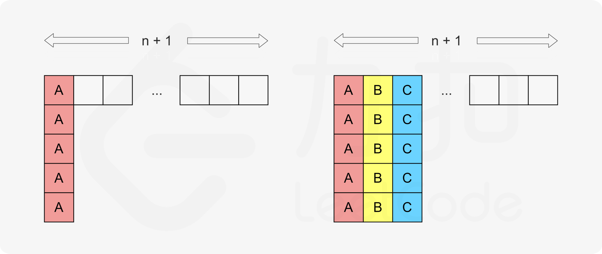

如果需要执行 *maxExec* 次的任务的数量为 *maxCount*，那么类似地可以得到对应的总时间为：

(*maxExec*−1)(*n*+1)+*maxCount*

读者可能会对这个总时间产生疑问：如果 *maxCount*>*n*+1，那么多出的任务会无法排布进矩阵的某一列中，上面计算总时间的方法就不对了。我们把这个疑问放在这里，先「假设」一定有 *maxCount*≤*n*+1。


**同时我们可以发现：**

- **如果我们没有填「超出」了 *n*+1 列，那么图中存在 0 个或多个位置没有放入任务，由于位置数量为 (*maxExec*−1)(*n*+1)+*maxCount*，因此有：**

  **∣*task*∣<(*maxExec*−1)(*n*+1)+*maxCount***

- **如果我们填「超出」了 *n*+1 列，那么同理有：**

  **∣*task*∣>(*maxExec*−1)(*n*+1)+*maxCount***

**因此，在任意的情况下，需要的最少时间就是 (*maxExec*−1)(*n*+1)+*maxCount* 和 ∣*task*∣ 中的较大值。**


```java
class Solution {
    public int leastInterval(char[] tasks, int n) {
    // 统计每个任务的出现次数
    int[] counts = new int[26];
    for (char task : tasks) {
        counts[task - 'A']++;
    }
    
    // 找到出现次数最多的任务maxCount
    //并记录次数最多任务的个数maxCountTasks
    int maxCount = 0;
    int maxCountTasks = 0;
    
    for (int count : counts) {
        if (count > maxCount) {
            maxCount = count;
            maxCountTasks = 1;
        } else if (count == maxCount) {
            maxCountTasks++;
        }
    }
    
    // 公式： (maxCount - 1) * (n + 1) + maxCountTasks
    // 解释：将出现次数最多的任务作为分隔，每个分隔块之间需要 n 个其他任务
    int result = (maxCount - 1) * (n + 1) + maxCountTasks;
    
    // 如果任务总数大于计算结果，说明不需要空闲时间
    return Math.max(result, tasks.length);
}
}
```


```java
class Solution {
    public int leastInterval(char[] tasks, int n) {
        Map<Character, Integer> freq = new HashMap<Character, Integer>();
        // 最多的执行次数
        int maxExec = 0;
        for (char ch : tasks) {
            int exec = freq.getOrDefault(ch, 0) + 1;
            freq.put(ch, exec);
            maxExec = Math.max(maxExec, exec);
        }

        // 具有最多执行次数的任务数量
        int maxCount = 0;
        Set<Map.Entry<Character, Integer>> entrySet = freq.entrySet();
        for (Map.Entry<Character, Integer> entry : entrySet) {
            int value = entry.getValue();
            if (value == maxExec) {
                ++maxCount;
            }
        }

        return Math.max((maxExec - 1) * (n + 1) + maxCount, tasks.length);
    }
}。
```

# 75颜色分类

[75. 颜色分类](https://leetcode.cn/problems/sort-colors/)

中等

给定一个包含红色、白色和蓝色、共 `n` 个元素的数组 `nums` ，**[原地](https://baike.baidu.com/item/原地算法)** 对它们进行排序，使得相同颜色的元素相邻，并按照红色、白色、蓝色顺序排列。

我们使用整数 `0`、 `1` 和 `2` 分别表示红色、白色和蓝色。

必须在不使用库内置的 sort 函数的情况下解决这个问题。

 

**示例 1：**

```
输入：nums = [2,0,2,1,1,0]
输出：[0,0,1,1,2,2]
```

**示例 2：**

```
输入：nums = [2,0,1]
输出：[0,1,2]
```

```java
class Solution {
    //本质是计算有多少个012,但是需要确定他们的数量
    //首先2肯定在末端,所以无论如何先取为2
    //再判断实际当前为多少,记为x
    //用p1标记1的数量,由于1的前面有0,那么判断时,x<=1,都是1,1的位置会覆盖原来多余的2
    //我们用p0标记0的数量,此时即为即0的末端位置,0的位置会覆盖原来多余的1
    
    public void sortColors(int[] nums) {
        int p0=0;
        int p1=0;
        for(int i=0;i<nums.length;i++){
            int x = nums[i];
            nums[i]=2;
            //以下俩个判断,同时计数了1和0的数量,并将真正是0的覆盖了1,将真正是1的覆盖了2
            if(x<=1)nums[p1++]=1;
            if(x==0)nums[p0++]=0;
        }
    }
}
```

# 48.旋转图像

[48. 旋转图像](https://leetcode.cn/problems/rotate-image/)

中等

给定一个 *n* × *n* 的二维矩阵 `matrix` 表示一个图像。请你将图像顺时针旋转 90 度。

你必须在**[ 原地](https://baike.baidu.com/item/原地算法)** 旋转图像，这意味着你需要直接修改输入的二维矩阵。**请不要** 使用另一个矩阵来旋转图像。

 

**示例 1：**


```
输入：matrix = [[1,2,3],[4,5,6],[7,8,9]]
输出：[[7,4,1],[8,5,2],[9,6,3]]
```

```java
class Solution {
    public void rotate(int[][] matrix) {
        int n = matrix.length;
        // 一层一层处理，只需要处理一半的行
        for (int i = 0; i < n / 2; i++) {
            // 每一层中，处理当前行的元素（最后一个元素不需要单独处理）
            for (int j = 0; j < (n+1)/2; j++) {
                // 保存上边的元素
                int temp = matrix[i][j];
                
                // 左边 -> 上边
                matrix[i][j] = matrix[n - 1 - j][i];
                
                // 下边 -> 左边
                matrix[n - 1 - j][i] = matrix[n - 1 - i][n - 1 - j];
                
                // 右边 -> 下边
                matrix[n - 1 - i][n - 1 - j] = matrix[j][n - 1 - i];
                
                // 上边(保存的值) -> 右边
                matrix[j][n - 1 - i] = temp;
            }
        }
    }
}
```

# 240搜索二维矩阵Ⅱ

[240. 搜索二维矩阵 II](https://leetcode.cn/problems/search-a-2d-matrix-ii/)

中等

编写一个高效的算法来搜索 `*m* x *n*` 矩阵 `matrix` 中的一个目标值 `target` 。该矩阵具有以下特性：

- 每行的元素从左到右升序排列。
- 每列的元素从上到下升序排列。

 

**示例 1：**


```
输入：matrix = [[1,4,7,11,15],[2,5,8,12,19],[3,6,9,16,22],[10,13,14,17,24],[18,21,23,26,30]], target = 5
输出：true
```

**解题思路：**


> 若使用暴力法遍历矩阵 `matrix` ，则时间复杂度为 *O*(*NM*) 。暴力法未利用矩阵 **“从上到下递增、从左到右递增”** 的特点，显然不是最优解法。

如下图所示，我们将矩阵逆时针旋转 45° ，并将其转化为图形式，发现其类似于 **二叉搜索树** ，即对于每个元素，其左分支元素更小、右分支元素更大。因此，通过从 “根节点” 开始搜索，遇到比 `target` 大的元素就向左，反之向右，即可找到目标值 `target` 。

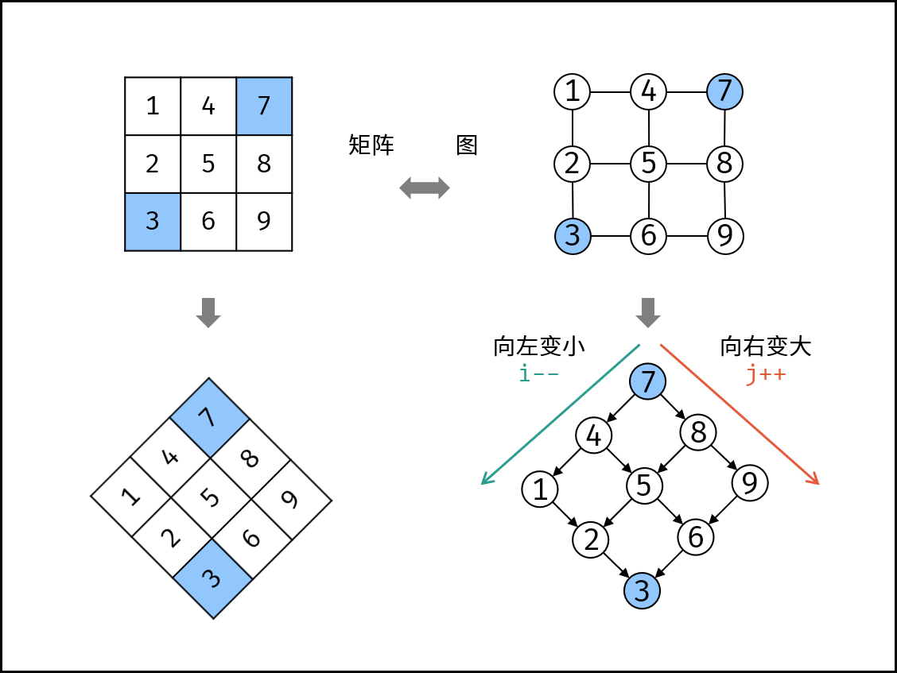

“根节点” 对应的是矩阵的 “左下角” 和 “右上角” 元素，本文称之为 **标志数** ，以 `matrix` 中的 **左下角元素** 为标志数 `flag` ，则有:

1. 若 `flag > target` ，则 `target` 一定在 `flag` 所在 **行的上方** ，即 `flag` 所在行可被消去。
2. 若 `flag < target` ，则 `target` 一定在 `flag` 所在 **列的右方** ，即 `flag` 所在列可被消去。

### **算法流程：**

1. 从矩阵matrix左下角元素（索引设为(i, j)）开始遍历，并与目标值对比：
   - 当 `matrix[i][j] > target` 时，执行 `i--` ，即消去第 `i` 行元素。
   - 当 `matrix[i][j] < target` 时，执行 `j++` ，即消去第 `j` 列元素。
   - 当 `matrix[i][j] = target` 时，返回 *t**r**u**e* ，代表找到目标值。
2. 若行索引或列索引越界，则代表矩阵中无目标值，返回 *f**a**l**se* 。

```java
class Solution {
    public boolean searchMatrix(int[][] matrix, int target) {
        int i = matrix.length - 1, j = 0;
        while(i >= 0 && j < matrix[0].length)
        {
            if(matrix[i][j] > target) i--;
            else if(matrix[i][j] < target) j++;
            else return true;
        }
        return false;
    }
}
```

