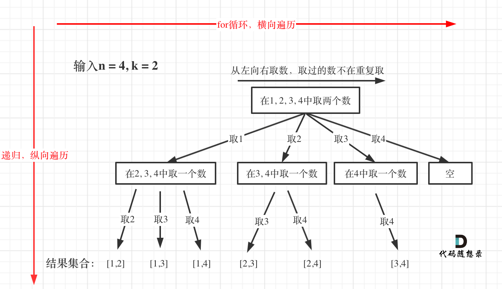
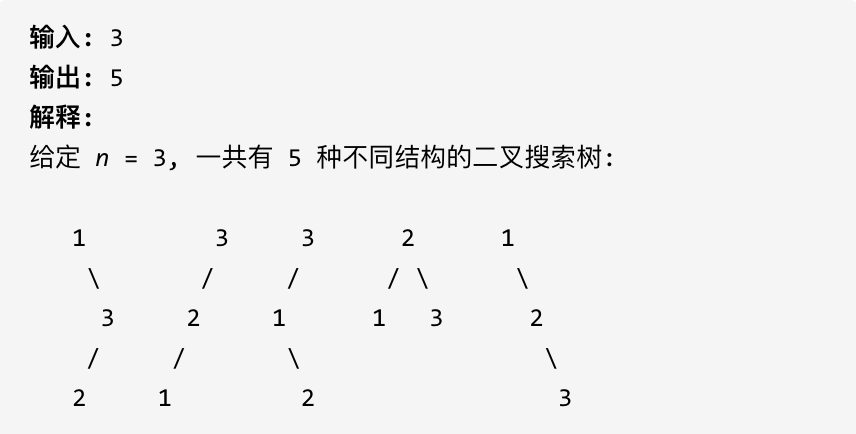
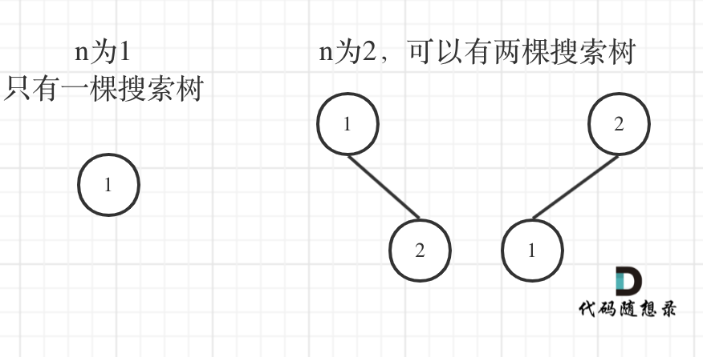
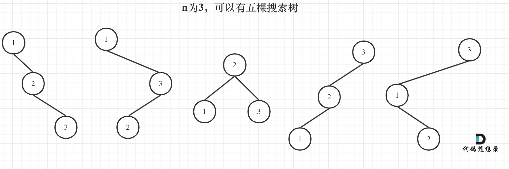
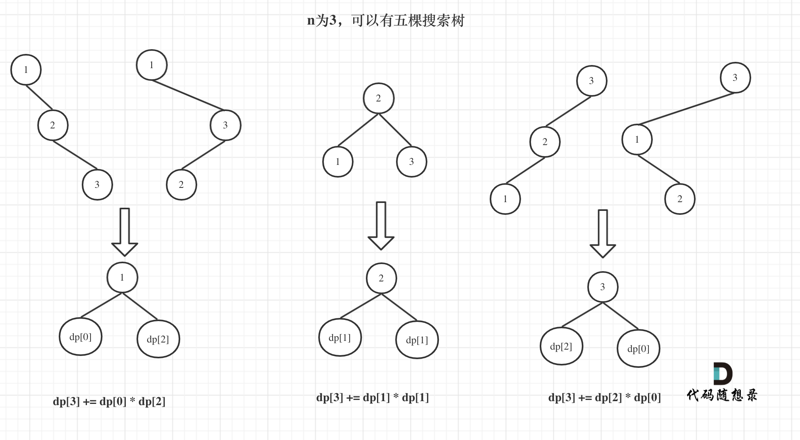
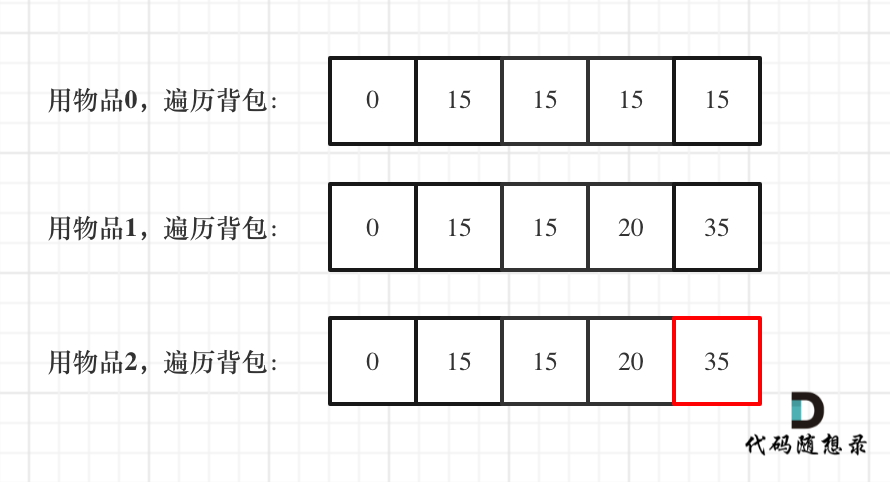

# 堆栈

##  20. 有效的括号

[力扣题目链接](https://leetcode.cn/problems/valid-parentheses/)

给定一个只包括 '('，')'，'{'，'}'，'['，']' 的字符串，判断字符串是否有效。

有效字符串需满足：

- 左括号必须用相同类型的右括号闭合。
- 左括号必须以正确的顺序闭合。
- 注意空字符串可被认为是有效字符串。

示例 1:

- 输入: "()"
- 输出: true

示例 2:

- 输入: "()[]{}"
- 输出: true

**思路:每次每次将对应的括号弹出**

**如果没有对应括号在栈内,或者栈已经空了,那么都说明不匹配**

**遍历完后,如果栈里面没有元素了,证明全部匹配**

```
class Solution {
    public boolean isValid(String s) {
        Stack<String> stack = new Stack<>();
        for(int i=0;i<s.length();i++){
            char c = s.charAt(i);
            if(c=="(")stack.push(")");
            else if(c=="[")stack.push("]");
            else if(c=="{")stack.push("}");
            else if(stack.empty()||stack.peek()!=c)return false;
            else stack.pop();
        }
        return stack.empty();
    }
}
```

## 1047. 删除字符串中的所有相邻重复项

[力扣题目链接(opens new window)](https://leetcode.cn/problems/remove-all-adjacent-duplicates-in-string/)

给出由小写字母组成的字符串 S，重复项删除操作会选择两个相邻且相同的字母，并删除它们。

在 S 上反复执行重复项删除操作，直到无法继续删除。

在完成所有重复项删除操作后返回最终的字符串。答案保证唯一。

示例：

- 输入："abbaca"
- 输出："ca"
- 解释：例如，在 "abbaca" 中，我们可以删除 "bb" 由于两字母相邻且相同，这是此时唯一可以执行删除操作的重复项。之后我们得到字符串 "aaca"，其中又只有 "aa" 可以执行重复项删除操作，所以最后的字符串为 "ca"。

提示：

- 1 <= S.length <= 20000
- S 仅由小写英文字母组成。

**思路:遍历字符串,有与栈顶相同的就弹出,不相同或者栈空就入栈**

**最后使用StringBuilder拼凑出答案**

```
class Solution {
    public String removeDuplicates(String s) {
        Stack<Character> stack = new Stack<>();
        for(int i =0;i<s.length();i++){
            char c = s.charAt(i);
            if(stack.empty()||c!=stack.peek())stack.push(c);
            else stack.pop();
        }
        StringBuilder sb = new StringBuilder();
        while(!stack.empty()){
            sb.append(stack.pop());
        }
        String result = sb.reverse().toString();
        return result;
    }
}
```


## 150. 逆波兰表达式求值

[力扣题目链接(opens new window)](https://leetcode.cn/problems/evaluate-reverse-polish-notation/)

根据 逆波兰表示法，求表达式的值。

有效的运算符包括 + , - , * , / 。每个运算对象可以是整数，也可以是另一个逆波兰表达式。

说明：

整数除法只保留整数部分。 给定逆波兰表达式总是有效的。换句话说，表达式总会得出有效数值且不存在除数为 0 的情况。

示例 1：

- 输入: ["2", "1", "+", "3", " * "]
- 输出: 9
- 解释: 该算式转化为常见的中缀算术表达式为：((2 + 1) * 3) = 9

示例 2：

- 输入: ["4", "13", "5", "/", "+"]
- 输出: 6
- 解释: 该算式转化为常见的中缀算术表达式为：(4 + (13 / 5)) = 6

示例 3：

- 输入: ["10", "6", "9", "3", "+", "-11", " * ", "/", " * ", "17", "+", "5", "+"]

- 输出: 22

- 解释:该算式转化为常见的中缀算术表达式为：

  ```text
  ((10 * (6 / ((9 + 3) * -11))) + 17) + 5       
  = ((10 * (6 / (12 * -11))) + 17) + 5       
  = ((10 * (6 / -132)) + 17) + 5     
  = ((10 * 0) + 17) + 5     
  = (0 + 17) + 5    
  = 17 + 5    
  = 22    
  ```

```
class Solution {
    public int evalRPN(String[] tokens) {
        Deque<Integer> stack = new LinkedList();
        for (String s : tokens) {
            if ("+".equals(s)) {        // leetcode 内置jdk的问题，不能使用==判断字符串是否相等
                stack.push(stack.pop() + stack.pop());      // 注意 - 和/ 需要特殊处理
            } else if ("-".equals(s)) {
                stack.push(-stack.pop() + stack.pop());
            } else if ("*".equals(s)) {
                stack.push(stack.pop() * stack.pop());
            } else if ("/".equals(s)) {
                int temp1 = stack.pop();
                int temp2 = stack.pop();
                stack.push(temp2 / temp1);
            } else {
                stack.push(Integer.valueOf(s));
            }
        }
        return stack.pop();
    }
}
```


## 239. 滑动窗口最大值

[力扣题目链接(opens new window)](https://leetcode.cn/problems/sliding-window-maximum/)

给定一个数组 nums，有一个大小为 k 的滑动窗口从数组的最左侧移动到数组的最右侧。你只可以看到在滑动窗口内的 k 个数字。滑动窗口每次只向右移动一位。

返回滑动窗口中的最大值。

进阶：

你能在线性时间复杂度内解决此题吗？


提示：

- 1 <= nums.length <= 10^5
- -10^4 <= nums[i] <= 10^4
- 1 <= k <= nums.length

```
class Solution {
    public int[] maxSlidingWindow(int[] nums, int k) {
        ArrayDeque<Integer> deque = new ArrayDeque<>();
        int idx=0;
        int n = nums.length;
        int[] res = new int[n-k+1];
        for(int i=0;i<nums.length;i++){
            //如果当前队首的序号小于了窗口左边界,那么就要弹出队首
            if(!deque.isEmpty()&&deque.peek()<i-k+1){
                deque.poll();
            }
            //如果新加进来的比末尾大,那么将抛弃末尾,不再维护,且需要一直判断弹出,保持单调性
            while(!deque.isEmpty()&&nums[i]>nums[deque.peekLast()]){
                deque.pollLast();
            }
            //在判断完后添加对应序号
            deque.add(i);
            //当窗口大小第一次达到 k 时，开始记录答案
            if(i>=k-1){
                res[idx++] = nums[deque.peek()];
            }
        }
        return res;
    }
}
```

## 347.前 K 个高频元素

[力扣题目链接(opens new window)](https://leetcode.cn/problems/top-k-frequent-elements/)

给定一个非空的整数数组，返回其中出现频率前 k 高的元素。

示例 1:

- 输入: nums = [1,1,1,2,2,3], k = 2
- 输出: [1,2]

示例 2:

- 输入: nums = [1], k = 1
- 输出: [1]

提示：

- 你可以假设给定的 k 总是合理的，且 1 ≤ k ≤ 数组中不相同的元素的个数。
- 你的算法的时间复杂度必须优于 $O(n \log n)$ , n 是数组的大小。
- 题目数据保证答案唯一，换句话说，数组中前 k 个高频元素的集合是唯一的。
- 你可以按任意顺序返回答案。


```
Map<Integer,Integer> map = new HashMap<>(); //key为数组元素值,val为对应出现次数
        for (int num : nums) {
            map.put(num, map.getOrDefault(num, 0) + 1);
        }
        //在优先队列中存储二元组(num, cnt),cnt表示元素值num在数组中的出现次数
        //出现次数按从队头到队尾的顺序是从小到大排,出现次数最低的在队头(相当于小顶堆)
        PriorityQueue<int[]> pq = new PriorityQueue<>((pair1, pair2) -> pair1[1] - pair2[1]);
        for (Map.Entry<Integer, Integer> entry : map.entrySet()) { //小顶堆只需要维持k个元素有序
            if (pq.size() < k) { //小顶堆元素个数小于k个时直接加
                pq.add(new int[]{entry.getKey(), entry.getValue()});
            } else {
                if (entry.getValue() > pq.peek()[1]) { //当前元素出现次数大于小顶堆的根结点(这k个元素中出现次数最少的那个)
                    pq.poll(); //弹出队头(小顶堆的根结点),即把堆里出现次数最少的那个删除,留下的就是出现次数多的了
                    pq.add(new int[]{entry.getKey(), entry.getValue()});
                }
            }
        }
        int[] ans = new int[k];
        for (int i = k - 1; i >= 0; i--) { //依次弹出小顶堆,先弹出的是堆的根,出现次数少,后面弹出的出现次数多
            ans[i] = pq.poll()[0];
        }
        return ans;
```

# 二叉树

## 递归遍历

```
// 前序遍历·递归·LC144_二叉树的前序遍历
class Solution {
    public List<Integer> preorderTraversal(TreeNode root) {
        List<Integer> result = new ArrayList<Integer>();
        preorder(root, result);
        return result;
    }

    public void preorder(TreeNode root, List<Integer> result) {
        if (root == null) {
            return;
        }
        result.add(root.val);
        preorder(root.left, result);
        preorder(root.right, result);
    }
}
// 中序遍历·递归·LC94_二叉树的中序遍历
class Solution {
    public List<Integer> inorderTraversal(TreeNode root) {
        List<Integer> res = new ArrayList<>();
        inorder(root, res);
        return res;
    }

    void inorder(TreeNode root, List<Integer> list) {
        if (root == null) {
            return;
        }
        inorder(root.left, list);
        list.add(root.val);             // 注意这一句
        inorder(root.right, list);
    }
}
// 后序遍历·递归·LC145_二叉树的后序遍历
class Solution {
    public List<Integer> postorderTraversal(TreeNode root) {
        List<Integer> res = new ArrayList<>();
        postorder(root, res);
        return res;
    }

    void postorder(TreeNode root, List<Integer> list) {
        if (root == null) {
            return;
        }
        postorder(root.left, list);
        postorder(root.right, list);
        list.add(root.val);             // 注意这一句
    }
}

```

## 迭代遍历(使用栈)


看代码有点抽象我们来看一下动画(中序遍历)：


**本质就是调整树的入栈顺序,并为所需出栈的加上null标记**

```
//前序遍历中左右,入栈顺序右左中
public List<Integer> preorderTraversal(TreeNode root) {
        //统一迭代
        Stack<TreeNode>stack = new Stack<>();
        List<Integer>res = new ArrayList<>();
        if(root!=null)stack.push(root);
        while(!stack.empty()){
            TreeNode node = stack.peek();
            if(node!=null)
            {
                stack.pop();
                if(node.right!=null)stack.push(node.right);
                if(node.left!=null)stack.push(node.left);
                stack.push(node);
                stack.push(null);
            }
            else{
                stack.pop();
                node = stack.pop();
                res.add(node.val);
            }
        }
        return res;
    }
//中序,只要改核心顺序,入栈变成右中左
//后序,同理,入栈改为中右左即可
    public List<Integer> preorderTraversal(TreeNode root) {
        //统一迭代
        Stack<TreeNode>stack = new Stack<>();
        List<Integer>res = new ArrayList<>();
        if(root!=null)stack.push(root);
        while(!stack.empty()){
            TreeNode node = stack.peek();
            if(node!=null)
            {
                stack.pop();
                if(node.right!=null)stack.push(node.right);
                stack.push(node);
                stack.push(null);
                if(node.left!=null)stack.push(node.left);
               
            }
            else{
                stack.pop();
                node = stack.pop();
                res.add(node.val);
            }
        }
        return res;
    }
```

## 树的层序遍历

**总结来讲,如果要进行层处理,就在while(num>0)的循环进行,每一层的前置设定与后续的收集就在该循环前后进行,其他框架基本不变**

### 基本层序

```
public List<List<Integer>>resList = new ArrayList<>();

public void find(TreeNode root){
if(root==null)return;
Queue<TreeNode> q =  new LinkedList<>();
q.offer(root);
while(!q.isEmpty()){
	List<Integer>tempList = new ArrayList<>();
	int num = q.size();
	while(num>0){
		TreeNode node = q.poll();
		tempList.add(node.val);
		if(node.left!=null)q.offer(node.left);
		if(node.right!=null)q.offer(node.right);
		num--;
	}
	resList.add(tempList);
}
}
```

### 倒序层序

只需要最后反转即可

### 右视图

[力扣题目链接(opens new window)](https://leetcode.cn/problems/binary-tree-right-side-view/)

给定一棵二叉树，想象自己站在它的右侧，按照从顶部到底部的顺序，返回从右侧所能看到的节点值。


只需要遍历的时候,只取每一层的最后一个添加到答案

```
public List<Integer> rightSideView(TreeNode root) {
        List<Integer>resList = new ArrayList<>();
        Queue<TreeNode> que = new LinkedList<>();
        if(root==null)return resList;
        que.add(root);
        while(!que.isEmpty()){
            int size = que.size();
            for(int i =1;i<=size;i++){
                TreeNode node = que.poll();
                if(node.left!=null){
                    que.add(node.left);
                }
                if(node.right!=null){
                    que.add(node.right);
                }
                if(i==size){
                    resList.add(node.val);
                }
            }
        }
        return resList;
    
    }
```

### 二叉树的层平均值

[力扣题目链接(opens new window)](https://leetcode.cn/problems/average-of-levels-in-binary-tree/)

给定一个非空二叉树, 返回一个由每层节点平均值组成的数组。


**本题就是层序遍历的时候把一层求个总和再取一个均值。**

```
public List<Double> averageOfLevels(TreeNode root) {
        List<Double> resList = new ArrayList<>();
        Queue<TreeNode> que = new LinkedList<>();
        if(root==null)return resList;
        que.add(root);
        while(!que.isEmpty()){
            int size = que.size();
            int sizeCaculate = que.size();
            double sum = 0;
            while(size>0){
                TreeNode node = que.poll();
                if(node.left!=null)que.add(node.left);
                if(node.right!=null)que.add(node.right);
                sum +=node.val;
                size--;
            }
            resList.add(sum/sizeCaculate);
        } 
        return resList;
    }
```


### 429.N叉树的层序遍历

[力扣题目链接(opens new window)](https://leetcode.cn/problems/n-ary-tree-level-order-traversal/)

给定一个 N 叉树，返回其节点值的层序遍历。 (即从左到右，逐层遍历)。

例如，给定一个 3叉树 :


返回其层序遍历:

[ [1], [3,2,4], [5,6] ]

**这道题依旧是模板题，只不过一个节点有多个孩子了**

```
public List<List<Integer>> levelOrder(Node root) {
        Queue<Node>que = new LinkedList<>();
        List<List<Integer>>res = new ArrayList<>();
        if(root==null)return res;
        que.add(root);
        while(!que.isEmpty()){
            int size = que.size();
            List<Integer>tempList = new ArrayList<>();
            while(size>0){
                Node nodeFather = que.poll();
                tempList.add(nodeFather.val);
                //在此处遍历孩子集合
                if(nodeFather.children==null)continue;
                for(Node node:nodeFather.children){
                    que.add(node);
                }
                size--;
            }
            res.add(tempList);
        }
        return res;
    }
```

### 515.在每个树行中找最大值

[力扣题目链接(opens new window)](https://leetcode.cn/problems/find-largest-value-in-each-tree-row/)

您需要在二叉树的每一行中找到最大的值。


**层序遍历，取每一层的最大值**

```
public List<Integer> largestValues(TreeNode root) {
        List<Integer>res = new ArrayList<>();
        Queue<TreeNode>que  = new LinkedList<>();
       if(root==null)return res;
       que.add(root);
       while(!que.isEmpty()){
        int size = que.size();
        Integer max = Integer.MIN_VALUE;
        while(size>0){
            TreeNode node = que.poll();
            max = Math.max(max,node.val);
            if(node.left!=null)que.add(node.left);
            if(node.right!=null)que.add(node.right);
            size--;
        }
        res.add(max);
       }
       return res;
    }
```

### 116.填充每个节点的下一个右侧节点指针

[力扣题目链接(opens new window)](https://leetcode.cn/problems/populating-next-right-pointers-in-each-node/)

给定一个完美二叉树，其所有叶子节点都在同一层，每个父节点都有两个子节点。二叉树定义如下：

```cpp
struct Node {
  int val;
  Node *left;
  Node *right;
  Node *next;
}
```

填充它的每个 next 指针，让这个指针指向其下一个右侧节点。如果找不到下一个右侧节点，则将 next 指针设置为 NULL。

初始状态下，所有 next 指针都被设置为 NULL。


**思路:在每层遍历的时候,判断是不是到最后一个即可,每到最后一个就可以直接把next指向队列的下一个**

```
public Node connect(Node root) {
        if(root==null)return root;
        Node rootTemp = root;
        Queue<Node>que = new LinkedList<>();
        que.add(rootTemp);
        while(!que.isEmpty()){
            int size = que.size();
            for(int i =0;i<size;i++){
                Node node = que.poll();
                if(i==size-1)node.next = null;
                else node.next=que.peek();
                if(node.left!=null)que.add(node.left);
                if(node.right!=null)que.add(node.right);
            }
        }
        return root;
    }
```

### 104.二叉树的最大深度

[力扣题目链接(opens new window)](https://leetcode.cn/problems/maximum-depth-of-binary-tree/)

给定一个二叉树，找出其最大深度。

二叉树的深度为根节点到最远叶子节点的最长路径上的节点数。

说明: 叶子节点是指没有子节点的节点。

示例：

给定二叉树 [3,9,20,null,null,15,7]，


返回它的最大深度 3 。

#### 递归法

```
 /**
     * 递归法
     */
    public int maxDepth(TreeNode root) {
        if (root == null) {
            return 0;
        }
        int leftDepth = maxDepth(root.left);
        int rightDepth = maxDepth(root.right);
        return Math.max(leftDepth, rightDepth) + 1;
    }
```


#### 层序遍历

**使用层序遍历记录层数即可**

```
public int maxDepth(TreeNode root) {
        if(root==null)return 0;
        Queue<TreeNode> que =  new LinkedList<>();
        que.add(root);
        int deepth = 0;
        while(!que.isEmpty()){
            List<Integer>tempList = new ArrayList<>();
            int num = que.size();
            deepth++;
            while(num>0){
                TreeNode node = que.poll();
                if(node.left!=null)que.offer(node.left);
                if(node.right!=null)que.offer(node.right);
                num--;
            }
        }
        return deepth;
    }
```

### 111.二叉树的最小深度

[力扣题目链接(opens new window)](https://leetcode.cn/problems/minimum-depth-of-binary-tree/)

**相对于 104.二叉树的最大深度 ，本题还也可以使用层序遍历的方式来解决，思路是一样的。**

**需要注意的是，只有当左右孩子都为空的时候，才说明遍历的最低点了。如果其中一个孩子为空则不是最低点**

```
 public int minDepth(TreeNode root) {
        if (root == null) {
            return 0;
        }
        Queue<TreeNode> queue = new LinkedList<>();
        queue.offer(root);
        int depth = 0;
        while (!queue.isEmpty()){
            int size = queue.size();
            depth++;
            TreeNode cur = null;
            for (int i = 0; i < size; i++) {
                cur = queue.poll();
                //如果当前节点的左右孩子都为空，直接返回最小深度
                if (cur.left == null && cur.right == null){
                    return depth;
                }
                if (cur.left != null) queue.offer(cur.left);
                if (cur.right != null) queue.offer(cur.right);
            }
        }
        return depth;
    }
```

## 226.翻转二叉树

[力扣题目链接(opens new window)](https://leetcode.cn/problems/invert-binary-tree/)

翻转一棵二叉树。


### **使用层序遍历进行反转,广度搜索进行遍历BFS

只需要将树的左右子树交换即可

```
    public TreeNode invertTree(TreeNode root) {
        if(root==null)return root;
        Queue<TreeNode> que = new LinkedList<>();
        que.add(root);
        while(!que.isEmpty()){
            int size = que.size();
            while(size>0){
                TreeNode node = que.poll();
                swapChildren(node);
                if(node.left!=null)que.add(node.left);
                if(node.right!=null)que.add(node.right);
                size--;
            }
        }
        return root;
    }
     private void swapChildren(TreeNode root) {
        TreeNode tmp = root.left;
        root.left = root.right;
        root.right = tmp;
    }
```

### 使用统一迭代法,深度搜索进行遍历DFS

```
//使用统一迭代法前序遍历
    public TreeNode invertTree(TreeNode root) {
        if(root==null)return root;
        Stack<TreeNode> stack = new Stack<>();
        stack.push(root);
        while(!stack.empty()){
            TreeNode node = stack.peek();
            if(node!=null){
                stack.pop();
                if(node.right!=null)stack.push(node.right);
                if(node.left!=null)stack.push(node.left);
                stack.push(node);
                stack.push(null);
            }
            else{
                stack.pop();
                swapChildren(stack.pop());
            }
        }
        return root;
    }
     private void swapChildren(TreeNode root) {
        TreeNode tmp = root.left;
        root.left = root.right;
        root.right = tmp;
    }
```

### 使用递归法前序遍历

```
    //使用递归法前序遍历
    public TreeNode invertTree(TreeNode root) {
        if(root == null)return root;
        swapChildren(root);
        invertTree(root.left);
        invertTree(root.right);
        return root;
    }
     private void swapChildren(TreeNode root) {
        TreeNode tmp = root.left;
        root.left = root.right;
        root.right = tmp;
    }
```

##  对称二叉树

[力扣题目链接(opens new window)](https://leetcode.cn/problems/symmetric-tree/)

给定一个二叉树，检查它是否是镜像对称的。


**首先想清楚，判断对称二叉树要比较的是哪两个节点，要比较的可不是左右节点！**

对于二叉树是否对称，要比较的是根节点的左子树与右子树是不是相互翻转的，理解这一点就知道了**其实我们要比较的是两个树（这两个树是根节点的左右子树）**，所以在递归遍历的过程中，也是要同时遍历两棵树。

那么如何比较呢？

比较的是两个子树的里侧和外侧的元素是否相等。如图所示：


```
//递归算法,比较左子树的左和右子树的右
    //这样子如果出现一个false并不能马上返回,要等整个判断完,效率低
    public boolean compare(TreeNode left,TreeNode right){
        if(left!=null&&right==null)return false;
        else if(left==null&&right==null)return true;
        else if(left==null&&right!=null)return false;
        else if(left.val!=right.val)return false;
        
        boolean outside = compare(left.left,right.right);
        boolean inside = compare(left.right,right.left);
        boolean isSame = outside && inside;
        return isSame;

    }
    public boolean isSymmetric(TreeNode root) {
        if(root==null)return true;
        return compare(root.left,root.right);
        
    }
```

## 完全二叉树的节点个数

### 使用层序法,每次统计

### 使用递归,后序遍历

```
    public int countNodes(TreeNode root) {
        if(root==null)return 0;
        return 1+countNodes(root.left)+countNodes(root.right);
    }
```

```
//就是先判断是不是慢二叉树,当是完全二叉树时,只要俩边深度相等,就是完全二叉树
    public int countNodes(TreeNode root) {
        if (root == null) return 0;
        TreeNode left = root.left;
        TreeNode right = root.right;
        int leftDepth = 1, rightDepth = 1; // 本身节点就有1
        while (left != null) {  // 求左子树深度
            left = left.left;
            leftDepth++;
        }
        while (right != null) { // 求右子树深度
            right = right.right;
            rightDepth++;
        }
        if (leftDepth == rightDepth) {
            return (int)Math.pow(2,leftDepth) - 1;
        }
        return countNodes(root.left) + countNodes(root.right) + 1;
    }
```

## 平衡二叉树

[力扣题目链接(opens new window)](https://leetcode.cn/problems/balanced-binary-tree/)

给定一个二叉树，判断它是否是高度平衡的二叉树。

本题中，一棵高度平衡二叉树定义为：一个二叉树每个节点 的左右两个子树的高度差的绝对值不超过1。

示例 1:

给定二叉树 [3,9,20,null,null,15,7]


返回 true 。

示例 2:

给定二叉树 [1,2,2,3,3,null,null,4,4]


返回 false 

**递归法,当前的高度就是左子树和右子树高度取最大的加1**
**采用后序遍历,左右中,当左子树或右子树中,已经存在高度差大于1的,就直接返回-1**

```
public boolean isBalanced(TreeNode root) {
        return getHeight(root)!=-1;
    }
    public int getHeight(TreeNode root){
        if(root == null)return 0;
        int leftHeight = getHeight(root.left);
        if(leftHeight==-1)return -1;
        int rightHeight = getHeight(root.right);
        if(rightHeight==-1)return -1;
        return Math.abs(leftHeight-rightHeight)>1?-1:1+Math.max(leftHeight,rightHeight);
    }
```

## . 二叉树的所有路径

[力扣题目链接(opens new window)](https://leetcode.cn/problems/binary-tree-paths/)

给定一个二叉树，返回所有从根节点到叶子节点的路径。

说明: 叶子节点是指没有子节点的节点。

示例: 


```
 public List<String> binaryTreePaths(TreeNode root) {
        List<String>res = new ArrayList<>();
        getPaths(root,"",res);
        return res;
    }
    public void getPaths(TreeNode root,String path,List<String>res){
        if(root==null)return;
        StringBuilder onepath = new StringBuilder(path);
        onepath.append(Integer.toString(root.val));
        if(root.left==null&&root.right==null){
            res.add(onepath.toString());
        }
        else{
            onepath.append("->");
            getPaths(root.left,onepath.toString(),res);
            getPaths(root.right,onepath.toString(),res);
        }
    }
```

# 回溯

回溯法，一般可以解决如下几种问题：

- 组合问题：N个数里面按一定规则找出k个数的集合

- 切割问题：一个字符串按一定规则有几种切割方式

- 子集问题：一个N个数的集合里有多少符合条件的子集

- 排列问题：N个数按一定规则全排列，有几种排列方式

- 棋盘问题：N皇后，解数独等等

  

  ```java
  void backtracking(参数) {
      if (终止条件) {
          存放结果;
          return;
      }
  
      for (选择：本层集合中元素（树中节点孩子的数量就是集合的大小）) {
          处理节点;
          backtracking(路径，选择列表); // 递归
          回溯，撤销处理结果
      }
  }
  ```

  ## 第77题. 组合

  [力扣题目链接(opens new window)](https://leetcode.cn/problems/combinations/)

  给定两个整数 n 和 k，返回 1 ... n 中所有可能的 k 个数的组合。

  示例: 输入: n = 4, k = 2 输出: [ [2,4], [3,4], [2,3], [1,2], [1,3], [1,4], ]

  回溯法的搜索过程就是一个树型结构的遍历过程，在如下图中，可以看出for循环用来横向遍历，递归的过程是纵向遍历。

  

  如此我们才遍历完图中的这棵树。

  for循环每次从startIndex开始遍历，然后用path保存取到的节点i。

  ```java
  class Solution {
      List<List<Integer>> result= new ArrayList<>();
      LinkedList<Integer> path = new LinkedList<>();
      public List<List<Integer>> combine(int n, int k) {
          backtracking(n,k,1);
          return result;
      }
  
      public void backtracking(int n,int k,int startIndex){
          if (path.size() == k){
              result.add(new ArrayList<>(path));
              return;
          }
          for (int i =startIndex;i<=n;i++){
              path.add(i);
              backtracking(n,k,i+1);
              path.removeLast();
          }
      }
  }
  ```

  ## [#](https://www.programmercarl.com/0077.组合.html#总结)总结

  组合问题是回溯法解决的经典问题，我们开始的时候给大家列举一个很形象的例子，就是n为100，k为50的话，直接想法就需要50层for循环。

  从而引出了回溯法就是解决这种k层for循环嵌套的问题。

  然后进一步把回溯法的搜索过程抽象为树形结构，可以直观的看出搜索的过程。

  接着用回溯法三部曲，逐步分析了函数参数、终止条件和单层搜索的过程。

  ## [#](https://www.programmercarl.com/0077.组合.html#剪枝优化)剪枝优化

  我们说过，回溯法虽然是暴力搜索，但也有时候可以有点剪枝优化一下的。

  在遍历的过程中有如下代码：

  ```cpp
  for (int i = startIndex; i <= n; i++) {
      path.push_back(i);
      backtracking(n, k, i + 1);
      path.pop_back();
  }
  ```

  这个遍历的范围是可以剪枝优化的，怎么优化呢？

  来举一个例子，n = 4，k = 4的话，那么第一层for循环的时候，从元素2开始的遍历都没有意义了。 在第二层for循环，从元素3开始的遍历都没有意义了。

  这么说有点抽象，如图所示：

  

  图中每一个节点（图中为矩形），就代表本层的一个for循环，那么每一层的for循环从第二个数开始遍历的话，都没有意义，都是无效遍历。

  **所以，可以剪枝的地方就在递归中每一层的for循环所选择的起始位置**。

  **如果for循环选择的起始位置之后的元素个数 已经不足 我们需要的元素个数了，那么就没有必要搜索了**。

  注意代码中i，就是for循环里选择的起始位置。

  ```text
  for (int i = startIndex; i <= n; i++) {
  ```

  接下来看一下优化过程如下：

  1. 已经选择的元素个数：path.size();
  2. 还需要的元素个数为: k - path.size();
  3. 在集合n中至多要从该起始位置 : n - (k - path.size()) + 1，开始遍历

  为什么有个+1呢，因为包括起始位置，我们要是一个左闭的集合。

  举个例子，n = 4，k = 3， 目前已经选取的元素为0（path.size为0），n - (k - 0) + 1 即 4 - ( 3 - 0) + 1 = 2。

  从2开始搜索都是合理的，可以是组合[2, 3, 4]。

  这里大家想不懂的话，建议也举一个例子，就知道是不是要+1了。

  所以优化之后的for循环是：

  ```text
  for (int i = startIndex; i <= n - (k - path.size()) + 1; i++) // i为本次搜索的起始位置
  ```

  优化后整体代码如下：

  ```java
  class Solution {
      List<List<Integer>> result = new ArrayList<>();
      LinkedList<Integer> path = new LinkedList<>();
      public List<List<Integer>> combine(int n, int k) {
          combineHelper(n, k, 1);
          return result;
      }
  
      /**
       * 每次从集合中选取元素，可选择的范围随着选择的进行而收缩，调整可选择的范围，就是要靠startIndex
       * @param startIndex 用来记录本层递归的中，集合从哪里开始遍历（集合就是[1,...,n] ）。
       */
      private void combineHelper(int n, int k, int startIndex){
          //终止条件
          if (path.size() == k){
              result.add(new ArrayList<>(path));
              return;
          }
          for (int i = startIndex; i <= n - (k - path.size()) + 1; i++){
              path.add(i);
              combineHelper(n, k, i + 1);
              path.removeLast();
          }
      }
  }
  ```

## 216组合总和Ⅲ

[216. 组合总和 III](https://leetcode.cn/problems/combination-sum-iii/)

中等

找出所有相加之和为 `n` 的 `k` 个数的组合，且满足下列条件：

- 只使用数字1到9
- 每个数字 **最多使用一次** 

返回 *所有可能的有效组合的列表* 。该列表不能包含相同的组合两次，组合可以以任何顺序返回。

 

**示例 1:**

```
输入: k = 3, n = 7
输出: [[1,2,4]]
解释:
1 + 2 + 4 = 7
没有其他符合的组合了。
```

```java
class Solution {
    private LinkedList<Integer> path = new LinkedList<>();
    private List<List<Integer>> result = new ArrayList<>();
    public List<List<Integer>> combinationSum3(int k, int n) {
        backtracking(0, n, k, 1);
        return result;
    }
    private void backtracking(int sum,int n,int k,int startIndex){
        //减枝
        if(sum>n){
            return;
        }
        //结果收集
        if(path.size()==k){
            if(sum==n)result.add(new ArrayList(path));
            return;
        }
        //for进行遍历1-9,递归用于对应1下面的k个数组合
        //MaxNum - (k-path.size())+1,用于减枝优化,当后面的数只剩下k个数时,确定起始点的最大值
        // 下面剪枝 i <= 9 - (k - path.size()) + 1; 如果还是不清楚
        // 也可以改为 if (path.size() > k) return; 执行效率上是一样的
        for(int i=startIndex;i<=9-(k-path.size())+1;i++){
            path.offer(i);
            sum+=i;
            backtracking(sum,n,k,i+1);
            //回溯
            sum-=i;
            path.removeLast();
        }
    }
} 
```


# 动态规划

**对于动态规划问题，我将拆解为如下五步曲，这五步都搞清楚了，才能说把动态规划真的掌握了！**

1. 确定dp数组（dp table）以及下标的含义
2. 确定递推公式
3. dp数组如何初始化
4. 确定遍历顺序
5. 举例推导dp数组

##  509. 斐波那契数

[力扣题目链接(opens new window)](https://leetcode.cn/problems/fibonacci-number/)

斐波那契数，通常用 F(n) 表示，形成的序列称为 斐波那契数列 。该数列由 0 和 1 开始，后面的每一项数字都是前面两项数字的和。也就是： F(0) = 0，F(1) = 1 F(n) = F(n - 1) + F(n - 2)，其中 n > 1 给你n ，请计算 F(n) 。

示例 1：

- 输入：2
- 输出：1
- 解释：F(2) = F(1) + F(0) = 1 + 0 = 1

```java
    public int fib(int n) {
        //边界条件
        if(n<=1)return n;
        int[] dp = new int[n+1];//dp表示斐波那契数的第n位,dp[n] = dp[n-1]+dp[n-2]
        //故有初始化如下
        dp[0] = 0;
        dp[1] = 1;
        //从2开始遍历即可,直到n,dp[n]就是要返回的
        for(int i = 2;i<=n;i++){
            dp[i] = dp[i-1]+dp[i-2];
        }
        return dp[n];
    }
```


## 70. 爬楼梯

[力扣题目链接(opens new window)](https://leetcode.cn/problems/climbing-stairs/)

假设你正在爬楼梯。需要 n 阶你才能到达楼顶。

每次你可以爬 1 或 2 个台阶。你有多少种不同的方法可以爬到楼顶呢？

注意：给定 n 是一个正整数。

示例 1：

- 输入： 2
- 输出： 2
- 解释： 有两种方法可以爬到楼顶。
  - 1 阶 + 1 阶
  - 2 阶

示例 2：

- 输入： 3
- 输出： 3
- 解释： 有三种方法可以爬到楼顶。
  - 1 阶 + 1 阶 + 1 阶
  - 1 阶 + 2 阶
  - 2 阶 + 1 阶

```
    public int climbStairs(int n) {
        //边界
        if(n<=2) return n;
        //动态规划,dp[i]表示,到达i阶楼梯的办法数目
        //由于只能走1步或者2步,所以,到达i层,dp[i] = dp[i-1]+dp[i-2];
        //因为在i-1层时,只能走1步到达i
        //在i-2层的时候,只能走2步到达i,走一步是到了i-1!不是i
        //在i-3层的时候,走1步和走2步都不能直接到i,被囊括到了i-1和i-2层的办法中了
        int[] dp =new int[n+1];
        //故有初始条件
        dp[1] = 1;
        dp[2] = 2;
        //遍历从3到n即可
        for(int i=3;i<=n;i++){
            dp[i] = dp[i-1]+dp[i-2];
        }
        return dp[n];
    }
```


## 746. 使用最小花费爬楼梯

**到达 第 0 个台阶是不花费的，但从 第0 个台阶 往上跳的话，需要花费 cost[0]。**

**所以初始化 dp[0] = 0，dp[1] = 0;**

[力扣题目链接(opens new window)](https://leetcode.cn/problems/min-cost-climbing-stairs/)

**旧题目描述**：

数组的每个下标作为一个阶梯，第 i 个阶梯对应着一个非负数的体力花费值 cost[i]（下标从 0 开始）。

每当你爬上一个阶梯你都要花费对应的体力值，一旦支付了相应的体力值，你就可以选择向上爬一个阶梯或者爬两个阶梯。

请你找出达到楼层顶部的最低花费。在开始时，你可以选择从下标为 0 或 1 的元素作为初始阶梯。

示例 1：

- 输入：cost = [10, 15, 20]
- 输出：15
- 解释：最低花费是从 cost[1] 开始，然后走两步即可到阶梯顶，一共花费 15 。

示例 2：

- 输入：cost = [1, 100, 1, 1, 1, 100, 1, 1, 100, 1]
- 输出：6
- 解释：最低花费方式是从 cost[0] 开始，逐个经过那些 1 ，跳过 cost[3] ，一共花费 6 。

提示：

- cost 的长度范围是 [2, 1000]。
- cost[i] 将会是一个整型数据，范围为 [0, 999] 。

```java
    public int minCostClimbingStairs(int[] cost) {
        //dp[i]代表到达第i层所需花费的最小费用故 new int[cost.length+1]
        //第i层只能是i-1跳一步或者i-2层跳俩步,
        //故dp[i] = min(dp[i-1]+cost[i-1],dp[i-2]+cost[i-2]);要累加上支付从该层上去的费用
        //所以初始条件就是 dp[1] = cost[0];dp[2] = min(cost[0],cost[1])
        //从3开始遍历到cost.length即可
        //所以3之前的就是边界
        int[] dp =new int[cost.length+1];
        //dp[1] = cost[0];这是初始可以直接选择的!!!所以到达这一层不用费用
        dp[2]  = Math.min(cost[0],cost[1]);
        if(cost.length<=2){
            return dp[cost.length];
        }
        for(int i = 3;i<= cost.length;i++){
            dp[i] = Math.min(dp[i-1]+cost[i-1],dp[i-2]+cost[i-2]);
        }
        return dp[cost.length];
    }
```

## 62.不同路径

[62. 不同路径](https://leetcode.cn/problems/unique-paths/)

中等

一个机器人位于一个 `m x n` 网格的左上角 （起始点在下图中标记为 “Start” ）。

机器人每次只能向下或者向右移动一步。机器人试图达到网格的右下角（在下图中标记为 “Finish” ）。

问总共有多少条不同的路径？

 

**示例 1：**


```
输入：m = 3, n = 7
输出：28
```

**示例 2：**

```
输入：m = 3, n = 2
输出：3
解释：
从左上角开始，总共有 3 条路径可以到达右下角。
1. 向右 -> 向下 -> 向下
2. 向下 -> 向下 -> 向右
3. 向下 -> 向右 -> 向下
```

**示例 3：**

```
输入：m = 7, n = 3
输出：28
```

**示例 4：**

```
输入：m = 3, n = 3
输出：6
```

 

**提示：**

- `1 <= m, n <= 100`
- 题目数据保证答案小于等于 `2 * 109`

```java
    public int uniquePaths(int m, int n) {
        //可以化简乘一个数学问题,本质就是,向下走m-1次,向右走n-1次
        //就是排列组合,无关顺序,一共有m+n-2个位置
        //确认了向下的步数,就确认了右的,故C(m+n-2,m-1)
        
        //但这题也明显是一个动态规划题
        //dp[i][j]代表从0,0到达i,j坐标的路径数目
        //递推式子,就是i,j从上面的格子往下走,或者从左边的格子往右走,即二者之和
        //即 dp[i][j] = dp[i-1][j]+dp[i][j-1]
        //初始条件,从递推式可以知道,i-1可能为0,即需初始化dp[0][j],同理dp[i][0]
        //可以容易得到,从00到0j,只能一直往右边走一条路径,即dp[0][j]=1
        //遍历的,就从1,1从左到右遍历到m,n
        int[][] dp = new int[m][n];
        for(int i=0;i<m;i++)dp[i][0] = 1;
        for(int j=0;j<n;j++)dp[0][j] = 1;
        for(int i =1;i<m;i++){
            for(int j = 1;j<n;j++){
                dp[i][j] = dp[i-1][j]+dp[i][j-1];
            }
        }
        return dp[m-1][n-1];
    }
```


## 63. 不同路径 II

**注意初始条件,以及递推式的判断!!**

[力扣题目链接(opens new window)](https://leetcode.cn/problems/unique-paths-ii/)

一个机器人位于一个 m x n 网格的左上角 （起始点在下图中标记为“Start” ）。

机器人每次只能向下或者向右移动一步。机器人试图达到网格的右下角（在下图中标记为“Finish”）。

现在考虑网格中有障碍物。那么从左上角到右下角将会有多少条不同的路径？


网格中的障碍物和空位置分别用 1 和 0 来表示。

示例 1：


- 输入：obstacleGrid = [[0,0,0],[0,1,0],[0,0,0]]
- 输出：2 解释：
- 3x3 网格的正中间有一个障碍物。
- 从左上角到右下角一共有 2 条不同的路径：
  1. 向右 -> 向右 -> 向下 -> 向下
  2. 向下 -> 向下 -> 向右 -> 向右

```
    public int uniquePathsWithObstacles(int[][] obstacleGrid) {
        //dp[i][j]代表从0,0到达i,j坐标的路径数目
        //递推式子,就是i,j从上面的格子往下走,或者从左边的格子往右走,即二者之和
        //即 dp[i][j] = dp[i-1][j]+dp[i][j-1]
        //但是如果当前格子是障碍物,那么dp[i][j]=0,代表无法到达!
        //初始条件,从递推式可以知道,i-1可能为0,即需初始化dp[0][j],同理dp[i][0]

        //可以容易得到,从00到0j,只能一直往右边走一条路径,即dp[0][j]=1
        //但是只要中途有障碍物,那么那一条线的后面以及这个点都为0!
        //遍历的,就从1,1从左到右遍历到m,n
        int m = obstacleGrid.length;
        int n = obstacleGrid[0].length;
        int[][] dp = new int[m][n];
        for(int i =0;i<m;i++){
            if(obstacleGrid[i][0]==1)break;//dp默认填充的是0,且后面连带都是0
            dp[i][0] = 1;
        }
        for(int j =0;j<n;j++){
            if(obstacleGrid[0][j]==1)break;//dp默认填充的是0,且后面连带都是0
            dp[0][j] = 1;
        }
        for(int i =1;i<m;i++){
            for(int j = 1;j<n;j++){
                if(obstacleGrid[i][j]==1)continue;
                dp[i][j] = dp[i-1][j]+dp[i][j-1];//如果为0,加上去也不影响
            }
        }
        return dp[m-1][n-1];
    }
```


## 343. 整数拆分

[力扣题目链接(opens new window)](https://leetcode.cn/problems/integer-break/)

给定一个正整数 n，将其拆分为至少两个正整数的和，并使这些整数的乘积最大化。 返回你可以获得的最大乘积。

示例 1:

- 输入: 2
- 输出: 1
- 解释: 2 = 1 + 1, 1 × 1 = 1。

示例 2:

- 输入: 10
- 输出: 36
- 解释: 10 = 3 + 3 + 4, 3 × 3 × 4 = 36。
- 说明: 你可以假设 n 不小于 2 且不大于 58。

```
    public int integerBreak(int n) {
        //dp[i]凑成整数i的最大乘积
        //递推式:需要遍历之前全部的最大乘积!差值乘这个前面的最大乘积,取最大的即可!
        //遍历j从1到i-1,dp[i] = max(dp[i],j*dp[i-j],j*(i-j)),找到最大的存入!
        
        //dp[i-j]*j代表找2个以上的数字拆分!而j*(i-j)代表拆分乘刚好俩个数->一开始没有留意到j*(i-j)
        //是因为对于dp[i]的递推获取途径太单一,或者说没有写全面!
        //初始化,dp[1] = 1
        //遍历从2到n,最后结果就是dp[n];

        int[] dp = new int[n+1];
        dp[1] =1;
        for(int i =2;i<=n;i++){
            for(int j=1;j<=i-1;j++){
                dp[i] = Math.max(dp[i],Math.max(j*dp[i-j],j*(i-j)));
            }
        }
        return dp[n];
    }
```


## 96.不同的二叉搜索树

[力扣题目链接(opens new window)](https://leetcode.cn/problems/unique-binary-search-trees/)

给定一个整数 n，求以 1 ... n 为节点组成的二叉搜索树有多少种？

示例:




了解了二叉搜索树之后，我们应该先举几个例子，画画图，看看有没有什么规律，如图：



n为1的时候有一棵树，n为2有两棵树，这个是很直观的。



来看看n为3的时候，有哪几种情况。

当1为头结点的时候，其右子树有两个节点，看这两个节点的布局，是不是和 n 为2的时候两棵树的布局是一样的啊！

（可能有同学问了，这布局不一样啊，节点数值都不一样。别忘了我们就是求不同树的数量，并不用把搜索树都列出来，所以不用关心其具体数值的差异）

当3为头结点的时候，其左子树有两个节点，看这两个节点的布局，是不是和n为2的时候两棵树的布局也是一样的啊！

当2为头结点的时候，其左右子树都只有一个节点，布局是不是和n为1的时候只有一棵树的布局也是一样的啊！

发现到这里，其实我们就找到了重叠子问题了，其实也就是发现可以通过dp[1] 和 dp[2] 来推导出来dp[3]的某种方式。

思考到这里，这道题目就有眉目了。

dp[3]，就是 元素1为头结点搜索树的数量 + 元素2为头结点搜索树的数量 + 元素3为头结点搜索树的数量

元素1为头结点搜索树的数量 = 右子树有2个元素的搜索树数量 * 左子树有0个元素的搜索树数量

元素2为头结点搜索树的数量 = 右子树有1个元素的搜索树数量 * 左子树有1个元素的搜索树数量

元素3为头结点搜索树的数量 = 右子树有0个元素的搜索树数量 * 左子树有2个元素的搜索树数量

有2个元素的搜索树数量就是dp[2]。

有1个元素的搜索树数量就是dp[1]。

有0个元素的搜索树数量就是dp[0]。

所以dp[3] = dp[2] * dp[0] + dp[1] * dp[1] + dp[0] * dp[2]

如图所示：



```java
    public int numTrees(int n) {
        //动态规划
        //dp[i]表示i个节点的二叉搜索树有几种可能
       int[] dp = new int[n+1];
       dp[0] = 1;
       dp[1] = 1;
        for(int i =2;i<=n;i++){
            for(int j =1;j<=i;j++){
                dp[i] += dp[j-1]*dp[i-j];
            }
        }
        return dp[n];
    }
```


## 背包问题

### 46.携带研究材料

**题目描述**

小明是一位科学家，他需要参加一场重要的国际科学大会，以展示自己的最新研究成果。他需要带一些研究材料，但是他的行李箱空间有限。这些研究材料包括实验设备、文献资料和实验样本等等，它们各自占据不同的空间，并且具有不同的价值。 

小明的行李空间为 N，问小明应该如何抉择，才能携带最大价值的研究材料，每种研究材料只能选择一次，并且只有选与不选两种选择，不能进行切割。

**输入描述**

第一行包含两个正整数，第一个整数 M 代表研究材料的种类，第二个正整数 N，代表小明的行李空间。

第二行包含 M 个正整数，代表每种研究材料的所占空间。 

第三行包含 M 个正整数，代表每种研究材料的价值。

输出描述

输出一个整数，代表小明能够携带的研究材料的最大价值。

输入示例

```
6 1
2 2 3 1 5 2
2 3 1 5 4 3
```

输出示例

```
5
```

提示信息

小明能够携带 6 种研究材料，但是行李空间只有 1，而占用空间为 1 的研究材料价值为 5，所以最终答案输出 5。 

数据范围：
1 <= N <= 5000
1 <= M <= 5000
研究材料占用空间和价值都小于等于 1000

#### **二维数组**

```
import java.util.Scanner;

public class Main {
    public static void main(String[] args) {
        Scanner input = new Scanner(System.in);
        int typeNum = input.nextInt();
        int bagWeight = input.nextInt();
        int[] weight = new int[typeNum];
        int[] value = new int[typeNum];

        for(int i =0;i<typeNum;i++){
            weight[i] = input.nextInt();
        }
        for(int i =0;i<typeNum;i++){
            value[i] = input.nextInt();
        }
        //dp[i][j]表示背包重量在j的情况下,从0-i从任意选取物品,所能达到的最大价值
        //只有typeNum个物品即0-typeNum-1,但是重量确实是bagWeight,序号0是为了计算
        int[][] dp = new int[typeNum][bagWeight+1];
        //递归条件
        //在物品i,重量j时,选择带物品i或者不带
        //若不带,则最大价值就是,dp[i-1][j]
        //带的话,要先看带不带的了,即j-weight[i]>=0,即带的liao,那么剩下的空间就是j-weight[i],即dp[i][j] = dp[i-1][j-weight[i]]+value[i],最后就是在这俩种取最大的

        //初始条件,有i-1则,需要初始化dp[0][j],代表含义就是,重量为j,带序号0的物品的最大价值,即能带就带,即weight[0]<=j能带,值为value[0],不能带,那么就是0
        //有j-weight[i]则说明要初始化dp[i][0],代表重量为0,能创建的价值,显然是0

        //直接从weight[0]开始遍历,在这之前的默认就是0了!
        for(int j = weight[0];j<=bagWeight;j++){
            dp[0][j] = value[0];
        }
        
        //遍历,先遍历物品再遍历背包容量
        for(int i = 1;i<typeNum;i++){
            for(int j =1;j<=bagWeight;j++){
                //物品重量比容量大,带不了
                if(weight[i]>j)dp[i][j] = dp[i-1][j];
                else{
                    dp[i][j] = dp[i-1][j-weight[i]]+value[i];
                    //取最大值
                    dp[i][j] = Math.max(dp[i-1][j-weight[i]]+value[i],dp[i-1][j]);
                }
            }
        }
        System.out.println(dp[typeNum-1][bagWeight]);
    }
}
```

#### 一维数组

1. 一维dp数组遍历顺序

代码如下：

```text
for(int i = 0; i < weight.size(); i++) { // 遍历物品
    for(int j = bagWeight; j >= weight[i]; j--) { // 遍历背包容量
        dp[j] = max(dp[j], dp[j - weight[i]] + value[i]);

    }
}
```

**这里大家发现和二维dp的写法中，遍历背包的顺序是不一样的！**

二维dp遍历的时候，背包容量是从小到大，而一维dp遍历的时候，背包是从大到小。

为什么呢？

**倒序遍历是为了保证物品i只被放入一次！**。但如果一旦正序遍历了，那么物品0就会被重复加入多次！

举一个例子：物品0的重量weight[0] = 1，价值value[0] = 15

如果正序遍历

dp[1] = dp[1 - weight[0]] + value[0] = 15

dp[2] = dp[2 - weight[0]] + value[0] = 30

此时dp[2]就已经是30了，意味着物品0，被放入了两次，所以不能正序遍历。

为什么倒序遍历，就可以保证物品只放入一次呢？

倒序就是先算dp[2]

dp[2] = dp[2 - weight[0]] + value[0] = 15 （dp数组已经都初始化为0）

dp[1] = dp[1 - weight[0]] + value[0] = 15

所以从后往前循环，每次取得状态不会和之前取得状态重合，这样每种物品就只取一次了。

**那么问题又来了，为什么二维dp数组遍历的时候不用倒序呢？**

因为对于二维dp，dp[i][j]都是通过上一层即dp[i - 1][j]计算而来，本层的dp[i][j]并不会被覆盖！

（如何这里读不懂，大家就要动手试一试了，空想还是不靠谱的，实践出真知！）

**再来看看两个嵌套for循环的顺序，代码中是先遍历物品嵌套遍历背包容量，那可不可以先遍历背包容量嵌套遍历物品呢？**

不可以！

因为一维dp的写法，背包容量一定是要倒序遍历（原因上面已经讲了），如果遍历背包容量放在上一层，那么每个dp[j]就只会放入一个物品，即：背包里只放入了一个物品。

**所以一维dp数组的背包在遍历顺序上和二维其实是有很大差异的！**，这一点大家一定要注意。

1. 举例推导dp数组

一维dp，分别用物品0，物品1，物品2 来遍历背包，最终得到结果如下：




```java
import java.util.Scanner;

public class Main {
    public static void main(String[] args) {
        Scanner scanner = new Scanner(System.in);

        // 读取 M 和 N
        int M = scanner.nextInt();  // 研究材料的数量
        int N = scanner.nextInt();  // 行李空间的大小

        int[] costs = new int[M];   // 每种材料的空间占用
        int[] values = new int[M];  // 每种材料的价值

        // 输入每种材料的空间占用
        for (int i = 0; i < M; i++) {
            costs[i] = scanner.nextInt();
        }

        // 输入每种材料的价值
        for (int j = 0; j < M; j++) {
            values[j] = scanner.nextInt();
        }

        // 创建一个动态规划数组 dp，初始值为 0
        int[] dp = new int[N + 1];
		//一定要先物品再背包 同时背包容量倒序遍历才能保证,物品没有被多次利用!
        //背包容量从后往前遍历,是因为小容量的可能会被重复去利用
        //遍历每个物品时,我们要比较的是,没有物品i时,物品容量为j的最大价值dp[j] 与 有物品i时(1个),value[i]+dp[j-weight[i]],注意!!!
        //此处所用的的dp必须都是由上一层的物品而来!,不能是在当前物品层更新的,如果正序遍历,小容量的dp,很有可能已经被该物品层更新过了!这样就代表多次使用一个物品了
        // 外层循环遍历每个类型的研究材料
        for (int i = 0; i < M; i++) {
            // 内层循环从 N 空间逐渐减少到当前研究材料所占空间
            for (int j = N; j >= costs[i]; j--) {
                // 考虑当前研究材料选择和不选择的情况，选择最大值
                dp[j] = Math.max(dp[j], dp[j - costs[i]] + values[i]);
            }
        }

        // 输出 dp[N]，即在给定 N 行李空间可以携带的研究材料的最大价值
        System.out.println(dp[N]);

        scanner.close();
    }
}
```


### 416.分割等和子集

[416. 分割等和子集](https://leetcode.cn/problems/partition-equal-subset-sum/)

中等

给你一个 **只包含正整数** 的 **非空** 数组 `nums` 。请你判断是否可以将这个数组分割成两个子集，使得两个子集的元素和相等。

 

**示例 1：**

```
输入：nums = [1,5,11,5]
输出：true
解释：数组可以分割成 [1, 5, 5] 和 [11] 。
```

**示例 2：**

```
输入：nums = [1,2,3,5]
输出：false
解释：数组不能分割成两个元素和相等的子集。
```

 

**提示：**

- `1 <= nums.length <= 200`
- `1 <= nums[i] <= 100`

```
class Solution {
    //背包问题
    //该题本质是找,数组中有无数字可以拼成数字的和除以2,即sum/2,如果sum不能整除,也说明不可能分割
    //即target是sum/2
    //dp[j]表示,在容量为j的情况下,数组能拼成的最大数
    //那么只要判断dp[target]==target即可
    public boolean canPartition(int[] nums) {
        if(nums.length==1)return false;
        int sum = 0;
        for(int i = 0;i<nums.length;i++){
            sum+=nums[i];
        }
        if(sum%2!=0)return false;
        int target = sum/2;
        int[] dp = new int[target+1];
        for(int i =0;i<nums.length;i++){
            for(int j = target;j>=nums[i];j--){
                dp[j] = Math.max(dp[j],dp[j-nums[i]]+nums[i]);
            }
        }
        return dp[target]==target;
    }
}
```

### 1049.最后一块石头的重量II

[力扣题目链接(opens new window)](https://leetcode.cn/problems/last-stone-weight-ii/)

题目难度：中等

有一堆石头，每块石头的重量都是正整数。

每一回合，从中选出任意两块石头，然后将它们一起粉碎。假设石头的重量分别为 x 和 y，且 x <= y。那么粉碎的可能结果如下：

如果 x == y，那么两块石头都会被完全粉碎；

如果 x != y，那么重量为 x 的石头将会完全粉碎，而重量为 y 的石头新重量为 y-x。

最后，最多只会剩下一块石头。返回此石头最小的可能重量。如果没有石头剩下，就返回 0。

示例：

- 输入：[2,7,4,1,8,1]
- 输出：1

解释：

- 组合 2 和 4，得到 2，所以数组转化为 [2,7,1,8,1]，
- 组合 7 和 8，得到 1，所以数组转化为 [2,1,1,1]，
- 组合 2 和 1，得到 1，所以数组转化为 [1,1,1]，
- 组合 1 和 1，得到 0，所以数组转化为 [1]，这就是最优值。

提示：

- 1 <= stones.length <= 30
- 1 <= stones[i] <= 1000

```java
class Solution {
    //背包问题
    ///问题的本质就是,找到最接近的俩个子数组,进行相减即可!
    //那么我们只需要找到数组和离sum/2最近的子数组
    //抽象成背包就是,找到容量是sum/2的,候选人是各个石头的重量,且只能选一次的最大价值石头数组即可
    //最后返回的就是(sum - dp[sum/2]) -dp[sum/2] 
    public int lastStoneWeightII(int[] stones) {
        int sum=0;
        for(int i =0;i<stones.length;i++){
            sum+=stones[i];
        }
        int target = sum/2;
        int[] dp = new int[target+1];
        for(int i =0;i<stones.length;i++){
            for(int j=target;j>=stones[i];j--){
                dp[j] = Math.max(dp[j],dp[j-stones[i]]+stones[i]);
            }
        }
        return (sum - dp[target]) - dp[target];
    }
}
```

### 494.目标和

[力扣题目链接(opens new window)](https://leetcode.cn/problems/target-sum/)

难度：中等

给定一个非负整数数组，a1, a2, ..., an, 和一个目标数，S。现在你有两个符号 + 和 -。对于数组中的任意一个整数，你都可以从 + 或 -中选择一个符号添加在前面。

返回可以使最终数组和为目标数 S 的所有添加符号的方法数。

示例：

- 输入：nums: [1, 1, 1, 1, 1], S: 3
- 输出：5

解释：

- -1+1+1+1+1 = 3
- +1-1+1+1+1 = 3
- +1+1-1+1+1 = 3
- +1+1+1-1+1 = 3
- +1+1+1+1-1 = 3

一共有5种方法让最终目标和为3。

提示：

- 数组非空，且长度不会超过 20 。
- 初始的数组的和不会超过 1000 。
- 保证返回的最终结果能被 32 位整数存下。


**思考**


本题要如何使表达式结果为target，

**既然为target，那么就一定有 left组合 - right组合 = target。**

**left的求法:left+right =sum,left-right =target-->left = (sum+targer)/2**

其中sum就是数组中数字的总和

**此时问题就是在集合nums中找出和为left的组合,对应right就是全是负号**。

```java
class Solution {

//dp[j]就是,left之和为j时的最大组合数
//递推:当遍历到数字i时,left之和为j的最大组合,当然选择数字nums[i]的前提是,容量j>=num[i]
//不选择数字i的方案:就是没有遍历到数字i时的dp[j],即之前的自己
//加上选择数字i的方案:就是把数字i的空间排出去,即没有遍历到数字i的dp[j-nums[i]]
//综上为:dp[j] = dp[j]+dp[j-nums[i]];

//边界,容量0->dp[0]=1即不选择任何数字,选择数字0的方案会在递推过程中去加入进去
//减枝:当target>sum时,或者target+sum无法整除2时,代表left不是一个整数了,,返回0
    public int findTargetSumWays(int[] nums, int target) {
        int sum=0;
        for(int i =0;i<nums.length;i++){
            sum+=nums[i];
        }
        if((sum+target)%2!=0||sum<Math.abs(target))return 0;
        int left = (sum+target)/2;
        int[] dp = new int[left+1];
        dp[0]=1;
        for(int i =0;i<nums.length;i++){
            for(int j = left;j>=nums[i];j--){
                dp[j] = dp[j] + dp[j-nums[i]];
            }
        }
        return dp[left];
    }
}
```

