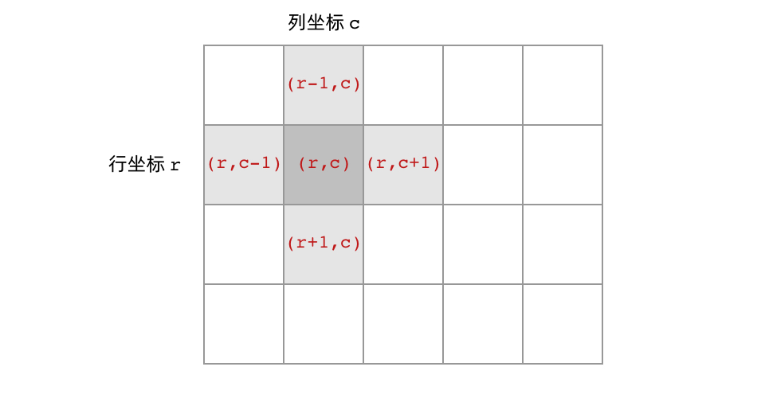

# ACM模式要注意

## 输入的nextInt和nextLine同时用会有问题

​    int n = input.nextInt();

​    input.nextLine(); // 消耗换行符

​    String str = input.nextLine();

# 对象函数

## String

```
// 构造方法
String()
String(String original)
String(char[] value)
String(byte[] bytes)

// 基本信息
int length()
boolean isEmpty()
boolean isBlank()  // Java 11+
```

### 字符串查找和比较

```
// 查找
char charAt(int index)
int indexOf(String str)
int lastIndexOf(String str)
boolean contains(CharSequence s)
boolean startsWith(String prefix)
boolean endsWith(String suffix)

// 比较
boolean equals(Object anObject)
boolean equalsIgnoreCase(String anotherString)
int compareTo(String anotherString)
int compareToIgnoreCase(String str)
boolean contentEquals(CharSequence cs)
```

### 字符串操作

```
// 子字符串
String substring(int beginIndex)
String substring(int beginIndex, int endIndex)

// 连接和重复
String concat(String str)
String repeat(int count)  // Java 11+
String join(CharSequence delimiter, CharSequence... elements)

// 大小写转换
String toLowerCase()
String toUpperCase()

// 去除空格
String trim()                    // 去除首尾空白字符
String strip()                   // Java 11+ (支持Unicode)
String stripLeading()           // Java 11+
String stripTrailing()          // Java 11+
```

### 字符串替换和分割

```
// 替换
String replace(char oldChar, char newChar)
String replace(CharSequence target, CharSequence replacement)
String replaceAll(String regex, String replacement)
String replaceFirst(String regex, String replacement)

// 分割
String[] split(String regex)
String[] split(String regex, int limit)
```

### 类型转换

```
// 字符数组转换
char[] toCharArray()
char[] toCharArray(int beginIndex, int endIndex)  // Java 21+

// 其他类型转换
byte[] getBytes()
static String valueOf(Object obj)
static String copyValueOf(char[] data)
```

### 正则表达式匹配

```
boolean matches(String regex)
```

### substring()

```
public String substring(int beginIndex)

或

public String substring(int beginIndex, int endIndex)
```

- **beginIndex** -- 起始索引（包括）, 索引从 0 开始。
- **endIndex** -- 结束索引（不包括）。

###  toCharArray()

```
public char[] toCharArray()
```

### 正则表达式匹配

```
boolean matches(String regex)
```

------

## StringBuilder

### StringBuilder常用方法

```
// 构造方法
StringBuilder()
StringBuilder(int capacity)
StringBuilder(String str)
// 添加操作
StringBuilder append(Object obj)          // 追加内容
StringBuilder insert(int offset, Object obj) // 插入内容
// 删除操作
StringBuilder delete(int start, int end)   // 删除子序列
StringBuilder deleteCharAt(int index)      // 删除单个字符
// 修改操作
StringBuilder replace(int start, int end, String str) // 替换
void setCharAt(int index, char ch)         // 设置字符
// 查询操作
char charAt(int index)                     // 获取字符
int indexOf(String str)                    // 查找字符串
int length()                               // 获取长度
String substring(int start, int end)       // 获取子串
// 其他操作
StringBuilder reverse()                    // 反转
void setLength(int newLength)              // 设置长度
String toString()                          // 转为字符串
```

## Set

```
// 创建Set
Set<String> set = new HashSet<>();
Set<String> linkedSet = new LinkedHashSet<>();
Set<String> treeSet = new TreeSet<>();
// 添加元素
boolean add(E e)
// 删除元素
boolean remove(Object o)
void clear()
// 查询操作
boolean contains(Object o)
boolean isEmpty()
int size()

```

------

# 常用正则表达式

## 基础元字符

```
.       匹配任意单个字符（除换行符）
\d      匹配数字，等价于 [0-9]
\D      匹配非数字，等价于 [^0-9]
\w      匹配单词字符，等价于 [a-zA-Z0-9_]
\W      匹配非单词字符
\s      匹配空白字符（空格、制表符、换行符等）
\S      匹配非空白字符
```

## 字符类

```
[abc]       匹配a、b或c中的任意一个
[^abc]      匹配除a、b、c之外的任意字符
[a-zA-Z]    匹配任意字母
[0-9]       匹配任意数字
```

## 量词

```
*       匹配0次或多次
+       匹配1次或多次
?       匹配0次或1次
{n}     匹配恰好n次
{n,}    匹配至少n次
{n,m}   匹配n到m次
```

## 边界匹配

```
^       匹配字符串开始
$       匹配字符串结束
\b      匹配单词边界
\B      匹配非单词边界
```

## 分组和或运算

```
(abc)       捕获分组
(?:abc)     非捕获分组
a|b         匹配a或b
```

## 常用正则表达式示例

```
// 您使用的：匹配一个或多个空白字符
"\\s+"                      // 如："hello  world" → ["hello", "world"]

// 其他常用正则
"^[a-zA-Z]+$"              // 只包含字母
"^[0-9]+$"                 // 只包含数字
"^[a-zA-Z0-9]+$"           // 字母数字
"^\\w+@\\w+\\.\\w+$"       // 简单邮箱验证
"^\\d{4}-\\d{2}-\\d{2}$"   // 日期格式：YYYY-MM-DD
"^1[3-9]\\d{9}$"           // 手机号验证
"\\b\\w+\\b"               // 匹配单词
```

# 类

## Math

### `Math.abs(a)`：

取a的绝对值

### `Math.sqrt(a)`：

取a的平方根

### `Math.cbrt(a)`：

取a的立方根

### `Math.max(a,b)`：

取a、b之间的最大值

### `Math.min(a,b)`：

取a、b之间的最小值

### `Math.pow(a,b)`：

取a的b次方

## Integer

### Integer.MAX_VALUE

提供一个最大值

```
int max = Integer.MAX_VALUE
```

### Integer.MIN_VALUE

提供一个最小值

## Integer.p

## StringBuilder

### 添加与插入 (Addition)

- **`append(数据类型 b)`**：最常用的方法。在字符串末尾追加内容。支持 `String`, `int`, `double`, `char`, `boolean` 等几乎所有类型。
- **`insert(int offset, 数据类型 b)`**：在指定索引位置插入内容。
  - 例如：`sb.insert(0, "Start: ");` 会在开头插入文字。

------

###  删除与修改 (Deletion & Modification)

- **`delete(int start, int end)`**：删除从 `start` 到 `end-1` 索引处的字符。
- **`deleteCharAt(int index)`**：删除指定索引处的一个字符（常用于模拟栈的 `pop` 操作）。
- **`replace(int start, int end, String str)`**：用新字符串替换指定范围的内容。
- **`setCharAt(int index, char ch)`**：修改指定索引处的单个字符。

------

### 反转与转换 (Reversal & Conversion)

- **`reverse()`**：将整个字符串序列反转（如 `"abc"` 变成 `"cba"`）。
- **`toString()`**：将 `StringBuilder` 对象转换为普通的 `String` 对象（这是最后一步通常要做的）。

------

### 查询与属性 (Query)

- **`length()`**：返回当前字符序列的长度。
- **`charAt(int index)`**：获取指定索引处的字符。
- **`indexOf(String str)`**：查找子字符串第一次出现的位置。
- **`substring(int start, int end)`**：截取一段内容（返回的是 String，不改变原 StringBuilder）。

------

### 综合示例代码

Java

```
public class StringBuilderDemo {
    public static void main(String[] args) {
        StringBuilder sb = new StringBuilder("Hello");

        // 1. 追加
        sb.append(" Java");        // "Hello Java"
        
        // 2. 插入
        sb.insert(5, "!");          // "Hello! Java"
        
        // 3. 替换
        sb.replace(0, 5, "Hi");     // "Hi! Java"
        
        // 4. 删除
        sb.deleteCharAt(2);         // "Hi Java" (删掉了感叹号)
        
        // 5. 反转
        sb.reverse();               // "avaJ iH"
        
        // 6. 转回 String
        String result = sb.toString();
        System.out.println(result);
    }
}
```

## Arrays


## List

### toArray

```java
        //转为二维数组返回
        return list.toArray(new int[list.size()][]);
```

### ArrayList

**ArrayList本质是一个数组**

list.add(a,b);在a位置插入值b

## Map

Java 中的 `Map` 接口用于存储**键值对（Key-Value Pair）**。它的核心特点是：**键（Key）必须唯一**，一个键对应一个值（Value）。

以下是 `Map` 接口中最常用方法的分类介绍，涵盖了增删改查及遍历操作。

------

### 1. 核心操作方法 (CRUD)

这些是日常开发中使用频率最高的方法。

| **方法**                          | **描述**                  | **备注**                                                     |
| --------------------------------- | ------------------------- | ------------------------------------------------------------ |
| **`put(K key, V value)`**         | 添加或更新键值对。        | 如果键已存在，**覆盖**旧值并返回旧值；如果键不存在，返回 `null`。 |
| **`get(Object key)`**             | 根据键获取值。            | 如果键不存在，返回 `null`。                                  |
| **`remove(Object key)`**          | 根据键删除对应的键值对。  | 返回被删除的值（如果键不存在则返回 `null`）。                |
| **`containsKey(Object key)`**     | 判断是否包含指定的键。    | 返回 `boolean`。非常常用，用于避免空指针异常。               |
| **`containsValue(Object value)`** | 判断是否包含指定的值。    | 返回 `boolean`。效率较低，需遍历整个 Map。                   |
| **`size()`**                      | 返回 Map 中键值对的数量。 | -                                                            |
| **`isEmpty()`**                   | 判断 Map 是否为空。       | -                                                            |
| **`clear()`**                     | 清空 Map 中的所有数据。   | -                                                            |

------

### 2. Java 8+ 增强方法 (推荐使用)

这些方法能简化代码，减少显式的 `if-else` 判断。

- **`getOrDefault(Object key, V defaultValue)`**
  - **作用：** 如果键存在，返回对应的值；如果不存在，返回你指定的默认值。
  - **场景：** 避免取值后出现 `NullPointerException`。
- **`putIfAbsent(K key, V value)`**
  - **作用：** 只有当键**不存在**（或映射为 `null`）时，才存入该值。
  - **场景：** 防止意外覆盖已有数据。
- **`forEach(BiConsumer action)`**
  - **作用：** 使用 Lambda 表达式遍历 Map。

------

### 3. 视图方法 (用于遍历)

`Map` 本身不是 `Collection`，不能直接遍历。需要通过以下方法获取它的“视图”来操作。

1. **`keySet()`**: 返回包含所有**键**的 `Set` 集合。
2. **`values()`**: 返回包含所有**值**的 `Collection` 集合（值可以重复）。

```java
return new ArrayList<List<String>>(map.values());
```

1. **`entrySet()`**: 返回包含所有**键值对对象** (`Map.Entry`) 的 `Set` 集合。**这是遍历 Map 最高效的方式。**

```
Set<Map.Entry<Character, Integer>> entrySet = map.entrySet();
```


------

### 4. 代码实战示例

以下代码展示了 `HashMap`（最常用的 Map 实现）的基本用法。

Java

```
import java.util.HashMap;
import java.util.Map;

public class MapBasicExample {
    public static void main(String[] args) {
        // 创建一个 HashMap，键是 String，值是 Integer
        Map<String, Integer> scores = new HashMap<>();

        // 1. 添加数据 (put)
        scores.put("Alice", 90);
        scores.put("Bob", 85);
        scores.put("Charlie", 95);
        
        // 覆盖 Alice 的分数
        scores.put("Alice", 92); 

        // 2. Java 8 实用方法 (getOrDefault)
        // 获取 David 的分数，如果没有则返回 0
        int davidScore = scores.getOrDefault("David", 0);
        System.out.println("David's score: " + davidScore); // 输出 0

        // 3. 判断 (containsKey)
        if (scores.containsKey("Bob")) {
            System.out.println("Bob's score: " + scores.get("Bob"));
        }

        // 4. 遍历 Map (推荐使用 entrySet 或 forEach)
        System.out.println("--- 遍历成绩单 ---");
        
        // 方式 A: Java 8 forEach (简洁)
        scores.forEach((name, score) -> {
            System.out.println(name + ": " + score);
        });

        // 方式 B: entrySet (传统且高效)
        for (Map.Entry<String, Integer> entry : scores.entrySet()) {
            // entry.getKey() 获取键，entry.getValue() 获取值
            System.out.println("Key: " + entry.getKey() + ", Value: " + entry.getValue());
        }
    }
}
```

------

### 5. 常见 Map 实现类简介

虽然方法通用，但选择哪种实现类很重要：

- **`HashMap`:** 最常用，**无序**，访问速度最快。
- **`LinkedHashMap`:** **有序**，按照插入顺序（或访问顺序）排列。
- **`TreeMap`:** **排序**，按照键的自然顺序（或自定义 Comparator）排序。

------

下一步建议：

Map 的遍历方式有很多种，性能差异也很大。您想了解**“遍历 Map 的 4 种方式及其性能对比”，还是想了解“HashMap 的底层扩容机制”**？

# 包

## Scanner

```
import java.util.Scanner
```

# 数据结构

## 链表

什么是链表，链表是一种通过指针串联在一起的线性结构，每一个节点由两部分组成，一个是数据域一个是指针域（存放指向下一个节点的指针），最后一个节点的指针域指向null（空指针的意思）。

链表的入口节点称为链表的头结点也就是head。

如图所示： 

### 链表的类型

接下来说一下链表的几种类型:

#### 单链表

刚刚说的就是单链表。

 

#### 双链表

单链表中的指针域只能指向节点的下一个节点。

双链表：每一个节点有两个指针域，一个指向下一个节点，一个指向上一个节点。

双链表 既可以向前查询也可以向后查询。

如图所示： 

#### 循环链表

循环链表，顾名思义，就是链表首尾相连。

循环链表可以用来解决约瑟夫环问题。


### 链表的存储方式

了解完链表的类型，再来说一说链表在内存中的存储方式。

数组是在内存中是连续分布的，但是链表在内存中可不是连续分布的。

链表是通过指针域的指针链接在内存中各个节点。

所以链表中的节点在内存中不是连续分布的 ，而是散乱分布在内存中的某地址上，分配机制取决于操作系统的内存管理。

如图所示：


这个链表起始节点为2， 终止节点为7， 各个节点分布在内存的不同地址空间上，通过指针串联在一起。

### 链表的定义

```
public class ListNode {
    // 结点的值
    int val;

    // 下一个结点
    ListNode next;

    // 节点的构造函数(无参)
    public ListNode() {
    }

    // 节点的构造函数(有一个参数)
    public ListNode(int val) {
        this.val = val;
    }

    // 节点的构造函数(有两个参数)
    public ListNode(int val, ListNode next) {
        this.val = val;
        this.next = next;
    }
}
```

### 链表的操作

#### 删除节点

删除D节点，如图所示：


```
C.next = D.next;
```

只要将C节点的next指针 指向E节点就可以了。

那有同学说了，D节点不是依然存留在内存里么？只不过是没有在这个链表里而已。

是这样的，所以在C++里最好是再手动释放这个D节点，释放这块内存。

其他语言例如Java、Python，就有自己的内存回收机制，就不用自己手动释放了。

#### [#](https://www.programmercarl.com/链表理论基础.html#添加节点)添加节点

如图所示：


```
F.next = C.next;
C.next = F;
```

可以看出链表的增添和删除都是O(1)操作，也不会影响到其他节点。

但是要注意，要是删除第五个节点，需要从头节点查找到第四个节点通过next指针进行删除操作，查找的时间复杂度是O(n)。

#### 遍历链表

```
ListNode temp = head;
while(temp!=null){
	temp = temp.next;
}
```

### 性能分析

再把链表的特性和数组的特性进行一个对比，如图所示：


## 哈希表

**用于快速搜索!!!**

总的来说,哈希函数，把学生的姓名直接映射为哈希表上的索引，然后就可以通过查询索引下标快速知道这位同学是否在这所学校里了。

即把**对应的元素通过哈希函数映射成一个值**并进行存放,这样在搜索的时候就是**O(1)的效率**


### 哈希碰撞

当我们**要存放的元素数量大于了哈希表的列表数目或者计算出来的哈希值相等时**,就出现了这个冲突问题

#### 拉链法

刚刚小李和小王在索引1的位置发生了冲突，发生冲突的元素都被存储在链表中。 这样我们就可以通过索引找到小李和小王了


（数据规模是dataSize， 哈希表的大小为tableSize）

其实拉链法就是要选择适当的哈希表的大小，这样既不会因为数组空值而浪费大量内存，也不会因为链表太长而在查找上浪费太多时间。

#### [#](https://www.programmercarl.com/哈希表理论基础.html#线性探测法)线性探测法

使用线性探测法，一定要保证tableSize大于dataSize。 我们需要依靠哈希表中的空位来解决碰撞问题。

例如冲突的位置，放了小李，那么就向下找一个空位放置小王的信息。所以要求tableSize一定要大于dataSize ，要不然哈希表上就没有空置的位置来存放 冲突的数据了。如图所示：


## 栈

### 常用方法

- `push(E item)`: 入栈（将元素压入栈顶）。

- `pop()`: 出栈（移除并返回栈顶元素）。

- `peek()`: 查看栈顶元素（不移除）。

- `empty()`: 检查栈是否为空

- ```
  import java.util.Stack;
  
  public class StackExample {
      public static void main(String[] args) {
          Stack<String> stack = new Stack<>();
  
          // 入栈
          stack.push("Java");
          stack.push("Web");
          stack.push("Notes");
  
          // 查看栈顶
          System.out.println("栈顶元素: " + stack.peek()); // 输出: Notes
  
          // 出栈
          System.out.println("弹出: " + stack.pop());    // 输出: Notes
  
          // 遍历剩余
          System.out.println("当前栈: " + stack);        // 输出: [Java, Web]
      }
  }
  ```

  

## 接口Queue

Java 中的 `Queue`（队列）接口体系非常丰富。为了让你更清晰地理解，我们可以将常见的实现类分为**三大类**：**普通队列**、**双端队列**和**并发/阻塞队列**。

以下是详细的分类介绍：

------

### 1. 普通队列 (非线程安全)

这些类位于 `java.util` 包下，适用于**单线程**环境。

| **实现类**          | **特点与用途**                                               |
| ------------------- | ------------------------------------------------------------ |
| **`LinkedList`**    | **最经典。** 既实现了 `List` 接口，也实现了 `Deque` (双端队列) 接口。它是基于链表实现的，增删快，查询慢。常被当作普通的 FIFO（先进先出）队列使用。 |
| **`PriorityQueue`** | **带优先级的。** 基于堆（Heap）实现。元素不是按插入顺序排列，而是按优先级（自然顺序或自定义 Comparator）出队。 |
| **`ArrayDeque`**    | **性能之王。** 基于数组实现的双端队列。作为队列使用时，它的**性能通常优于 `LinkedList`**，因为它对缓存更友好且产生更少的垃圾对象。 |

------

### 2. 并发/阻塞队列 (线程安全)

这些类位于 `java.util.concurrent` 包下，实现了 `BlockingQueue` 接口。它们常用于**多线程**环境下的“生产者-消费者”模型。

| **实现类**                  | **特点**                 | **关键区别**                                                 |
| --------------------------- | ------------------------ | ------------------------------------------------------------ |
| **`ArrayBlockingQueue`**    | **有界**阻塞队列。       | 基于数组。**必须指定容量**，不能扩容。公平性可选。           |
| **`LinkedBlockingQueue`**   | **可选有界**阻塞队列。   | 基于链表。如果不指定容量，默认是 `Integer.MAX_VALUE`（容易导致 OOM 内存溢出），吞吐量通常高于 ArrayBlockingQueue。 |
| **`PriorityBlockingQueue`** | **带优先级**的阻塞队列。 | `PriorityQueue` 的线程安全版。**无界**（容量不够会自动扩容）。 |
| **`DelayQueue`**            | **延时**队列。           | 元素必须实现 `Delayed` 接口。只有当元素的延时时间到了，才能从队列中取出。常用于缓存失效、任务调度。 |
| **`SynchronousQueue`**      | **不存储元素**的队列。   | 容量为 0。每一个 `put` 操作必须等待一个 `take` 操作，否则线程阻塞。用于直接传递任务。 |

------

### 3. 双端队列 (Deque)

`Deque` (Double Ended Queue) 是 `Queue` 的子接口，允许在队列的**两端**进行插入和删除。

- **`ArrayDeque`**: 基于数组实现的双端队列（推荐使用）。
- **`LinkedList`**: 基于链表实现的双端队列。
- **`LinkedBlockingDeque`**: 线程安全的双端阻塞队列。

------

### 总结：如何选择？

为了方便记忆，我为你总结了一个简单的**决策树**：

1. **需要多线程并发安全吗？**
   - **是 (多线程):**
     - 需要先进先出 (FIFO)？
       - 内存有限/防止爆内存 → **`ArrayBlockingQueue`**
       - 追求高吞吐/流量稳定 → **`LinkedBlockingQueue`**
     - 需要按优先级？ → **`PriorityBlockingQueue`**
     - 需要延时执行？ → **`DelayQueue`**
   - **否 (单线程):**
     - 需要先进先出 (FIFO)？ → 首选 **`ArrayDeque`** (比 `LinkedList` 快)
     - 需要按优先级？ → **`PriorityQueue`**

## 双端队列

### . 常用核心方法（三套接口）

为了方便记忆，你可以把 `ArrayDeque` 的方法分为三组：**栈操作**、**队列操作**、以及**双端操作**。

#### A. 作为栈使用（LIFO - 后进先出）

如果你想替代老旧的 `Stack` 类，请使用这组方法：

- **`push(e)`**: 向栈顶（队首）压入元素。
- **`pop()`**: 弹出并返回栈顶元素（若为空则抛出异常）。
- **`peek()`**: 查看栈顶元素但不弹出。

#### B. 作为普通队列使用（FIFO - 先进先出）

如果你想作为普通队列使用，请使用这组方法：

- **`add(e)` / `offer(e)`**: 向队尾添加元素。
- **`poll()`**: 移除并返回队首元素（若为空返回 `null`）。
- **`peek()`**: 查看队首元素。

#### C. 作为双端队列使用（最完整）

`Deque` 接口最强大的地方在于可以同时操作头尾：

- **头部操作**：`addFirst(e)`, `removeFirst()`, `peekFirst()`, `pollFirst()`
- **尾部操作**：`addLast(e)`, `removeLast()`, `peekLast()`, `pollLast()`

------

### 2. 方法对比表（异常处理 vs 返回特殊值）

`ArrayDeque` 的很多功能都有两种方法，区别在于**当容器为空或满时**的处理方式：

| **操作类型** | **抛出异常 (Throws Exception)** | **返回特殊值 (null/false)** |
| ------------ | ------------------------------- | --------------------------- |
| **插入头部** | `addFirst(e)`                   | `offerFirst(e)`             |
| **插入尾部** | `addLast(e)`                    | `offerLast(e)`              |
| **移除头部** | `removeFirst()`                 | `pollFirst()`               |
| **移除尾部** | `removeLast()`                  | `pollLast()`                |
| **检查头部** | `getFirst()`                    | `peekFirst()`               |
| **检查尾部** | `getLast()`                     | `peekLast()`                |

------

### 3. 其他实用方法

- **`isEmpty()`**: 判断队列是否为空。
- **`size()`**: 获取元素个数。
- **`contains(Object o)`**: 判断是否包含某个元素。
- **`clear()`**: 清空所有元素。

## 优先级队列PriorityQueue

Java 中的 `PriorityQueue`（优先队列）是一个基于**优先级堆（Priority Heap）**实现的无界队列。

与普通的先进先出（FIFO）队列不同，`PriorityQueue` 中的元素是根据**优先级**排序的。默认情况下，它使用自然顺序（从小到大），但也可以通过自定义 `Comparator` 来改变排序规则。

以下是关于它的核心概念和基本使用方式的介绍。

------

### 1. 核心特性

- **数据结构：** 内部基于数组实现的**二叉小顶堆（Binary Min-Heap）**。这意味着队头（Head）永远是“最小”的那个元素。
- **排序规则：**
  - **默认：** 自然顺序（如数字从小到大，字符串按字典序）。
  - **自定义：** 在构造函数中传入 `Comparator`。
- **不允许 Null：** 插入 `null` 会抛出 `NullPointerException`。
- **非线程安全：** 如果需要在多线程环境中使用，请使用 `PriorityBlockingQueue`。

------

### 2. 常用方法

| **操作类型** | **方法**                  | **描述**                                                     |
| ------------ | ------------------------- | ------------------------------------------------------------ |
| **插入**     | `offer(E e)` / `add(E e)` | 插入元素。通常推荐使用 `offer`。                             |
| **查看**     | `peek()`                  | 返回队头元素（优先级最高的），但**不删除**。如果队列为空，返回 `null`。 |
| **移除**     | `poll()`                  | 返回并**删除**队头元素。如果队列为空，返回 `null`。          |
| **移除**     | `remove(Object o)`        | 删除队列中指定的元素（效率较低，O(n)）。                     |

------

### 3. 代码示例

#### 场景一：默认排序（小顶堆 - 从小到大）

这是 `PriorityQueue` 的默认行为，适用于整数、字符串等实现了 `Comparable` 接口的对象。

Java

```
import java.util.PriorityQueue;

public class MinHeapExample {
    public static void main(String[] args) {
        // 创建默认的优先队列
        PriorityQueue<Integer> pq = new PriorityQueue<>();

        // 插入数据 (顺序无关)
        pq.offer(5);
        pq.offer(1);
        pq.offer(3);

        // 查看队头
        System.out.println("当前队头: " + pq.peek()); // 输出: 1

        // 依次取出元素
        while (!pq.isEmpty()) {
            // 每次 poll 出来的都是当前队列中最小的元素
            System.out.println(pq.poll()); 
        }
        // 输出顺序: 1, 3, 5
    }
}
```

#### 场景二：自定义排序（大顶堆 - 从大到小）

如果需要“最大的元素先出队”，或者对象没有实现 `Comparable` 接口，需要传入 `Comparator`。

Java

```
import java.util.PriorityQueue;
import java.util.Collections;

public class MaxHeapExample {
    public static void main(String[] args) {
        // 使用 Collections.reverseOrder() 实现大顶堆
        // 或者使用 Lambda: (a, b) -> b - a
        PriorityQueue<Integer> maxPQ = new PriorityQueue<>(Collections.reverseOrder());

        maxPQ.offer(5);
        maxPQ.offer(1);
        maxPQ.offer(10);

        // 此时队头应该是最大的元素
        System.out.println("当前队头: " + maxPQ.peek()); // 输出: 10

        while (!maxPQ.isEmpty()) {
            System.out.println(maxPQ.poll());
        }
        // 输出顺序: 10, 5, 1
    }
}
```

------

### 4. 重要注意事项（避坑指南）

> **⚠️ 遍历顺序不保证有序**

这是新手最容易犯的错误。使用 `for-each` 循环或 `iterator()` 遍历 `PriorityQueue` 时，**不保证**按照优先级顺序输出。它只是打印出内部数组的存储结构（堆结构）。

**如果需要有序输出，必须使用 `while(!pq.isEmpty()) { pq.poll(); }` 的方式。**

**错误示范：**

Java

```
PriorityQueue<Integer> pq = new PriorityQueue<>();
pq.offer(10); pq.offer(5); pq.offer(20);

// 这种方式打印出来的顺序是不可预测的（通常是堆的数组顺序）
for (Integer i : pq) {
    System.out.println(i); // 可能输出 5, 10, 20，顺序不一定严格
}
```

------

下一步建议：

如果您需要解决具体的算法题（如“Top K 问题”或“合并 K 个排序链表”），我可以为您提供具体的代码实现。您想看哪个示例？

## 二叉树

### 遍历

#### 递归遍历

```
// 前序遍历·递归·LC144_二叉树的前序遍历
class Solution {
    public List<Integer> preorderTraversal(TreeNode root) {
        List<Integer> result = new ArrayList<Integer>();
        preorder(root, result);
        return result;
    }

    public void preorder(TreeNode root, List<Integer> result) {
        if (root == null) {
            return;
        }
        result.add(root.val);
        preorder(root.left, result);
        preorder(root.right, result);
    }
}
// 中序遍历·递归·LC94_二叉树的中序遍历
class Solution {
    public List<Integer> inorderTraversal(TreeNode root) {
        List<Integer> res = new ArrayList<>();
        inorder(root, res);
        return res;
    }

    void inorder(TreeNode root, List<Integer> list) {
        if (root == null) {
            return;
        }
        inorder(root.left, list);
        list.add(root.val);             // 注意这一句
        inorder(root.right, list);
    }
}
// 后序遍历·递归·LC145_二叉树的后序遍历
class Solution {
    public List<Integer> postorderTraversal(TreeNode root) {
        List<Integer> res = new ArrayList<>();
        postorder(root, res);
        return res;
    }

    void postorder(TreeNode root, List<Integer> list) {
        if (root == null) {
            return;
        }
        postorder(root.left, list);
        postorder(root.right, list);
        list.add(root.val);             // 注意这一句
    }
}

```

#### 迭代遍历(使用栈)


看代码有点抽象我们来看一下动画(中序遍历)：


```

//前序遍历中左右,入栈顺序右左中
public List<Integer> preorderTraversal(TreeNode root) {
        //统一迭代
        Stack<TreeNode>stack = new Stack<>();
        List<Integer>res = new ArrayList<>();
        if(root!=null)stack.push(root);
        while(!stack.empty()){
            TreeNode node = stack.peek();
            if(node!=null)
            {
                stack.pop();
                if(node.right!=null)stack.push(node.right);
                if(node.left!=null)stack.push(node.left);
                stack.push(node);
                stack.push(null);
            }
            else{
                stack.pop();
                node = stack.pop();
                res.add(node.val);
            }
        }
        return res;
    }
//中序,只要改核心顺序,入栈变成右中左
//后序,同理,入栈改为中右左即可
    public List<Integer> preorderTraversal(TreeNode root) {
        //统一迭代
        Stack<TreeNode>stack = new Stack<>();
        List<Integer>res = new ArrayList<>();
        if(root!=null)stack.push(root);
        while(!stack.empty()){
            TreeNode node = stack.peek();
            if(node!=null)
            {
                stack.pop();
                if(node.right!=null)stack.push(node.right);
                stack.push(node);
                stack.push(null);
                if(node.left!=null)stack.push(node.left);
               
            }
            else{
                stack.pop();
                node = stack.pop();
                res.add(node.val);
            }
        }
        return res;
    }
```

#### 广度优先搜索(层序遍历)

使用队列实现二叉树广度优先遍历，动画如下：


```
public void checkFun02(TreeNode node) {
        if (node == null) return;
        Queue<TreeNode> que = new LinkedList<TreeNode>();
        que.offer(node);

        while (!que.isEmpty()) {
            List<Integer> itemList = new ArrayList<Integer>();
            int len = que.size();

            while (len > 0) {
                TreeNode tmpNode = que.poll();
                itemList.add(tmpNode.val);

                if (tmpNode.left != null) que.offer(tmpNode.left);
                if (tmpNode.right != null) que.offer(tmpNode.right);
                len--;
            }

            resList.add(itemList);
        }
     }


```

## 图

### 图的DFS遍历

对应

例题 1：**岛屿的最大面积**

[LeetCode 695. Max Area of Island](https://leetcode.cn/problems/max-area-of-island/) （Medium）

例题 2：**填海造陆问题**

[LeetCode 827. Making A Large Island](https://leetcode.cn/problems/making-a-large-island/) （Hard）

例题 3：**岛屿的周长**

[LeetCode 463. Island Perimeter](https://leetcode.cn/problems/island-perimeter/) （Easy）



```
void dfs(int[][] grid, int r, int c) {
    // 判断 base case
    if (!inArea(grid, r, c)) {
        return;
    }
    // 如果这个格子不是岛屿，直接返回
    if (grid[r][c] != 1) {
        return;
    }
    grid[r][c] = 2; // 将格子标记为「已遍历过」
    
    // 访问上、下、左、右四个相邻结点
    dfs(grid, r - 1, c);
    dfs(grid, r + 1, c);
    dfs(grid, r, c - 1);
    dfs(grid, r, c + 1);
}

// 判断坐标 (r, c) 是否在网格中
boolean inArea(int[][] grid, int r, int c) {
    return 0 <= r && r < grid.length 
        	&& 0 <= c && c < grid[0].length;
}
```


# 方法总结

## 递归

这里帮助大家确定下来递归算法的三个要素。**每次写递归，都按照这三要素来写，可以保证大家写出正确的递归算法！**

1. **确定递归函数的参数和返回值：** 确定哪些参数是递归的过程中需要处理的，那么就在递归函数里加上这个参数， 并且还要明确每次递归的返回值是什么进而确定递归函数的返回类型。
2. **确定终止条件：** 写完了递归算法, 运行的时候，经常会遇到栈溢出的错误，就是没写终止条件或者终止条件写的不对，操作系统也是用一个栈的结构来保存每一层递归的信息，如果递归没有终止，操作系统的内存栈必然就会溢出。
3. **确定单层递归的逻辑：** 确定每一层递归需要处理的信息。在这里也就会重复调用自己来实现递归的过程。
