# 总笔记

[【黑马】Java基础从入门到起飞目录合集_bv17f411t7ao-CSDN博客](https://blog.csdn.net/qq_41071754/article/details/129432761)

目录
【Java基础】001 – Java入门
【Java基础】002 – Java基础概念（注释&关键字&字面量&变量）
【Java基础】003 – Java基础概念（计算机的存储规则）
【Java基础】004 – Java基础概念（数据类型&标识符&键盘录入）
【Java基础】005 – Java基础概念（IDEA）
【Java基础】006 – 运算符
【Java基础】007 – 判断和循环
【Java基础】008 – 数组
【Java基础】009 – 方法
【Java基础】010 – Java基础综合练习
【Java基础】011 – 面向对象
【Java基础】012 – 面向对象综合练习
【Java基础】013 – 字符串
【Java基础】014 – 集合（ArrayList）
【Java基础】015 – 学生管理系统
【Java基础】016 – 面向对象进阶一（静态、继承、多态）
【Java基础】017 – 面向对象进阶二（包、代码块、抽象类、接口、内部类）
【Java基础】018 – 面向对象阶段项目上（拼图小游戏）
【Java基础】019 – 面向对象阶段项目下（拼图小游戏扩展）
【Java基础】020 – 常见API
【Java基础】021 – 常见算法及API（查找、排序、Arrays）
【Java基础】022 – Lambda与递归练习
【Java基础】023 – 集合进阶（List、Set、泛型、树）
【Java基础 下】 024 – 集合进阶（双列集合、HashMap、LinkedHashMap、TreeMap、Collections）
【Java基础 下】 025 – 阶段项目（斗地主）
【Java基础 下】 026 – 集合进阶（不可变集合、Stream流、方法引用
【Java基础 下】 027 – 异常、File、综合案例
【Java基础 下】 028 – IO流
【Java基础 下】 029 – 多线程
【Java基础 下】 030 – 网络编程
【Java基础 下】 031 – 反射 & 动态代理

# 键盘录入

next()：接收字符串，但是遇到制表符，空格和回车都会停止接收。且不会接收这三个，会留到缓冲区。

nextLine：只有遇到回车才停止接收

当先用next再用nextLine时

# 类的定义规则

## 类的赋值

类的赋值其实是对地址的赋值，即引用。此处为正确对数组中的对象进行赋值。

而以下这个，是把同一个Car c赋值到了数组当中，都是同一个引用值

# 封装：

人关门，其实是人调用了门对象中使门关上的方法，所以关门是在门的类中的。

# String类

在对String类对象进行比较的时候要额外注意

## equals

## char charAt(int)

根据索引获取字符串的字符

## int length()

获取长度

## substring

# List,Set,Map

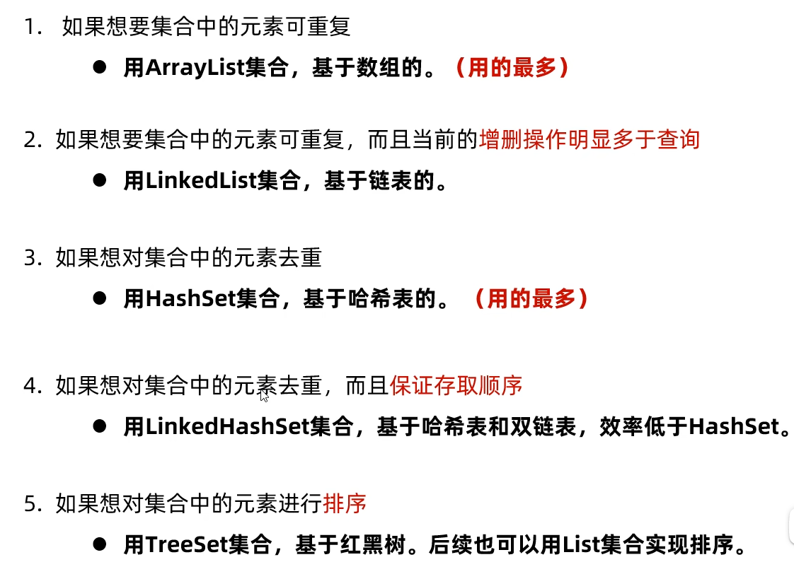

## List

### 特点

### 方法

### 遍历

1、迭代器遍历：

2、增强for：

3、Lambda表达式

4、普通for循环

## Set

### 特点

### 方法

### 遍历

## Map

### 特点

### 方法

### 遍历

#### 第一种遍历方式：键找值（keySet）

#### ②、第二种遍历方式：键值对（entrySet）

Entry：键值对对象

#### 第三种遍历方式：Lambda表达式（forEach）

示例代码：

# IO流

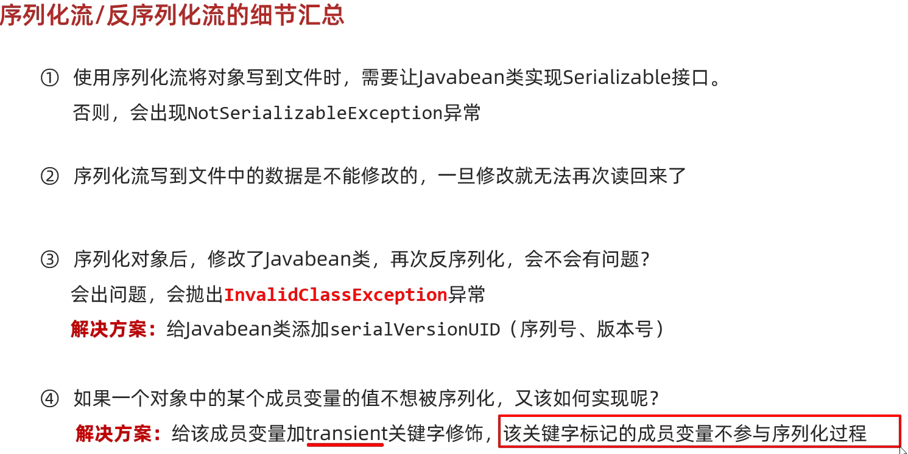

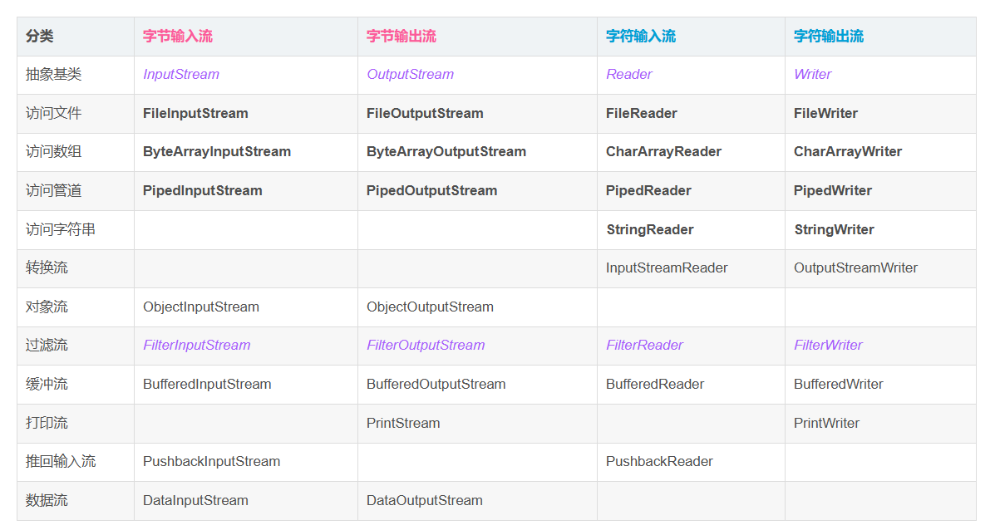

字节，使用byte数组去获取内容

可以使用char去转换成字符，进行输出

byte[] b = new byte[1024];

int length;

while((length = br.read(b))!=-1){

​	sout((char)b);

}

字符使用char数组去获取内容

char[] b = new char[1024];

int length;

while((length = br.read(b))!=-1){

​	sout(new String(b,0,length));

}

可以使用new String(bytes,0,length);去输出

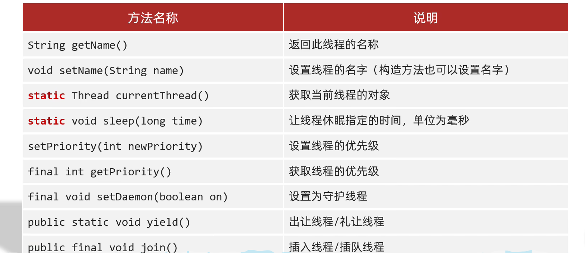

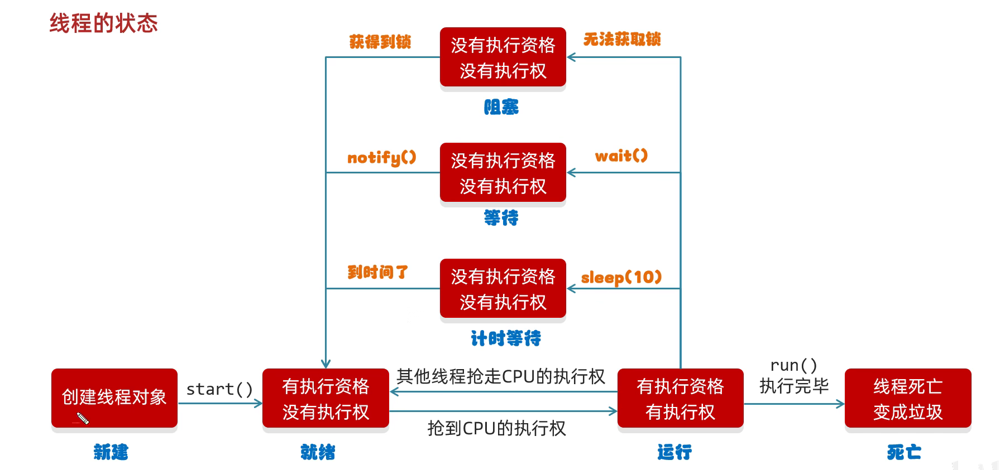

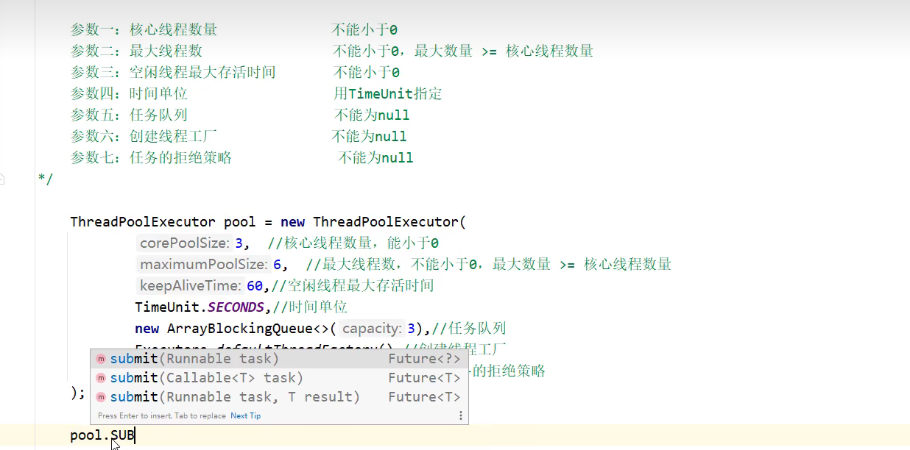

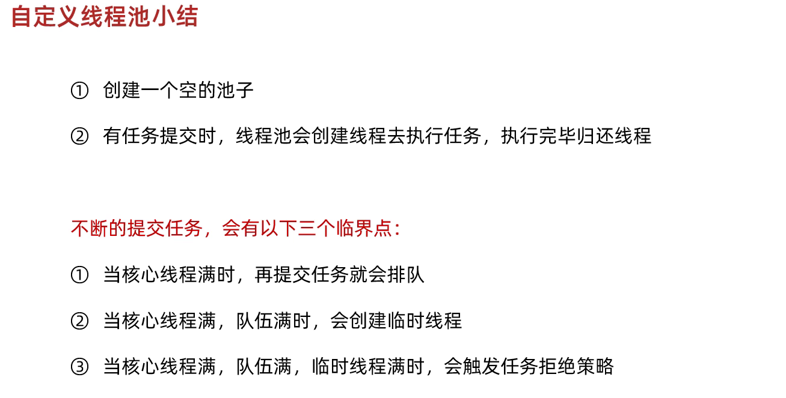

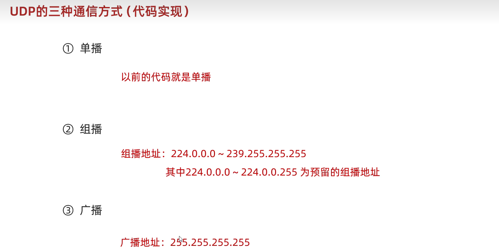

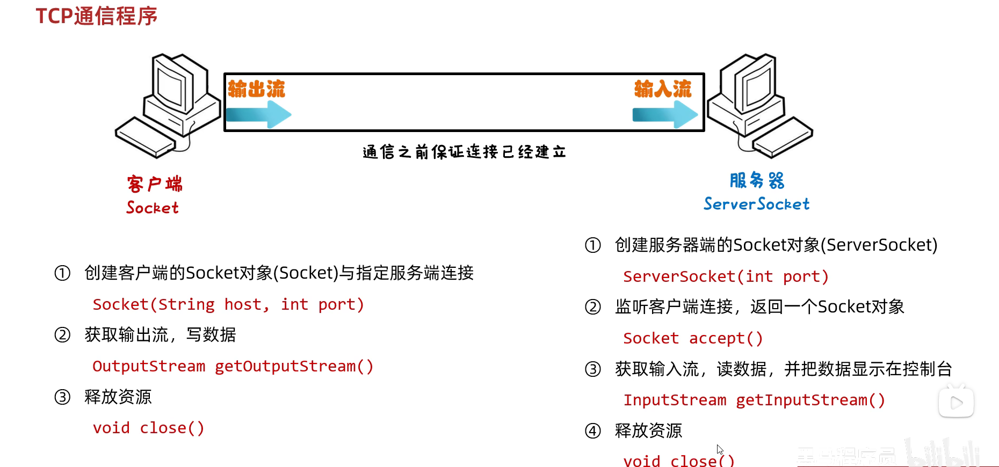

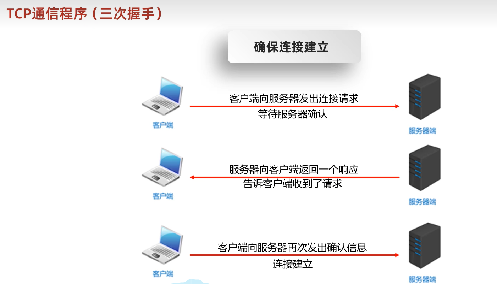

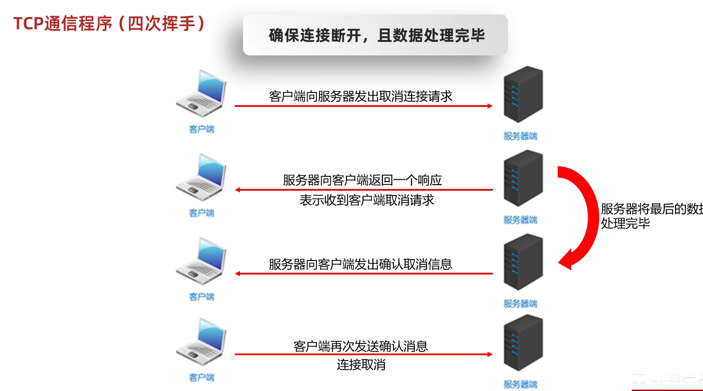

网络编程大作业逻辑

客户端

选择登录，注册

登录

先输出login，表示登录

再需要输入账户名和密码，输出给服务端

然后接收服务端的回写，如果是

1，则进行转发逻辑，使用线程的方式，转发

2或者3，则代表账户密码错误

注册暂时不写，输出选择注册就ok

服务端

接收请求，是

登录

如果接收到登录，就到登录界面

判断账户密码是否正确

正确就将用户的信息进行群发

群发需要将这个内容进行群发到登录到这个服务的的所有socket链表里面，进行遍历

错误就给客户端回写，2或3，代表是哪里有问题

注册

暂时输出注册语句即可

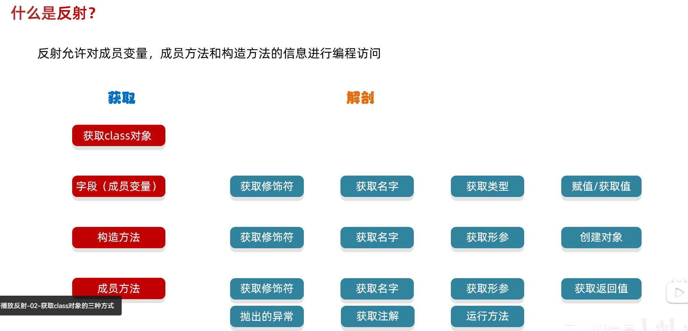

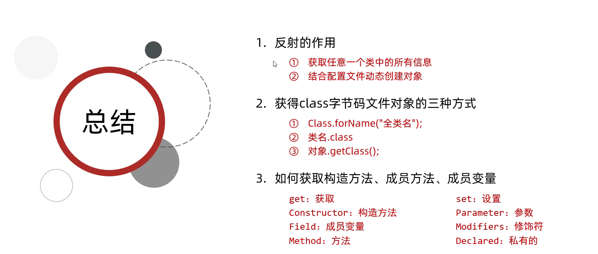

