# javaWeb项目总结

## 环境方面

需要idea专业版

mysql8

maven依赖管理

**注意一些配置需要在环境变量上添加**,比如oss的账户和密码

## 架构方面

采用springboot+vue+mysql进行,

其中后端通过Mbatis连接到数据库,执行数据库操作

前端通过axios来实现异步拉取后端数据

前端和后端均遵循api接口文档,一般是restful规范,结果返回为Result工具类

前端发起请求,后端

## 较难的部分

### 分页查询

使用pagehelper依赖,从而更简便的编写,本质上是select * from emp limit pageSize*(page-1),pageSize

### 文件上传

通过阿里云提供的阿里云工具类来实现

使用云端上传,oss对象存储

其实就是由后端上传到阿里云的oss对象存储,oss会提供一个url,这个url是可以通过bucket和oss的地区以及上传文件的名字来组成的

返回这个url到前端,前端就会通过image标签进行渲染到我们的前端

### 环境配置

通过yaml文件进行配置

编写时使用把需要注入的封装成一个类,并标上注解

> 实体类

```
@Data
@Component
@ConfigurationProperties(prefix = "aliyun.oss")
public class AilOSSproperties {
	private String bucketName;
	private String endpoint;
	private String region;
}

```

> yaml

```
aliyun:
  oss:
    region: cn-guangzhou
    endpoint: https://oss-cn-guangzhou.aliyuncs.com
    bucketName: web-ticast
```


# git操作

拉取新的文件到本地后,在idea需要重新加载

ctl+Alt+Y

即可重新加载

或者右键根目录从磁盘中重新加载

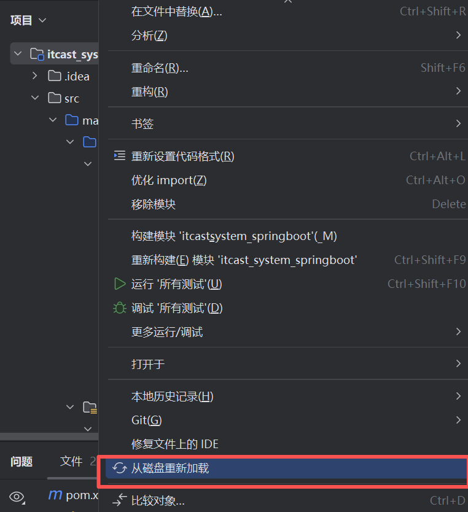

### **一、 生成密钥 (SSH Key)**

用于免密安全访问远程仓库：

1. **生成**：执行 `ssh-keygen -t rsa -C "邮箱"`，连按三次回车。
2. **获取**：执行 `cat ~/.ssh/id_rsa.pub` 复制公钥。
3. **配置**：在 Gitee/GitHub 的“设置”->“SSH公钥”中粘贴并保存。
4. **验证**：执行 `ssh -T git@gitee.com` 确认连接成功。

### **二、 本地与远程连接**

建立本地文件夹与云端仓库的关联：

1. **已有连接**：`git remote -v` 查看当前关联的远程地址。
2. **添加连接**：`git remote add origin <远程仓库地址>`。
3. **建立轨道**：首次推送执行 `git push -u origin master`，之后只需 `git push`。
4. **更换地址**：`git remote set-url origin <新地址>`。

### **三、 Git 基本操作 (日常流程)**

1. **同步**：` git pull origin master` —— 每天开始写代码前，先拉取远程最新更新。

2. **查看**：`git status` —— 随时确认哪些文件被修改了。

3. **暂存**：`git add .` —— 将修改放入“待提交”暂存区。

4. **保存**：`git commit -m "说明文字"` —— 提交到本地仓库，记录改动点。

5. **推送**：`git push` —— 将本地代码同步到远程仓库。

6. 删除远程仓库的内容:

   ```
   git rm -r --cached "黑马/day10-SpringBootWeb案例/资料/02. 环境搭建"
   git commit -m "从远程移除资料，本地保留"
   git push
   
   ```

7. 忽略本地文件的一些内容

   为了防止以后误传，建议将其加入到 **`.gitignore`** 文件中：

   1. 在项目根目录找到或新建一个名为 `.gitignore` 的文件。
   2. 在里面添加一行：`黑马/`。
   3. 这样以后 Git 就会彻底忽略这个文件夹下的所有内容。

   

# Web标准

HTML:网页结构（图片，文字，视频等等）

CSS：网页的表现（渲染）

JS：网页的行为（交互）->后续变成Vue

以及UI库 Element UI,异步交互的AXIOS

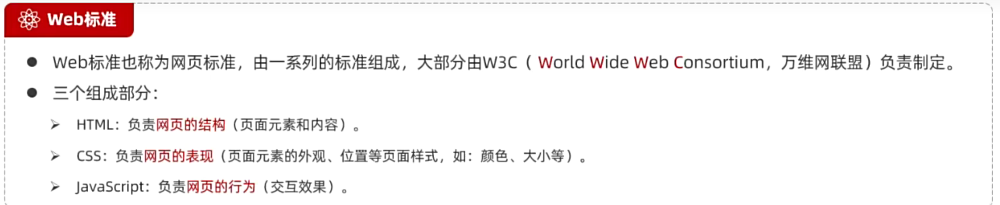

对应的前端教程

[w3school 在线教程](https://www.w3school.com.cn/)

# HTML

## 语法

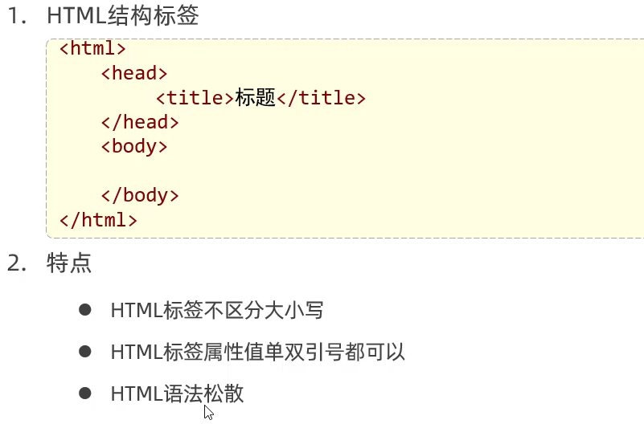

主要是使用标签的方式,基本结构由头和身体组成

## 标签

### <h1-h6>,hr,img


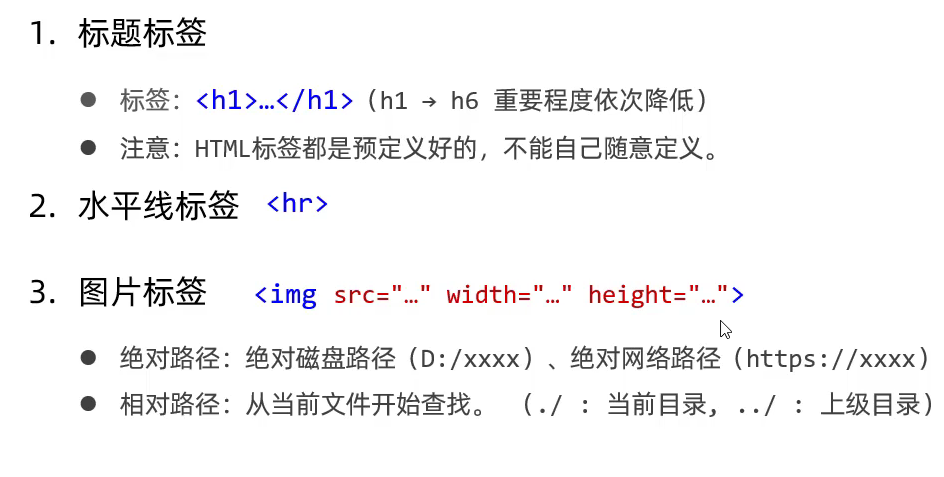

```
<!DOCTYPE html>
<html lang="en">
<head>
    <meta charset="UTF-8">
    <meta name="viewport" content="width=device-width, initial-scale=1.0">
    <title>新浪新闻</title>
</head>
<body>
     热点事件
    <hr>
    你好下划线
    <hr>
    <h1>这是h1</h1>
</body>
</html>
```

## CSS

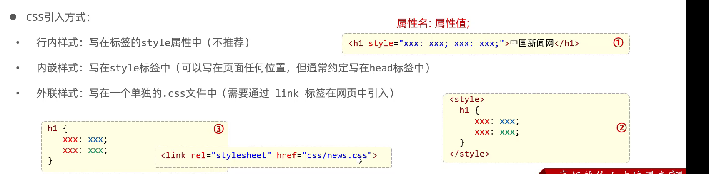

### 设置字体颜色

```
<!DOCTYPE html>
<html lang="en">
<head>
    <meta charset="UTF-8">
    <meta name="viewport" content="width=device-width, initial-scale=1.0">
    <title>新浪新闻</title>
    <!-- 方式3:使用外联css -->
    <!-- <link rel="stylesheet" href="./1.css"> -->
    <!-- 方式2:使用内嵌 -->
    <style>
        h1{
/*             color: limegreen; */
            color: #70ACDE;
        }
    </style>
</head>
<body>
     热点事件
    <hr>
    你好下划线
    <hr>
<!--     方式1:使用行内 -->
<!--     <h1 style="color: limegreen;">这是h1</h1> -->
    <h1>这是h1</h1>
</body>
</html>
```

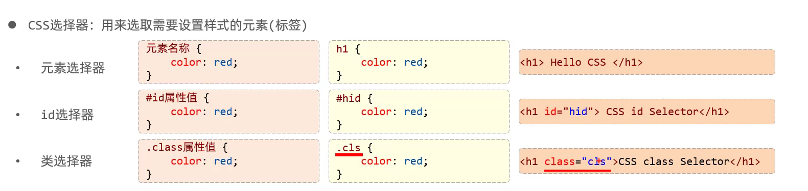

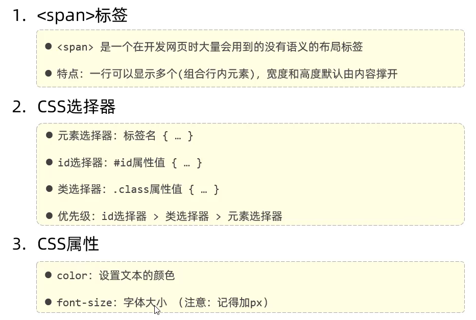

```
<!DOCTYPE html>
<html lang="en">
<head>
    <meta charset="UTF-8">
    <meta name="viewport" content="width=device-width, initial-scale=1.0">
    <title>新浪新闻</title>

    <style>
        h1{
            color: #70ACDE;
        }
        span{
            color: aqua;
        }
        #time{
            color: bisque;
        }
        .claz{
            color: #70ACDE;
            font-size: 10px;字体大小
        }
    </style>
</head>
<body>
     热点事件
    <hr>
    <span id="time">你好下划线,id选择器</span>  <span class="claz">类选择器</span>
    <span>无标签的选择器</span>
    <hr>
    <h1>这是h1</h1>
</body>
</html>
```

## 超链接<a

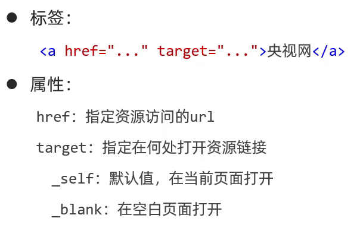

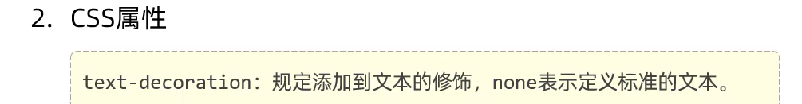

```
<!DOCTYPE html>
<html lang="en">
<head>
    <meta charset="UTF-8">
    <meta name="viewport" content="width=device-width, initial-scale=1.0">
    <title>壹视界·任平文章解读｜从进博会到自贸港，看见了怎样的中国？</title>

    <style>
        h1{
            color: black;
        }
        span{
            color: aqua;
        }
        #time{
            color: grey;
        }
        a:hover{
            color: red;
        }
        a{
            color: #53535E;
            text-decoration: dashed;
            font-size: 10px;
        }
    </style>
</head>
<body>
     <a href="https://gov.sina.com.cn/" target="_blank">新浪政务</a> >正文
     <h1>壹视界·任平文章解读｜从进博会到自贸港，看见了怎样的中国？</h1>
    <hr>
    <span id="time" style="font-size: 15px;">2025年11月18日 09:09 </span> <a href="https://www.peopleapp.com/column/30050779436-500007208216" target="_self" style="font-size: 15px;">  人民日报客户端</a> 
    <hr>
   

</body>
</html>
```

## 视频<video

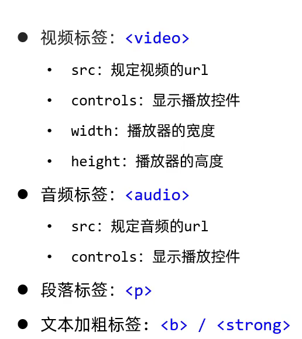

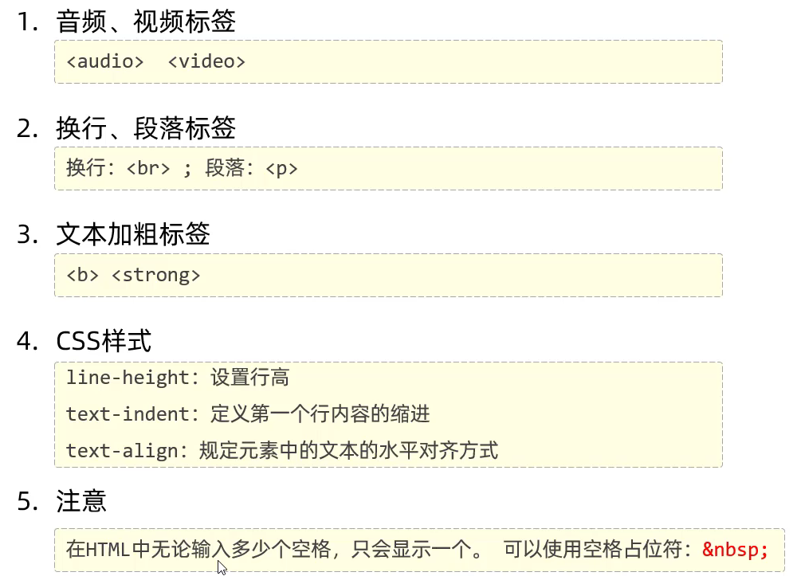

```
   <video src="../video/1.mp4" controls="controls" width="40%"></video>

   <p>
    <b>中国的发展离不开世界，</b>世界的繁荣也需要中国。开放合作、互利共赢，是解码中国式现代化的一把钥匙。
   </p>
　　<p>
    11月10日，第八届进博会在上海闭幕。习近平总书记亲自谋划的世界上第一个以进口为主题的国家级展会，是国际贸易发展史上的一大创举。
    </p>
    <p style="text-align: end;">
      责任编辑：王树淼 SN242
    </p>
    
    p{
    line-height: 2px;
    text-indent: 35px;
}
```


## 盒子模型

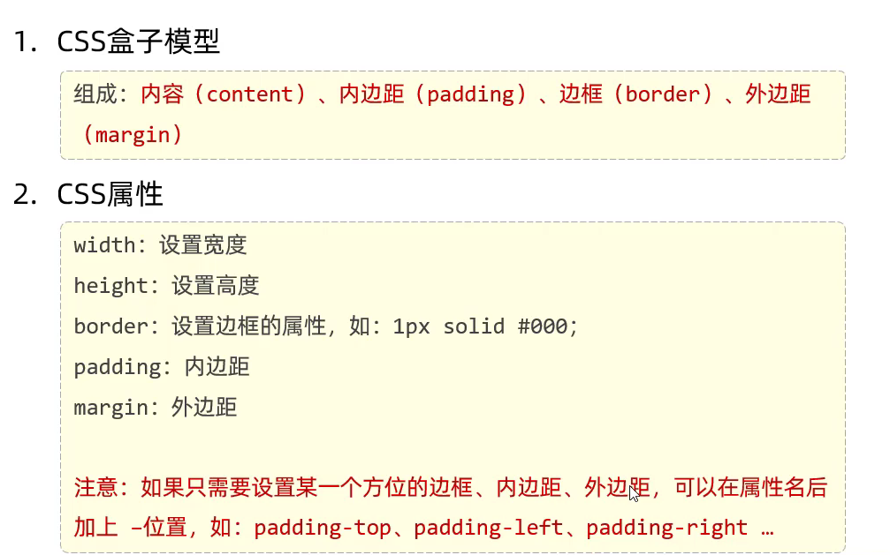

采用div 包裹整个内容,设置盒子模型,id为"centor"

```
#centor{
    width: 65%;
    margin: 0 auto ;
}


<body>
    <div id="centor">
   <p>
    11月10日，第八届进博会在上海闭幕。习近平总书记亲自谋划的世界上第一个以进口为主题的国家级展会，是国际贸易发展史上的一大创举。
    </p>
    <p style="text-align: end;">
      责任编辑：王树淼 SN242
    </p>
    </div>

</body>

```


## 表格

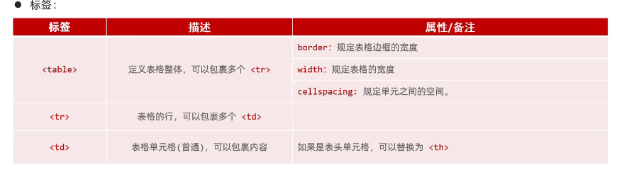

表头的th,默认加粗

```
  <table border="1px" cellspacing="0"  width="600px">
        <tr>
            <th>序号</th>
            <th>品牌Logo</th>
            <th>品牌名称</th>
            <th>企业名称</th>
        </tr>
        <tr>
            <td>1</td>
            <td>  </td>
            <td>华为</td>
            <td>华为技术有限公司</td>
        </tr>
        <tr>
            <td>2</td>
            <td>  </td>
            <td>阿里</td>
            <td>阿里巴巴集团控股有限公司</td>
        </tr>
    </table>
```

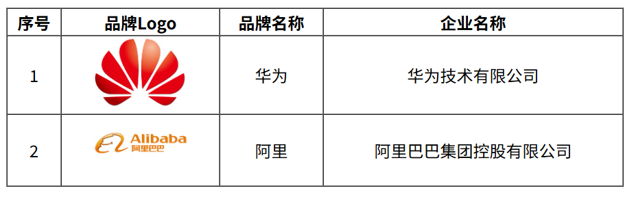

## 表单

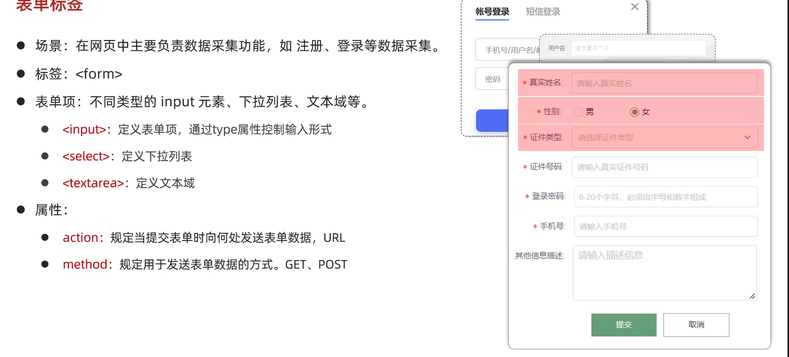

```
    <!-- 
    form表单属性: 
        action: 表单提交的url, 往何处提交数据 . 如果不指定, 默认提交到当前页面
        method: 表单的提交方式 .
            get: 在url后面拼接表单数据, 比如: ?username=Tom&age=12 , url长度有限制 . 默认值
            post: 在消息体(请求体)中传递的, 参数大小无限制的.
    -->   

    <form action="" method="post">
        用户名: <input type="text" name="username">
        年龄: <input type="text" name="age">
        <input type="submit" value="提交">
    </form>
```


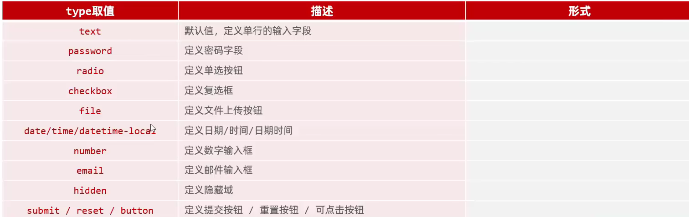

```
<form action="" method="post">
     姓名: <input type="text" name="name"> <br><br>
     密码: <input type="password" name="password"> <br><br> 
     性别: <input type="radio" name="gender" value="1"> 男
          <label><input type="radio" name="gender" value="2"> 女 </label> <br><br>
     爱好: <label><input type="checkbox" name="hobby" value="java"> java </label>
          <label><input type="checkbox" name="hobby" value="game"> game </label>
          <label><input type="checkbox" name="hobby" value="sing"> sing </label> <br><br>
     图像: <input type="file" name="image">  <br><br>
     生日: <input type="date" name="birthday"> <br><br>
     时间: <input type="time" name="time"> <br><br>
     日期时间: <input type="datetime-local" name="datetime"> <br><br>
     邮箱: <input type="email" name="email"> <br><br>
     年龄: <input type="number" name="age"> <br><br>
     学历: <select name="degree">
               <option value="">----------- 请选择 -----------</option>
               <option value="1">大专</option>
               <option value="2">本科</option>
               <option value="3">硕士</option>
               <option value="4">博士</option>
          </select>  <br><br>
     描述: <textarea name="description" cols="30" rows="10"></textarea>  <br><br>
     <input type="hidden" name="id" value="1">

     <!-- 表单常见按钮 -->
     <input type="button" value="按钮">
     <input type="reset" value="重置"> 
     <input type="submit" value="提交">   
     <br>
</form>
```


# JavaScript(JS)

## 引入方式

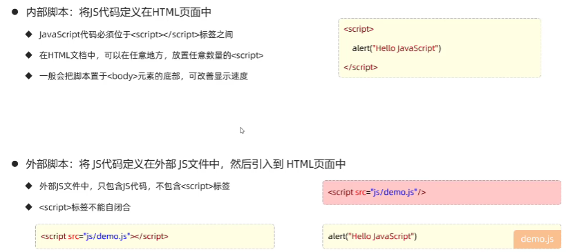

注意要用单引号

```
<!DOCTYPE html>
<html lang="en">
<head>
    <meta charset="UTF-8">
    <meta name="viewport" content="width=device-width, initial-scale=1.0">
    <title>Document</title>
    <script>alert('hhhh');</script>
    <script src="/js/demo.js"></script>
</head>
<body>
    <script src="./js/demo.js"></script>
</body>
</html>

js/demo.js
alert('hello');
```

## 基础语法

### 输出语句

语法与java类似,只是末尾分号可有可无

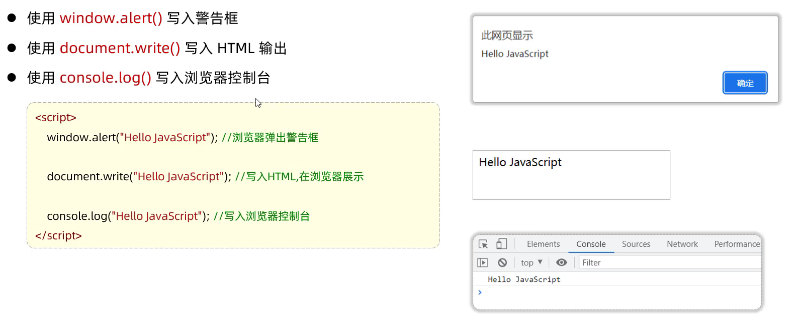

### 变量

**全局变量 var,**

可以放任何的数据类型,

可以重复定义,并覆盖原来的

全局生效

**局部变量let**

可以放任何的数据类型,

不可以重复定义

只能在对应的代码块{}中生效

**常量const**

可以放任何的数据类型,

无法被改变

不可以重复定义

只能在对应的代码块中生效

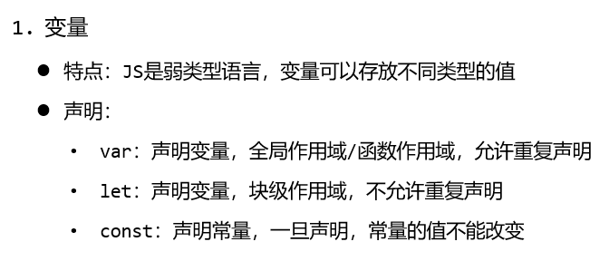

### 数据类型

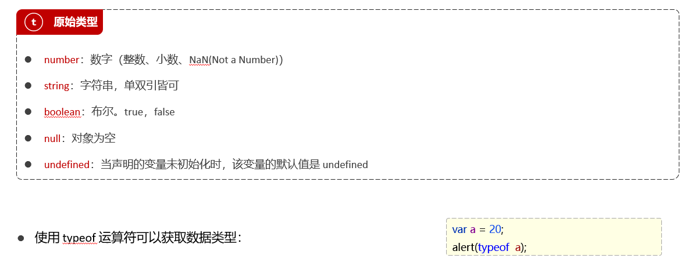

### 运算符

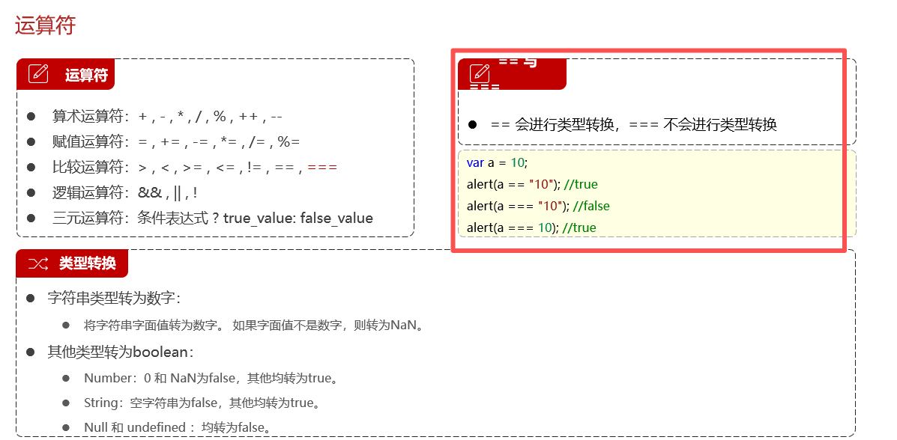

### 逻辑

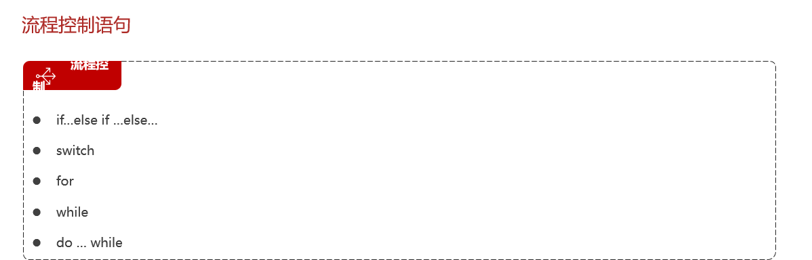

## 函数

```
    //定义函数-2
    var add = function(a,b){
        return  a + b;
    }


    //函数调用
    var result = add(10,20);
    alert(result);
```

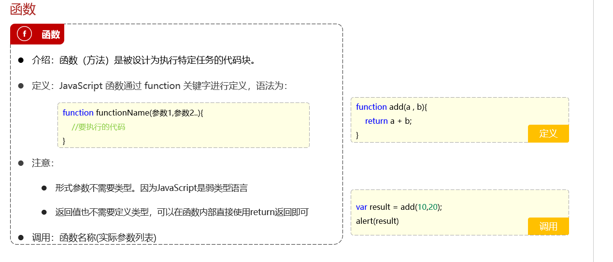

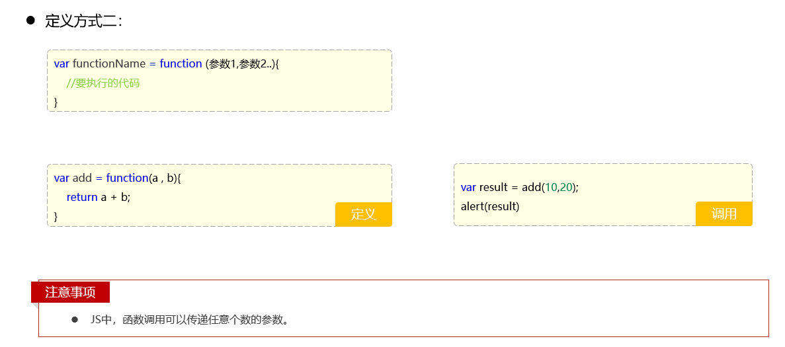

但是只会取声明的那几个参数

## 对象

### •Array

```
//匿名的函数遍历
arr.forEach(function(e){
   // console.log(e);
    
})
//lamda
arr.forEach((e)=>{
   // console.log(e);
}
)

arr.push(7,8,9);
arr.splice(2,2);//从序号2开始,删除包括序号2的2个元素
```

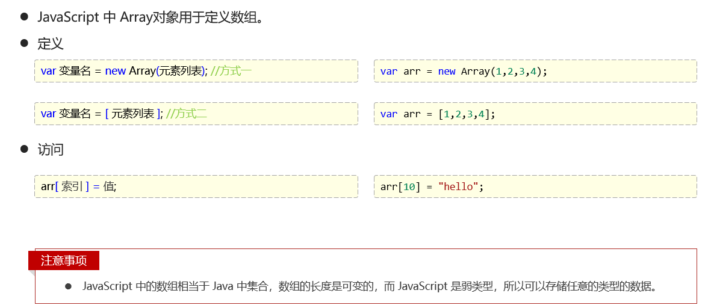

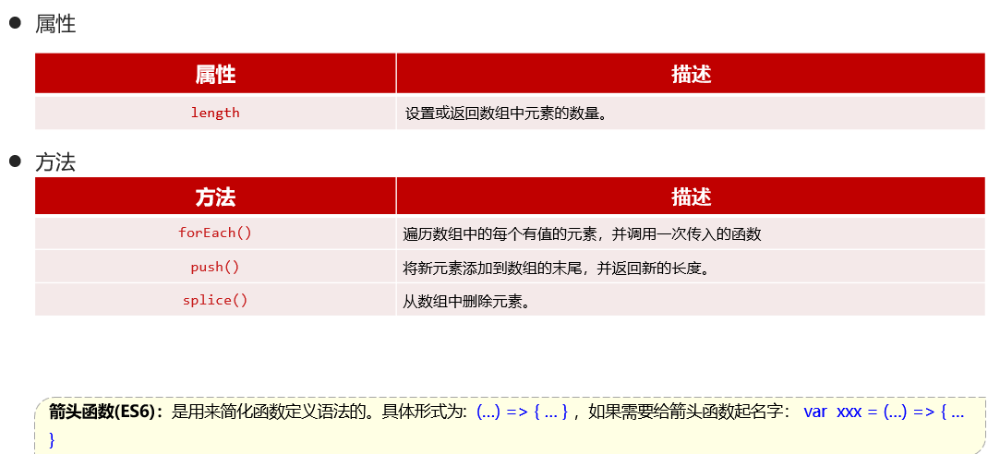

也可以使用for循环进行遍历

```
    var arr = [1,2,3,4];
    arr[10] = 50;
    for (let i = 0; i < arr.length; i++) {
        console.log(arr[i]);
    }
//forEach    
arr.forEach(function(e){
   // console.log(e);
    
// })
//lamda
arr.forEach((e)=>{
   // console.log(e);
}
)

arr.push(7,8,9);
arr.splice(2,2);//从序号2开始,删除包括序号2的2个元素
```


### •String


```
    var str = "  Hello String    ";
    console.log(str);
    //length
    console.log(str.length);
    //charAt
    console.log(str.charAt(4));
    //indexOf
    console.log(str.indexOf("lo"));
    //trim
    var s = str.trim();
    console.log(s);
    //substring(start,end) --- 开始索引, 结束索引 (含头不含尾)
    console.log(s.substring(0,5));
```


### •JSON

```html
    //定义json
    var jsonstr = '{"name":"Tom", "age":18, "addr":["北京","上海","西安"]}';
    alert(jsonstr.name);//这里还不能正确输出,因为这个只是字符串,还需要转换成对象,才能调用

    //json字符串--js对象
    var obj = JSON.parse(jsonstr);
    alert(obj.name);

    //js对象--json字符串
    alert(JSON.stringify(obj));
```

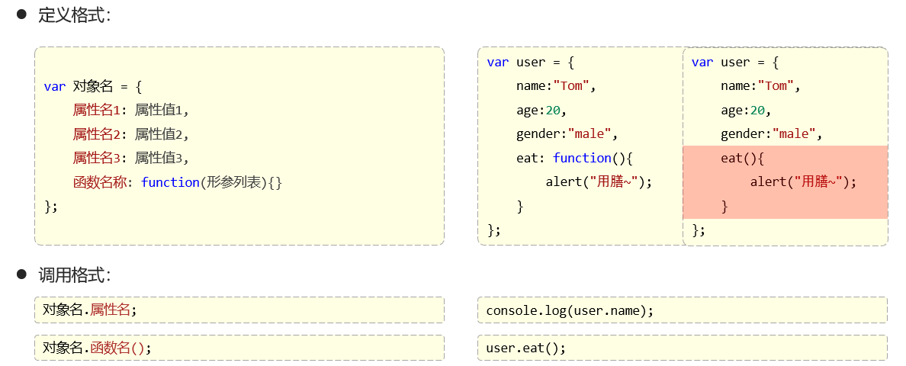

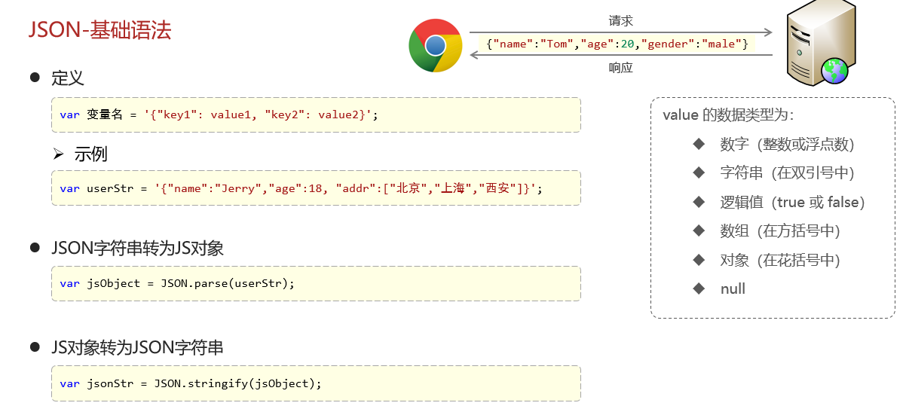

### •BOM

#### Window：浏览器窗口对象

```
    //获取
    window.alert("Hello BOM");
    alert("Hello BOM Window");

    // 方法
    // confirm - 对话框 -- 确认: true , 取消: false
    var flag = confirm("您确认删除该记录吗?");
    alert(flag);

    // 定时器 - setInterval -- 周期性的执行某一个函数
    var i = 0;
    setInterval(function(){
        i++;
        console.log("定时器执行了"+i+"次");
    },2000);

    // 定时器 - setTimeout -- 延迟指定时间执行一次 
    setTimeout(function(){
        alert("JS");
    },3000);


    //location
    alert(location.href);

    location.href = "https://www.itcast.cn";
```

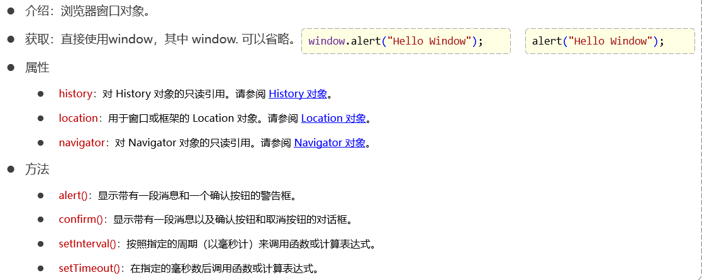


#### Navigator：浏览器对象

#### Screen：屏幕对象

#### History：历史记录对象

#### Location：地址栏对象

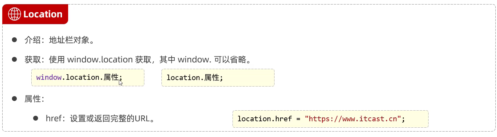

### •DOM

```
<body>
      <br><br>

    <div class="cls">传智教育</div>   <br>
    <div class="cls">黑马程序员</div>  <br>

    <input type="checkbox" name="hobby"> 电影
    <input type="checkbox" name="hobby"> 旅游
    <input type="checkbox" name="hobby"> 游戏
</body>

<script>
    //1. 点亮灯泡 : src 属性值
    var img = document.getElementById('h1');
    img.src = "img/on.gif";


    //2. 将所有div标签的内容后面加上: very good (红色字体) -- <font color='red'></font>
    var divs = document.getElementsByTagName('div');
    for (let i = 0; i < divs.length; i++) {
        const div = divs[i];
        div.innerHTML +=  '<span style="color: red; font-weight: bold;">very good</span>'; 
    }


    //3. 使所有的复选框呈现选中状态
    var ins = document.getElementsByName('hobby');
    for (let i = 0; i < ins.length; i++) {
        const check = ins[i];
        check.checked = true;//选中
    }

</script>
```


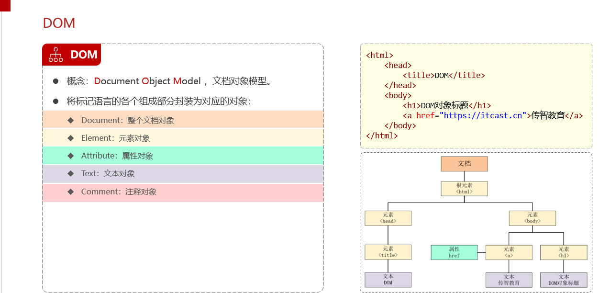

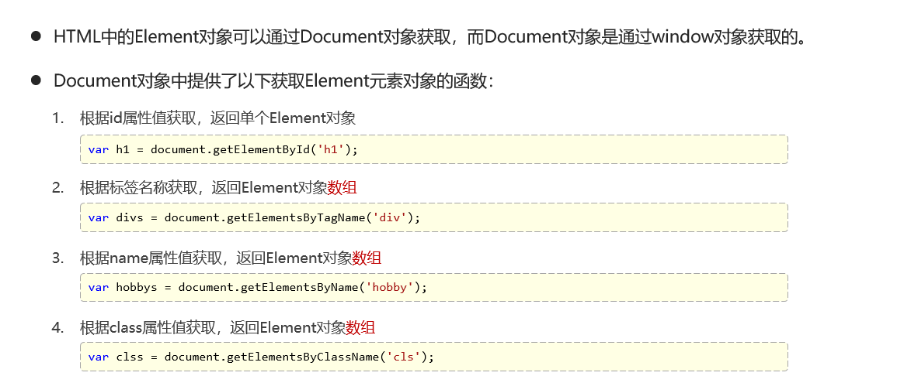

### 事件监听

#### 事件监听绑定方式

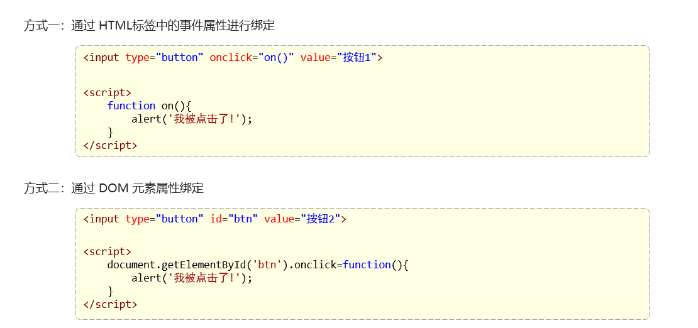

```
<body>
    <input type="button" id="btn1" value="事件绑定1" onclick="on()">
    <input type="button" id="btn2" value="事件绑定2">
</body>

<script>
    function on(){
        alert("按钮1被点击了...");
    }

    document.getElementById('btn2').onclick = function(){
        alert("按钮2被点击了...");
    }

</script>
```

#### 常见监听事件

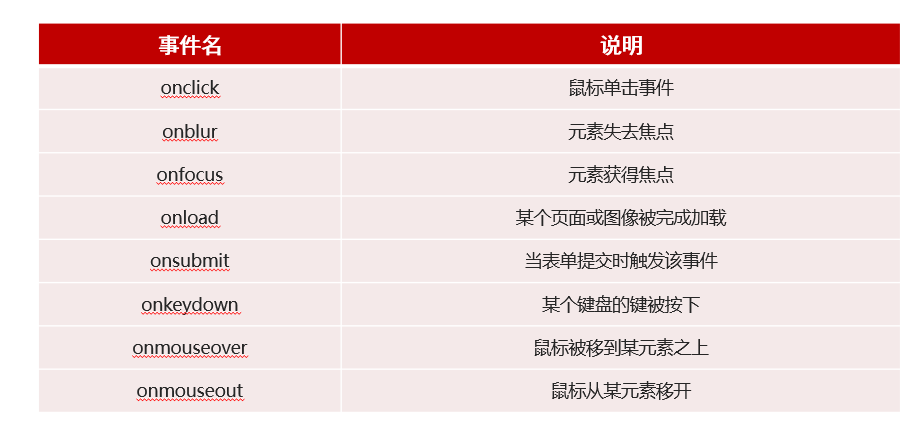

# Vue

## Vue入门

需要引入官方提供的vue.js

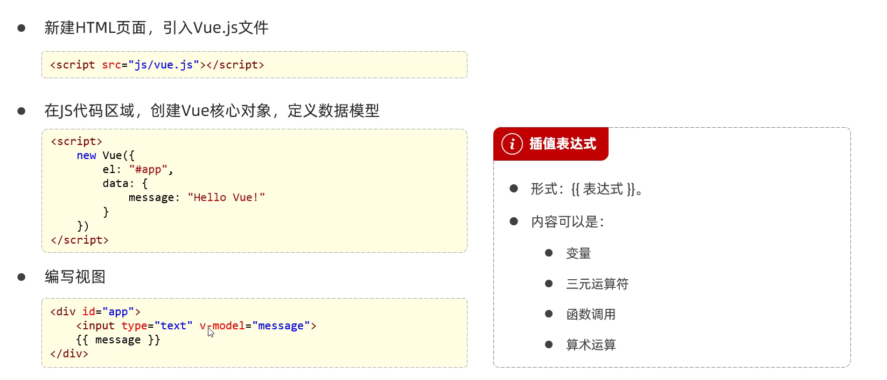

## 常用指令

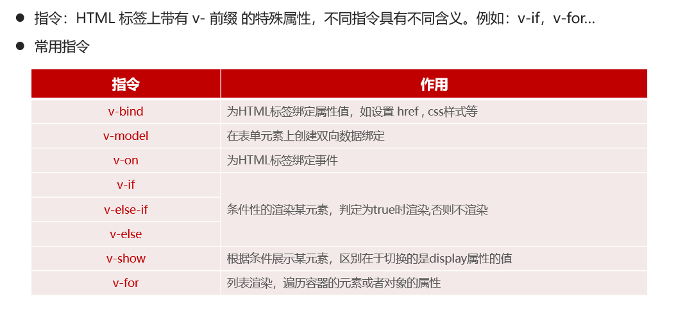

### v-bind->:和v-model

```
<body>
    <div id="app">

        <a v-bind:href="url">链接1</a>
        <a :href="url">链接2</a>

        <input type="text" v-model="url">

    </div>
</body>
<script>
    //定义Vue对象
    new Vue({
        el: "#app", //vue接管区域
        data:{
           url: "https://www.baidu.com"
        }
    })
</script>
```

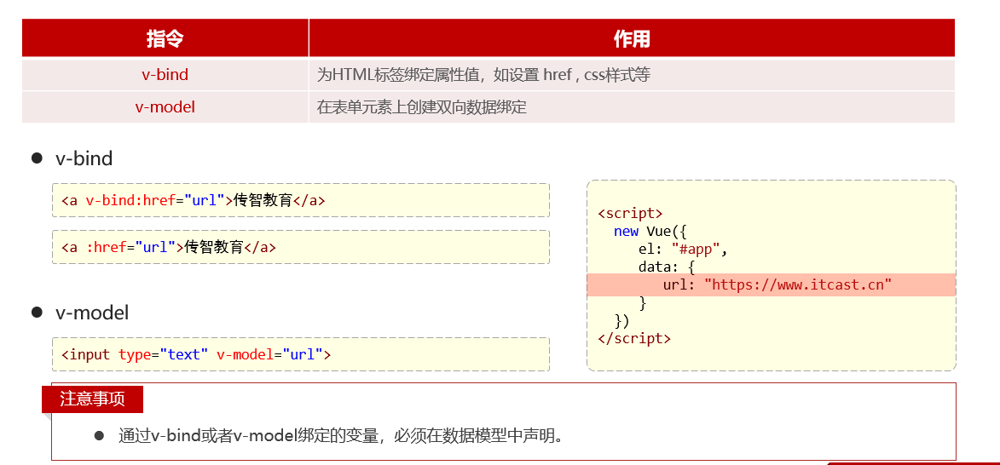

### v-on 或@,绑定方法

```
<body>
    <div id="app">

        <input type="button" value="点我一下" v-on:click="handle()">

        <input type="button" value="点我一下" @click="handle()">

    </div>
</body>
<script>
    //定义Vue对象
    new Vue({
        el: "#app", //vue接管区域
        data:{
           
        },
        methods: {
            handle: function(){
                alert("你点我了一下...");
            }
        }
    })
</script>
```

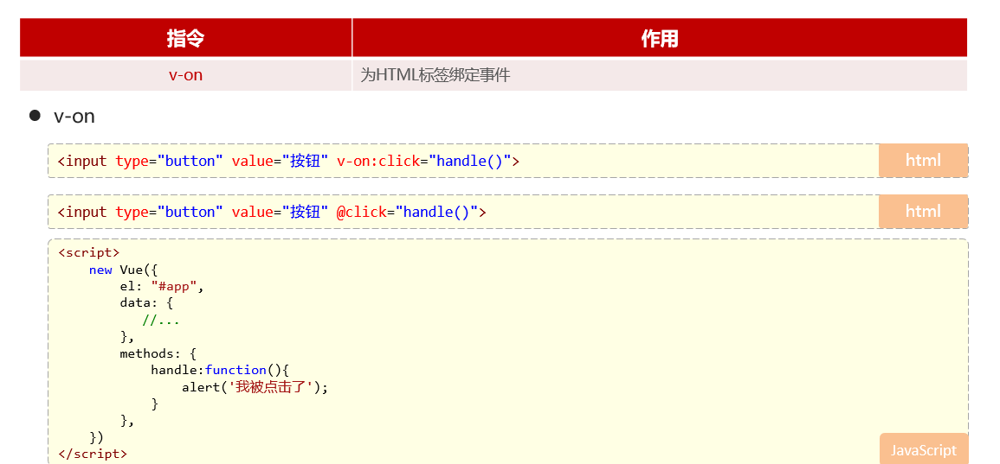

### v-if v-show

```
<body>
    <div id="app">
        
        年龄<input type="text" v-model="age">经判定,为:
        <span v-if="age <= 35">年轻人(35及以下)</span>
        <span v-else-if="age > 35 && age < 60">中年人(35-60)</span>
        <span v-else>老年人(60及以上)</span>

        <br><br>

        年龄<input type="text" v-model="age">经判定,为:
        <span v-show="age <= 35">年轻人(35及以下)</span>
        <span v-show="age > 35 && age < 60">中年人(35-60)</span>
        <span v-show="age >= 60">老年人(60及以上)</span>

    </div>
</body>
<script>
    //定义Vue对象
    new Vue({
        el: "#app", //vue接管区域
        data:{
           age: 20
        },
        methods: {
            
        }
    })
</script>
```

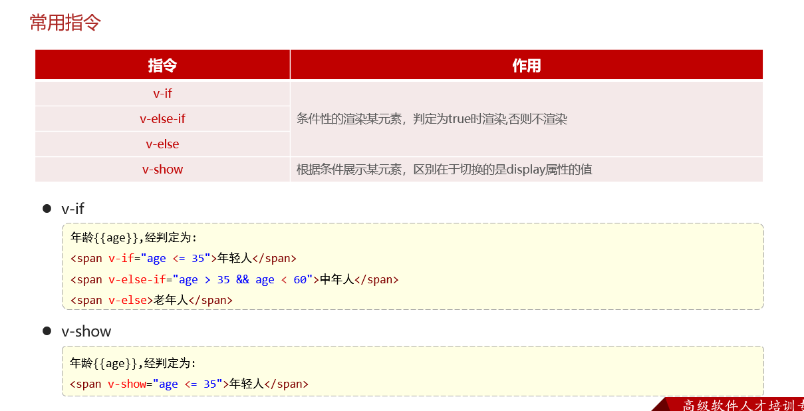

### v-for

```
<body>
    <div id="app">

        <div v-for="addr in addrs">{{addr}}</div>

        <hr>

        <div v-for="(addr,index) in addrs">{{index + 1}} : {{addr}}</div>

    </div>
</body>
<script>
    //定义Vue对象
    new Vue({
        el: "#app", //vue接管区域
        data:{
           addrs:["北京", "上海", "西安", "成都", "深圳"]
        },
        methods: {
            
        }
    })
</script>
```

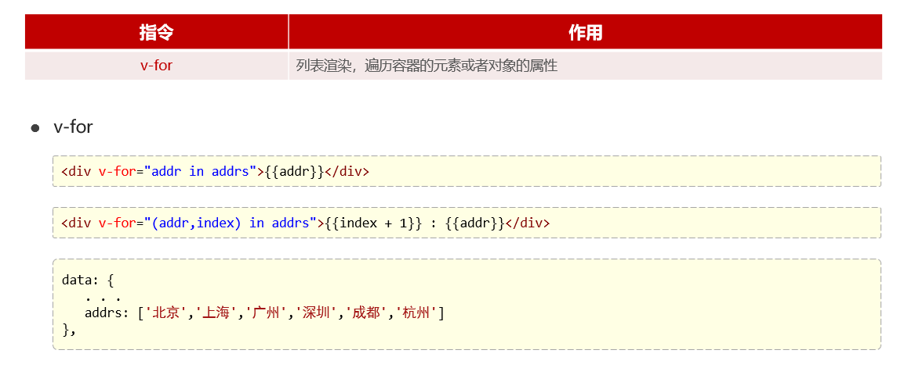 

## 生命周期

重点在于挂载完成部分,此处对后端发起请求

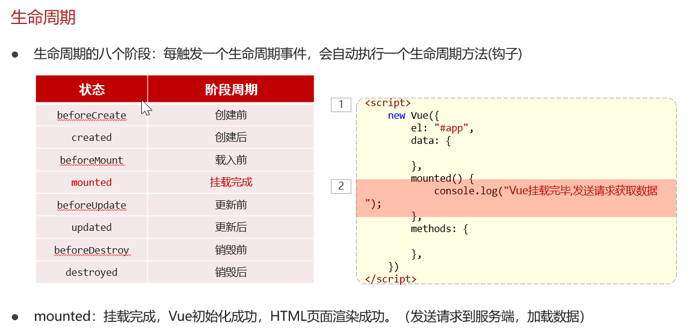

## Vue的脚手架

这个是一个极好的前端框架,基于这个框架去开发前端,而不是使用之前的那个html去开发

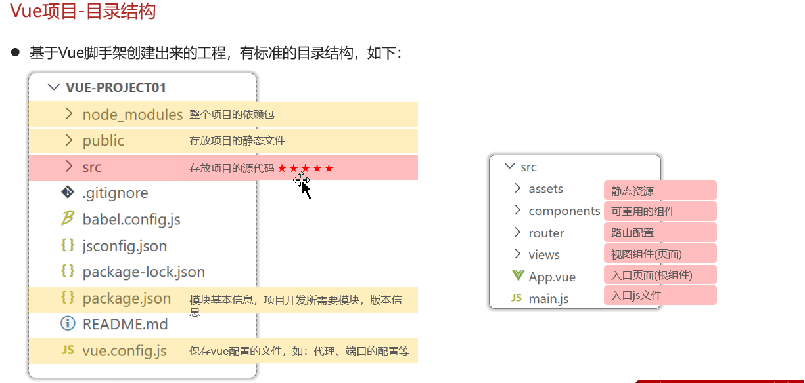

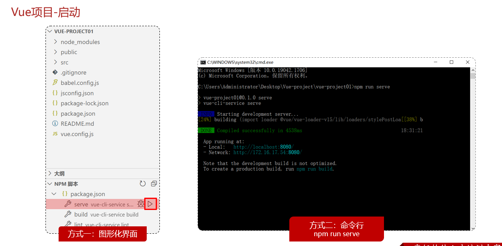

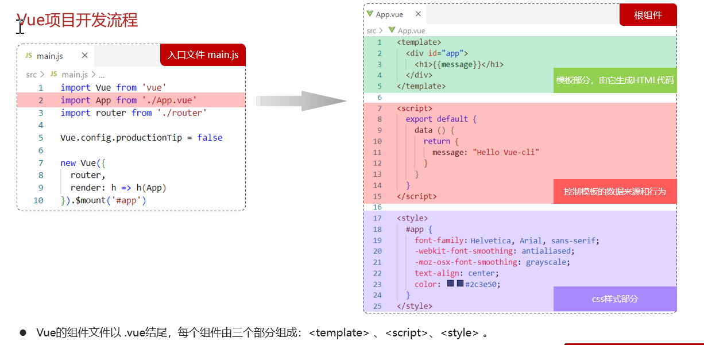

这个template就相当于之前的body部分了

# AXIOS

AXIOS是对Ajax的一个封装,更好的开发

而Ajax是用于异步请求的

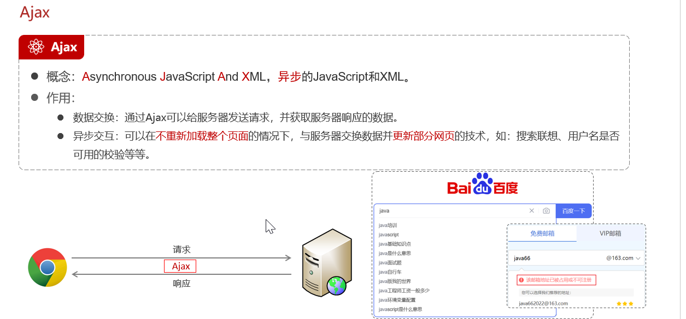

俩种请求方式,post和get

get进行的是查找

post进行的是增删改操作,要加具体参数

且用then进行回调

```
<body>
    
    <input type="button" value="获取数据GET" onclick="get()">

    <input type="button" value="删除数据POST" onclick="post()">

</body>
<script>
    function get(){
        axios.get("http://yapi.smart-xwork.cn/mock/169327/emp/list").then(result => {
            console.log(result.data);
        })
    }

    function post(){
        //通过axios发送异步请求-post
        axios.post("http://yapi.smart-xwork.cn/mock/169327/emp/deleteById","id=1").then(result => {
            console.log(result.data);
        })
    }
```

## 案例

```
<body>
    <div id="app">
        <table border="1" cellspacing="0" width="60%">
            <tr>
                <th>编号</th>
                <th>姓名</th>
                <th>图像</th>
                <th>性别</th>
                <th>职位</th>
                <th>入职日期</th>
                <th>最后操作时间</th>
            </tr>

            <tr align="center" v-for="(emp,index) in emps">
                <td>{{index + 1}}</td>
                <td>{{emp.name}}</td>
                <td>
                    
                </td>
                <td>
                    <span v-if="emp.gender == 1">男</span>
                    <span v-if="emp.gender == 2">女</span>
                </td>
                <td>{{emp.job}}</td>
                <td>{{emp.entrydate}}</td>
                <td>{{emp.updatetime}}</td>
            </tr>
        </table>
    </div>
</body>
<script>
    new Vue({
       el: "#app",
       data: {
         emps:[]
       },
       mounted () {
          //发送异步请求,加载数据
          axios.get("https://mock.apifox.cn/m1/3128855-0-default/emp/list").then(result => {
            this.emps = result.data.data;
          })
       }
    });
</script>
```

第一次data是指要拿的数据,第二次的data是服务器里面的那个data数组

# 前后端分离开发

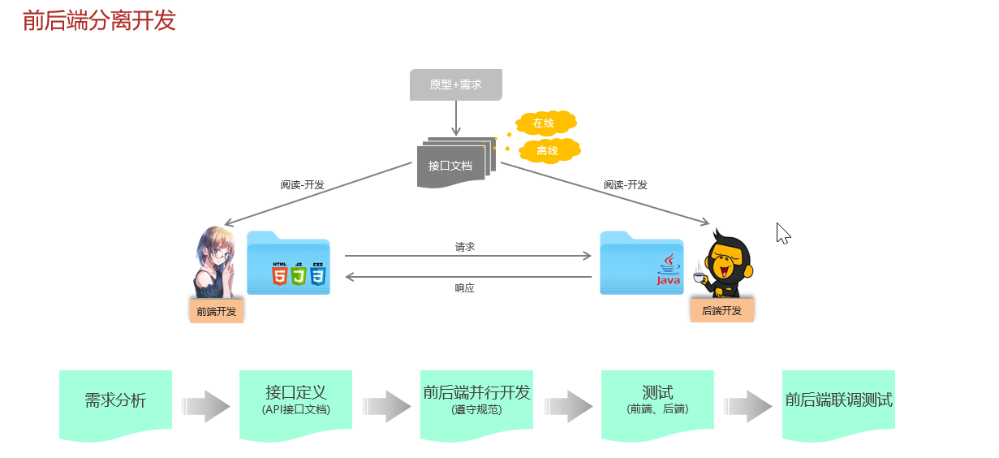

# Element

## 初识

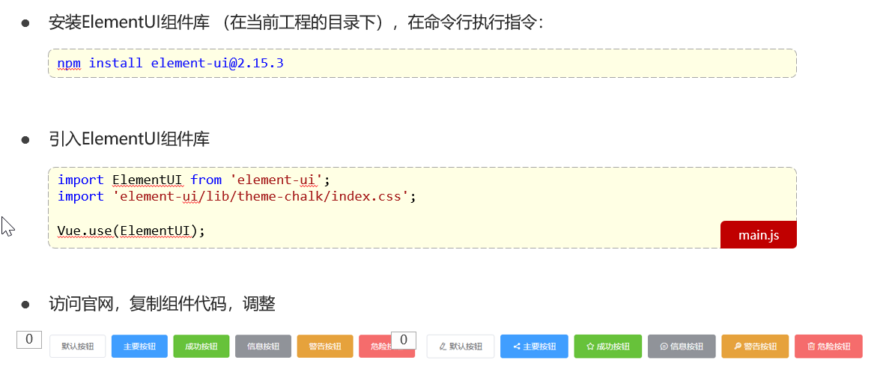

# MAVEN

用maven可以更好的构建并管理我的项目

还可以通过引入别人的项目到我的本地仓库mvn_repo中,然后在pom.xml中写好引入的依赖

更好的进行项目的开发,复用

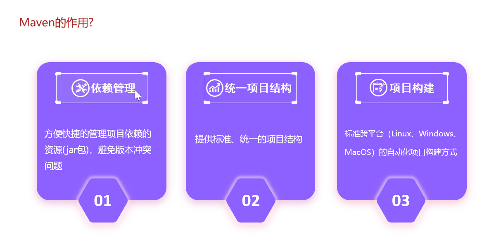

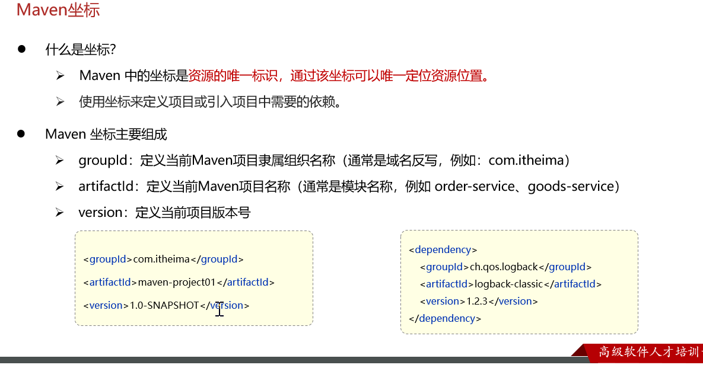

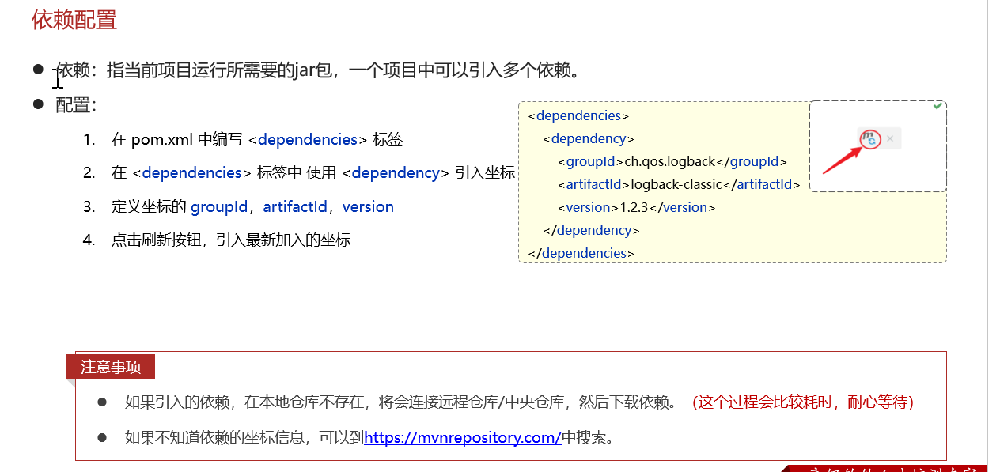

A会继承B中的C和对应的JAR包,因为A直接依赖了B,而B本身依赖了C和一个JAR包


运行install时会运行compile,test,package,但不会运行clean

install会把打包号的jar包放到我们的本地仓库里面.即mvn_repo

# Spring Boot

使用这个开发后端会非常的方便

这个相当于前端的Vue脚手架


## 入门

## 创建项目

注意TYPE要选maven

SDK要选本机的

如果没有网络,可以手动构建这个框架,不用联网

day04-Maven-SpringBootWeb入门\资料\SpringbootWeb\03. Springboot项目(手动构建)


## HTTP


**如果要实现客户端与服务端通过http进行通信,那么我们就要在服务端ServerSocket类去解析客户端的请求,再通过向客户端发起响应来回应请求**


**而这些都要按照http协议中的请求格式来,这会非常麻烦!!!**

**但好在http请求的这些格式非常的统一,通用,有公司帮我们写好了,我们只需要用他们的软件就好,比如**

**Tomcat**,**这样子开发人员只用关注开发逻辑就好**

## 问题

### 端口号被占用

使用cmd进去,查看

netstat -ano | findstr 端口号


再去任务管理器关闭这个8068编号的进程

## TomCat


把文件放到webapps的目录下就好了,然后访问对应的目录的文件比如lhttp://localhost:8080/demo/index.html

通过maven构建的时候勾选了web依赖,里面就有tomcat的依赖文件!主体还是基于springboot的框架进行开发


故在启动springboot时,就会启动内置的tomcat!


## 详解springboot接收请求响应数据

主要就是通过springboot提供的俩个对象来实现,解析请求和发出响应!

接下来就会从这俩方面进行详细讲解


## 请求

### 总结


### •Postman

用于测试我们的后端接口,包括get和post请求

而不用再依赖前端界面去测试了,这样才算真正意义上的前后端分离

post请求是存在于请求体当中的

get是在url路径当中的,这个说有限制参数数目


### •简单参数

需要函数形参和请求参数一样

```
@RestController
public class SimpleParam {
    @RequestMapping("/simpleParam")
    public String simpleParam(String name, Integer age) {
        System.out.println(name + "  :  " + age);
        return "OK";
    }
}
```

不一样的话需要使用RequestParam注解进行映射


### •实体参数,实体对象!

实际就是把参数封装到对象里面去获取即可,

**对于对象的嵌套,那么也是一样,通过对象.属性的方式去get或post**

address.city


### •数组集合参数

把数组参数作为函数形参即可,数组名要一致

```
@RestController
public class ArrayRequest {
    @RequestMapping("/Array")
    public String simpleParam(String[] hobby) {
        return Arrays.toString(hobby);
    }
}
```

集合也是一样,不过要添加注解@RequestParam

```
@RequestMapping("/listParam")
public String listParam(@RequestParam List<String> hobby){    
	System.out.println(hobby);    
	return "OK";
}

```


### •日期参数

要指定日期的格式,pattern来指定

```
@RequestMapping("/dateParam")
public String dateParam(@DateTimeFormat(pattern = "yyyy-MM-dd HH:mm:ss") LocalDateTime updateTime){ 
System.out.println(updateTime);
return "OK";
}

```


### •Json参数


### •路径参数

需要用可变的路径参数去获取

```
@RestController
public class URL_Request {
    @RequestMapping("path/{id}")
    public String path(@PathVariable String id) {
        return id;
    }
}
```

访问localhost:8080/path/100

返回100

多个参数也是可以的

```
    @RequestMapping("path/{id}/{name}")
    public String[] path(@PathVariable String id, @PathVariable String name) {
        return new String[]{id, name};
    }
```

访问localhost:8080/path/100/你好

返回[  "100", "你好"]

## 响应

响应其实就是上面的return内容,注解@RestController = @Controller + @ResponseBody ,即包含了请求和响应!

使用统一的响应数据类result,这个是自定义的


### xml的员工管理案例

前端通过访问钩子函数mounted,通过异步请求/listEmp路径的资源

```
        mounted() {
            axios.get('/listEmp').then(res => {
                if (res.data.code) {
                    this.tableData = res.data.data;
                }
            });
        },
```

后端则通过以下方法解析xml文件

**目标**: 将xml文件中的那个带标签的数据解析成对应的实体员工对象,并放进员工对象列表,并做一个返回

我们接收返回的列表,进行遍历,再进行数字到对应含义的解析,并通过Result类进行封装管理,得到以下的数据信息!

前端要请求的就是这个信息里面的data数组!,这样就实现了前后端异步请求!

```
{
    "code": 1,
    "msg": "success",
    "data": [
        {
            "name": "金毛狮王",
            "age": 55,
            "image": "https://web-framework.oss-cn-hangzhou.aliyuncs.com/web/1.jpg",
            "gender": "男",
            "job": "讲师"
        },
        {
            "name": "白眉鹰王",
            "age": 65,
            "image": "https://web-framework.oss-cn-hangzhou.aliyuncs.com/web/2.jpg",
            "gender": "男",
            "job": "讲师"
        },
        {
            "name": "青翼蝠王",
            "age": 45,
            "image": "https://web-framework.oss-cn-hangzhou.aliyuncs.com/web/3.jpg",
            "gender": "男",
            "job": "班主任"
        },
        {
            "name": "紫衫龙王",
            "age": 38,
            "image": "https://web-framework.oss-cn-hangzhou.aliyuncs.com/web/4.jpg",
            "gender": "女",
            "job": "就业指导"
        }
    ]
}
```


```
public class XmlParserUtils {
    public static <T> List<T> parse(String file, Class<T> targetClass) {
        ArrayList<T> list = new ArrayList<T>(); //封装解析出来的数据
        try {
            //1.获取一个解析器对象
            SAXReader saxReader = new SAXReader();
            //2.利用解析器把xml文件加载到内存中,并返回一个文档对象
            Document document = saxReader.read(new File(file));
            //3.获取到根标签
            Element rootElement = document.getRootElement();
            //4.通过根标签来获取 user 标签
            List<Element> elements = rootElement.elements("emp");

            //5.遍历集合,得到每一个 user 标签
            for (Element element : elements) {
                //获取 name 属性
                String name = element.element("name").getText();
                //获取 age 属性
                String age = element.element("age").getText();
                //获取 image 属性
                String image = element.element("image").getText();
                //获取 gender 属性
                String gender = element.element("gender").getText();
                //获取 job 属性
                String job = element.element("job").getText();

                //组装数据
                //反射,获取到对应的构造方法
                Constructor<T> constructor = targetClass.getDeclaredConstructor(String.class, Integer.class, String.class, String.class, String.class);
                constructor.setAccessible(true);//设定权限,这样privat也可以访问
                T object = constructor.newInstance(name, Integer.parseInt(age), image, gender, job);

                list.add(object);
            }
        } catch (Exception e) {
            e.printStackTrace();
        }
        return list;
    }
}
```

```
@RestController
public class EmpRespond {

    @RequestMapping("/listEmp")
    public Result list() {
        //1. 加载 emp.xml, 并解析 emp.xml 中的数据
        //这是通过编译后的文件即calss文件,存放在target中的,来找到对应的url路径
        String file = this.getClass().getClassLoader().getResource("emp.xml").getFile();
        List<Emp> empList = XmlParserUtils.parse(file, Emp.class);
        //2. 对员工信息中的gender , job字段进行处理
        empList.stream().forEach(emp -> {
            String gender = emp.getGender();
            //gender : 1 男 , 2 女
            if ("1".equals(gender)) {
                emp.setGender("男");
            } else if ("2".equals(gender)) {
                emp.setGender("女");
            }
            String job = emp.getJob();
            //job : 1 讲师 , 2 班主任 , 3 就业指导
            if ("1".equals(job)) {
                emp.setJob("讲师");
            } else if ("2".equals(job)) {
                emp.setJob("班主任");
            } else if ("3".equals(job)) {
                emp.setJob("就业指导");
            }
        });   //3. 组装数据并返回
        return Result.success(empList);
    }
}
```


## 分层解耦

上述的过程讲所有过耦合到class EmpRespond ,即controller层当中了,非常冗杂,可以讲他们分开


### 内聚和耦合

但是这样,他们有互相耦合在一起了,改动一个,就要都改


使用控制反馈和依赖注入!!


### 控制反转

使用@Component

被 @Component 注解标记的类会被 Spring 容器自动扫描并注册为 Bean，供其他组件使用。

以下分别位Controller,Service,Dao


而如果我们要切换数据的处理方式,只需要将原来的ServiceA上面的@Component注解给注释

再在新的ServiceB上加上注解@Component

```
@RestController
public class EmpController {

    @Autowired
    private EmpService empService;

    @RequestMapping("/listEmp")
    public Result list() {
        //1. 调用service, 获取数据
        List<Emp> empList = empService.listEmp();

        //3. 响应数据
        return Result.success(empList);
    }
}
```

```
@Component
public class EmpServiceA implements EmpService {

    @Autowired
    private EmpDao empDao = new EmpDaoA();

    @Override
    public List<Emp> listEmp() {
        //1. 调用dao, 获取数据
        List<Emp> empList = empDao.listEmp();

        //2. 对数据进行转换处理 - gender, job
        empList.stream().forEach(emp -> {
            //处理 gender 1: 男, 2: 女
            String gender = emp.getGender();
            if ("1".equals(gender)) {
                emp.setGender("男");
            } else if ("2".equals(gender)) {
                emp.setGender("女");
            }

            //处理job - 1: 讲师, 2: 班主任 , 3: 就业指导
            String job = emp.getJob();
            if ("1".equals(job)) {
                emp.setJob("讲师");
            } else if ("2".equals(job)) {
                emp.setJob("班主任");
            } else if ("3".equals(job)) {
                emp.setJob("就业指导");
            }
        });
        return empList;
    }
}
```

```
@Component
public class EmpDaoA implements EmpDao {
    @Override
    public List<Emp> listEmp() {
        //1. 加载并解析emp.xml
        String file = this.getClass().getClassLoader().getResource("emp.xml").getFile();
        System.out.println(file);
        List<Emp> empList = XmlParserUtils.parse(file, Emp.class);
        return empList;
    }
}
```


### 依赖注入

使用@Autowired

被@Autowired所标记的对象会自动从IOC容器中寻找所需要的Bean

### 详解控制反转和依赖注入

#### Component

Bean的名字默认是类名的首字母小写

具有衍生,当作为Service和Dao包作用的时候就可以使用

而如果我们向声明一个在Service和Dao之外的话,就可以直接使用Componet


以及有一个Bean的Scanner,生效范围在当前包以及子包

所以我们放那些被Component注解的类的时候,需要放在黄色区域那里


#### @Autowired

@Autowired默认是按照**类型**进行，如果存在多个相同类型的bean，将会报错,因为不知道选哪个

所以可以使用以下来解决

Primary是指定优先级,被注解的类,优先级高

Qualifier是指定Bean的名字,直接选择对应名字的Bean,

Resourse,与上面类似,也是指定名字,但这个时候得删去Component以及她的衍生注解,以上的都不用


# Mysql


## 启动与链接

MySQL服务器启动完毕后，然后再使用如下指令，来连接MySQL服务器：

```
mysql -u用户名 -p密码 [-h数据库服务器的IP地址 -P端口号]
```

> -h  参数不加，默认连接的是本地 127.0.0.1 的MySQL服务器
>
> -P  参数不加，默认连接的端口号是 3306

```
mysql -uroot -p1234
```

## 数据模型

**关系型数据库（RDBMS）**

概念：建立在关系模型基础上，由多张相互连接的**二维表**组成的数据库。

而所谓二维表，指的是由行和列组成的表，如下图：


二维表的优点：

- 使用表存储数据，格式统一，便于维护

- 使用SQL语言操作，标准统一，使用方便，可用于复杂查询


**2). 数据模型**

介绍完了关系型数据库之后，接下来我们再来看一看在Mysql数据库当中到底是如何来存储数据的，也就是Mysql 的数据模型。

MySQL是关系型数据库，是基于二维表进行数据存储的，具体的结构图下:

 

- 通过MySQL客户端连接数据库管理系统DBMS，然后通过DBMS操作数据库
- 使用MySQL客户端，向数据库管理系统发送一条SQL语句，由数据库管理系统根据SQL语句指令去操作数据库中的表结构及数据
- 一个数据库服务器中可以创建多个数据库，一个数据库中也可以包含多张表，而一张表中又可以包含多行记录。

> 在Mysql数据库服务器当中存储数据，你需要：
>
> 1. 先去创建数据库（可以创建多个数据库，之间是相互独立的）
> 2. 在数据库下再去创建数据表（一个数据库下可以创建多张表）
> 3. 再将数据存放在数据表中（一张表可以存储多行数据）

## 语法


## SQL语句

SQL语句根据其功能被分为四大类：DDL、DML、DQL、DCL 

| DDL  | Data Definition  Language   | 数据定义语言，用来定义数据库对象(数据库，表，字段)     |
| ---- | --------------------------- | ------------------------------------------------------ |
| DML  | Data Manipulation  Language | 数据操作语言，用来对数据库表中的数据进行增删改         |
| DQL  | Data Query Language         | 数据查询语言，用来查询数据库中表的记录                 |
| DCL  | Data Control  Language      | 数据控制语言，用来创建数据库用户、控制数据库的访问权限 |

### 数据库设计-DDL

#### 数据库的基本操作


需求文档：

- 在我们开发一个项目或者项目当中的某个模块之前，会先会拿到产品经理给我们提供的页面原型及需求文档。


设计：

- 拿到产品原型和需求文档之后，我们首先要做的不是编码，而是要先进行项目的设计，其中就包括概要设计、详细设计、接口设计、数据库设计等等。
- 数据库设计根据产品原型以及需求文档，要分析各个模块涉及到的表结构以及表结构之间的关系，以及表结构的详细信息。最终我们需要将数据库以及数据库当中的表结构设计创建出来。

开发/测试：

- 参照页面原型和需求进行编码，实现业务功能。在这个过程当中，我们就需要来操作设计出来的数据库表结构，来完成业务的增删改查操作等。

部署上线：

- 在项目的功能开发测试完成之后，项目就可以上线运行了，后期如果项目遇到性能瓶颈，还需要对项目进行优化。优化很重要的一个部分就是数据库的优化，包括数据库当中索引的建立、SQL 的优化、分库分表等操作。


在上述的流程当中，针对于数据库来说，主要包括三个阶段：

1. 数据库设计阶段
   - 参照页面原型以及需求文档设计数据库表结构
2. 数据库操作阶段
   - 根据业务功能的实现，编写SQL语句对数据表中的数据进行增删改查操作
3. 数据库优化阶段
   - 通过数据库的优化来提高数据库的访问性能。优化手段：索引、SQL优化、分库分表等

接下来我们就先来学习第一部分数据库的设计，而数据库的设计就是来定义数据库，定义表结构以及表中的字段。

我们在进行数据库设计，需要使用到刚才所介绍SQL分类中的DDL语句。

DDL英文全称是Data Definition Language(数据定义语言)，用来定义数据库对象(数据库、表)。

DDL中数据库的常见操作：查询、创建、使用、删除。

##### 查询数据库

**查询所有数据库：**

```mysql
show databases;
```

命令行中执行效果如下：

 

**查询当前数据库：**

```mysql
select database();
```

命令行中执行效果如果：


> 我们要操作某一个数据库，必须要切换到对应的数据库中。 
>
> 通过指令：select  database() ，就可以查询到当前所处的数据库 


##### 创建数据库

**语法：**

```mysql
create database [ if not exists ] 数据库名;
```

案例： 创建一个itcast数据库。

```mysql
create database itcast;
```

命令行执行效果如下：

 

==注意：在同一个数据库服务器中，不能创建两个名称相同的数据库，否则将会报错。==


- 可以使用if not exists来避免这个问题

```sql
-- 数据库不存在,则创建该数据库；如果存在则不创建
create database if not extists itcast; 
```

 命令行执行效果如下：  


#####  使用数据库

**语法：**

```mysql
use 数据库名 ;
```

> 我们要操作某一个数据库下的表时，就需要通过该指令，切换到对应的数据库下，否则不能操作。

案例：切换到itcast数据

```mysql
use itcast;
```

命令执行效果如下：

 


##### 删除数据库

**语法：**

```mysql
drop database [ if exists ] 数据库名 ;
```

> 如果删除一个不存在的数据库，将会报错。
>
> 可以加上参数 if exists ，如果数据库存在，再执行删除，否则不执行删除。

案例：删除itcast数据库

~~~mysql
drop database if exists itcast; -- itcast数据库存在时删除
~~~

命令执行效果如下：

 

> 说明：上述语法中的database，也可以替换成 schema
>
> - 如：create schema db01;
> - 如：show schemas;
>

####  表操作

学习完了DDL语句当中关于数据库的操作之后，接下来我们继续学习DDL语句当中关于表结构的操作。

关于表结构的操作也是包含四个部分：创建表、查询表、修改表、删除表。

##### 创建

#####  语法

```mysql
create table  表名(
	字段1  字段1类型 [约束]  [comment  字段1注释 ],
	字段2  字段2类型 [约束]  [comment  字段2注释 ],
	......
	字段n  字段n类型 [约束]  [comment  字段n注释 ] 
) [ comment  表注释 ] ;
```

> 注意： [ ] 中的内容为可选参数； 最后一个字段后面没有逗号


案例：创建tb_user表

- 对应的结构如下：

  

- ##### 建表语句： 

```mysql
create table tb_user (
    id int comment 'ID,唯一标识',   # id是一行数据的唯一标识（不能重复）
    username varchar(20) comment '用户名',
    name varchar(10) comment '姓名',
    age int comment '年龄',
    gender char(1) comment '性别'
) comment '用户表';
```

> 数据表创建完成，接下来我们还需要测试一下是否可以往这张表结构当中来存储数据。

##### **约束条件**

| **约束** | **描述**                                         | **关键字**  |
| -------- | ------------------------------------------------ | ----------- |
| 非空约束 | 限制该字段值不能为null                           | not null    |
| 唯一约束 | 保证字段的所有数据都是唯一、不重复的             | unique      |
| 主键约束 | 主键是一行数据的唯一标识，要求非空且唯一         | primary key |
| 默认约束 | 保存数据时，如果未指定该字段值，则采用默认值     | default     |
| 外键约束 | 让两张表的数据建立连接，保证数据的一致性和完整性 | foreign key |

> 注意：约束是作用于表中字段上的，可以在创建表/修改表的时候添加约束。

##### 数据类型

在上面建表语句中，我们在指定字段的数据类型时，用到了int 、varchar、char，那么在MySQL中除了以上的数据类型，还有哪些常见的数据类型呢？ 接下来,我们就来详细介绍一下MySQL的数据类型。

MySQL中的数据类型有很多，主要分为三类：数值类型、字符串类型、日期时间类型。

**数值类型**

| 类型            | 大小   | 有符号(SIGNED)范围                                    | 无符号(UNSIGNED)范围                                       | 描述               |
| --------------- | ------ | ----------------------------------------------------- | ---------------------------------------------------------- | ------------------ |
| **TINYINT**     | 1byte  | (-128，127)                                           | (0，255)                                                   | 小整数值           |
| SMALLINT        | 2bytes | (-32768，32767)                                       | (0，65535)                                                 | 大整数值           |
| MEDIUMINT       | 3bytes | (-8388608，8388607)                                   | (0，16777215)                                              | 大整数值           |
| **INT/INTEGER** | 4bytes | (-2147483648，2147483647)                             | (0，4294967295)                                            | 大整数值           |
| BIGINT          | 8bytes | (-2^63，2^63-1)                                       | (0，2^64-1)                                                | 极大整数值         |
| FLOAT           | 4bytes | (-3.402823466 E+38，3.402823466351 E+38)              | 0 和 (1.175494351  E-38，3.402823466 E+38)                 | 单精度浮点数值     |
| DOUBLE          | 8bytes | (-1.7976931348623157 E+308，1.7976931348623157 E+308) | 0 和  (2.2250738585072014 E-308，1.7976931348623157 E+308) | 双精度浮点数值     |
| DECIMAL         |        | 依赖于M(精度)和D(标度)的值                            | 依赖于M(精度)和D(标度)的值                                 | 小数值(精确定点数) |

```sql
示例: 
    年龄字段 ---不会出现负数, 而且人的年龄不会太大
	age tinyint unsigned
	
	分数 ---总分100分, 最多出现一位小数
	score double(4,1)
```

**字符串类型**

| 类型        | 大小                  | 描述                                    |
| ----------- | --------------------- | --------------------------------------- |
| **CHAR**    | 0-255 bytes           | 定长字符串(需要指定长度),会固定占用长度 |
| **VARCHAR** | 0-65535 bytes         | 变长字符串(需要指定长度)                |
| TINYBLOB    | 0-255 bytes           | 不超过255个字符的二进制数据             |
| TINYTEXT    | 0-255 bytes           | 短文本字符串                            |
| BLOB        | 0-65 535 bytes        | 二进制形式的长文本数据                  |
| TEXT        | 0-65 535 bytes        | 长文本数据                              |
| MEDIUMBLOB  | 0-16 777 215 bytes    | 二进制形式的中等长度文本数据            |
| MEDIUMTEXT  | 0-16 777 215 bytes    | 中等长度文本数据                        |
| LONGBLOB    | 0-4 294 967 295 bytes | 二进制形式的极大文本数据                |
| LONGTEXT    | 0-4 294 967 295 bytes | 极大文本数据                            |

char 与 varchar 都可以描述字符串，char是定长字符串，指定长度多长，就占用多少个字符，和字段值的长度无关 。而varchar是变长字符串，指定的长度为最大占用长度 。相对来说，char的性能会更高些。

```sql
示例： 
    用户名 username ---长度不定, 最长不会超过50
	username varchar(50)
	
	手机号 phone ---固定长度为11
	phone char(11)
```

**日期时间类型**

| 类型         | 大小 | 范围                                       | 格式                | 描述                     |
| ------------ | ---- | ------------------------------------------ | ------------------- | ------------------------ |
| **DATE**     | 3    | 1000-01-01 至  9999-12-31                  | YYYY-MM-DD          | 日期值                   |
| TIME         | 3    | -838:59:59 至  838:59:59                   | HH:MM:SS            | 时间值或持续时间         |
| YEAR         | 1    | 1901 至 2155                               | YYYY                | 年份值                   |
| **DATETIME** | 8    | 1000-01-01 00:00:00 至 9999-12-31 23:59:59 | YYYY-MM-DD HH:MM:SS | 混合日期和时间值         |
| TIMESTAMP    | 4    | 1970-01-01 00:00:01 至 2038-01-19 03:14:07 | YYYY-MM-DD HH:MM:SS | 混合日期和时间值，时间戳 |

```sql
示例: 
	生日字段  birthday ---生日只需要年月日  
	birthday date
	
	创建时间 createtime --- 需要精确到时分秒
	createtime  datetime
```

#### 表创建后的操作

**查询**

****


**修改**

l添加字段：alter table 表名 add 字段名 类型(长度) [comment 注释] [约束];

l修改字段类型：alter table 表名 modify 字段名 新数据类型(长度);

l修改字段名和字段类型：alter table 表名 change 旧字段名 新字段名 类型 (长度) [comment 注释] [约束];

l删除字段：alter table 表名 drop column 字段名;

l修改表名： rename table 表名 to 新表名;

删除表: drop table [if exists] 表名;

```
alter table  tb_name add test varchar(10) unique COMMENT "测试";

alter  table tb_name modify test varchar(100);

alter  table  tb_name change test test_new int not null comment "修改"

alter table tb_name drop column  test_new;

rename table itcast.tb_name to tb_namee

drop table [if exists] tb_name
```

### 数据操作语言DML

DML英文全称是Data Manipulation Language(数据操作语言)，用来对数据库中表的**数据记录**进行增、删、改操作。

即对应表里面的具体数据,而不是表头了

**DDL是对表与表头进行定义**,**DML是对里面的数据进行操作**

#### 添加数据（INSERT）

- 向指定字段添加数据

  ~~~mysql
  insert into 表名 (字段名1, 字段名2) values (值1, 值2);
  ~~~

- 全部字段添加数据

  ~~~mysql
  insert into 表名 values (值1, 值2, ...);
  ~~~

- 批量添加数据（指定字段）

  ~~~mysql
  insert into 表名 (字段名1, 字段名2) values (值1, 值2), (值1, 值2);
  ~~~

- 批量添加数据（全部字段）

  ~~~mysql
  insert into 表名 values (值1, 值2, ...), (值1, 值2, ...);
  ~~~


案例1：向tb_emp表的username、name、gender字段插入数据

~~~mysql
-- 因为设计表时create_time, update_time两个字段不能为NULL，所以也做为要插入的字段
insert into tb_emp(username, name, gender, create_time, update_time)
values ('wuji', '张无忌', 1, now(), now());
~~~

案例2：向tb_emp表的所有字段插入数据

~~~mysql
insert into tb_emp(id, username, password, name, gender, image, job, entrydate, create_time, update_time)
values (null, 'zhirou', '123', '周芷若', 2, '1.jpg', 1, '2010-01-01', now(), now());
~~~

案例3：批量向tb_emp表的username、name、gender字段插入数据

~~~mysql
insert into tb_emp(username, name, gender, create_time, update_time)
values ('weifuwang', '韦一笑', 1, now(), now()),
       ('fengzi', '张三疯', 1, now(), now());
~~~

> 图形化操作：双击tb_emp表查看数据


Insert操作的注意事项：

1. 插入数据时，指定的字段顺序需要与值的顺序是一一对应的。

2. 字符串和日期型数据应该包含在引号中。

3. 插入的数据大小，应该在字段的规定范围内

#### 修改数据（UPDATE）

update语法：

```sql
update 表名 set 字段名1 = 值1 , 字段名2 = 值2 , .... [where 条件] ;
```

案例1：将tb_emp表中id为1的员工，姓名name字段更新为'张三'

```sql
update tb_emp set name='张三',update_time=now() where id=1;
```

案例2：将tb_emp表的所有员工入职日期更新为'2010-01-01'

```sql
update tb_emp set entrydate='2010-01-01',update_time=now();
```


> 注意事项:
>
> 1. 修改语句的条件可以有，也可以没有，如果没有条件，则会修改整张表的所有数据。
>
> 2. 在修改数据时，一般需要同时修改公共字段update_time，将其修改为当前操作时间。

#### 删除数据（DELETE)：

delete语法：

```SQL
delete from 表名  [where  条件] ;
```

案例1：删除tb_emp表中id为1的员工

```sql
delete from tb_emp where id = 1;
```

案例2：删除tb_emp表中所有员工

```sql
delete from tb_emp;
```

> 注意事项:
>
> ​	• DELETE 语句的条件可以有，也可以没有，如果没有条件，则会删除整张表的所有数据。
>
> ​	• **DELETE 语句不能删除某一个字段的值(可以使用UPDATE，将该字段值置为NULL即可)**。
>
> ​	• 当进行删除全部数据操作时，会提示询问是否确认删除所有数据，直接点击Execute即可。 

### DQL数据查询

DQL英文全称是Data Query Language(数据查询语言)，用来查询数据库表中的记录。

查询关键字：SELECT

查询操作是所有SQL语句当中最为常见，也是最为重要的操作。在一个正常的业务系统中，查询操作的使用频次是要远高于增删改操作的。当我们打开某个网站或APP所看到的展示信息，都是通过从数据库中查询得到的，而在这个查询过程中，还会涉及到条件、排序、分页等操作。

#### 语法

DQL查询语句，语法结构如下：

```mysql
SELECT
	字段列表
FROM
	表名列表
WHERE
	条件列表
GROUP  BY
	分组字段列表
HAVING
	分组后条件列表
ORDER BY
	排序字段列表
LIMIT
	分页参数
```

我们今天会将上面的完整语法拆分为以下几个部分学习：

- 基本查询（不带任何条件）
- 条件查询（where）
- 分组查询（group by）
- 排序查询（order by）
- 分页查询（limit）

#### 基本查询(不带任何条件)

在基本查询的DQL语句中，不带任何的查询条件，语法如下：

- 查询多个字段

  ~~~mysql
  select 字段1, 字段2, 字段3 from  表名;
  ~~~

- 查询所有字段（通配符）

  ~~~mysql
  select *  from  表名;
  ~~~

- 设置别名

  ~~~mysql
  select 字段1 [ as 别名1 ] , 字段2 [ as 别名2 ]  from  表名;
  ~~~

- 去除重复记录

  ~~~mysql
  select distinct 字段列表 from  表名;
  ~~~

#### 条件查询（where）

**语法：**

```sql
select  字段列表  from   表名   where   条件列表 ; -- 条件列表：意味着可以有多个条件
```

学习条件查询就是学习条件的构建方式，而在SQL语句当中构造条件的运算符分为两类：

- 比较运算符
- 逻辑运算符

常用的比较运算符如下: 

| **比较运算符**       | **功能**                                 |
| -------------------- | ---------------------------------------- |
| >                    | 大于                                     |
| >=                   | 大于等于                                 |
| <                    | 小于                                     |
| <=                   | 小于等于                                 |
| =                    | 等于                                     |
| <> 或 !=             | 不等于                                   |
| between ...  and ... | 在某个范围之内(含最小、最大值)           |
| in(...)              | 在in之后的列表中的值，多选一             |
| like 占位符          | 模糊匹配(_匹配单个字符, %匹配任意个字符) |
| is null              | 是null                                   |

常用的逻辑运算符如下:

| **逻辑运算符** | **功能**                    |
| -------------- | --------------------------- |
| and 或 &&      | 并且 (多个条件同时成立)     |
| or 或 \|\|     | 或者 (多个条件任意一个成立) |
| not 或 !       | 非 , 不是                   |


案例1：查询 姓名 为 杨逍 的员工

~~~mysql
select id, username, password, name, gender, image, job, entrydate, create_time, update_time
from tb_emp
where name = '杨逍'; -- 字符串使用''或""包含
~~~


案例2：查询 id小于等于5 的员工信息

~~~mysql
select id, username, password, name, gender, image, job, entrydate, create_time, update_time
from tb_emp
where id <=5;
~~~


案例3：查询 没有分配职位 的员工信息

~~~mysql
select id, username, password, name, gender, image, job, entrydate, create_time, update_time
from tb_emp
where job is null ;
~~~


> 注意：查询为NULL的数据时，不能使用 `= null`
>
> 


案例4：查询 有职位 的员工信息

~~~mysql
select id, username, password, name, gender, image, job, entrydate, create_time, update_time
from tb_emp
where job is not null ;
~~~


案例5：查询 密码不等于 '123456' 的员工信息

~~~mysql
-- 方式1：
select id, username, password, name, gender, image, job, entrydate, create_time, update_time
from tb_emp
where password <> '123456';
-- 方式2：
select id, username, password, name, gender, image, job, entrydate, create_time, update_time
from tb_emp
where password != '123456';
~~~


案例6：查询 入职日期 在 '2000-01-01' (包含) 到 '2010-01-01'(包含) 之间的员工信息

~~~mysql
-- 方式1：
select id, username, password, name, gender, image, job, entrydate, create_time, update_time
from tb_emp
where entrydate>='2000-01-01' and entrydate<='2010-01-01';
-- 方式2： between...and
select id, username, password, name, gender, image, job, entrydate, create_time, update_time
from tb_emp
where entrydate between '2000-01-01' and '2010-01-01';
~~~


案例7：查询 入职时间 在 '2000-01-01' (包含) 到 '2010-01-01'(包含) 之间 且 性别为女 的员工信息

~~~mysql
select id, username, password, name, gender, image, job, entrydate, create_time, update_time
from tb_emp
where entrydate between '2000-01-01' and '2010-01-01'
      and gender = 2;
~~~


案例8：查询 职位是 2 (讲师), 3 (学工主管), 4 (教研主管) 的员工信息

~~~mysql
-- 方式1：使用or连接多个条件
select id, username, password, name, gender, image, job, entrydate, create_time, update_time
from tb_emp
where job=2 or job=3 or job=4;
-- 方式2：in关键字
select id, username, password, name, gender, image, job, entrydate, create_time, update_time
from tb_emp
where job in (2,3,4);
~~~


案例9：查询 姓名 为两个字的员工信息

~~~mysql
select id, username, password, name, gender, image, job, entrydate, create_time, update_time
from tb_emp
where name like '__';  # 通配符 "_" 代表任意1个字符
~~~


案例10：查询 姓 '张' 的员工信息

~~~mysql
select id, username, password, name, gender, image, job, entrydate, create_time, update_time
from tb_emp
where name like '张%'; # 通配符 "%" 代表任意个字符（0个 ~ 多个）
~~~


#### 聚合函数

之前我们做的查询都是横向查询，就是根据条件一行一行的进行判断，而使用聚合函数查询就是纵向查询，它是对一列的值进行计算，然后返回一个结果值。（将一列数据作为一个整体，进行纵向计算）

语法：

~~~mysql
select  聚合函数(字段列表)  from  表名 ;
~~~

> 注意 : 聚合函数会忽略空值，对NULL值不作为统计。


常用聚合函数：

| **函数** | **功能** |
| -------- | -------- |
| count    | 统计数量 |
| max      | 最大值   |
| min      | 最小值   |
| avg      | 平均值   |
| sum      | 求和     |

> count ：按照列去统计有多少行数据。
>
> - 在根据指定的列统计的时候，如果这一列中有null的行，该行不会被统计在其中。
>
> sum ：计算指定列的数值和，如果不是数值类型，那么计算结果为0
>
> max ：计算指定列的最大值
>
> min ：计算指定列的最小值
>
> avg ：计算指定列的平均值


案例1：统计该企业员工数量

~~~mysql
# count(字段)
select count(id) from tb_emp;-- 结果：29
select count(job) from tb_emp;-- 结果：28 （聚合函数对NULL值不做计算）

# count(常量)
select count(0) from tb_emp;
select count('A') from tb_emp;

# count(*)  推荐此写法（MySQL底层进行了优化）
select count(*) from tb_emp;
~~~


案例2：统计该企业最早入职的员工

~~~mysql
select min(entrydate) from tb_emp;
~~~


案例3：统计该企业最迟入职的员工

~~~mysql
select max(entrydate) from tb_emp;
~~~


案例4：统计该企业员工 ID 的平均值

~~~mysql
select avg(id) from tb_emp;
~~~


案例5：统计该企业员工的 ID 之和

~~~mysql
select sum(id) from tb_emp;
~~~


#### 分组查询（group by）

分组： 按照某一列或者某几列，把相同的数据进行合并输出。

> 分组其实就是按列进行分类(指定列下相同的数据归为一类)，然后可以对分类完的数据进行合并计算。
>
> 分组查询通常会使用聚合函数进行计算。

语法：

~~~mysql
select  字段列表  from  表名  [where 条件]  group by 分组字段名  [having 分组后过滤条件];
~~~


案例1：根据性别分组 , 统计男性和女性员工的数量

~~~mysql
select gender, count(*)
from tb_emp
group by gender; -- 按照gender字段进行分组（gender字段下相同的数据归为一组）
~~~


案例2：查询入职时间在 '2015-01-01' (包含) 以前的员工 , 并对结果根据职位分组 , 获取员工数量大于等于2的职位

~~~mysql
select job, count(*)
from tb_emp
where entrydate <= '2015-01-01'   -- 分组前条件
group by job                      -- 按照job字段分组
having count(*) >= 2;             -- 分组后条件
~~~


> 注意事项:
>
> ​	• 分组之后，查询的字段一般为聚合函数和分组字段，查询其他字段无任何意义
>
> ​	• 执行顺序：where > 聚合函数 > having 


**where与having区别（面试题）**

- 执行时机不同：where是分组之前进行过滤，不满足where条件，不参与分组；而having是分组之后对结果进行过滤。
- 判断条件不同：where不能对聚合函数进行判断，而having可以。


#### 排序查询（order by）

排序在日常开发中是非常常见的一个操作，有升序排序，也有降序排序。

语法：

```mysql
select  字段列表  
from   表名   
[where  条件列表] 
[group by  分组字段 ] 
order  by  字段1  排序方式1 , 字段2  排序方式2 … ;
```

- 排序方式：

  - ASC ：升序（默认值）

  - DESC：降序


案例1：根据入职时间, 对员工进行升序排序

~~~mysql
select id, username, password, name, gender, image, job, entrydate, create_time, update_time
from tb_emp
order by entrydate ASC; -- 按照entrydate字段下的数据进行升序排序

select id, username, password, name, gender, image, job, entrydate, create_time, update_time
from tb_emp
order by  entrydate; -- 默认就是ASC（升序）
~~~


> 注意事项：如果是升序, 可以不指定排序方式ASC 


案例2：根据入职时间，对员工进行降序排序

~~~mysql
select id, username, password, name, gender, image, job, entrydate, create_time, update_time
from tb_emp
order by entrydate DESC; -- 按照entrydate字段下的数据进行降序排序
~~~


案例3：根据入职时间对公司的员工进行升序排序，入职时间相同，再按照更新时间进行降序排序

~~~mysql
select id, username, password, name, gender, image, job, entrydate, create_time, update_time
from tb_emp
order by entrydate ASC , update_time DESC;
~~~


> 注意事项：如果是多字段排序，当第一个字段值相同时，才会根据第二个字段进行排序 

#### 分页查询（limit）

分页操作在业务系统开发时，也是非常常见的一个功能，日常我们在网站中看到的各种各样的分页条，后台也都需要借助于数据库的分页操作。


分页查询语法：

```sql
select  字段列表  from   表名  limit  起始索引, 查询记录数 ;
```


案例1：从起始索引0开始查询员工数据, 每页展示5条记录

~~~mysql
select id, username, password, name, gender, image, job, entrydate, create_time, update_time
from tb_emp
limit 0 , 5; -- 从索引0开始，向后取5条记录
~~~


案例2：查询 第1页 员工数据, 每页展示5条记录

~~~mysql
select id, username, password, name, gender, image, job, entrydate, create_time, update_time
from tb_emp
limit 5; -- 如果查询的是第1页数据，起始索引可以省略，直接简写为：limit 条数
~~~


案例3：查询 第2页 员工数据, 每页展示5条记录

~~~mysql
select id, username, password, name, gender, image, job, entrydate, create_time, update_time
from tb_emp
limit 5 , 5; -- 从索引5开始，向后取5条记录
~~~


案例4：查询 第3页 员工数据, 每页展示5条记录

~~~mysql
select id, username, password, name, gender, image, job, entrydate, create_time, update_time
from tb_emp
limit 10 , 5; -- 从索引10开始，向后取5条记录
~~~


> 注意事项:
>
> 1. 起始索引从0开始。        计算公式 ：   起始索引 = （查询页码 - 1）* 每页显示记录数
>
> 2. 分页查询是数据库的方言，不同的数据库有不同的实现，MySQL中是LIMIT
>
> 3. 如果查询的是第一页数据，起始索引可以省略，直接简写为 limit  条数


#### 案例一

案例：根据需求完成员工管理的条件分页查询


> 分析：根据输入的条件，查询第1页数据
>
> 1. 在员工管理的列表上方有一些查询条件：员工姓名、员工性别，员工入职时间(开始时间~结束时间)
>    - 姓名：张
>    - 性别：男
>    - 入职时间：2000-01-01  ~  2015-12-31
>
> 2. 除了查询条件外，在列表的下面还有一个分页条，这就涉及到了分页查询
>    - 查询第1页数据（每页显示10条数据）
> 3. 基于查询的结果，按照修改时间进行降序排序
>
> 结论：条件查询 + 分页查询 + 排序查询

SQL语句代码：

~~~mysql
-- 根据输入条件查询第1页数据（每页展示10条记录）
-- 输入条件：
   -- 姓名：张 （模糊查询）
   -- 性别：男
   -- 入职时间：2000-01-01 ~ 2015-12-31
-- 分页： 0 , 10
-- 排序： 修改时间  DESC
select id, username, password, name, gender, image, job, entrydate, create_time, update_time
from tb_emp
where name like '张%' and gender = 1 and entrydate between '2000-01-01' and '2015-12-31'
order by update_time desc
limit 0 , 10;
~~~


####  案例二

案例：根据需求完成员工信息的统计


> 分析：以上信息统计在开发中也叫图形报表(将统计好的数据以可视化的形式展示出来)
>
> - 员工性别统计：以饼状图的形式展示出企业男性员人数和女性员工人数
>   - 只要查询出男性员工和女性员工各自有多少人就可以了
> - 员工职位统计：以柱状图的形式展示各职位的在岗人数
>   - 只要查询出各个职位有多少人就可以了


员工性别统计：

~~~mysql
-- if(条件表达式, true取值 , false取值)
select if(gender=1,'男性员工','女性员工') AS 性别, count(*) AS 人数
from tb_emp
group by gender;
~~~


> if(表达式, tvalue, fvalue) ：当表达式为true时，取值tvalue；当表达式为false时，取值fvalue


员工职位统计：

~~~mysql
-- case 表达式 when 值1 then 结果1  when 值2  then  结果2 ...  else  result  end
select (case job
             when 1 then '班主任'
             when 2 then '讲师'
             when 3 then '学工主管'
             when 4 then '教研主管'
             else '未分配职位'
        end) AS 职位 ,
       count(*) AS 人数
from tb_emp
group by job;
~~~


> case   表达式    when   值1   then  结果1   [when 值2  then  结果2 ...]     [else result]     end

关于单表的操作(单表的设计、单表的增删改查)我们就已经学习完了。接下来我们就要来学习多表的操作，首先来学习多表的设计。

## 多表设计

项目开发中，在进行数据库表结构设计时，会根据业务需求及业务模块之间的关系，分析并设计表结构，由于业务之间相互关联，所以各个表结构之间也存在着各种联系，基本上分为三种：

- 一对多(多对一)

- 多对多

- 一对一

###  一对多

####  表设计

需求：根据页面原型及需求文档 ，完成部门及员工的表结构设计

- 员工管理页面原型：（前面已完成tb_emp表结构设计）


- 部门管理页面原型：


> 经过上述分析，现已明确的部门表结构：
>
> - 业务字段 ： 部门名称
> - 基础字段 ： id(主键)、创建时间、修改时间

部门表 - SQL语句： 

~~~mysql
# 建议：创建新的数据库（多表设计存放在新数据库下）
create database db03;
use db03;

-- 部门表
create table tb_dept
(
    id int unsigned primary key auto_increment comment '主键ID',
    name varchar(10) not null unique  comment '部门名称',
    create_time datetime not null comment '创建时间',
    update_time datetime not null comment '修改时间'
) comment '部门表';
~~~

部门表创建好之后，我们还需要再修改下员工表。为什么要修改员工表呢？是因为我们之前设计员工表(单表)的时候，并没有考虑员工的归属部门。


员工表：添加归属部门字段

~~~mysql
-- 员工表
create table tb_emp
(
    id          int unsigned primary key auto_increment comment 'ID',
    username    varchar(20)      not null unique comment '用户名',
    password    varchar(32) default '123456' comment '密码',
    name        varchar(10)      not null comment '姓名',
    gender      tinyint unsigned not null comment '性别, 说明: 1 男, 2 女',
    image       varchar(300) comment '图像',
    job         tinyint unsigned comment '职位, 说明: 1 班主任,2 讲师, 3 学工主管, 4 教研主管',
    entrydate   date comment '入职时间',
    
    dept_id     int unsigned comment '部门ID', -- 员工的归属部门
    
    create_time datetime         not null comment '创建时间',
    update_time datetime         not null comment '修改时间'
) comment '员工表';
~~~

测试数据：

~~~mysql
-- 部门表测试数据
insert into tb_dept (id, name, create_time, update_time) values
(1,'学工部',now(),now()),
(2,'教研部',now(),now()),
(3,'咨询部',now(),now()),
(4,'就业部',now(),now()),
(5,'人事部',now(),now());

-- 员工表测试数据
INSERT INTO tb_emp
(id, username, password, name, gender, image, job, entrydate,dept_id, create_time, update_time) VALUES
(1,'jinyong','123456','金庸',1,'1.jpg',4,'2000-01-01',2,now(),now()),
(2,'zhangwuji','123456','张无忌',1,'2.jpg',2,'2015-01-01',2,now(),now()),
(3,'yangxiao','123456','杨逍',1,'3.jpg',2,'2008-05-01',2,now(),now()),
(4,'weiyixiao','123456','韦一笑',1,'4.jpg',2,'2007-01-01',2,now(),now()),
(5,'changyuchun','123456','常遇春',1,'5.jpg',2,'2012-12-05',2,now(),now()),
(6,'xiaozhao','123456','小昭',2,'6.jpg',3,'2013-09-05',1,now(),now()),
(7,'jixiaofu','123456','纪晓芙',2,'7.jpg',1,'2005-08-01',1,now(),now()),
(8,'zhouzhiruo','123456','周芷若',2,'8.jpg',1,'2014-11-09',1,now(),now()),
(9,'dingminjun','123456','丁敏君',2,'9.jpg',1,'2011-03-11',1,now(),now()),
(10,'zhaomin','123456','赵敏',2,'10.jpg',1,'2013-09-05',1,now(),now()),
(11,'luzhangke','123456','鹿杖客',1,'11.jpg',1,'2007-02-01',1,now(),now()),
(12,'hebiweng','123456','鹤笔翁',1,'12.jpg',1,'2008-08-18',1,now(),now()),
(13,'fangdongbai','123456','方东白',1,'13.jpg',2,'2012-11-01',2,now(),now()),
(14,'zhangsanfeng','123456','张三丰',1,'14.jpg',2,'2002-08-01',2,now(),now()),
(15,'yulianzhou','123456','俞莲舟',1,'15.jpg',2,'2011-05-01',2,now(),now()),
(16,'songyuanqiao','123456','宋远桥',1,'16.jpg',2,'2010-01-01',2,now(),now()),
(17,'chenyouliang','123456','陈友谅',1,'17.jpg',NULL,'2015-03-21',NULL,now(),now());
~~~

员工表 - 部门表之间的关系：


> **一对多关系实现：在数据库表中多的一方，添加字段，来关联属于一这方的主键。**


####  外键约束

**问题**

- 表结构创建完毕后，我们看到两张表的数据分别为：

 

现在员工表中有五个员工都归属于1号部门(学工部)，当删除了1号部门后，数据变为：

 

1号部门被删除了，但是依然还有5个员工是属于1号部门的。 此时：就出现数据的不完整、不一致了。 


**问题分析**

目前上述的两张表(员工表、部门表)，在数据库层面，并未建立关联，所以是无法保证数据的一致性和完整性的


**问题解决**

想解决上述的问题呢，我们就可以通过数据库中的 **外键约束** 来解决。

> 外键约束：让两张表的数据建立连接，保证数据的一致性和完整性。  
>
> 对应的关键字：foreign key

外键约束的语法：

```mysql
-- 创建表时指定
create table 表名(
	字段名    数据类型,
	...
	[constraint]   [外键名称]  foreign  key (外键字段名)   references   主表 (主表列名)	
);


-- 建完表后，添加外键
alter table  表名  add constraint  外键名称  foreign key(外键字段名) references 主表(主表列名);
```

那接下来，我们就为员工表的dept_id 建立外键约束，来关联部门表的主键。


方式1：通过SQL语句操作

```mysql
-- 修改表： 添加外键约束
alter table tb_emp  
add  constraint  fk_dept_id  foreign key (dept_id)  references  tb_dept(id);
```


方式2：图形化界面操作

 

> 当我们添加外键约束时，我们得保证当前数据库表中的数据是完整的。 所以，我们需要将之前删除掉的数据再添加回来。

> 当我们添加了外键之后，再删除ID为1的部门，就会发现，此时数据库报错了，不允许删除。
>
> 
>
> 外键约束（foreign key）：保证了数据的完整性和一致性。


**一般使用逻辑外键**

**物理外键和逻辑外键**

- 物理外键
  - 概念：使用foreign key定义外键关联另外一张表。
  - 缺点：
    - 影响增、删、改的效率（需要检查外键关系）。
    - 仅用于单节点数据库，不适用与分布式、集群场景。
    - 容易引发数据库的死锁问题，消耗性能。

- **逻辑外键**
  - 概念：在业务层逻辑中，解决外键关联。
  - 通过逻辑外键，就可以很方便的解决上述问题。

> **在现在的企业开发中，很少会使用物理外键，都是使用逻辑外键。 甚至在一些数据库开发规范中，会明确指出禁止使用物理外键 foreign key **


### 一对一

**一种特殊的一对多,在任意一方加入外键,关联,并设置唯一**

一对一关系表在实际开发中应用起来比较简单，通常是用来做单表的拆分，也就是将一张大表拆分成两张小表，将大表中的一些基础字段放在一张表当中，将其他的字段放在另外一张表当中，以此来提高数据的操作效率。

> 一对一的应用场景： 用户表(基本信息+身份信息)
>
> 
>
> - 基本信息：用户的ID、姓名、性别、手机号、学历
> - 身份信息：民族、生日、身份证号、身份证签发机关，身份证的有效期(开始时间、结束时间)
>
> 如果在业务系统当中，对用户的基本信息查询频率特别的高，但是对于用户的身份信息查询频率很低，此时出于提高查询效率的考虑，我就可以将这张大表拆分成两张小表，第一张表存放的是用户的基本信息，而第二张表存放的就是用户的身份信息。他们两者之间一对一的关系，一个用户只能对应一个身份证，而一个身份证也只能关联一个用户。

那么在数据库层面怎么去体现上述两者之间是一对一的关系呢？

其实一对一我们可以看成一种特殊的一对多。一对多我们是怎么设计表关系的？是不是在多的一方添加外键。同样我们也可以通过外键来体现一对一之间的关系，我们只需要在任意一方来添加一个外键就可以了。


> 一对一 ：在任意一方加入外键，关联另外一方的主键，并且设置外键为唯一的(UNIQUE)


SQL脚本：

~~~mysql
-- 用户基本信息表
create table tb_user(
    id int unsigned  primary key auto_increment comment 'ID',
    name varchar(10) not null comment '姓名',
    gender tinyint unsigned not null comment '性别, 1 男  2 女',
    phone char(11) comment '手机号',
    degree varchar(10) comment '学历'
) comment '用户基本信息表';
-- 测试数据
insert into tb_user values (1,'白眉鹰王',1,'18812340001','初中'),
                        (2,'青翼蝠王',1,'18812340002','大专'),
                        (3,'金毛狮王',1,'18812340003','初中'),
                        (4,'紫衫龙王',2,'18812340004','硕士');

-- 用户身份信息表
create table tb_user_card(
    id int unsigned  primary key auto_increment comment 'ID',
    nationality varchar(10) not null comment '民族',
    birthday date not null comment '生日',
    idcard char(18) not null comment '身份证号',
    issued varchar(20) not null comment '签发机关',
    expire_begin date not null comment '有效期限-开始',
    expire_end date comment '有效期限-结束',
    user_id int unsigned not null unique comment '用户ID',
    constraint fk_user_id foreign key (user_id) references tb_user(id)
) comment '用户身份信息表';
-- 测试数据
insert into tb_user_card values (1,'汉','1960-11-06','100000100000100001','朝阳区公安局','2000-06-10',null,1),
        (2,'汉','1971-11-06','100000100000100002','静安区公安局','2005-06-10','2025-06-10',2),
        (3,'汉','1963-11-06','100000100000100003','昌平区公安局','2006-06-10',null,3),
        (4,'回','1980-11-06','100000100000100004','海淀区公安局','2008-06-10','2028-06-10',4);
~~~


###  多对多

多对多的关系在开发中属于也比较常见的。比如：学生和老师的关系，一个学生可以有多个授课老师，一个授课老师也可以有多个学生。在比如：学生和课程的关系，一个学生可以选修多门课程，一个课程也可以供多个学生选修。

案例：学生与课程的关系

- 关系：一个学生可以选修多门课程，一门课程也可以供多个学生选择

- 实现关系：建立第三张中间表，中间表至少包含两个外键，分别关联两方主键


SQL脚本：

~~~mysql
-- 学生表
create table tb_student(
    id int auto_increment primary key comment '主键ID',
    name varchar(10) comment '姓名',
    no varchar(10) comment '学号'
) comment '学生表';
-- 学生表测试数据
insert into tb_student(name, no) values ('黛绮丝', '2000100101'),('谢逊', '2000100102'),('殷天正', '2000100103'),('韦一笑', '2000100104');

-- 课程表
create table tb_course(
   id int auto_increment primary key comment '主键ID',
   name varchar(10) comment '课程名称'
) comment '课程表';
-- 课程表测试数据
insert into tb_course (name) values ('Java'), ('PHP'), ('MySQL') , ('Hadoop');

-- 学生课程表（中间表）
create table tb_student_course(
   id int auto_increment comment '主键' primary key,
   student_id int not null comment '学生ID',
   course_id  int not null comment '课程ID',
   constraint fk_courseid foreign key (course_id) references tb_course (id),
   constraint fk_studentid foreign key (student_id) references tb_student (id)
)comment '学生课程中间表';
-- 学生课程表测试数据
insert into tb_student_course(student_id, course_id) values (1,1),(1,2),(1,3),(2,2),(2,3),(3,4);
~~~


###  案例

下面通过一个综合案例加深对于多表关系的理解，并掌握多表设计的流程。

**需求**

- 根据参考资料中提供的《[苍穹外卖](https://app.mockplus.cn/app/share-e928208474edd220b75e9faff1380e4ashare-VaH7dpoIaqRr/preview/BlJ_BHC42AEaa/tKNB7Tamh14B54?allowShare=1&cps=expand&ha=1)[_](https://app.mockplus.cn/app/share-e928208474edd220b75e9faff1380e4ashare-VaH7dpoIaqRr/preview/BlJ_BHC42AEaa/tKNB7Tamh14B54?allowShare=1&cps=expand&ha=1)[管理后台](https://app.mockplus.cn/app/share-e928208474edd220b75e9faff1380e4ashare-VaH7dpoIaqRr/preview/BlJ_BHC42AEaa/tKNB7Tamh14B54?allowShare=1&cps=expand&ha=1)》页面原型，设计分类管理、菜品管理、套餐管理模块的表结构。


**步骤**

1. 阅读页面原型及需求文档，分析各个模块涉及到的表结构，及表结构之间的关系。

2. 根据页面原型及需求文档，分析各个表结构中具体的字段及约束。


**分析**

- 页面原型-分类管理


> 分类的信息：分类名称、分类类型[菜品/套餐]、分类排序、分类状态[禁用/启用]、分类的操作时间(修改时间)。

- 页面原型-菜品管理


> 菜品的信息：菜品名称、菜品图片、菜品分类、菜品售价、菜品售卖状态、菜品的操作时间(修改时间)。

> 思考：分类与菜品之间是什么关系？
>
> - 思考逻辑：一个分类下可以有多个菜品吗？反过来再想一想，一个菜品会对应多个分类吗？
>
> 答案：一对多关系。一个分类下会有多个菜品，而一个菜品只能归属一个分类。
>
> 设计表原则：在多的一方，添加字段，关联属于一这方的主键。

- 页面原型-套餐管理

 

> 套餐的信息：套餐名称、套餐图片、套餐分类、套餐价格、套餐售卖状态、套餐的操作时间。

> 思考：套餐与菜品之间是什么关系？
>
> - 思考逻辑：一个套餐下可以有多个菜品吗？反过来再想一想，一个菜品可以出现在多个套餐中吗？
>
> 答案：多对多关系。一个套餐下会有多个菜品，而一个菜品也可以出现在多个套餐中。
>
> 设计表原则：创建第三张中间表，建立两个字段分别关联菜品表的主键和套餐表的主键。


分析页面原型及需求文档后，我们获得：

- 分类表
  - 业务字段：分类名称、分类类型、分类排序、分类状态
  - 基础字段：id(主键)、分类的创建时间、分类的修改时间
- 菜品表
  - 业务字段：菜品名称、菜品图片、菜品分类、菜品售价、菜品售卖状态
  - 基础字段：id(主键)、分类的创建时间、分类的修改时间
- 套餐表
  - 业务字段：套餐名称、套餐图片、套餐分类、套餐价格、套餐售卖状态
  - 基础字段：id(主键)、分类的创建时间、分类的修改时间

表结构之间的关系：

- 分类表 - 菜品表 ： 一对多
  - 在菜品表中添加字段(菜品分类)，关联分类表 
- 菜品表 - 套餐表 ： 多对多
  - 创建第三张中间表(套餐菜品关联表)，在中间表上添加两个字段(菜品id、套餐id)，分别关联菜品表和分类表


**表结构**

分类表：category

- 业务字段：分类名称、分类类型、分类排序、分类状态
- 基础字段：id(主键)、创建时间、修改时间


~~~mysql
-- 分类表
create table category
(
    id          int unsigned primary key auto_increment comment '主键ID',
    name        varchar(20)      not null unique comment '分类名称',
    type        tinyint unsigned not null comment '类型 1 菜品分类 2 套餐分类',
    sort        tinyint unsigned not null comment '顺序',
    status      tinyint unsigned not null default 0 comment '状态 0 禁用，1 启用',
    create_time datetime         not null comment '创建时间',
    update_time datetime         not null comment '更新时间'
) comment '菜品及套餐分类';
~~~


菜品表：dish

- 业务字段：菜品名称、菜品图片、菜品分类、菜品售价、菜品售卖状态
- 基础字段：id(主键)、分类的创建时间、分类的修改时间


~~~mysql
-- 菜品表
create table dish
(
    id          int unsigned primary key auto_increment comment '主键ID',
    name        varchar(20)      not null unique comment '菜品名称',
    category_id int unsigned     not null comment '菜品分类ID',   -- 逻辑外键
    price       decimal(8, 2)    not null comment '菜品价格',
    image       varchar(300)     not null comment '菜品图片',
    description varchar(200) comment '描述信息',
    status      tinyint unsigned not null default 0 comment '状态, 0 停售 1 起售',
    create_time datetime         not null comment '创建时间',
    update_time datetime         not null comment '更新时间'
) comment '菜品';
~~~


套餐表：setmeal

- 业务字段：套餐名称、套餐图片、套餐分类、套餐价格、套餐售卖状态
- 基础字段：id(主键)、分类的创建时间、分类的修改时间


~~~mysql
-- 套餐表
create table setmeal
(
    id          int unsigned primary key auto_increment comment '主键ID',
    name        varchar(20)      not null unique comment '套餐名称',
    category_id int unsigned     not null comment '分类id',       -- 逻辑外键
    price       decimal(8, 2)    not null comment '套餐价格',
    image       varchar(300)     not null comment '图片',
    description varchar(200) comment '描述信息',
    status      tinyint unsigned not null default 0 comment '状态 0:停用 1:启用',
    create_time datetime         not null comment '创建时间',
    update_time datetime         not null comment '更新时间'
) comment '套餐';
~~~


套餐菜品关联表：setmeal_dish


~~~mysql
-- 套餐菜品关联表
create table setmeal_dish
(
    id         int unsigned primary key auto_increment comment '主键ID',
    setmeal_id int unsigned     not null comment '套餐id ',    -- 逻辑外键
    dish_id    int unsigned     not null comment '菜品id',     -- 逻辑外键
    copies     tinyint unsigned not null comment '份数'
) comment '套餐菜品关联表';
~~~

# Mybatis

**就是让java接入数据库,增删查改对应的数据库**

Mybatis是使用连接池的方式,来链接数据库

目前使用默认的**Hikari**连接池技术

切换的话,只需要再pom.xml添加对应的依赖即可


在红框处链接数据库

### 注意目录结构!!!否则Mapper无法扫描到对应的接口,Mapper的使用要在com.example下


## 注解

### Mapper,Select

**Select**:用于使用SQL语句,来对数据库进行操作

```
@Mapper
//运行时,会自动生成改接口的实现类对象,并提供IOC容器自动调用
public interface UserMapper {
    @Select("select * from user")
    public List<User> list();
}
```

### Autowired

依赖注入,自动从IOC容器中寻找对应类型的对象

```
    @Autowired
    private UserMapper userMapper;
```

### Test

测试注解,会自动加载springboot所有对应依赖

```
    @Test
    public void testListUser() {

        List<User> userList = userMapper.list();
        userList.stream().forEach(user -> {
            System.out.println(user);
        });
    }
```

### Option

设置参数,此处设置可以返回id,

```
@Options(keyProperty = "id", useGeneratedKeys = true)

@Insert("insert into emp(username, name, gender, image, job, entrydate, dept_id, create_time, update_time)" +"values(#{username},#{name},#{gender},#{image}, #{job}, #{entrydate}, #{deptId},#{createTime}, #{updateTime}) ")

@Test
public void test01() {
Emp emp1 = new Emp(null, "Tom", null, "汤姆", (short) 1, "1.jpg", (short) 2, LocalDate.of(200, 1, 1), 2, LocalDateTime.now(), LocalDateTime.now());
empMapper.insertEmp(emp1);
System.out.println(emp1.getId());
}
```


## lombok

为实体类对象的get,set,toString,hashequal方法提供对应的注解,@Data

在实际编译的时候帮我们自动加上

要在pom.xml中添加对应的依赖

```
<dependency>
    <groupId>org.projectlombok</groupId>
    <artifactId>lombok</artifactId>
</dependency>
```


## 案例

### 特殊使用

#### 占位符#{value}和${value}

#是预编译

$是拼接,存在SQL注入的危险

```
    @Delete("delete from emp where id =#{id}")
    public void deleteEmp(Integer id);
```

**这种是预编译的SQL语句,更加高效,更加安全**

#### 预编译


### 删除Delete

```
    @Delete("delete from emp where id =#{id}")
    public void deleteEmp(Integer id);
```

### 新增Insert

```
@Options(keyProperty = "id", useGeneratedKeys = true)

@Insert("insert into emp(username, name, gender, image, job, entrydate, dept_id, create_time, update_time)" +"values(#{username},#{name},#{gender},#{image}, #{job}, #{entrydate}, #{deptId},#{createTime}, #{updateTime}) ")

public void insertEmp(Emp emp);

//测试

@Test
public void test01() {
Emp emp1 = new Emp(null, "Tom", null, "汤姆", (short) 1, "1.jpg", (short) 2, LocalDate.of(200, 1, 1), 2, LocalDateTime.now(), LocalDateTime.now());
empMapper.insertEmp(emp1);
System.out.println(emp1.getId());
}
```

### 更新

SQL语句：

```sql
update emp set username = 'linghushaoxia', name = '令狐少侠', gender = 1 , image = '1.jpg' , job = 2, entrydate = '2012-01-01', dept_id = 2, update_time = '2022-10-01 12:12:12' where id = 18;
```

接口方法：

```java
@Mapper
public interface EmpMapper {
    /**
     * 根据id修改员工信息
     * @param emp
     */
    @Update("update emp set username=#{username}, name=#{name}, gender=#{gender}, image=#{image}, job=#{job}, entrydate=#{entrydate}, dept_id=#{deptId}, update_time=#{updateTime} where id=#{id}")
    public void update(Emp emp);
    
}
```

测试类：

```java
@SpringBootTest
class SpringbootMybatisCrudApplicationTests {
    @Autowired
    private EmpMapper empMapper;

    @Test
    public void testUpdate(){
        //要修改的员工信息
        Emp emp = new Emp();
        emp.setId(23);
        emp.setUsername("songdaxia");
        emp.setPassword(null);
        emp.setName("老宋");
        emp.setImage("2.jpg");
        emp.setGender((short)1);
        emp.setJob((short)2);
        emp.setEntrydate(LocalDate.of(2012,1,1));
        emp.setCreateTime(null);
        emp.setUpdateTime(LocalDateTime.now());
        emp.setDeptId(2);
        //调用方法，修改员工数据
        empMapper.update(emp);
    }
}
```

### 查询

#### 根据ID查询

SQL语句：

~~~mysql
select id, username, password, name, gender, image, job, entrydate, dept_id, create_time, update_time from emp;
~~~

接口方法：

~~~java
@Mapper
public interface EmpMapper {
    @Select("select id, username, password, name, gender, image, job, entrydate, dept_id, create_time, update_time from emp where id=#{id}")
    public Emp getById(Integer id);
}
~~~

测试类：

~~~java
@SpringBootTest
class SpringbootMybatisCrudApplicationTests {
    @Autowired
    private EmpMapper empMapper;

    @Test
    public void testGetById(){
        Emp emp = empMapper.getById(1);
        System.out.println(emp);
    }
}
~~~

#### 问题SQLname为下划线和java的驼峰命名不兼容

我们看到查询返回的结果中大部分字段是有值的，但是deptId，createTime，updateTime这几个字段是没有值的，而数据库中是有对应的字段值的，这是为什么呢？


原因如下： 

- 实体类属性名和数据库表查询返回的字段名一致，mybatis会自动封装。
- 如果实体类属性名和数据库表查询返回的字段名不一致，不能自动封装。


 解决方案：

1. 起别名
2. 结果映射
3. **开启驼峰命名**

**开启驼峰命名(推荐)**：如果字段名与属性名符合驼峰命名规则，mybatis会自动通过驼峰命名规则映射

> 驼峰命名规则：   abc_xyz    =>   abcXyz
>
> - 表中字段名：abc_xyz
> - 类中属性名：abcXyz

```properties
# 在application.properties中添加：
mybatis.configuration.map-underscore-to-camel-case=true
```

> 要使用驼峰命名前提是 实体类的属性 与 数据库表中的字段名严格遵守驼峰命名。


**起别名**：在SQL语句中，对不一样的列名起别名，别名和实体类属性名一样

```java
@Select("select id, username, password, name, gender, image, job, entrydate, " +
        "dept_id AS deptId, create_time AS createTime, update_time AS updateTime " +
        "from emp " +
        "where id=#{id}")
public Emp getById(Integer id);
```


**手动结果映射**：通过 @Results及@Result 进行手动结果映射

```java
@Results({@Result(column = "dept_id", property = "deptId"),
          @Result(column = "create_time", property = "createTime"),
          @Result(column = "update_time", property = "updateTime")})
@Select("select id, username, password, name, gender, image, job, entrydate, dept_id, create_time, update_time from emp where id=#{id}")
public Emp getById(Integer id);
```

#### 根据条件查询

注意!!concat('%',#{name},'%'),此处放的是字符串,所以不能用#,而是用concat,可以拼接字符串

```
@Select("select * from emp " +
        "where name like concat('%',#{name},'%') " +
        "and gender = #{gender} " +
        "and entrydate between #{begin} and #{end} " +
        "order by update_time desc")
public List<Emp> list(String name, Short gender, LocalDate begin, LocalDate end);
```

## 根据xml文件执行SQL语句

```
<?xml version="1.0" encoding="UTF-8" ?>
<!DOCTYPE mapper
        PUBLIC "-//mybatis.org//DTD Mapper 3.0//EN"
        "https://mybatis.org/dtd/mybatis-3-mapper.dtd">
<mapper namespace="com.itheima.mapper.EmpMapper">

    <!--查询操作-->
    <select id="list" resultType="com.itheima.pojo.Emp">
        select * from emp
        where name like concat('%',#{name},'%')
              and gender = #{gender}
              and entrydate between #{begin} and #{end}
        order by update_time desc
    </select>
</mapper>
```


### 动态SQL

####  条件查询if


示例：把SQL语句改造为动态SQL方式

- 原有的SQL语句

~~~xml
<select id="list" resultType="com.itheima.pojo.Emp">
        select * from emp
        where name like concat('%',#{name},'%')
              and gender = #{gender}
              and entrydate between #{begin} and #{end}
        order by update_time desc
</select>


    @Select("select * from emp " +
            "where name like concat('%',#{name},'%') " +
            "and gender = #{gender} " +
            "and entrydate between #{begin} and #{end} " +
            "order by update_time desc")
~~~

- 动态SQL语句

~~~xml
<select id="list" resultType="com.itheima.pojo.Emp">
        select * from emp
        where
    
             <if test="name != null">
                 name like concat('%',#{name},'%')
             </if>
             <if test="gender != null">
                 and gender = #{gender}
             </if>
             <if test="begin != null and end != null">
                 and entrydate between #{begin} and #{end}
             </if>
    
        order by update_time desc
</select>

<update id="update2">
        update emp
        <set>
            <if test="username!=null">
                username=#{username},
            </if>
            <if test="name!=null">
                name=#{name},
            </if>
            <if test="gender!=null">
                gender=#{gender},
            </if>
            <if test="image!=null">
                image=#{image},
            </if>
            <if test="job!=null">
                job=#{job},
            </if>
            <if test="entrydate!=null">
                entrydate=#{entrydate},
            </if>
            <if test="deptId!=null">
                dept_id=#{deptId},
            </if>
            <if test="updateTime!=null">
                update_time=#{updateTime}
            </if>
        </set>
        where id=#{id}
    </update>
~~~

测试方法：

~~~java
@Test
public void testList(){
    //性别数据为null、开始时间和结束时间也为null
    List<Emp> list = empMapper.list("张", null, null, null);
    for(Emp emp : list){
        System.out.println(emp);
    }
}
~~~

### foreach遍历


### sql片段和include


## 使用mybatis的前后端联调案例


主要是基于接口文档开发对应的后端接口

分三层架构,Controller层,Service层,Dao层

其中Dao层链接数据库,使用的是SQL语句

**其中SQL语句可以使用XMl文件进行映射.主要是复杂的或者需要动态的SQL**


### 开发规范


### 响应Result

```
package com.example.pojo;

import lombok.AllArgsConstructor;
import lombok.Data;
import lombok.NoArgsConstructor;

@Data
@NoArgsConstructor
@AllArgsConstructor
public class Result {
	private Integer code;//响应码，1 代表成功; 0 代表失败
	private String msg;  //响应信息 描述字符串
	private Object data; //返回的数据
	
	//增删改 成功响应
	public static Result success() {
		return new Result(1, "success", null);
	}
	
	//查询 成功响应
	public static Result success(Object data) {
		return new Result(1, "success", data);
	}
	
	//失败响应
	public static Result error(String msg) {
		return new Result(0, msg, null);
	}
}

```

### 开发流程


### 三层架构

#### Controller层

编写接口api,接收前端的请求,并通过Service层进行数据处理

#### Service层

对前端发来的数据进行处理并向DAO层进行请求数据库信息

#### Dao层

使用SQL语句或者xml表映射的方式实现动态SQL来操作数据库信息,返回给Service层

### 文件上传

阿里云oss对象存储服务的准备工作以及入门程序我们都已经完成了，接下来我们就需要在案例当中集成oss对象存储服务，来存储和管理案例中上传的图片。


> 在新增员工的时候，上传员工的图像，而之所以需要上传员工的图像，是因为将来我们需要在系统页面当中访问并展示员工的图像。而要想完成这个操作，需要做两件事：
>
> 1. 需要上传员工的图像，并把图像保存起来（存储到阿里云OSS）
> 2. 访问员工图像（通过图像在阿里云OSS的存储地址访问图像）
>    - OSS中的每一个文件都会分配一个访问的url，通过这个url就可以访问到存储在阿里云上的图片。所以需要把url返回给前端，这样前端就可以通过url获取到图像。

### 配置文件


#### yml配置文件

前面我们一直使用springboot项目创建完毕后自带的application.properties进行属性的配置，那其实呢，在springboot项目当中是支持多种配置方式的，除了支持properties配置文件以外，还支持另外一种类型的配置文件，就是我们接下来要讲解的yml格式的配置文件。

- application.properties

  ```properties
  server.port=8080
  server.address=127.0.0.1
  ```

- application.yml 

  ```yml
  server:
    port: 8080
    address: 127.0.0.1
  ```

- application.yaml 

  ```yml
  server:
    port: 8080
    address: 127.0.0.1
  ```


> yml 格式的配置文件，后缀名有两种：
>
> - yml （推荐）
> - yaml

常见配置文件格式对比：


我们可以看到配置同样的数据信息，yml格式的数据有以下特点：

- 容易阅读
- 容易与脚本语言交互
- 以数据为核心，重数据轻格式


简单的了解过springboot所支持的配置文件，以及不同类型配置文件之间的优缺点之后，接下来我们就来了解下yml配置文件的基本语法：

- 大小写敏感
- 数值前边必须有空格，作为分隔符
- 使用缩进表示层级关系，缩进时，不允许使用Tab键，只能用空格（idea中会自动将Tab转换为空格）
- 缩进的空格数目不重要，只要相同层级的元素左侧对齐即可
- `#`表示注释，从这个字符一直到行尾，都会被解析器忽略


了解完yml格式配置文件的基本语法之后，接下来我们再来看下yml文件中常见的数据格式。在这里我们主要介绍最为常见的两类：

1. 定义对象或Map集合
2. 定义数组、list或set集合

对象/Map集合

```yml
user:
  name: zhangsan
  age: 18
  password: 123456
```

数组/List/Set集合

```yml
hobby: 
  - java
  - game
  - sport
```


熟悉完了yml文件的基本语法后，我们修改下之前案例中使用的配置文件，变更为application.yml配置方式：

1. 修改application.properties名字为：`_application.properties`（名字随便更换，只要加载不到即可）
2. 创建新的配置文件： `application.yml`

原有application.properties文件：


新建的application.yml文件：

~~~yaml
spring:
  datasource:
    driver-class-name: com.mysql.cj.jdbc.Driver
    url: jdbc:mysql://localhost:3306/tlias
    username: root
    password: 1234
  servlet:
    multipart:
      max-file-size: 10MB
      max-request-size: 100MB
      
mybatis:
  configuration:
    log-impl: org.apache.ibatis.logging.stdout.StdOutImpl
    map-underscore-to-camel-case: true
	
aliyun:
  oss:
    endpoint: https://oss-cn-hangzhou.aliyuncs.com
    accessKeyId:
    accessKeySecret: 
    bucketName: web-397
~~~


###  @ConfigurationProperties


讲解完了yml配置文件之后，最后再来介绍一个注解`@ConfigurationProperties`。在介绍注解之前，我们先来看一个场景，分析下代码当中可能存在的问题：


我们在application.properties或者application.yml中配置了阿里云OSS的四项参数之后，如果java程序中需要这四项参数数据，我们直接通过@Value注解来进行注入。这种方式本身没有什么问题问题，但是如果说需要注入的属性较多(例：需要20多个参数数据)，我们写起来就会比较繁琐。

那么有没有一种方式可以简化这些配置参数的注入呢？答案是肯定有，在Spring中给我们提供了一种简化方式，可以直接将配置文件中配置项的值自动的注入到对象的属性中。


Spring提供的简化方式套路：

1. 需要创建一个实现类，且实体类中的属性名和配置文件当中key的名字必须要一致

   > 比如：配置文件当中叫endpoints，实体类当中的属性也得叫endpoints，另外实体类当中的属性还需要提供 getter / setter方法

2. 需要将实体类交给Spring的IOC容器管理，成为IOC容器当中的bean对象

3. 在实体类上添加`@ConfigurationProperties`注解，并通过perfect属性来指定配置参数项的前缀


实体类：AliOSSProperties

~~~java
import lombok.Data;
import org.springframework.boot.context.properties.ConfigurationProperties;
import org.springframework.stereotype.Component;

/*阿里云OSS相关配置*/
@Data
@Component
@ConfigurationProperties(prefix = "aliyun.oss")
public class AliOSSProperties {
    //区域
    private String endpoint;
    //身份ID
    private String accessKeyId ;
    //身份密钥
    private String accessKeySecret ;
    //存储空间
    private String bucketName;
}
~~~


AliOSSUtils工具类：

~~~java
import com.aliyun.oss.OSS;
import com.aliyun.oss.OSSClientBuilder;
import org.springframework.beans.factory.annotation.Autowired;
import org.springframework.stereotype.Component;
import org.springframework.web.multipart.MultipartFile;
import java.io.IOException;
import java.io.InputStream;
import java.util.UUID;

@Component //当前类对象由Spring创建和管理
public class AliOSSUtils {

    //注入配置参数实体类对象
    @Autowired
    private AliOSSProperties aliOSSProperties;
   
    
    /**
     * 实现上传图片到OSS
     */
    public String upload(MultipartFile multipartFile) throws IOException {
        // 获取上传的文件的输入流
        InputStream inputStream = multipartFile.getInputStream();

        // 避免文件覆盖
        String originalFilename = multipartFile.getOriginalFilename();
        String fileName = UUID.randomUUID().toString() + originalFilename.substring(originalFilename.lastIndexOf("."));

        //上传文件到 OSS
        OSS ossClient = new OSSClientBuilder().build(aliOSSProperties.getEndpoint(),
                aliOSSProperties.getAccessKeyId(), aliOSSProperties.getAccessKeySecret());
        ossClient.putObject(aliOSSProperties.getBucketName(), fileName, inputStream);

        //文件访问路径
        String url =aliOSSProperties.getEndpoint().split("//")[0] + "//" + aliOSSProperties.getBucketName() + "." + aliOSSProperties.getEndpoint().split("//")[1] + "/" + fileName;

        // 关闭ossClient
        ossClient.shutdown();
        return url;// 把上传到oss的路径返回
    }
}

~~~


在我们添加上注解后，会发现idea窗口上面出现一个红色警告：

 

这个警告提示是告知我们还需要引入一个依赖：

~~~xml
<dependency>
    <groupId>org.springframework.boot</groupId>
    <artifactId>spring-boot-configuration-processor</artifactId>
</dependency>
~~~

当我们在pom.xml文件当中配置了这项依赖之后，我们重新启动服务，大家就会看到在properties或者是yml配置文件当中，就会提示阿里云 OSS 相关的配置项。所以这项依赖它的作用就是会自动的识别被`@Configuration Properties`注解标识的bean对象。


> 刚才的红色警告，已经变成了一个灰色的提示，提示我们需要重新运行springboot服务

@ConfigurationProperties注解我们已经介绍完了，接下来我们就来区分一下@ConfigurationProperties注解以及我们前面所介绍的另外一个@Value注解：

相同点：都是用来注入外部配置的属性的。

不同点：

- @Value注解只能一个一个的进行外部属性的注入。

- @ConfigurationProperties可以批量的将外部的属性配置注入到bean对象的属性中。


如果要注入的属性非常的多，并且还想做到复用，就可以定义这么一个bean对象。通过 configuration properties 批量的将外部的属性配置直接注入到 bin 对象的属性当中。在其他的类当中，我要想获取到注入进来的属性，我直接注入 bin 对象，然后调用 get 方法，就可以获取到对应的属性值了


### 密钥,拦截,过滤器,统一异常处理


### 事务

事务管理

@Transactional

**第一个参数**rollbackFor,决定什么异常进行回滚

**第二个参数**propagation,决定事务传播行为,主要有俩种,默认是REQUIRED

事务传播行为是,嵌套事务的管理

**需求：**解散部门时需要记录操作日志

**此时就需要REQUIRES_NEW,来保证记录日志**


| **属性值**   | **含义**                                     |
| ------------ | -------------------------------------------- |
| REQUIRED     | 【默认值】需要事务，有则加入，无则创建新事务 |
| REQUIRES_NEW | 需要新事务，无论有无，总是创建新事务         |

```
	//默认只有运行时异常才回滚
	//加上参数rollbackFor= Exception.class,即所有异常回滚
	@Transactional(rollbackFor = Exception.class)//交给Springboot的事务管理,要一整个执行完
	@Override
	public void delete(Integer id) {
		deptMapper.delete(id);
		//根据部门id删除对应的员工
		empMapper.deleteById(id);
		
	}
```

### AOP

AOP英文全称：Aspect Oriented Programming（面向切面编程、面向方面编程），其实说白了，面向切面编程就是面向特定方法编程。

那面向这样的指定的一个或多个方法进行编程，我们就称之为 面向切面编程。


####  AOP快速入门

在了解了什么是AOP后，我们下面通过一个快速入门程序，体验下AOP的开发，并掌握Spring中AOP的开发步骤。

**需求：**统计各个业务层方法执行耗时。

**实现步骤：**

1. 导入依赖：在pom.xml中导入AOP的依赖
2. 编写AOP程序：针对于特定方法根据业务需要进行编程

> 为演示方便，可以自建新项目或导入提供的`springboot-aop-quickstart`项目工程


**pom.xml**

~~~xml
<dependency>
    <groupId>org.springframework.boot</groupId>
    <artifactId>spring-boot-starter-aop</artifactId>
</dependency>
~~~


**AOP程序：TimeAspect**

~~~java
@Component
@Aspect //当前类为切面类
@Slf4j
public class TimeAspect {

    @Around("execution(* com.itheima.service.*.*(..))") 
    public Object recordTime(ProceedingJoinPoint pjp) throws Throwable {
        //记录方法执行开始时间
        long begin = System.currentTimeMillis();

        //执行原始方法
        Object result = pjp.proceed();

        //记录方法执行结束时间
        long end = System.currentTimeMillis();

        //计算方法执行耗时
        log.info(pjp.getSignature()+"执行耗时: {}毫秒",end-begin);

        return result;
    }
}
~~~

我们通过AOP入门程序完成了业务方法执行耗时的统计，那其实AOP的功能远不止于此，常见的应用场景如下：

- 记录系统的操作日志
- 权限控制
- 事务管理：我们前面所讲解的Spring事务管理，底层其实也是通过AOP来实现的，只要添加@Transactional注解之后，AOP程序自动会在原始方法运行前先来开启事务，在原始方法运行完毕之后提交或回滚事务

这些都是AOP应用的典型场景。


通过入门程序，我们也应该感受到了AOP面向切面编程的一些优势：

- 代码无侵入：没有修改原始的业务方法，就已经对原始的业务方法进行了功能的增强或者是功能的改变
- 减少了重复代码
- 提高开发效率
- 维护方便

#### aop核心概念

实际在运行的时候,底层是动态代理对象,为我们的目标对象生成一个新的代理对象


#### aop的通知类型

Spring中AOP的通知类型：

- @Around：环绕通知，此注解标注的通知方法在目标方法前、后都被执行
- @Before：前置通知，此注解标注的通知方法在目标方法前被执行
- @After ：后置通知，此注解标注的通知方法在目标方法后被执行，无论是否有异常都会执行
- @AfterReturning ： 返回后通知，此注解标注的通知方法在目标方法后被执行，有异常不会执行
- @AfterThrowing ： 异常后通知，此注解标注的通知方法发生异常后执行


下面我们通过代码演示，来加深对于不同通知类型的理解：

~~~java
@Slf4j
@Component
@Aspect
public class MyAspect1 {
    //前置通知
    @Before("execution(* com.itheima.service.*.*(..))")
    public void before(JoinPoint joinPoint){
        log.info("before ...");

    }

    //环绕通知
    @Around("execution(* com.itheima.service.*.*(..))")
    public Object around(ProceedingJoinPoint proceedingJoinPoint) throws Throwable {
        log.info("around before ...");

        //调用目标对象的原始方法执行
        Object result = proceedingJoinPoint.proceed();
        
        //原始方法如果执行时有异常，环绕通知中的后置代码不会在执行了
        
        log.info("around after ...");
        return result;
    }

    //后置通知
    @After("execution(* com.itheima.service.*.*(..))")
    public void after(JoinPoint joinPoint){
        log.info("after ...");
    }

    //返回后通知（程序在正常执行的情况下，会执行的后置通知）
    @AfterReturning("execution(* com.itheima.service.*.*(..))")
    public void afterReturning(JoinPoint joinPoint){
        log.info("afterReturning ...");
    }

    //异常通知（程序在出现异常的情况下，执行的后置通知）
    @AfterThrowing("execution(* com.itheima.service.*.*(..))")
    public void afterThrowing(JoinPoint joinPoint){
        log.info("afterThrowing ...");
    }
}

~~~

Spring提供了@PointCut注解，该注解的作用是将公共的切入点表达式抽取出来，需要用到时引用该切入点表达式即可。

~~~java
@Slf4j
@Component
@Aspect
public class MyAspect1 {

    //切入点方法（公共的切入点表达式）
    @Pointcut("execution(* com.itheima.service.*.*(..))")
    public void pt(){

    }

    //前置通知（引用切入点）
    @Before("pt()")
    public void before(JoinPoint joinPoint){
        log.info("before ...");

    }

    //环绕通知
    @Around("pt()")
    public Object around(ProceedingJoinPoint proceedingJoinPoint) throws Throwable {
        log.info("around before ...");

        //调用目标对象的原始方法执行
        Object result = proceedingJoinPoint.proceed();
        //原始方法在执行时：发生异常
        //后续代码不在执行

        log.info("around after ...");
        return result;
    }

    //后置通知
    @After("pt()")
    public void after(JoinPoint joinPoint){
        log.info("after ...");
    }

    //返回后通知（程序在正常执行的情况下，会执行的后置通知）
    @AfterReturning("pt()")
    public void afterReturning(JoinPoint joinPoint){
        log.info("afterReturning ...");
    }

    //异常通知（程序在出现异常的情况下，执行的后置通知）
    @AfterThrowing("pt()")
    public void afterThrowing(JoinPoint joinPoint){
        log.info("afterThrowing ...");
    }
}
~~~

#### 通知顺序

讲解完了Spring中AOP所支持的5种通知类型之后，接下来我们再来研究通知的执行顺序。

当在项目开发当中，我们定义了多个切面类，而多个切面类中多个切入点都匹配到了同一个目标方法。此时当目标方法在运行的时候，这多个切面类当中的这些通知方法都会运行。

此时我们就有一个疑问，这多个通知方法到底哪个先运行，哪个后运行？ 下面我们通过程序来验证（这里呢，我们就定义两种类型的通知进行测试，一种是前置通知@Before，一种是后置通知@After）

**默认按照切面类的字母顺序排序**

**如果我们想控制通知的执行顺序有两种方式：**

1. **修改切面类的类名（这种方式非常繁琐、而且不便管理）**
2. **使用Spring提供的@Order注解**


使用@Order注解，控制通知的执行顺序：

~~~java
@Slf4j
@Component
@Aspect
@Order(2)  //切面类的执行顺序（前置通知：数字越小先执行; 后置通知：数字越小越后执行）
public class MyAspect2 {
    //前置通知
    @Before("execution(* com.itheima.service.*.*(..))")
    public void before(){
        log.info("MyAspect2 -> before ...");
    }

    //后置通知 
    @After("execution(* com.itheima.service.*.*(..))")
    public void after(){
        log.info("MyAspect2 -> after ...");
    }
}
~~~

~~~java
@Slf4j
@Component
@Aspect
@Order(3)  //切面类的执行顺序（前置通知：数字越小先执行; 后置通知：数字越小越后执行）
public class MyAspect3 {
    //前置通知
    @Before("execution(* com.itheima.service.*.*(..))")
    public void before(){
        log.info("MyAspect3 -> before ...");
    }

    //后置通知
    @After("execution(* com.itheima.service.*.*(..))")
    public void after(){
        log.info("MyAspect3 ->  after ...");
    }
}
~~~

~~~java
@Slf4j
@Component
@Aspect
@Order(1) //切面类的执行顺序（前置通知：数字越小先执行; 后置通知：数字越小越后执行）
public class MyAspect4 {
    //前置通知
    @Before("execution(* com.itheima.service.*.*(..))")
    public void before(){
        log.info("MyAspect4 -> before ...");
    }

    //后置通知
    @After("execution(* com.itheima.service.*.*(..))")
    public void after(){
        log.info("MyAspect4 -> after ...");
    }
}
~~~

#### 切入点表达式

- **execution切入点表达式**
  - **根据我们所指定的方法的描述信息来匹配切入点方法，这种方式也是最为常用的一种方式**
  - **如果我们要匹配的切入点方法的方法名不规则，或者有一些比较特殊的需求，通过execution切入点表达式描述比较繁琐**
- **annotation 切入点表达式**
  - **基于注解的方式来匹配切入点方法。这种方式虽然多一步操作，我们需要自定义一个注解，但是相对来比较灵活。我们需要匹配哪个方法，就在方法上加上对应的注解就可以了**


从AOP的入门程序到现在，我们一直都在使用切入点表达式来描述切入点。下面我们就来详细的介绍一下切入点表达式的具体写法。

切入点表达式：

- 描述切入点方法的一种表达式

- 作用：主要用来决定项目中的哪些方法需要加入通知

- 常见形式：

  1. execution(……)：根据方法的签名来匹配

  

  2. @annotation(……) ：根据注解匹配

  

首先我们先学习第一种最为常见的execution切入点表达式。


##### execution

execution主要根据方法的返回值、包名、类名、方法名、方法参数等信息来匹配，语法为：

~~~
execution(访问修饰符?  返回值  包名.类名.?方法名(方法参数) throws 异常?)
~~~

其中带`?`的表示可以省略的部分

- 访问修饰符：可省略（比如: public、protected）

- 包名.类名： 可省略

- throws 异常：可省略（注意是方法上声明抛出的异常，不是实际抛出的异常）

示例：

~~~java
@Before("execution(void com.itheima.service.impl.DeptServiceImpl.delete(java.lang.Integer))")
~~~


可以使用通配符描述切入点

- `*` ：单个独立的任意符号，可以通配任意返回值、包名、类名、方法名、任意类型的一个参数，也可以通配包、类、方法名的一部分

- `..` ：多个连续的任意符号，可以通配任意层级的包，或任意类型、任意个数的参数


切入点表达式的语法规则：

1. 方法的访问修饰符可以省略
2. 返回值可以使用`*`号代替（任意返回值类型）
3. 包名可以使用`*`号代替，代表任意包（一层包使用一个`*`）
4. 使用`..`配置包名，标识此包以及此包下的所有子包
5. 类名可以使用`*`号代替，标识任意类
6. 方法名可以使用`*`号代替，表示任意方法
7. 可以使用 `*`  配置参数，一个任意类型的参数
8. 可以使用`..` 配置参数，任意个任意类型的参数


**切入点表达式示例**

- 省略方法的修饰符号 

  ~~~java
  execution(void com.itheima.service.impl.DeptServiceImpl.delete(java.lang.Integer))
  ~~~

- 使用`*`代替返回值类型

  ~~~java
  execution(* com.itheima.service.impl.DeptServiceImpl.delete(java.lang.Integer))
  ~~~

- 使用`*`代替包名（一层包使用一个`*`）

  ~~~java
  execution(* com.itheima.*.*.DeptServiceImpl.delete(java.lang.Integer))
  ~~~

- 使用`..`省略包名

  ~~~java
  execution(* com..DeptServiceImpl.delete(java.lang.Integer))    
  ~~~

- 使用`*`代替类名

  ~~~java
  execution(* com..*.delete(java.lang.Integer))   
  ~~~

- 使用`*`代替方法名

  ~~~java
  execution(* com..*.*(java.lang.Integer))   
  ~~~

- 使用 `*` 代替参数

  ```java
  execution(* com.itheima.service.impl.DeptServiceImpl.delete(*))
  ```

- 使用`..`省略参数

  ~~~java
  execution(* com..*.*(..))
  ~~~

​	

注意事项：

- 根据业务需要，可以使用 且（&&）、或（||）、非（!） 来组合比较复杂的切入点表达式。

  ```java
  execution(* com.itheima.service.DeptService.list(..)) || execution(* com.itheima.service.DeptService.delete(..))
  ```

  

切入点表达式的书写建议：

- 所有业务方法名在命名时尽量规范，方便切入点表达式快速匹配。如：查询类方法都是 find 开头，更新类方法都是update开头

  ~~~java
  //业务类
  @Service
  public class DeptServiceImpl implements DeptService {
      
      public List<Dept> findAllDept() {
         //省略代码...
      }
      
      public Dept findDeptById(Integer id) {
         //省略代码...
      }
      
      public void updateDeptById(Integer id) {
         //省略代码...
      }
      
      public void updateDeptByMoreCondition(Dept dept) {
         //省略代码...
      }
      //其他代码...
  }
  ~~~

  ~~~java
  //匹配DeptServiceImpl类中以find开头的方法
  execution(* com.itheima.service.impl.DeptServiceImpl.find*(..))
  ~~~

- 描述切入点方法通常基于接口描述，而不是直接描述实现类，增强拓展性

  ~~~java
  execution(* com.itheima.service.DeptService.*(..))
  ~~~

- 在满足业务需要的前提下，尽量缩小切入点的匹配范围。如：包名匹配尽量不使用 ..，使用 * 匹配单个包

  ~~~java
  execution(* com.itheima.*.*.DeptServiceImpl.find*(..))
  ~~~


##### annotation表达式

已经学习了execution切入点表达式的语法。那么如果我们要匹配多个无规则的方法，比如：list()和 delete()这两个方法。这个时候我们基于execution这种切入点表达式来描述就不是很方便了。而在之前我们是将两个切入点表达式组合在了一起完成的需求，这个是比较繁琐的。

我们可以借助于另一种切入点表达式annotation来描述这一类的切入点，从而来简化切入点表达式的书写。

```
   @Before("@annotation(com.itheima.anno.MyLog)")
```

实现步骤：

1. 编写自定义注解

2. 在业务类要做为连接点的方法上添加自定义注解

   

**自定义注解**：MyLog

~~~java
@Target(ElementType.METHOD)
@Retention(RetentionPolicy.RUNTIME)
public @interface MyLog {
}
~~~


**业务类**：DeptServiceImpl

~~~java
@Slf4j
@Service
public class DeptServiceImpl implements DeptService {
    @Autowired
    private DeptMapper deptMapper;

    @Override
    @MyLog //自定义注解（表示：当前方法属于目标方法）
    public List<Dept> list() {
        List<Dept> deptList = deptMapper.list();
        //模拟异常
        //int num = 10/0;
        return deptList;
    }

    @Override
    @MyLog  //自定义注解（表示：当前方法属于目标方法）
    public void delete(Integer id) {
        //1. 删除部门
        deptMapper.delete(id);
    }


    @Override
    public void save(Dept dept) {
        dept.setCreateTime(LocalDateTime.now());
        dept.setUpdateTime(LocalDateTime.now());
        deptMapper.save(dept);
    }

    @Override
    public Dept getById(Integer id) {
        return deptMapper.getById(id);
    }

    @Override
    public void update(Dept dept) {
        dept.setUpdateTime(LocalDateTime.now());
        deptMapper.update(dept);
    }
}
~~~


**切面类**

~~~java
@Slf4j
@Component
@Aspect
public class MyAspect6 {
    //针对list方法、delete方法进行前置通知和后置通知

    //前置通知
    @Before("@annotation(com.itheima.anno.MyLog)")
    public void before(){
        log.info("MyAspect6 -> before ...");
    }

    //后置通知
    @After("@annotation(com.itheima.anno.MyLog)")
    public void after(){
        log.info("MyAspect6 -> after ...");
    }
}
~~~

#### 连接点

讲解完了切入点表达式之后，接下来我们再来讲解最后一个部分连接点。我们前面在讲解AOP核心概念的时候，我们提到过什么是连接点，连接点可以简单理解为可以被AOP控制的方法。

我们目标对象当中所有的方法是不是都是可以被AOP控制的方法。而在SpringAOP当中，连接点又特指方法的执行。


在Spring中用JoinPoint抽象了连接点，用它可以获得方法执行时的相关信息，如目标类名、方法名、方法参数等。

- 对于@Around通知，获取连接点信息只能使用ProceedingJoinPoint类型

- 对于其他四种通知，获取连接点信息只能使用JoinPoint，它是ProceedingJoinPoint的父类型


示例代码：

~~~java
@Slf4j
@Component
@Aspect
public class MyAspect7 {

    @Pointcut("@annotation(com.itheima.anno.MyLog)")
    private void pt(){}
   
    //前置通知
    @Before("pt()")
    public void before(JoinPoint joinPoint){
        log.info(joinPoint.getSignature().getName() + " MyAspect7 -> before ...");
    }
    
    //后置通知
    @Before("pt()")
    public void after(JoinPoint joinPoint){
        log.info(joinPoint.getSignature().getName() + " MyAspect7 -> after ...");
    }

    //环绕通知
    @Around("pt()")
    public Object around(ProceedingJoinPoint pjp) throws Throwable {
        //获取目标类名
        String name = pjp.getTarget().getClass().getName();
        log.info("目标类名：{}",name);

        //目标方法名
        String methodName = pjp.getSignature().getName();
        log.info("目标方法名：{}",methodName);

        //获取方法执行时需要的参数
        Object[] args = pjp.getArgs();
        log.info("目标方法参数：{}", Arrays.toString(args));

        //执行原始方法
        Object returnValue = pjp.proceed();

        return returnValue;
    }
}

~~~

重新启动SpringBoot服务，执行查询部门数据的功能：


####  AOP案例

SpringAOP的相关知识我们就已经全部学习完毕了。最后我们要通过一个案例来对AOP进行一个综合的应用。

##### 需求

需求：将案例中增、删、改相关接口的操作日志记录到数据库表中

- 就是当访问部门管理和员工管理当中的增、删、改相关功能接口时，需要详细的操作日志，并保存在数据表中，便于后期数据追踪。

操作日志信息包含：

- 操作人、操作时间、执行方法的全类名、执行方法名、方法运行时参数、返回值、方法执行时长

> 所记录的日志信息包括当前接口的操作人是谁操作的，什么时间点操作的，以及访问的是哪个类当中的哪个方法，在访问这个方法的时候传入进来的参数是什么，访问这个方法最终拿到的返回值是什么，以及整个接口方法的运行时长是多长时间。


#####  分析

问题1：项目当中增删改相关的方法是不是有很多？

- 很多

问题2：我们需要针对每一个功能接口方法进行修改，在每一个功能接口当中都来记录这些操作日志吗？

- 这种做法比较繁琐


以上两个问题的解决方案：可以使用AOP解决(每一个增删改功能接口中要实现的记录操作日志的逻辑代码是相同)。

> 可以把这部分记录操作日志的通用的、重复性的逻辑代码抽取出来定义在一个通知方法当中，我们通过AOP面向切面编程的方式，在不改动原始功能的基础上来对原始的功能进行增强。目前我们所增强的功能就是来记录操作日志，所以也可以使用AOP的技术来实现。使用AOP的技术来实现也是最为简单，最为方便的。


问题3：既然要基于AOP面向切面编程的方式来完成的功能，那么我们要使用 AOP五种通知类型当中的哪种通知类型？

- 答案：环绕通知

> 所记录的操作日志当中包括：操作人、操作时间，访问的是哪个类、哪个方法、方法运行时参数、方法的返回值、方法的运行时长。
>
> 方法返回值，是在原始方法执行后才能获取到的。
>
> 方法的运行时长，需要原始方法运行之前记录开始时间，原始方法运行之后记录结束时间。通过计算获得方法的执行耗时。
>
> 
>
> 基于以上的分析我们确定要使用Around环绕通知。


问题4：最后一个问题，切入点表达式我们该怎么写？

- 答案：使用annotation来描述表达式

> 要匹配业务接口当中所有的增删改的方法，而增删改方法在命名上没有共同的前缀或后缀。此时如果使用execution切入点表达式也可以，但是会比较繁琐。 当遇到增删改的方法名没有规律时，就可以使用 annotation切入点表达式


#####  步骤

简单分析了一下大概的实现思路后，接下来我们就要来完成案例了。案例的实现步骤其实就两步：

- 准备工作
  1. 引入AOP的起步依赖
  2. 导入资料中准备好的数据库表结构，并引入对应的实体类
- 编码实现
  1. 自定义注解@Log
  2. 定义切面类，完成记录操作日志的逻辑


##### 实现

###### 准备工作

1. AOP起步依赖

~~~xml
<!--AOP起步依赖-->
<dependency>
    <groupId>org.springframework.boot</groupId>
    <artifactId>spring-boot-starter-aop</artifactId>
</dependency>
~~~

2. 导入资料中准备好的数据库表结构，并引入对应的实体类

数据表

~~~mysql
-- 操作日志表
create table operate_log(
    id int unsigned primary key auto_increment comment 'ID',
    operate_user int unsigned comment '操作人',
    operate_time datetime comment '操作时间',
    class_name varchar(100) comment '操作的类名',
    method_name varchar(100) comment '操作的方法名',
    method_params varchar(1000) comment '方法参数',
    return_value varchar(2000) comment '返回值',
    cost_time bigint comment '方法执行耗时, 单位:ms'
) comment '操作日志表';
~~~

实体类

~~~java
//操作日志实体类
@Data
@NoArgsConstructor
@AllArgsConstructor
public class OperateLog {
    private Integer id; //主键ID
    private Integer operateUser; //操作人ID
    private LocalDateTime operateTime; //操作时间
    private String className; //操作类名
    private String methodName; //操作方法名
    private String methodParams; //操作方法参数
    private String returnValue; //操作方法返回值
    private Long costTime; //操作耗时
}
~~~

Mapper接口

~~~java
@Mapper
public interface OperateLogMapper {

    //插入日志数据
    @Insert("insert into operate_log (operate_user, operate_time, class_name, method_name, method_params, return_value, cost_time) " +
            "values (#{operateUser}, #{operateTime}, #{className}, #{methodName}, #{methodParams}, #{returnValue}, #{costTime});")
    public void insert(OperateLog log);

}
~~~


######  编码实现

- 自定义注解@Log

~~~java
/**
 * 自定义Log注解
 */
@Target({ElementType.METHOD})
@Documented
@Retention(RetentionPolicy.RUNTIME)
public @interface Log {
}
~~~


- 修改业务实现类，在增删改业务方法上添加@Log注解

~~~java
@Slf4j
@Service
public class EmpServiceImpl implements EmpService {
    @Autowired
    private EmpMapper empMapper;

    @Override
    @Log
    public void update(Emp emp) {
        emp.setUpdateTime(LocalDateTime.now()); //更新修改时间为当前时间

        empMapper.update(emp);
    }

    @Override
    @Log
    public void save(Emp emp) {
        //补全数据
        emp.setCreateTime(LocalDateTime.now());
        emp.setUpdateTime(LocalDateTime.now());
        //调用添加方法
        empMapper.insert(emp);
    }

    @Override
    @Log
    public void delete(List<Integer> ids) {
        empMapper.delete(ids);
    }

    //省略其他代码...
}
~~~

以同样的方式，修改EmpServiceImpl业务类


- 定义切面类，完成记录操作日志的逻辑

~~~java
@Slf4j
@Component
@Aspect //切面类
public class LogAspect {

    @Autowired
    private HttpServletRequest request;

    @Autowired
    private OperateLogMapper operateLogMapper;

    @Around("@annotation(com.itheima.anno.Log)")
    public Object recordLog(ProceedingJoinPoint joinPoint) throws Throwable {
        //操作人ID - 当前登录员工ID
        //获取请求头中的jwt令牌, 解析令牌
        String jwt = request.getHeader("token");
        Claims claims = JwtUtils.parseJWT(jwt);
        Integer operateUser = (Integer) claims.get("id");

        //操作时间
        LocalDateTime operateTime = LocalDateTime.now();

        //操作类名
        String className = joinPoint.getTarget().getClass().getName();

        //操作方法名
        String methodName = joinPoint.getSignature().getName();

        //操作方法参数
        Object[] args = joinPoint.getArgs();
        String methodParams = Arrays.toString(args);

        long begin = System.currentTimeMillis();
        //调用原始目标方法运行
        Object result = joinPoint.proceed();
        long end = System.currentTimeMillis();

        //方法返回值
        String returnValue = JSONObject.toJSONString(result);

        //操作耗时
        Long costTime = end - begin;


        //记录操作日志
        OperateLog operateLog = new OperateLog(null,operateUser,operateTime,className,methodName,methodParams,returnValue,costTime);
        operateLogMapper.insert(operateLog);

        log.info("AOP记录操作日志: {}" , operateLog);

        return result;
    }

}
~~~

> 代码实现细节： 获取request对象，从请求头中获取到jwt令牌，解析令牌获取出当前用户的id。

