# 总结

项目组成:原型图设计,数据库设计,架构设计,技术选型,代码逻辑实现,联调,自测,部署上线,查日志

根据项目原型,设计出需要的实体类,实体类直接的关系对应数据库的设计

架构设计,技术选型参照主流实现方式

代码逻辑,主要就是三层架构,控制层,业务层和持久层,根据原型图设计,总结出所需要的接口,传入参数以及传出参数

主要还是要分析出该操作的业务层面的逻辑,在业务层去实现

# 前期准备

## 架构

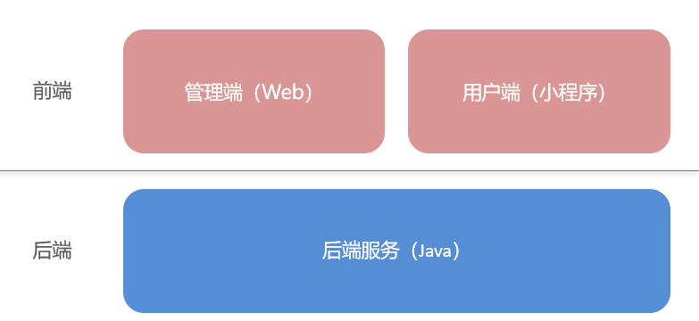

## 数据库

使用idea,导入sql初始化脚本,排列译码规则选择utf8_4bin

## 前端

已经写好,直接打开nginx

## 后端

**分3个模块**


### sky-common

存放公共类,给其他模块使用

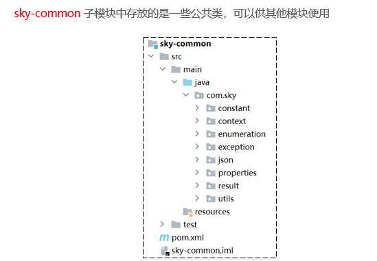

### sky-pojo

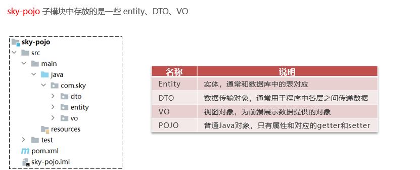

### sky-server


## 前后端测试


## nginx的反向代理和负载均衡

### 反向代理

转发

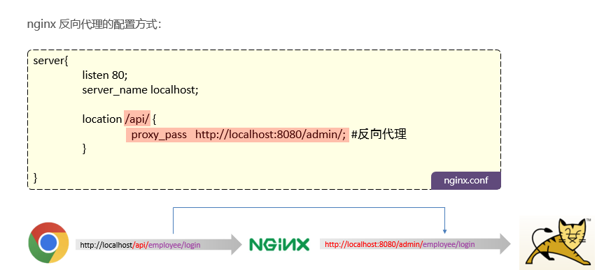

### 负载均衡


## 接口文档

### 设计阶段的,使用apifox

直接导入产品经理写的json格式的YApi

### 开发测试阶段,使用Swagger

使用Swagger你只需要按照它的规范去定义接口及接口相关的信息，就可以做到生成接口文档，以及在线接口调试页面。

官网：https://swagger.io/

#### Knife4j

为Java MVC框架集成Swagger生成Api文档的增强解决方案。

```
<dependency>
            <groupId>com.github.xiaoymin</groupId>
            <artifactId>knife4j-spring-boot-starter</artifactId>
            <version>3.0.2</version>
</dependency>

```

#### 配置类中加入的相关配置

**扫描com.sky.controller下的所有类,将接口信息进行展示**

```
/**
	 * 通过knife4j生成接口文档
	 *
	 * @return
	 */
	@Bean
	public Docket docket() {
		log.info("开始生成接口文档");
		ApiInfo apiInfo = new ApiInfoBuilder()
				.title("苍穹外卖项目接口文档")
				.version("2.0")
				.description("苍穹外卖项目接口文档")
				.build();
		Docket docket = new Docket(DocumentationType.SWAGGER_2)
				.apiInfo(apiInfo)
				.select()
				.apis(RequestHandlerSelectors.basePackage("com.sky.controller"))
				.paths(PathSelectors.any())
				.build();
		return docket;
	}
```


使用注解,就可以在页面上展示对应的注释信息

#### 在配置类中设置静态资源

只有设置了这个,才能在localhost:8080/doc.html处查看到对应的接口文档内容

```
/**
	 * 设置静态资源映射
	 *
	 * @param registry
	 */
	protected void addResourceHandlers(ResourceHandlerRegistry registry) {
		log.info("开始设置静态资源映射");
		registry.addResourceHandler("/doc.html").addResourceLocations("classpath:/META-INF/resources/");
		registry.addResourceHandler("/webjars/**").addResourceLocations("classpath:/META-INF/resources/webjars/");
	}
```

# 开发接口并测试

## 员工

### 添加员工

#### 开发

还是老三样,三层架构

```
@RequestMapping("/admin/employee")
	@PostMapping
	@ApiOperation("添加员工")
	public Result<String> add(@RequestBody EmployeeDTO employeeDTO) {
		log.info("新增员工，员工数据：{}", employeeDTO);
		employeeService.add(employeeDTO);
		return Result.success();
	}
```

```
	@Autowired
	private HttpServletRequest request;
	@Autowired
	private JwtProperties jwtProperties;
@Override
	public void add(EmployeeDTO employeeDTO) {
		Employee employee = new Employee();
		//对象属性拷贝
		BeanUtils.copyProperties(employeeDTO, employee);
		//依赖注入的request 对象
		String token = request.getHeader(jwtProperties.getAdminTokenName());
		//通过密钥进行解密得到键值对MAP claims,其中就含有键为empId的键值对,这就取出了id
		Claims claims = JwtUtil.parseJWT(jwtProperties.getAdminSecretKey(), token);
		Long empId = Long.valueOf(claims.get(JwtClaimsConstant.EMP_ID).toString());
		
		//设置账号的状态，默认正常状态 1表示正常 0表示锁定
		employee.setStatus(StatusConstant.ENABLE);
		employee.setCreateTime(LocalDateTime.now());
		employee.setUpdateTime(LocalDateTime.now());
		
		//设置创建人和更新人id
		employee.setCreateUser(empId);
		employee.setUpdateUser(empId);
		
		//设置默认密码 123456,使用MD5进行加密
		//使用常量封装,便于整体维护
		employee.setPassword(DigestUtils.md5DigestAsHex(PasswordConstant.DEFAULT_PASSWORD.getBytes()));
		
		employeeMapper.add(employee);
	}
```

```
	/**
	 * 插入员工数据
	 *
	 * @param employee
	 */
	@Insert("insert into employee (username, name, password, phone, sex, id_number, status, create_time, update_time, create_user, update_user) " +
			"values (#{username}, #{name}, #{password}, #{phone}, #{sex}, #{idNumber}, #{status}, #{createTime}, #{updateTime}, #{createUser}, #{updateUser})")
	void add(Employee employee);
```


#### 测试

由于前端可能还没有开发好,可以使用上面生成的接口文档地址localhost:8080/doc.html,去进行调试

第一次发送发现无法测试

是由于请求头并没有还有jwt令牌,导致被拦截了,一般是在登录的时候获取的

可以在统一设定处进行设定,**设定好记得刷新一下**

而这个token就是登录时返回的

参数名称是由我们后端的参数设定决定的

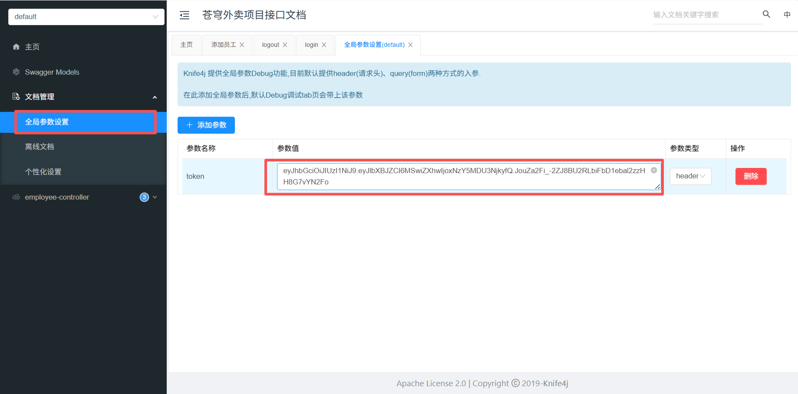

#### 代码完善

##### 需要捕获异常信息src/main/java/com/sky/handler/GlobalExceptionHandler.java

```
@ExceptionHandler
	public Result exceptionHandler(SQLIntegrityConstraintViolationException ex) {
		log.error("异常信息：{}", ex.getMessage());
		//这是编译器抛出的异常信息
		//Duplicate entry '2222' for key 'employee.idx_username'
		if (ex.getMessage().contains("Duplicate entry")) {
			String[] split = ex.getMessage().split(" ");
			String msg = split[2] + MessageConstant.ALREADY_EXIST;
			return Result.error(msg);
		}
		return Result.error(MessageConstant.UNKNOWN_ERROR);
	}
```

##### 需要获取登录用户id

提供登录后生成的JWT令牌获取,登陆后的每次请求都会携带JWT令牌

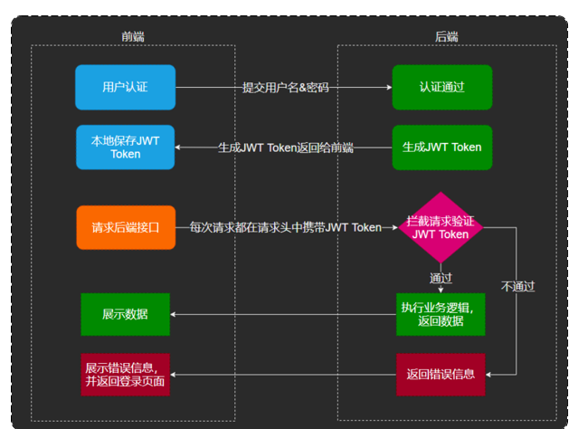

我们要做的就是从请求头中获取到jwt令牌中携带的id信息

```
	@Autowired
	private HttpServletRequest request;
	@Autowired
	private JwtProperties jwtProperties;
@Override
	public void add(EmployeeDTO employeeDTO) {
		Employee employee = new Employee();
		//对象属性拷贝
		BeanUtils.copyProperties(employeeDTO, employee);
		//依赖注入的request 对象
		String token = request.getHeader(jwtProperties.getAdminTokenName());
		//通过密钥进行解密得到键值对MAP claims,其中就含有键为empId的键值对,这就取出了id
		Claims claims = JwtUtil.parseJWT(jwtProperties.getAdminSecretKey(), token);
		Long empId = Long.valueOf(claims.get(JwtClaimsConstant.EMP_ID).toString());
		
		//设置账号的状态，默认正常状态 1表示正常 0表示锁定
		employee.setStatus(StatusConstant.ENABLE);
		employee.setCreateTime(LocalDateTime.now());
		employee.setUpdateTime(LocalDateTime.now());
		
		//设置创建人和更新人id
		employee.setCreateUser(empId);
		employee.setUpdateUser(empId);
		
		//设置默认密码 123456,使用MD5进行加密
		//使用常量封装,便于整体维护
		employee.setPassword(DigestUtils.md5DigestAsHex(PasswordConstant.DEFAULT_PASSWORD.getBytes()));
		
		employeeMapper.add(employee);
	}
```

**但是,在拦截器的时候,其实已经解析过了!这样要重新获取和解析,非常麻烦**

**引出新的技术ThreadLocal,在同一个线程中,都有一个单独的存储空间**

**而浏览器发起的每次后端请求,都是单独的一个线程,跑在tomcat中,这样我们就可以在拦截器的时候把id存在存储空间中,这样再在添加的时候拿取就好**


```
public class BaseContext {

    public static ThreadLocal<Long> threadLocal = new ThreadLocal<>();

    public static void setCurrentId(Long id) {
        threadLocal.set(id);
    }

    public static Long getCurrentId() {
        return threadLocal.get();
    }

    public static void removeCurrentId() {
        threadLocal.remove();
    }

}
```

在拦截器的位置设置

```
		//2、校验令牌
		try {
			log.info("jwt校验:{}", token);
			Claims claims = JwtUtil.parseJWT(jwtProperties.getAdminSecretKey(), token);
			Long empId = Long.valueOf(claims.get(JwtClaimsConstant.EMP_ID).toString());
			log.info("当前员工id：", empId);
			BaseContext.setCurrentId(empId);
```

```
//使用ThreadLoacl中的get方法获取当前登录用户的id
		//这个在拦截器的时候就已经存储好了
		Long empId = BaseContext.getCurrentId();
```

### 员工分页展示

使用pageHelper插件

```
<dependency>
    <groupId>com.github.pagehelper</groupId>
    <artifactId>pagehelper-spring-boot-starter</artifactId>
</dependency>
```

**controller**

```
	@GetMapping("/page")
	@ApiOperation("分页查询员工")
	public Result<PageResult> page(EmployeePageQueryDTO employeePageQuery) {
		log.info("分页查询员工:{}", employeePageQuery);
		PageResult pageResult = employeeService.page(employeePageQuery);
		return Result.success(pageResult);
	}
```

**service**

```
	public PageResult page(EmployeePageQueryDTO employeePageQuery) {
		PageHelper.startPage(employeePageQuery.getPage(), employeePageQuery.getPageSize());
		Page<Employee> page = employeeMapper.page(employeePageQuery);
		return new PageResult((long) page.getTotal(), page.getResult());
	}
```

**mapper**,xml

```
	Page<Employee> page(EmployeePageQueryDTO employeePageQuery);

<select id="page" resultType="com.sky.entity.Employee">
        select * from employee
        <where>
            <if test="name != null and name != ''">
                and name like concat('%',#{name},'%')
            </if>
        </where>
        order by create_time desc
    </select>
```

### 时间格式化配置

```
@Configuration
@Slf4j
public class WebMvcConfiguration extends WebMvcConfigurationSupport {
	/**
	 * 扩展mvc框架的消息转换器
	 */
	protected void extendMessageConverters(List<HttpMessageConverter<?>> converters) {
		log.info("扩展消息转换器...");
		//创建消息转换器对象
		MappingJackson2HttpMessageConverter messageConverter = new MappingJackson2HttpMessageConverter();
		//设置对象转换器，底层使用Jackson将Java对象转为json
		messageConverter.setObjectMapper(new JacksonObjectMapper());
		//将上面的消息转换器对象追加到mvc框架的转换器集合中
		converters.add(0, messageConverter);
	}
}
```

```
/**
 * 对象映射器:基于jackson将Java对象转为json，或者将json转为Java对象
 * 将JSON解析为Java对象的过程称为 [从JSON反序列化Java对象]
 * 从Java对象生成JSON的过程称为 [序列化Java对象到JSON]
 */
public class JacksonObjectMapper extends ObjectMapper {

    public static final String DEFAULT_DATE_FORMAT = "yyyy-MM-dd";
    //public static final String DEFAULT_DATE_TIME_FORMAT = "yyyy-MM-dd HH:mm:ss";
    public static final String DEFAULT_DATE_TIME_FORMAT = "yyyy-MM-dd HH:mm";
    public static final String DEFAULT_TIME_FORMAT = "HH:mm:ss";

    public JacksonObjectMapper() {
        super();
        //收到未知属性时不报异常
        this.configure(FAIL_ON_UNKNOWN_PROPERTIES, false);

        //反序列化时，属性不存在的兼容处理
        this.getDeserializationConfig().withoutFeatures(DeserializationFeature.FAIL_ON_UNKNOWN_PROPERTIES);

        SimpleModule simpleModule = new SimpleModule()
                .addDeserializer(LocalDateTime.class, new LocalDateTimeDeserializer(DateTimeFormatter.ofPattern(DEFAULT_DATE_TIME_FORMAT)))
                .addDeserializer(LocalDate.class, new LocalDateDeserializer(DateTimeFormatter.ofPattern(DEFAULT_DATE_FORMAT)))
                .addDeserializer(LocalTime.class, new LocalTimeDeserializer(DateTimeFormatter.ofPattern(DEFAULT_TIME_FORMAT)))
                .addSerializer(LocalDateTime.class, new LocalDateTimeSerializer(DateTimeFormatter.ofPattern(DEFAULT_DATE_TIME_FORMAT)))
                .addSerializer(LocalDate.class, new LocalDateSerializer(DateTimeFormatter.ofPattern(DEFAULT_DATE_FORMAT)))
                .addSerializer(LocalTime.class, new LocalTimeSerializer(DateTimeFormatter.ofPattern(DEFAULT_TIME_FORMAT)));

        //注册功能模块 例如，可以添加自定义序列化器和反序列化器
        this.registerModule(simpleModule);
    }
}
```


### 员工状态启用禁用和员工信息编辑

```
@PostMapping("/status/{status}")
	@ApiOperation("员工状态禁用/启用")
	public Result startOrStop(@PathVariable Integer status, Long id) {
		log.info("员工状态禁用/启用：{}", status);
		employeeService.startOrStop(status, id);
		return Result.success();
	}
	
	@GetMapping("/{id}")
	@ApiOperation("查询员工信息")
	public Result<Employee> getById(@PathVariable Long id) {
		log.info("查询员工信息：{}", id);
		Employee employee = employeeService.getById(id);
		return Result.success(employee);
	}
	
	@PutMapping
	@ApiOperation("编辑员工信息")
	public Result update(@RequestBody EmployeeDTO employeeDTO) {
		log.info("编辑员工信息：{}", employeeDTO);
		employeeService.update(employeeDTO);
		return Result.success();
	}
```

```
	@Override
	public void startOrStop(Integer status, Long id) {
		//使用builder进行构建对象,前提是该类有Builder注解
		//且注意,这个构建是构建一个新的,而不能在原有基础去修改
		Employee employee = Employee.builder()
				.status(status)
				.id(id)
				.updateTime(LocalDateTime.now())
				.updateUser(BaseContext.getCurrentId())
				.build();
		employeeMapper.update(employee);
	}
	
	@Override
	public Employee getById(Long id) {
		Employee employee = employeeMapper.getById(id);
		return employee;
	}
	
	@Override
	public void update(EmployeeDTO employeeDTO) {
		Employee employee = new Employee();
		//使用工具类将employeeDTO中的属性拷贝到employee中
		BeanUtils.copyProperties(employeeDTO, employee);
		employee.setUpdateUser(BaseContext.getCurrentId());
		employee.setUpdateTime(LocalDateTime.now());
		//重复调用update的xml文件去操作
		employeeMapper.update(employee);
	}
```

```
	void update(Employee employee);
	
	@Select("select * from employee where id = #{id}")
	Employee getById(Long id);
	
	
	<update id="update">
        update employee
        <set>
            <if test="name != null">name = #{name},</if>
            <if test="username != null">username = #{username},</if>
            <if test="password != null">password = #{password},</if>
            <if test="phone != null">phone = #{phone},</if>
            <if test="sex != null">sex = #{sex},</if>
            <if test="idNumber != null">id_number = #{idNumber},</if>
            <if test="status != null">status = #{status},</if>
            <if test="updateTime != null">update_time = #{updateTime},</if>
            <if test="updateUser != null">update_user = #{updateUser},</if>
            <if test="createTime != null">create_time = #{createTime},</if>
            <if test="createUser != null">create_user = #{createUser},</if>
        </set>
        where id = #{id}
    </update>
```

### 为公共字段统一赋值--AOP切面编程

切面知识详见javaWeb

#### 问题

在每次update和insert操作前都要为操作时间操作人,进行赋值,非常的冗余,可以通过切面编程,实现统一赋值

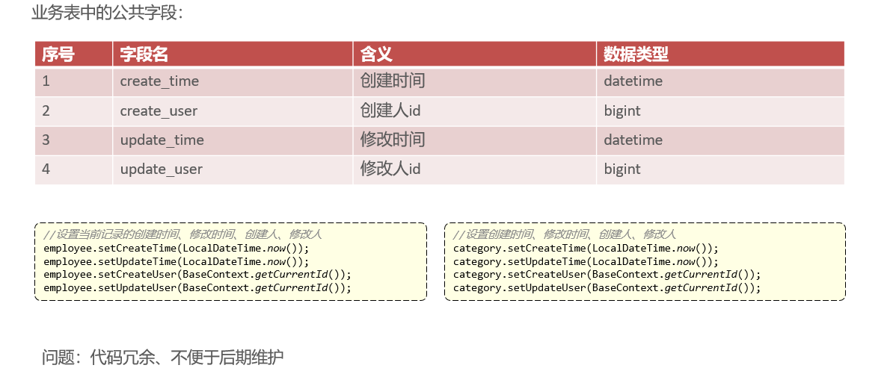

#### 解决

**三步走**


##### **注解annotion**

```
public enum OperationType {

    UPDATE,
    INSERT

}
```

```
@Retention(RetentionPolicy.RUNTIME)
@Target(ElementType.METHOD)
public @interface AutoFill {
	
	//OperationType是Insert或者Update的枚举
	OperationType value();
}
```

##### **切面类**

通过切入点获取,方法签名进而获取到注解的update或者insert

通过切入点获取对应的参数,需要固定被赋值对象在参数的同一个位置,这样统一获取到对象

通过反射,获取到对象中对应的方法,并将需要赋的操作人,操作时间赋值上去

实现统一的公共字段赋值

```
//定义切面,实现公共字段自动填充
@Aspect
@Component
@Slf4j
public class AutoFillAspect {
	
	//切入点
	@Pointcut("execution(* com.sky.mapper.*.*(..)) && @annotation(com.sky.annotation.AutoFill)")
	public void autoFillPointFill() {
	}
	
	//前置通知
	@Before("autoFillPointFill()")
	public void autoFill(JoinPoint joinPoint) {
		log.info("开始进行公共字段填充");
		//先获取当前拦截的方法上的数据库操作类型:update,insert
		MethodSignature signature = (MethodSignature) joinPoint.getSignature();//方法签名对象
		AutoFill autoFill = signature.getMethod().getAnnotation(AutoFill.class);
		OperationType operationType = autoFill.value();
		
		//获取被拦截方法的参数--实体对象
		Object[] args = joinPoint.getArgs();
		if (args == null || args.length == 0) {
			return;
		}
		//默认需要把对象参数放在方法第一位
		Object entity = args[0];
		//获取需要自动填充的字段的值
		LocalDateTime now = LocalDateTime.now();
		Long currentId = BaseContext.getCurrentId();
		//根据当前不同的操作类型.为对应的属性赋值(反射的方式)
		if (operationType == OperationType.INSERT) {
			log.info("开始进行插入操作的字段填充");
			//为4个公共字段赋值,通过invoke反射来给拦截的对象赋值
			try {
				entity.getClass().getDeclaredMethod(AutoFillConstant.SET_CREATE_TIME, LocalDateTime.class).invoke(entity, now);
				entity.getClass().getDeclaredMethod(AutoFillConstant.SET_UPDATE_TIME, LocalDateTime.class).invoke(entity, now);
				entity.getClass().getDeclaredMethod(AutoFillConstant.SET_CREATE_USER, Long.class).invoke(entity, currentId);
				entity.getClass().getDeclaredMethod(AutoFillConstant.SET_UPDATE_USER, Long.class).invoke(entity, currentId);
			} catch (Exception e) {
				throw new RuntimeException(e);
			}
			
		} else if (operationType == OperationType.UPDATE) {
			log.info("开始进行更新操作的字段填充");
			try {
				entity.getClass().getDeclaredMethod(AutoFillConstant.SET_UPDATE_TIME, LocalDateTime.class).invoke(entity, now);
				entity.getClass().getDeclaredMethod(AutoFillConstant.SET_UPDATE_USER, Long.class).invoke(entity, currentId);
			} catch (Exception e) {
				throw new RuntimeException(e);
			}
		}
	}
	
}
```

##### 为需要统一字段的方法加上注解

例如,mapper接口中的add和update方法,包括员工和分离表单等等

```
@AutoFill(value = OperationType.INSERT)
	void add(Employee employee);
	
```

**最后将之前在Service端中对这些操作人操作时间等等的赋值删去**

## 菜品

### 图片上传

**使用阿里云oss**

```
@RestController
@Slf4j
@RequestMapping("/admin/common")
@Api(tags = "通用接口")
public class CommonController {
	@Autowired
	private AliOssUtil aliOssUtil;
	
	@PostMapping("/upload")
	@ApiOperation("文件上传")
	public Result<String> upload(MultipartFile file) {
		log.info("文件上传：{}", file);
		//原始名字
		String originalFilename = file.getOriginalFilename();
		String extension = originalFilename.substring(originalFilename.lastIndexOf("."));
		
		//将文件上传到阿里云
		String fileName = UUID.randomUUID().toString() + extension;
		
		try {
			String path = aliOssUtil.upload(file.getBytes(), file.getOriginalFilename());
			return Result.success(path);
		} catch (IOException e) {
			log.info("文件上传失败", e.getMessage());
		}
		return Result.error(MessageConstant.UPLOAD_FAILED);
	}
}
```

阿里云的配置

**注入对象参数**

```
@Configuration
@Slf4j
public class OssConfiguration {
	/**
	 * 配置阿里云OSS对象存储
	 */
	@Bean
	@ConditionalOnMissingBean
	public AliOssUtil aliOssUtil(AliOssProperties aliOssProperties) {
		log.info("开始创建阿里云OSS客户端对象：{}", aliOssProperties);
		return new AliOssUtil(aliOssProperties.getEndpoint(),
				aliOssProperties.getAccessKeyId(),
				aliOssProperties.getAccessKeySecret(),
				aliOssProperties.getBucketName());
	}
}
```


### 表的联动--新增or修改or删除菜品

一个菜品包含了多个口味,所以在每次新增或者修改菜品时,需要同时更新口味表


**比如在新增时**

```
	@Override
	public void add(DishDTO dishDTO) {
		Dish dish = new Dish();
		BeanUtils.copyProperties(dishDTO, dish);
		DishMapper.add(dish);
		//获取菜品的主键值
		Long dishId = dish.getId();
		//将口味数据批量插入
		List<DishFlavor> flavors = dishDTO.getFlavors();
		if (flavors != null && flavors.size() > 0) {
			//向口味表dish_flavor插入n条
			flavors.forEach(dishFlavor -> {
				dishFlavor.setDishId(dishId);
			});
			//批量插入
			dishFlavorMapper.insertBatch(flavors);
		}
		
	}
```

```
	@AutoFill(value = OperationType.INSERT)
	//由于我们要使用到id,所以要回传数据库生成的主键id给对象dish,就要用mybatis
	void add(Dish dish);
	
<!--此处要回传数据库生成的主键id给对象dish,所以用useGeneratedKeys="true" keyProperty="id"-->
    <insert id="add" useGeneratedKeys="true" keyProperty="id">
        insert into dish (name, category_id, price, image, description, status, create_time, update_time, create_user,
                          update_user)
        values (#{name}, #{categoryId}, #{price}, #{image}, #{description}, #{status}, #{createTime}, #{updateTime},
                #{createUser}, #{updateUser})
    </insert>
```

**在更新的时候,包括了修改时的回显,即根据id查询**

可以看到查询的时候,也需要根据dishid查到对应有什么口味

```
	@Override
	public DishVO getByIdWithFlavors(Long id) {
		DishVO dishVO = DishMapper.getByIdWithFlavors(id);
		dishVO.setFlavors(dishFlavorMapper.getByDishId(id));
		return dishVO;
	}
```

```
	@Override
	public void update(DishDTO dishDTO) {
		Dish dish = new Dish();
		BeanUtils.copyProperties(dishDTO, dish);
		DishMapper.update(dish);
		//遍历DTO中的口味数据,将其更新到口味表中
		List<DishFlavor> flavors = dishDTO.getFlavors();
		if (flavors != null && flavors.size() > 0) {
			//删除原有的口味数据
			dishFlavorMapper.deleteByDishId(dishDTO.getId());
			//批量插入新的口味数据
			flavors.forEach(dishFlavor -> {
				dishFlavor.setDishId(dishDTO.getId());
			});
			dishFlavorMapper.insertBatch(flavors);
		}
	}
```

**删除时同理**

```
	@Override
	//在删除菜品之前，需要先删除菜品表中的口味数据，再删除菜品数据
	public void delete(List<Long> ids) {
		dishFlavorMapper.deleteByDishIds(ids);
		DishMapper.delete(ids);
	}
```

## 套餐

### 业务分析

有4个关联的表

套餐表:对应有套餐分类,套餐的名称

菜品表:一个套餐有多个菜品,一个菜品也可能存在多个套餐,多对多的关系,使用setmeal_dish,这个中间表维护

使用DTO接收参数

VO去展现给前端

技术点与上面类似


### 左连接的使用,分页展示,对应的套餐类名称,怎么直接通过后端显示,而不是前端保存

将套餐表和分类表进行左连接!

菜品名称以及对应的菜品分类也是如此

```
<select id="page" resultType="com.sky.vo.SetmealVO">
        # 选择套餐表的所有,以及将分类表的name命名为categoryName(VO中的属性名)----->进行返回
        #左连接是保存左的所有,并将右的符合条件的返回
        select
        s.*,c.name categoryName
        # 左连接并取别名
        from
        setmeal s
        left join
        category c
        # 在套餐表和分类表的id相等
        on
        s.category_id = c.id
        <where>
            <if test="name != null">
                and s.name like concat('%',#{name},'%')
            </if>
            <if test="status != null">
                and s.status = #{status}
            </if>
            <if test="categoryId != null">
                and s.category_id = #{categoryId}
            </if>
        </where>
        order by s.create_time desc
    </select>
```

# Redis

**对Mysql的补充**

Mysql是在 **磁盘存储** ,而Redis是在 **内存** 存储,所以应用场景就在于需要快速浏览,多人访问

## Redis入门

### 开启Redis

使用Redis Desktop客户端来连接对应的Redis服务端,密码存储在Redis-Windos.config中,requirepass那里

在对应按照目录使用如下命令,加载配置并启动redis

```
redis-server.exe redis.windows.conf
```


### 存储模式<String,Object>,key-value

**Object主要有5种**

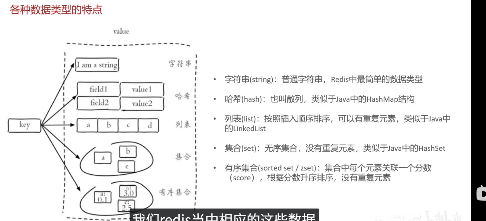

Map使用存储对象

list适合需要有顺序的,比如谁先点餐

无序set适用于需要不重复的,也可以用于找交集

### 操作命令

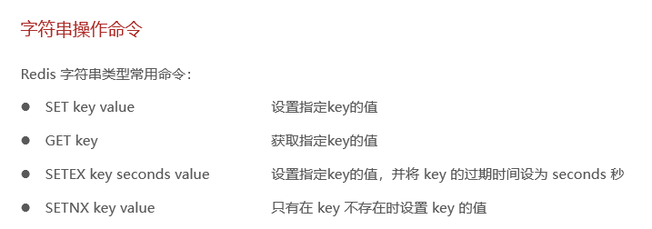

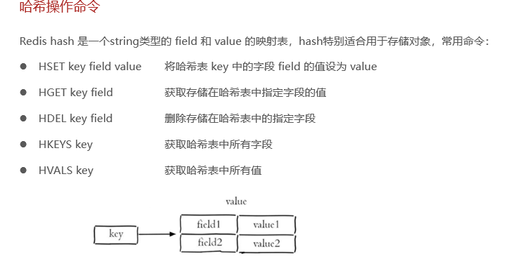

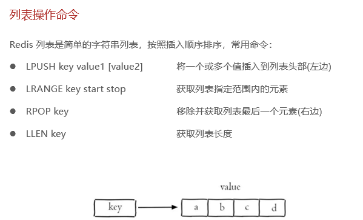

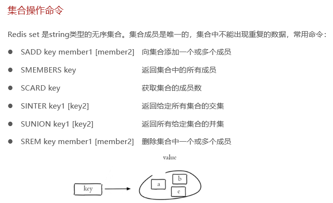

这里的abc是同级的

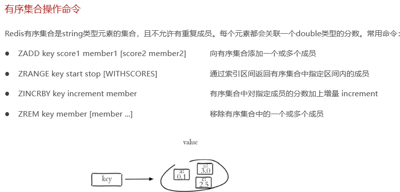

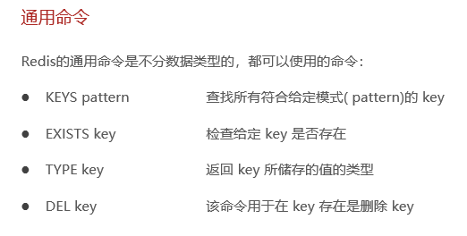

## 在idea中使用Redis--Spring Data Redis 

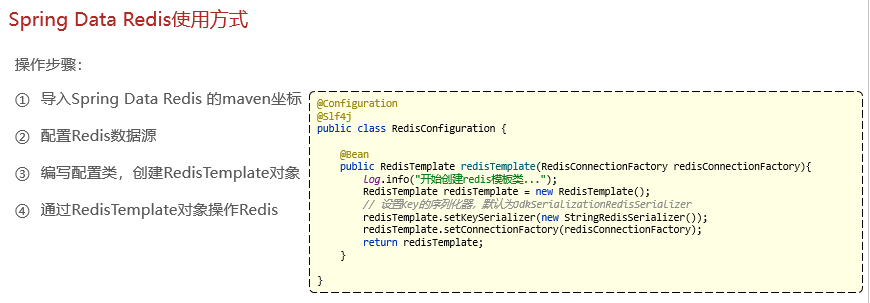

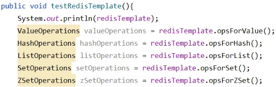

```
package com.sky.test;

import org.junit.jupiter.api.Test;
import org.springframework.beans.factory.annotation.Autowired;
import org.springframework.boot.test.context.SpringBootTest;
import org.springframework.data.redis.connection.DataType;
import org.springframework.data.redis.core.*;

import java.util.Set;
import java.util.concurrent.TimeUnit;

@SpringBootTest
public class SpringDataRedisTest {
	@Autowired
	private RedisTemplate redisTemplate;
	
	@Test
	public void testRedis() {
		redisTemplate.opsForValue().set("nh", "zhangsan");
		System.out.println(redisTemplate.opsForValue().get("name"));
	}
	
	@Test
	public void testString() {
		redisTemplate.opsForValue().set("name", "zhangsan");
		String name = (String) redisTemplate.opsForValue().get("name");
		System.out.println(name);
		redisTemplate.opsForValue().set("age", 18, 60, TimeUnit.MINUTES);
	}
	
	@Test
	public void testList() {
		ListOperations listOperations = redisTemplate.opsForList();
		listOperations.leftPushAll("list", "zhangsan", "lisi", "wangwu");
		redisTemplate.opsForList().leftPush("list", "a");
		redisTemplate.opsForList().leftPush("list", "b");
		redisTemplate.opsForList().leftPush("list", "c");
		redisTemplate.opsForList().leftPush("list", "d");
		System.out.println(redisTemplate.opsForList().size("list"));
		System.out.println(redisTemplate.opsForList().index("list", 0));
		System.out.println(redisTemplate.opsForList().range("list", 0, -1));
		listOperations.rightPop("list");
	}
	
	@Test
	public void testSet() {
		SetOperations setOperations = redisTemplate.opsForSet();
		redisTemplate.opsForSet().add("set", "a");
		redisTemplate.opsForSet().add("set", "b");
		redisTemplate.opsForSet().add("set2", "c");
		redisTemplate.opsForSet().add("set2", "d");
		System.out.println(setOperations.size("set"));
		System.out.println(setOperations.union("set", "set2"));
		setOperations.remove("set", "a");
		System.out.println(redisTemplate.opsForSet().size("set"));
	}
	
	@Test
	public void testHash() {
		HashOperations hashOperations = redisTemplate.opsForHash();
		hashOperations.put("hash", "name", "zhangsan");
		hashOperations.put("hash", "age", 18);
		System.out.println(redisTemplate.opsForHash().get("hash", "name"));
		
		System.out.println(hashOperations.values("hash"));
		
		hashOperations.delete("hash", "name");
	}
	
	@Test
	public void testZSet() {
		ZSetOperations zSetOperations = redisTemplate.opsForZSet();
		zSetOperations.add("zset", "a", 1);
		zSetOperations.add("zset", "b", 2);
		zSetOperations.add("zset", "c", 3);
		Set zet1 = zSetOperations.range("zset", 0, -1);
		System.out.println(zet1);
		
		zSetOperations.incrementScore("zset", "a", 11);
		Set zet2 = zSetOperations.range("zset", 0, -1);
		zSetOperations.remove("zset", "a");
		
	}
	
	@Test
	public void testCommon() {
		Set keys = redisTemplate.keys("*");
		System.out.println(keys);
		
		Boolean name = redisTemplate.hasKey("name");
		Boolean set1 = redisTemplate.hasKey("set");
		
		for (Object key : keys) {
			DataType type = redisTemplate.type(key);
			System.out.println(key + ":" + type);
		}
		redisTemplate.delete("name");
	}
	
}

```

## 实战,使用Redis管理营业状态

### 管理端

**controller同名问题**

**注意同样的Controller要在RestController处标记**

```
@RestController("adminShopController")
@RequestMapping("/admin/shop")
@Slf4j
@Api(tags = "店铺相关接口")
public class ShopController {
	public static final String KEY = "SHOP_STATUS";
	@Autowired
	private RedisTemplate redisTemplate;
	
	/**
	 * 设置店铺的营业状态
	 *
	 * @param status
	 * @return
	 */
	@PutMapping("/{status}")
	@ApiOperation("设置店铺营业状态")
	public Result<String> setStatus( @PathVariable Integer status) {
		log.info("设置店铺状态:{}", status == 1 ? "营业中" : "打烊中");
		//直接操作Redis
		redisTemplate.opsForValue().set(KEY, status);
		return Result.success();
	}
	
	/**
	 * 获取店铺的营业状态
	 *
	 * @return
	 */
	@GetMapping("/status")
	@ApiOperation("获取店铺营业状态")
	public Result<Integer> getStatus() {
		log.info("获取店铺营业状态");
		//直接操作Redis
		Integer status = (Integer) redisTemplate.opsForValue().get(KEY);
		return Result.success(status);
	}
	
}


```

### 用户端

```
@RestController("userShopController")
@RequestMapping("/user/shop")
@Slf4j
@Api(tags = "C端-店铺相关接口")
public class ShopController {
	public static final String KEY = "SHOP_STATUS";
	@Autowired
	private RedisTemplate redisTemplate;
	
	/**
	 * 查询店铺的营业状态
	 *
	 * @return
	 */
	@GetMapping("/status")
	@ApiOperation("查询店铺的营业状态")
	public Result<Integer> getStatus() {
		Integer status = (Integer) redisTemplate.opsForValue().get(KEY);
		log.info("查询店铺的营业状态为:{}", status == 1 ? "营业中" : "打烊中");
		return Result.success(1);
	}
}

```

# 微信登录-HTTP请求

需要引入坐标

```
package com.sky.test;

import org.apache.http.HttpEntity;
import org.apache.http.client.methods.CloseableHttpResponse;
import org.apache.http.client.methods.HttpGet;
import org.apache.http.client.methods.HttpPost;
import org.apache.http.entity.StringEntity;
import org.apache.http.impl.client.CloseableHttpClient;
import org.apache.http.impl.client.HttpClients;
import org.apache.http.util.EntityUtils;
import org.json.JSONException;
import org.json.JSONObject;
import org.junit.jupiter.api.Test;
import org.springframework.boot.test.context.SpringBootTest;

import java.io.IOException;

@SpringBootTest
public class HttpClientRequestTest {
    @Test
    public void test() throws IOException {
       //进行http请求
//     创建httpclient对象
       
       CloseableHttpClient httpClient = HttpClients.createDefault();
       //创建请求对象
       HttpGet httpGet = new HttpGet("http://localhost:8080/user/shop/status");
       CloseableHttpResponse response = httpClient.execute(httpGet);
       
       //获取服务端返回的状态码
       int statusCode = response.getStatusLine().getStatusCode();
       System.out.println(statusCode);
       if (statusCode == 200) {
          //获取服务端返回的响应内容
          HttpEntity entity = response.getEntity();
          String content = EntityUtils.toString(entity, "UTF-8");
          System.out.println(content);
       }
       response.close();
       httpClient.close();
    }
    
    @Test
    public void testPost() throws IOException, JSONException {
       CloseableHttpClient httpClient = HttpClients.createDefault();
       HttpPost httpPost = new HttpPost("http://localhost:8080/admin/employee/login");
       
       JSONObject json = new JSONObject();
       json.put("username", "admin");
       json.put("password", "123456");
       
       StringEntity entity = new StringEntity(json.toString(), "UTF-8");
       
       //指定请求编码
       entity.setContentEncoding("utf-8");
       //指定数据类型
       entity.setContentType("application/json");
       httpPost.setEntity(entity);
       
       //发送
       CloseableHttpResponse response = httpClient.execute(httpPost);
       
       //解析
       int statusCode = response.getStatusLine().getStatusCode();
       System.out.println(statusCode);
       if (statusCode == 200) {
          HttpEntity entity1 = response.getEntity();
          String content = EntityUtils.toString(entity1, "UTF-8");
          System.out.println(content);
       }
       response.close();
       httpClient.close();
    }
}
```

## 登录流程

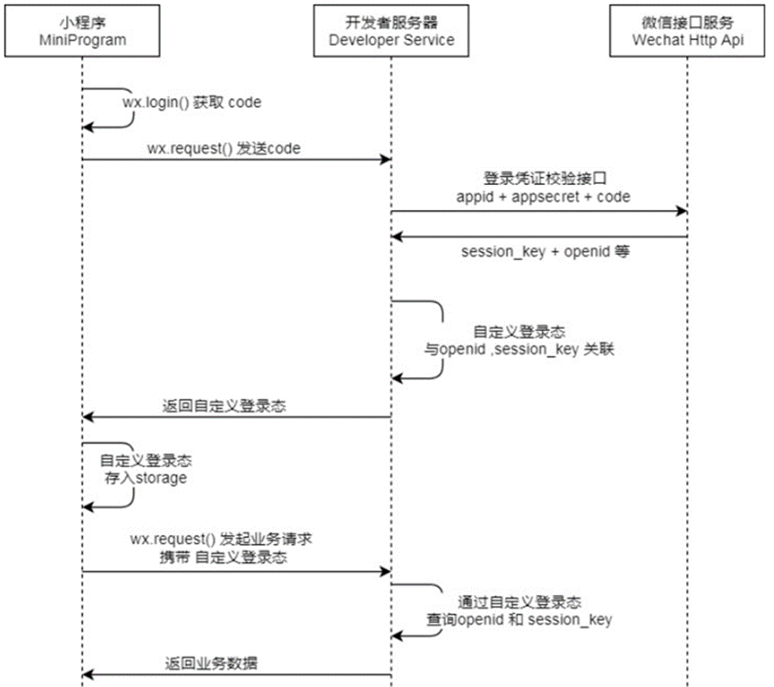

**配置项目**

注意重要的配置是在application.yml中去书写

```
@Component
@ConfigurationProperties(prefix = "sky.jwt")
@Data
public class JwtProperties {
    /**
     * 用户端微信用户生成jwt令牌相关配置
     */
    private String userSecretKey;
    private long userTtl;
    private String userTokenName;
}
```

**拦截器**

**config**

```
registry.addInterceptor(jwtTokenUserInterceptor)
       .addPathPatterns("/user/**")
       .excludePathPatterns("/user/user/login")
       .excludePathPatterns("/user/shop/status");
```

```
@Component
public class JwtTokenUserInterceptor implements HandlerInterceptor {
	@Autowired
	private JwtProperties jwtProperties;
	
	public boolean preHandle(HttpServletRequest request, HttpServletResponse response, Object handler) throws Exception {
		String token = request.getHeader(jwtProperties.getUserTokenName());
		
		try {
			Claims claims = JwtUtil.parseJWT(jwtProperties.getUserSecretKey(), token);
			Long userId = Long.valueOf(claims.get(JwtClaimsConstant.USER_ID).toString());
			BaseContext.setCurrentId(userId);
			return true;
		} catch (Exception e) {
			response.setStatus(401);
			return false;
		}
	}
	
}
```

Controller

```
@RestController
@RequestMapping("/user/user")
@Slf4j
@Api(tags = "C端用户相关接口")
public class UserController {
	@Autowired
	private UserService userService;
	@Autowired
	JwtProperties jwtProperties;
	
	/**
	 * 微信登录
	 */
	@PostMapping("/login")
	@ApiOperation("微信登录")
	public Result<UserLoginVO> login(@RequestBody UserLoginDTO userLoginDTO) {
		log.info("微信登录,授权码：{}", userLoginDTO.getCode());
		User user = userService.wxLogin(userLoginDTO);
		
		Map claims = new HashMap();
		claims.put(JwtClaimsConstant.USER_ID, user.getId());
		String token = JwtUtil.createJWT(
				jwtProperties.getUserSecretKey(),
				jwtProperties.getUserTtl(),
				claims);
		
		UserLoginVO userLoginVO = UserLoginVO.builder()
				.id(user.getId())
				.openid(user.getOpenid())
				.token(token)
				.build();
		
		return Result.success(userLoginVO);
	}
}
```

Service

```
public static final String WX_LOGIN = "https://api.weixin.qq.com/sns/jscode2session";
@Autowired
private UserMapper userMapper;
@Autowired
private WeChatProperties weChatProperties;

@Override
public User wxLogin(UserLoginDTO userLoginDTO) {
    String code = userLoginDTO.getCode();
    String openid = getOpenid(code);
    if (openid == null) {
       throw new LoginFailedException(MessageConstant.LOGIN_FAILED);
    }
    
    User user = userMapper.getByOpenid(openid);
    if (user == null) {
       user = User.builder()
             .openid(openid)
             .createTime(LocalDateTime.now())
             .build();
       userMapper.insert(user);
    }
    return user;
}

private String getOpenid(String code) {
    Map map = new HashMap();
    map.put("appid", weChatProperties.getAppid());
    log.info("微信登录，appid：{}", weChatProperties.getAppid());
    map.put("secret", weChatProperties.getSecret());
    log.info("微信登录，secret：{}", weChatProperties.getSecret());
    map.put("js_code", code);
    log.info("微信登录，code：{}", code);
    map.put("grant_type", "authorization_code");
    log.info("微信登录，grant_type：{}", "authorization_code");
    String json = HttpClientUtil.doGet(WX_LOGIN, map);
    log.info("微信登录，获取openid返回参数：{}", json);
    
    JSONObject jsonObject = JSONObject.parseObject(json);
    String openid = jsonObject.getString("openid");
    log.info("微信登录，获取openid：{}", openid);
    
    return openid;
}
```

其他**商品浏览**部分按照接口文档设计即可

# 实现缓存

## 菜品缓存

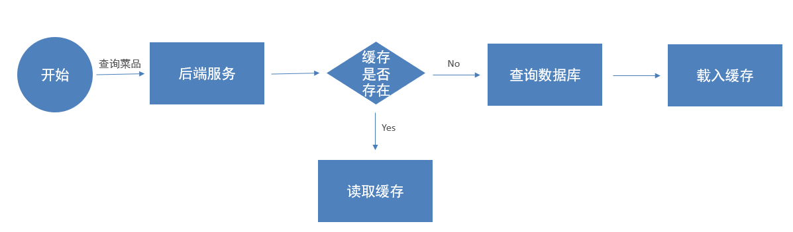

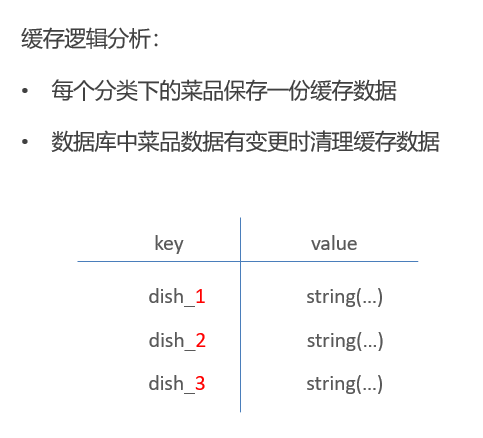

## 套餐缓存

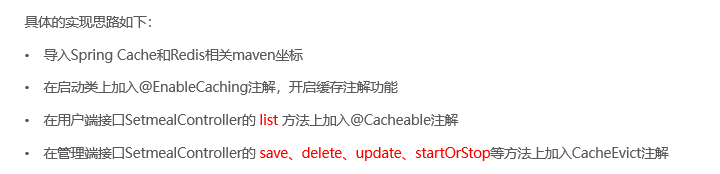

```
        <dependency>
            <groupId>org.springframework.boot</groupId>
            <artifactId>spring-boot-starter-cache</artifactId>
        </dependency>
```

# Spring Task 定时回调

## cron表达式

[在线Cron表达式生成器](https://cron.qqe2.com/),生成对应的时间表达式

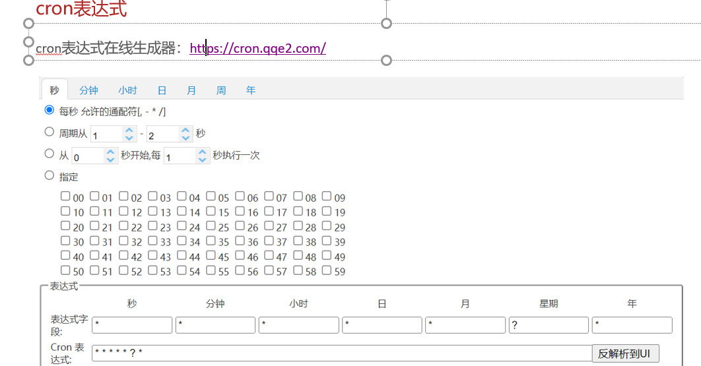

## 入门案例

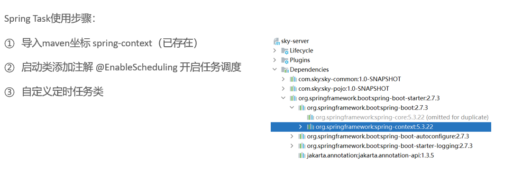

## 订单超时和订单完成定时检查

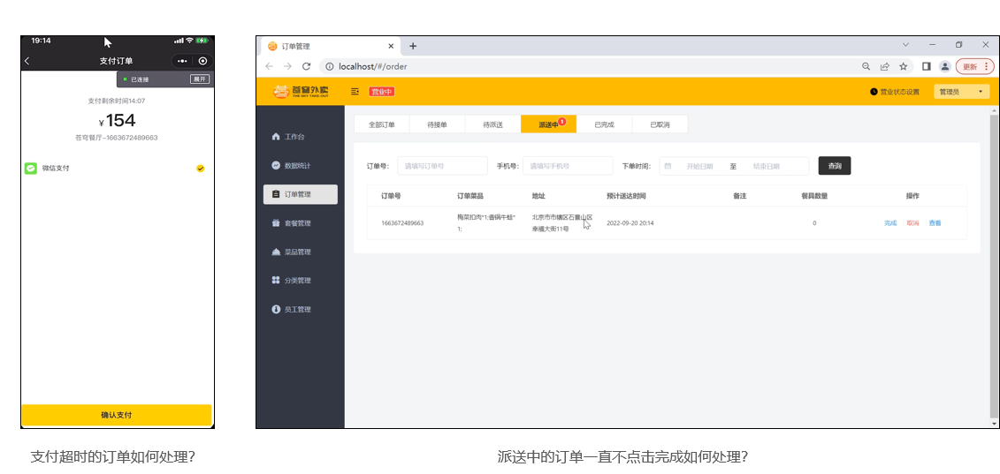

```
@Component
@Slf4j
public class OrderTask {

    @Autowired
    private OrderMapper orderMapper;

    /**
     * 支付超时订单处理
     * 对于下单后超过15分钟仍未支付的订单自动修改状态为 [已取消]
     * 每分钟执行一次
     */
    @Scheduled(cron = "0 * * * * ?") 
    public void processTimeoutOrder() {
        log.info("处理支付超时订单：{}", new Date()); // [cite: 90]
        
        // 计算15分钟前的时间点
        LocalDateTime time = LocalDateTime.now().plusMinutes(-15); // [cite: 90]
        
        // 查询超时订单
        List<Orders> ordersList = orderMapper.getByStatusAndOrdertimeLT(Orders.PENDING_PAYMENT, time); // [cite: 91]

        if(ordersList != null && ordersList.size() > 0){
            ordersList.forEach(order -> {
                order.setStatus(Orders.CANCELLED);
                order.setCancelReason("支付超时，自动取消");
                order.setCancelTime(LocalDateTime.now());
                orderMapper.update(order);
            }); // [cite: 92]
        }
    }

    /**
     * 派送中状态的订单处理
     * 对于一直处于派送中状态的订单，自动修改状态为 [已完成]
     * 每天凌晨1点执行一次
     */
    @Scheduled(cron = "0 0 1 * * ?") 
    public void processDeliveryOrder(){
        log.info("处理派送中订单：{}", new Date()); // [cite: 96]
        
        LocalDateTime time = LocalDateTime.now().plusMinutes(-60); // [cite: 96]
        
        List<Orders> ordersList = orderMapper.getByStatusAndOrdertimeLT(Orders.DELIVERY_IN_PROGRESS, time); // [cite: 97]
        
        if(ordersList != null && ordersList.size() > 0){
            ordersList.forEach(order -> {
                order.setStatus(Orders.COMPLETED);
                orderMapper.update(order);
            }); // [cite: 97]
        }
    }
}
```

```
/** * 根据订单状态和下单时间查询订单 
 * @param status 
 * @param orderTime 
 */
@Select("select * from orders where status = #{status} and order_time < #{orderTime}")
List<Orders> getByStatusAndOrdertimeLT(Integer status, LocalDateTime orderTime);
```

# WebSocket 持久连接 双向通信

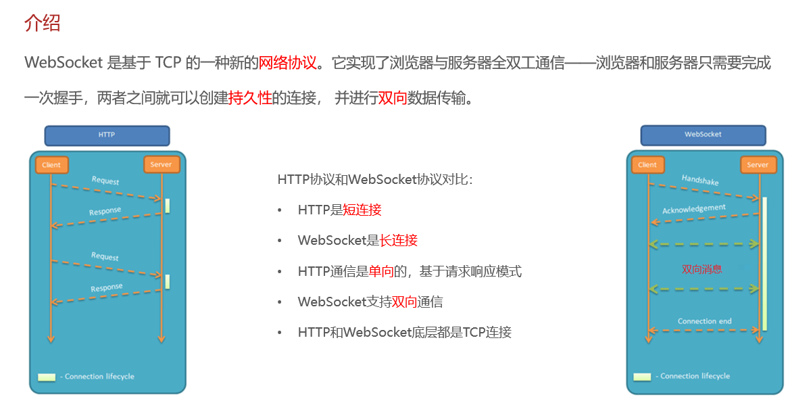

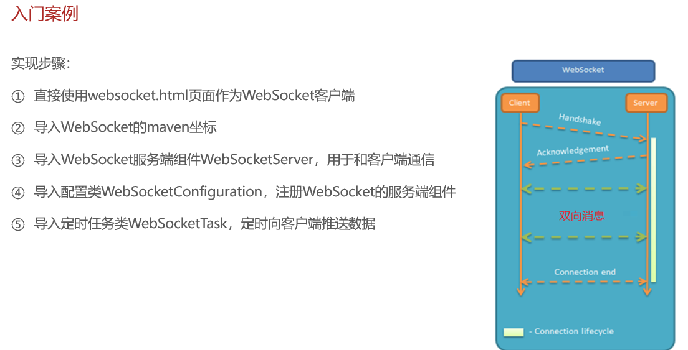

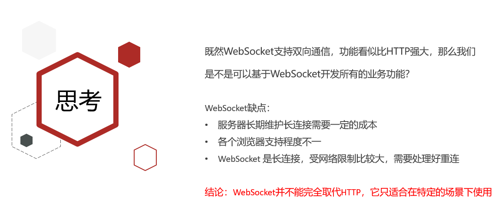

## 来单提醒

```
        <dependency>
            <groupId>org.springframework.boot</groupId>
            <artifactId>spring-boot-starter-websocket</artifactId>
        </dependency>
```

```
@SpringBootApplication
@EnableTransactionManagement //开启注解方式的事务管理
@Slf4j
@EnableCaching//开启缓存
@EnableScheduling//开启定时
public class SkyApplication {
	public static void main(String[] args) {
		SpringApplication.run(SkyApplication.class, args);
		log.info("server started");
	}
}

```

```
package com.sky.webSocket;

import org.springframework.stereotype.Component;

import javax.websocket.OnClose;
import javax.websocket.OnMessage;
import javax.websocket.OnOpen;
import javax.websocket.Session;
import javax.websocket.server.PathParam;
import javax.websocket.server.ServerEndpoint;
import java.util.Collection;
import java.util.HashMap;
import java.util.Map;

/**
 * WebSocket服务
 */
@Component
@ServerEndpoint("/ws/{sid}")
public class WebSocketServer {
	
	//存放会话对象
	private static Map<String, Session> sessionMap = new HashMap();
	
	/**
	 * 连接建立成功调用的方法
	 */
	@OnOpen
	public void onOpen(Session session, @PathParam("sid") String sid) {
		System.out.println("客户端：" + sid + "建立连接");
		sessionMap.put(sid, session);
	}
	
	/**
	 * 收到客户端消息后调用的方法
	 *
	 * @param message 客户端发送过来的消息
	 */
	@OnMessage
	public void onMessage(String message, @PathParam("sid") String sid) {
		System.out.println("收到来自客户端：" + sid + "的信息:" + message);
	}
	
	/**
	 * 连接关闭调用的方法
	 *
	 * @param sid
	 */
	@OnClose
	public void onClose(@PathParam("sid") String sid) {
		System.out.println("连接断开:" + sid);
		sessionMap.remove(sid);
	}
	
	/**
	 * 群发
	 *
	 * @param message
	 */
	public void sendToAllClient(String message) {
		Collection<Session> sessions = sessionMap.values();
		for (Session session : sessions) {
			try {
				//服务器向客户端发送消息
				session.getBasicRemote().sendText(message);
			} catch (Exception e) {
				e.printStackTrace();
			}
		}
	}
	
}

```

```
/**
 * WebSocket配置类，用于注册WebSocket的Bean
 */
@Configuration
public class WebSocketConfiguration {

    @Bean
    public ServerEndpointExporter serverEndpointExporter() {
        return new ServerEndpointExporter();
    }

}

```

```
public void paySuccess(String outTradeNo) {
		
		// 根据订单号查询订单
		Orders ordersDB = orderMapper.getByNumber(outTradeNo);
		
		// 根据订单id更新订单的状态、支付方式、支付状态、结账时间
		Orders orders = Orders.builder()
				.id(ordersDB.getId())
				.status(Orders.TO_BE_CONFIRMED)
				.payStatus(Orders.PAID)
				.checkoutTime(LocalDateTime.now())
				.build();
		// 支付成功后，向客户端推送消息
		Map map = new HashMap();
		map.put("type", 1); // 通知类型：1来单提醒 2客户催单
		map.put("orderId", orders.getId()); // 订单id
		map.put("content", "订单号:" + outTradeNo);

// 通过WebSocketServer发送消息给所有客户端浏览器
		webSocketServer.sendToAllClient(JSON.toJSONString(map));
		orderMapper.update(orders);
	}
	
```


## 用户催单

```
/**
	 * 用户催单
	 *
	 * @param id
	 */
	@Override
	public void reminder(Long id) {
		// 查询订单是否存在
		Orders orders = orderMapper.getById(id);
		if (orders == null) {
			throw new OrderBusinessException(MessageConstant.ORDER_NOT_FOUND);
		}
		
		// 基于WebSocket实现催单
		Map map = new HashMap();
		map.put("type", 2); // 2代表用户催单
		map.put("orderId", id);
		map.put("content", "订单号：" + orders.getNumber());
		
		// 向客户端推送消息
		webSocketServer.sendToAllClient(JSON.toJSONString(map));
	}
```

# Apache ECharts 图表展示 数据可视化

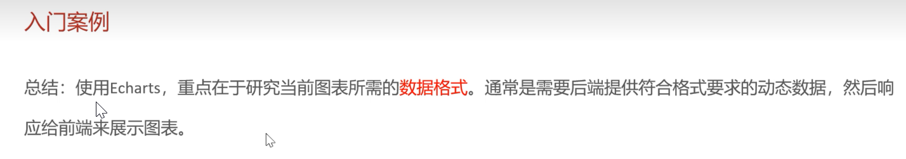

根据提供的PPT文件内容，其中包含了四个主要统计功能模块的代码开发：营业额统计、用户统计、订单统计和销量排名Top10。

以下是按功能模块整理的完整代码解析：

## 营业额统计 (Turnover Statistics)

该模块用于统计指定时间区间内的每日营业额。

**1.1 View Object (VO) 定义** 用于封装返回给前端的数据格式 。


Java

```
public class TurnoverReportVO implements Serializable {
    // 日期，以逗号分隔，例如：2022-10-01,2022-10-02,2022-10-03
    private String dateList;
    // 营业额，以逗号分隔，例如：406.0,1520.0,75.0
    private String turnoverList;
}
```

**1.2 Controller 层** 接收日期参数并调用 Service 。


Java

```
@RestController
@RequestMapping("/admin/report")
@Slf4j
@Api(tags = "统计报表相关接口")
public class ReportController {
    @Autowired
    private ReportService reportService;

    /**
     * 营业额数据统计
     * @param begin
     * @param end
     * @return
     */
    @GetMapping("/turnoverStatistics")
    @ApiOperation("营业额数据统计")
    public Result<TurnoverReportVO> turnoverStatistics(
            @DateTimeFormat(pattern = "yyyy-MM-dd") LocalDate begin,
            @DateTimeFormat(pattern = "yyyy-MM-dd") LocalDate end){
        return Result.success(reportService.getTurnover(begin,end));
    }
}
```

**1.3 Service 层** 计算日期列表，循环查询每一天的营业额 。


Java

```
// 接口定义
public interface ReportService {
    TurnoverReportVO getTurnover(LocalDateTime begin, LocalDateTime end);
}

// 实现类
@Service
@Slf4j
public class ReportServiceImpl implements ReportService {
    @Autowired
    private OrderMapper orderMapper;

    public TurnoverReportVO getTurnover(LocalDate begin, LocalDate end) {
        List<LocalDate> dateList = new ArrayList<>();
        dateList.add(begin);
        while (!begin.equals(end)){
            begin = begin.plusDays(1); // 日期计算，获得指定日期后1天的日期
            dateList.add(begin);
        }

        List<Double> turnoverList = new ArrayList<>();
        for (LocalDate date : dateList) {
            LocalDateTime beginTime = LocalDateTime.of(date, LocalTime.MIN);
            LocalDateTime endTime = LocalDateTime.of(date, LocalTime.MAX);
            
            // 查询营业额
            Map map = new HashMap();
            map.put("status", Orders.COMPLETED);
            map.put("begin", beginTime);
            map.put("end", endTime);
            
            Double turnover = orderMapper.sumByMap(map);
            turnover = turnover == null ? 0.0 : turnover;
            turnoverList.add(turnover);
        }
        
        // 数据封装
        return TurnoverReportVO.builder()
                .dateList(StringUtils.join(dateList,","))
                .turnoverList(StringUtils.join(turnoverList,","))
                .build();
    }
}
```

**1.4 Mapper 层** 通过动态SQL统计已完成订单的金额总和 。


Java

```
// 接口
Double sumByMap(Map map);
```

XML

```
<select id="sumByMap" resultType="java.lang.Double">
    select sum(amount) from orders
    <where>
        <if test="status != null">
            and status = #{status}
        </if>
        <if test="begin != null">
            and order_time &gt;= #{begin}
        </if>
        <if test="end != null">
            and order_time &lt;= #{end}
        </if>
    </where>
</select>
```

------

##  用户统计 (User Statistics)

该模块统计每日的新增用户数和总用户数。

**2.1 View Object (VO) 定义**


Java

```
public class UserReportVO implements Serializable {
    // 日期，以逗号分隔
    private String dateList;
    // 用户总量，以逗号分隔
    private String totalUserList;
    // 新增用户，以逗号分隔
    private String newUserList;
}
```

**2.2 Controller 层**


Java

```
@GetMapping("/userStatistics")
@ApiOperation("用户数据统计")
public Result<UserReportVO> userStatistics(
        @DateTimeFormat(pattern = "yyyy-MM-dd") LocalDate begin,
        @DateTimeFormat(pattern = "yyyy-MM-dd") LocalDate end){
    return Result.success(reportService.getUserStatistics(begin,end));
}
```

**2.3 Service 层** 分别统计每日新增（区间内创建）和总用户（截止到当日） 。


Java

```
public UserReportVO getUserStatistics(LocalDate begin, LocalDate end) {
    List<LocalDate> dateList = new ArrayList<>();
    dateList.add(begin);
    while (!begin.equals(end)){
        begin = begin.plusDays(1);
        dateList.add(begin);
    }
    List<Integer> newUserList = new ArrayList<>(); // 新增用户数
    List<Integer> totalUserList = new ArrayList<>(); // 总用户数

    for (LocalDate date : dateList) {
        LocalDateTime beginTime = LocalDateTime.of(date, LocalTime.MIN);
        LocalDateTime endTime = LocalDateTime.of(date, LocalTime.MAX);
        
        // 新增用户数量 select count(id) from user where create_time > ? and create_time < ?
        Integer newUser = getUserCount(beginTime, endTime);
        // 总用户数量 select count(id) from user where create_time < ?
        Integer totalUser = getUserCount(null, endTime);
        
        newUserList.add(newUser);
        totalUserList.add(totalUser);
    }
    
    return UserReportVO.builder()
            .dateList(StringUtils.join(dateList,","))
            .newUserList(StringUtils.join(newUserList,","))
            .totalUserList(StringUtils.join(totalUserList,","))
            .build();
}

private Integer getUserCount(LocalDateTime beginTime, LocalDateTime endTime) {
    Map map = new HashMap();
    map.put("begin",beginTime);
    map.put("end", endTime);
    return userMapper.countByMap(map);
}
```

**2.4 Mapper 层**


Java

```
Integer countByMap(Map map);
```

XML

```
<select id="countByMap" resultType="java.lang.Integer">
    select count(id) from user
    <where>
        <if test="begin != null">
            and create_time &gt;= #{begin}
        </if>
        <if test="end != null">
            and create_time &lt;= #{end}
        </if>
    </where>
</select>
```

------

## 订单统计 (Order Statistics)

该模块统计订单总数、有效订单数及订单完成率。

**3.1 View Object (VO) 定义**


Java

```
public class OrderReportVO implements Serializable {
    private String dateList;
    private String orderCountList;      // 每日订单数
    private String validOrderCountList; // 每日有效订单数
    private Integer totalOrderCount;    // 订单总数
    private Integer validOrderCount;    // 有效订单数
    private Double orderCompletionRate; // 订单完成率
}
```

**3.2 Controller 层**


Java

```
@GetMapping("/ordersStatistics")
@ApiOperation("订单数据统计")
public Result<OrderReportVO> orderStatistics(
        @DateTimeFormat(pattern = "yyyy-MM-dd") LocalDate begin,
        @DateTimeFormat(pattern = "yyyy-MM-dd") LocalDate end){
    return Result.success(reportService.getOrderStatistics(begin,end));
}
```

**3.3 Service 层**


Java

```
public OrderReportVO getOrderStatistics(LocalDate begin, LocalDate end) {
    List<LocalDate> dateList = new ArrayList<>();
    dateList.add(begin);
    while (!begin.equals(end)){
        begin = begin.plusDays(1);
        dateList.add(begin);
    }
    
    List<Integer> orderCountList = new ArrayList<>(); // 每天订单总数集合
    List<Integer> validOrderCountList = new ArrayList<>(); // 每天有效订单数集合

    for (LocalDate date : dateList) {
        LocalDateTime beginTime = LocalDateTime.of(date, LocalTime.MIN);
        LocalDateTime endTime = LocalDateTime.of(date, LocalTime.MAX);
        
        // 查询每天的总订单数
        Integer orderCount = getOrderCount(beginTime, endTime, null);
        // 查询每天的有效订单数 (status = COMPLETED)
        Integer validOrderCount = getOrderCount(beginTime, endTime, Orders.COMPLETED);
        
        orderCountList.add(orderCount);
        validOrderCountList.add(validOrderCount);
    }
    
    // 计算时间区间内的总数
    Integer totalOrderCount = orderCountList.stream().reduce(Integer::sum).get();
    Integer validOrderCount = validOrderCountList.stream().reduce(Integer::sum).get();
    
    // 订单完成率
    Double orderCompletionRate = 0.0;
    if(totalOrderCount != 0){
        orderCompletionRate = validOrderCount.doubleValue() / totalOrderCount;
    }
    
    return OrderReportVO.builder()
            .dateList(StringUtils.join(dateList, ","))
            .orderCountList(StringUtils.join(orderCountList, ","))
            .validOrderCountList(StringUtils.join(validOrderCountList, ","))
            .totalOrderCount(totalOrderCount)
            .validOrderCount(validOrderCount)
            .orderCompletionRate(orderCompletionRate)
            .build();
}

private Integer getOrderCount(LocalDateTime beginTime, LocalDateTime endTime, Integer status) {
    Map map = new HashMap();
    map.put("status", status);
    map.put("begin", beginTime);
    map.put("end", endTime);
    return orderMapper.countByMap(map);
}
```

**3.4 Mapper 层**


Java

```
Integer countByMap(Map map);
```

XML

```
<select id="countByMap" resultType="java.lang.Integer">
    select count(id) from orders
    <where>
        <if test="status != null">
            and status = #{status}
        </if>
        <if test="begin != null">
            and order_time &gt;= #{begin}
        </if>
        <if test="end != null">
            and order_time &lt;= #{end}
        </if>
    </where>
</select>
```

------

##  销量排名 Top10 (Sales Top 10)

该模块统计指定区间内销量最高的前10个商品。

**4.1 View Object (VO) 定义**


Java

```
public class SalesTop10ReportVO implements Serializable {
    // 商品名称列表
    private String nameList;
    // 销量列表
    private String numberList;
}
```

**4.2 Controller 层**


Java

```
@GetMapping("/top10")
@ApiOperation("销量排名统计")
public Result<SalesTop10ReportVO> top10(
        @DateTimeFormat(pattern = "yyyy-MM-dd") LocalDate begin,
        @DateTimeFormat(pattern = "yyyy-MM-dd") LocalDate end){
    return Result.success(reportService.getSalesTop10(begin,end));
}
```

**4.3 Service 层** 调用 Mapper 查询聚合数据，并将结果转换为逗号分隔的字符串 。


Java

```
public SalesTop10ReportVO getSalesTop10(LocalDate begin, LocalDate end) {
    LocalDateTime beginTime = LocalDateTime.of(begin, LocalTime.MIN);
    LocalDateTime endTime = LocalDateTime.of(end, LocalTime.MAX);
    
    List<GoodsSalesDTO> goodsSalesDTOList = orderMapper.getSalesTop10(beginTime, endTime);
    
    String nameList = StringUtils.join(goodsSalesDTOList.stream().map(GoodsSalesDTO::getName).collect(Collectors.toList()),",");
    String numberList = StringUtils.join(goodsSalesDTOList.stream().map(GoodsSalesDTO::getNumber).collect(Collectors.toList()),",");
    
    return SalesTop10ReportVO.builder()
            .nameList(nameList)
            .numberList(numberList)
            .build();
}
```

**4.4 Mapper 层** 关联 `order_detail` 和 `orders` 表，按商品名称分组并按销量降序排列 。


Java

```
List<GoodsSalesDTO> getSalesTop10(LocalDateTime begin, LocalDateTime end);
```

XML

```
<select id="getSalesTop10" resultType="com.sky.dto.GoodsSalesDTO">
    select od.name name, sum(od.number) number from order_detail od, orders o
    where od.order_id = o.id
        and o.status = 5
        <if test="begin != null">
            and order_time &gt;= #{begin}
        </if>
        <if test="end != null">
            and order_time &lt;= #{end}
        </if>
    group by name
    order by number desc
    limit 0, 10
</select>
```

# Apache POI  对Miscrosoft Office各种文件读写

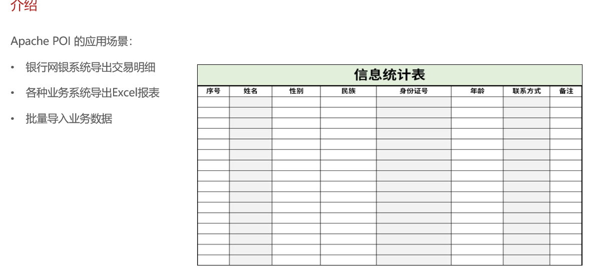

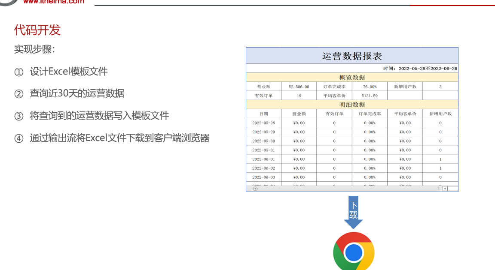

主要分为 **Apache POI 基础使用** 和 **运营数据报表导出功能** 两部分。

## Apache POI 基础配置与使用

**Maven 依赖坐标**

XML

```
<dependency>
    <groupId>org.apache.poi</groupId>
    <artifactId>poi</artifactId>
    <version>3.16</version>
</dependency>
<dependency>
    <groupId>org.apache.poi</groupId>
    <artifactId>poi-ooxml</artifactId>
    <version>3.16</version>
</dependency>
```

**案例 1：将数据写入 Excel 文件**

Java

```
// 在内存中创建一个Excel文件对象
XSSFWorkbook excel = new XSSFWorkbook();
// 创建Sheet页
XSSFSheet sheet = excel.createSheet("itcast");

// 在Sheet页中创建行，0表示第1行
XSSFRow row1 = sheet.createRow(0);
// 创建单元格并在单元格中设置值，单元格编号也是从0开始，1表示第2个单元格
row1.createCell(1).setCellValue("姓名");
row1.createCell(2).setCellValue("城市");

XSSFRow row2 = sheet.createRow(1);
row2.createCell(1).setCellValue("张三");
row2.createCell(2).setCellValue("北京");

XSSFRow row3 = sheet.createRow(2);
row3.createCell(1).setCellValue("李四");
row3.createCell(2).setCellValue("上海");

FileOutputStream out = new FileOutputStream(new File("D:\\itcast.xlsx"));
// 通过输出流将内存中的Excel文件写入到磁盘上
excel.write(out);

// 关闭资源
out.flush();
out.close();
excel.close();
```

**案例 2：读取 Excel 文件中的数据**

Java

```
FileInputStream in = new FileInputStream(new File("D:\\itcast.xlsx"));
// 通过输入流读取指定的Excel文件
XSSFWorkbook excel = new XSSFWorkbook(in);

// 获取Excel文件的第1个Sheet页
XSSFSheet sheet = excel.getSheetAt(0);

// 获取Sheet页中的最后一行的行号
int lastRowNum = sheet.getLastRowNum();

for (int i = 0; i <= lastRowNum; i++) {
    // 获取Sheet页中的行
    XSSFRow titleRow = sheet.getRow(i);
    // 获取行的第2个单元格
    XSSFCell cell1 = titleRow.getCell(1);
    // 获取单元格中的文本内容
    String cellValue1 = cell1.getStringCellValue();
    
    // 获取行的第3个单元格
    XSSFCell cell2 = titleRow.getCell(2);
    // 获取单元格中的文本内容
    String cellValue2 = cell2.getStringCellValue();
    
    System.out.println(cellValue1 + " " + cellValue2);
}

// 关闭资源
in.close();
excel.close();
```

------

##  导出运营数据报表功能开发

注意文件要放在  src/main/resources

资源未被打包进 JAR / classes 目录：
如果 template/运营数据报表模板.xlsx 未被 Maven 正确包含（例如未放在 src/main/resources，而是放在 src/main/java 或其他非资源目录），则运行时 inputStream == null

**Controller 层 (`ReportController.java`)**

Java

```
/**
 * 导出运营数据报表
 * @param response
 */
@GetMapping("/export")
@ApiOperation("导出运营数据报表")
public void export(HttpServletResponse response){
    reportService.exportBusinessData(response);
}
```

**Service 接口层 (`ReportService.java`)**

Java

```
/**
 * 导出近30天的运营数据报表
 * @param response
 */
void exportBusinessData(HttpServletResponse response);
```

**Service 实现层 (`ReportServiceImpl.java`)**

该方法通过读取 Excel 模板，查询近30天的运营数据并填充到模板中，最后通过输出流下载。

Java

```
/**
 * 导出近30天的运营数据报表
 * @param response
 */
public void exportBusinessData(HttpServletResponse response) {
    // 1. 查询数据库，获取营业数据
    LocalDate begin = LocalDate.now().minusDays(30);
    LocalDate end = LocalDate.now().minusDays(1);
    
    // 查询概览运营数据，提供给Excel模板文件
    BusinessDataVO businessData = workspaceService.getBusinessData(LocalDateTime.of(begin, LocalTime.MIN), LocalDateTime.of(end, LocalTime.MAX));
    
    InputStream inputStream = this.getClass().getClassLoader().getResourceAsStream("template/运营数据报表模板.xlsx");
    
    try {
        // 基于提供好的模板文件创建一个新的Excel表格对象
        XSSFWorkbook excel = new XSSFWorkbook(inputStream);
        // 获得Excel文件中的一个Sheet页
        XSSFSheet sheet = excel.getSheet("Sheet1");

        // 2. 填充概览数据
        // 填充时间区间
        sheet.getRow(1).getCell(1).setCellValue(begin + "至" + end);
        
        // 获得第4行
        XSSFRow row = sheet.getRow(3);
        // 填充营业额、订单完成率、新增用户数
        row.getCell(2).setCellValue(businessData.getTurnover());
        row.getCell(4).setCellValue(businessData.getOrderCompletionRate());
        row.getCell(6).setCellValue(businessData.getNewUsers());
        
        // 获得第5行
        row = sheet.getRow(4);
        // 填充有效订单、平均客单价
        row.getCell(2).setCellValue(businessData.getValidOrderCount());
        row.getCell(4).setCellValue(businessData.getUnitPrice());

        // 3. 填充明细数据
        for (int i = 0; i < 30; i++) {
            LocalDate date = begin.plusDays(i);
            // 查询某一天的营业数据
            businessData = workspaceService.getBusinessData(LocalDateTime.of(date, LocalTime.MIN), LocalDateTime.of(date, LocalTime.MAX));
            
            // 获得对应的行（从第8行开始）
            row = sheet.getRow(7 + i);
            row.getCell(1).setCellValue(date.toString());
            row.getCell(2).setCellValue(businessData.getTurnover());
            row.getCell(3).setCellValue(businessData.getValidOrderCount());
            row.getCell(4).setCellValue(businessData.getOrderCompletionRate());
            row.getCell(5).setCellValue(businessData.getUnitPrice());
            row.getCell(6).setCellValue(businessData.getNewUsers());
        }

        // 4. 通过输出流将文件下载到客户端浏览器中
        ServletOutputStream out = response.getOutputStream();
        excel.write(out);

        // 关闭资源
        out.flush();
        out.close();
        excel.close();
    } catch (IOException e) {
        e.printStackTrace();
    }
}
```

