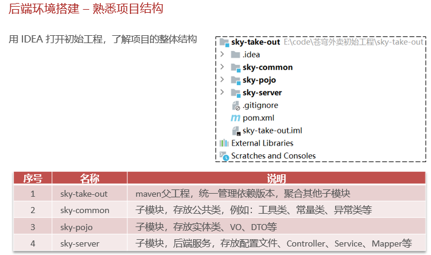
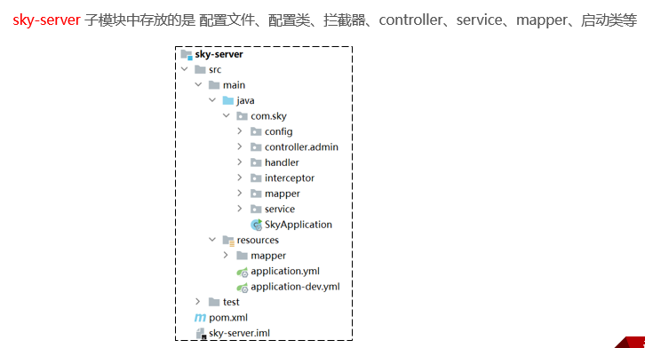
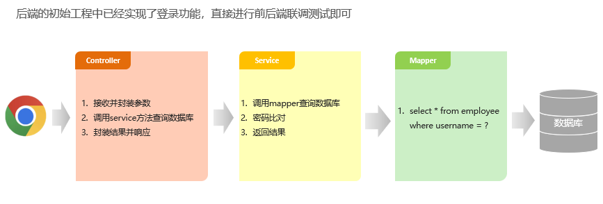
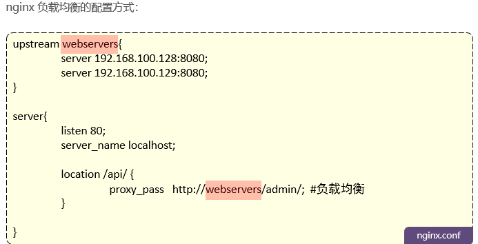
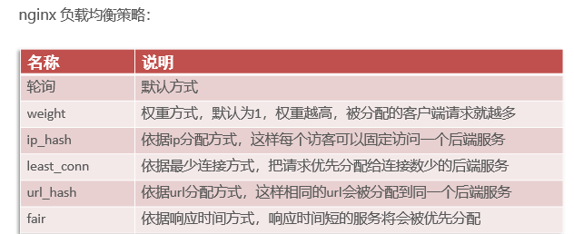
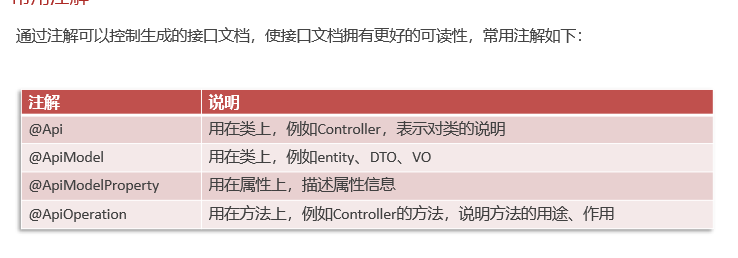
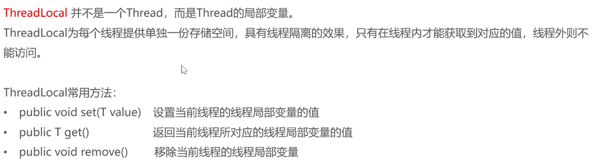
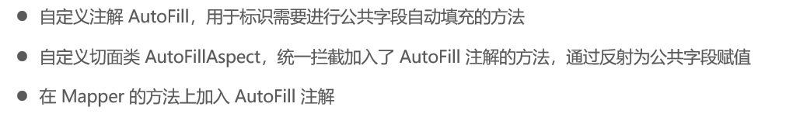
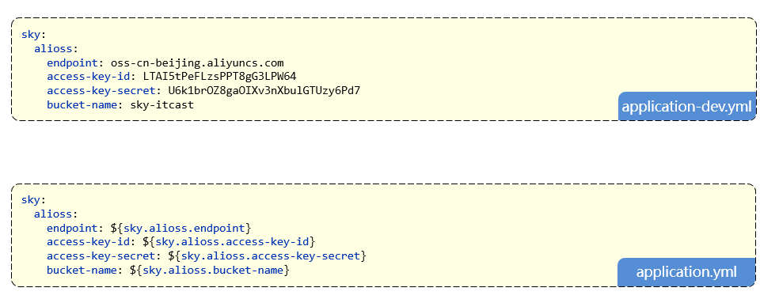
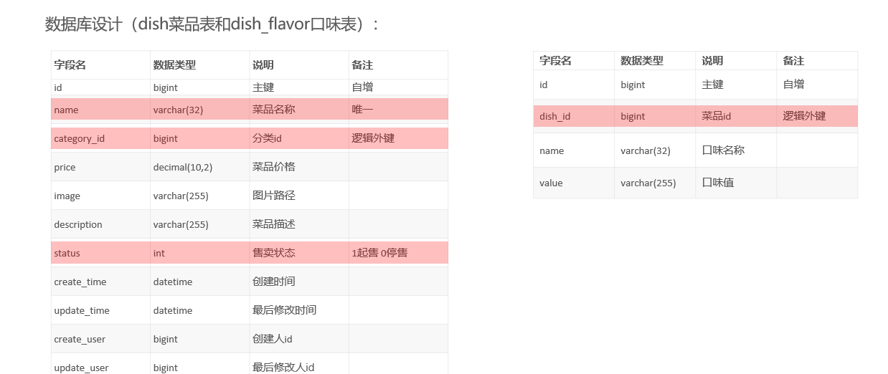

# 前期准备

## 架构


## 数据库

使用idea,导入sql初始化脚本,排列译码规则选择utf8_4bin

## 前端

已经写好,直接打开nginx

## 后端

**分3个模块**



### sky-common

存放公共类,给其他模块使用


### sky-pojo


### sky-server



## 前后端测试



## nginx的反向代理和负载均衡

### 反向代理

转发


### 负载均衡





## 接口文档

### 设计阶段的,使用apifox

直接导入产品经理写的json格式的YApi

### 开发测试阶段,使用Swagger

使用Swagger你只需要按照它的规范去定义接口及接口相关的信息，就可以做到生成接口文档，以及在线接口调试页面。

官网：https://swagger.io/

#### Knife4j

为Java MVC框架集成Swagger生成Api文档的增强解决方案。

```
<dependency>
            <groupId>com.github.xiaoymin</groupId>
            <artifactId>knife4j-spring-boot-starter</artifactId>
            <version>3.0.2</version>
</dependency>

```

#### 配置类中加入的相关配置

**扫描com.sky.controller下的所有类,将接口信息进行展示**

```
/**
	 * 通过knife4j生成接口文档
	 *
	 * @return
	 */
	@Bean
	public Docket docket() {
		log.info("开始生成接口文档");
		ApiInfo apiInfo = new ApiInfoBuilder()
				.title("苍穹外卖项目接口文档")
				.version("2.0")
				.description("苍穹外卖项目接口文档")
				.build();
		Docket docket = new Docket(DocumentationType.SWAGGER_2)
				.apiInfo(apiInfo)
				.select()
				.apis(RequestHandlerSelectors.basePackage("com.sky.controller"))
				.paths(PathSelectors.any())
				.build();
		return docket;
	}
```



使用注解,就可以在页面上展示对应的注释信息

#### 在配置类中设置静态资源

只有设置了这个,才能在localhost:8080/doc.html处查看到对应的接口文档内容

```
/**
	 * 设置静态资源映射
	 *
	 * @param registry
	 */
	protected void addResourceHandlers(ResourceHandlerRegistry registry) {
		log.info("开始设置静态资源映射");
		registry.addResourceHandler("/doc.html").addResourceLocations("classpath:/META-INF/resources/");
		registry.addResourceHandler("/webjars/**").addResourceLocations("classpath:/META-INF/resources/webjars/");
	}
```

# 开发接口并测试

## 员工

### 添加员工

#### 开发

还是老三样,三层架构

```
@RequestMapping("/admin/employee")
	@PostMapping
	@ApiOperation("添加员工")
	public Result<String> add(@RequestBody EmployeeDTO employeeDTO) {
		log.info("新增员工，员工数据：{}", employeeDTO);
		employeeService.add(employeeDTO);
		return Result.success();
	}
```

```
	@Autowired
	private HttpServletRequest request;
	@Autowired
	private JwtProperties jwtProperties;
@Override
	public void add(EmployeeDTO employeeDTO) {
		Employee employee = new Employee();
		//对象属性拷贝
		BeanUtils.copyProperties(employeeDTO, employee);
		//依赖注入的request 对象
		String token = request.getHeader(jwtProperties.getAdminTokenName());
		//通过密钥进行解密得到键值对MAP claims,其中就含有键为empId的键值对,这就取出了id
		Claims claims = JwtUtil.parseJWT(jwtProperties.getAdminSecretKey(), token);
		Long empId = Long.valueOf(claims.get(JwtClaimsConstant.EMP_ID).toString());
		
		//设置账号的状态，默认正常状态 1表示正常 0表示锁定
		employee.setStatus(StatusConstant.ENABLE);
		employee.setCreateTime(LocalDateTime.now());
		employee.setUpdateTime(LocalDateTime.now());
		
		//设置创建人和更新人id
		employee.setCreateUser(empId);
		employee.setUpdateUser(empId);
		
		//设置默认密码 123456,使用MD5进行加密
		//使用常量封装,便于整体维护
		employee.setPassword(DigestUtils.md5DigestAsHex(PasswordConstant.DEFAULT_PASSWORD.getBytes()));
		
		employeeMapper.add(employee);
	}
```

```
	/**
	 * 插入员工数据
	 *
	 * @param employee
	 */
	@Insert("insert into employee (username, name, password, phone, sex, id_number, status, create_time, update_time, create_user, update_user) " +
			"values (#{username}, #{name}, #{password}, #{phone}, #{sex}, #{idNumber}, #{status}, #{createTime}, #{updateTime}, #{createUser}, #{updateUser})")
	void add(Employee employee);
```


#### 测试

由于前端可能还没有开发好,可以使用上面生成的接口文档地址localhost:8080/doc.html,去进行调试

第一次发送发现无法测试

是由于请求头并没有还有jwt令牌,导致被拦截了,一般是在登录的时候获取的

可以在统一设定处进行设定,**设定好记得刷新一下**

而这个token就是登录时返回的

参数名称是由我们后端的参数设定决定的


#### 代码完善

##### 需要捕获异常信息src/main/java/com/sky/handler/GlobalExceptionHandler.java

```
@ExceptionHandler
	public Result exceptionHandler(SQLIntegrityConstraintViolationException ex) {
		log.error("异常信息：{}", ex.getMessage());
		//这是编译器抛出的异常信息
		//Duplicate entry '2222' for key 'employee.idx_username'
		if (ex.getMessage().contains("Duplicate entry")) {
			String[] split = ex.getMessage().split(" ");
			String msg = split[2] + MessageConstant.ALREADY_EXIST;
			return Result.error(msg);
		}
		return Result.error(MessageConstant.UNKNOWN_ERROR);
	}
```

##### 需要获取登录用户id

提供登录后生成的JWT令牌获取,登陆后的每次请求都会携带JWT令牌


我们要做的就是从请求头中获取到jwt令牌中携带的id信息

```
	@Autowired
	private HttpServletRequest request;
	@Autowired
	private JwtProperties jwtProperties;
@Override
	public void add(EmployeeDTO employeeDTO) {
		Employee employee = new Employee();
		//对象属性拷贝
		BeanUtils.copyProperties(employeeDTO, employee);
		//依赖注入的request 对象
		String token = request.getHeader(jwtProperties.getAdminTokenName());
		//通过密钥进行解密得到键值对MAP claims,其中就含有键为empId的键值对,这就取出了id
		Claims claims = JwtUtil.parseJWT(jwtProperties.getAdminSecretKey(), token);
		Long empId = Long.valueOf(claims.get(JwtClaimsConstant.EMP_ID).toString());
		
		//设置账号的状态，默认正常状态 1表示正常 0表示锁定
		employee.setStatus(StatusConstant.ENABLE);
		employee.setCreateTime(LocalDateTime.now());
		employee.setUpdateTime(LocalDateTime.now());
		
		//设置创建人和更新人id
		employee.setCreateUser(empId);
		employee.setUpdateUser(empId);
		
		//设置默认密码 123456,使用MD5进行加密
		//使用常量封装,便于整体维护
		employee.setPassword(DigestUtils.md5DigestAsHex(PasswordConstant.DEFAULT_PASSWORD.getBytes()));
		
		employeeMapper.add(employee);
	}
```

**但是,在拦截器的时候,其实已经解析过了!这样要重新获取和解析,非常麻烦**

**引出新的技术ThreadLocal,在同一个线程中,都有一个单独的存储空间**

**而浏览器发起的每次后端请求,都是单独的一个线程,跑在tomcat中,这样我们就可以在拦截器的时候把id存在存储空间中,这样再在添加的时候拿取就好**



```
public class BaseContext {

    public static ThreadLocal<Long> threadLocal = new ThreadLocal<>();

    public static void setCurrentId(Long id) {
        threadLocal.set(id);
    }

    public static Long getCurrentId() {
        return threadLocal.get();
    }

    public static void removeCurrentId() {
        threadLocal.remove();
    }

}
```

在拦截器的位置设置

```
		//2、校验令牌
		try {
			log.info("jwt校验:{}", token);
			Claims claims = JwtUtil.parseJWT(jwtProperties.getAdminSecretKey(), token);
			Long empId = Long.valueOf(claims.get(JwtClaimsConstant.EMP_ID).toString());
			log.info("当前员工id：", empId);
			BaseContext.setCurrentId(empId);
```

```
//使用ThreadLoacl中的get方法获取当前登录用户的id
		//这个在拦截器的时候就已经存储好了
		Long empId = BaseContext.getCurrentId();
```

### 员工分页展示

使用pageHelper插件

```
<dependency>
    <groupId>com.github.pagehelper</groupId>
    <artifactId>pagehelper-spring-boot-starter</artifactId>
</dependency>
```

**controller**

```
	@GetMapping("/page")
	@ApiOperation("分页查询员工")
	public Result<PageResult> page(EmployeePageQueryDTO employeePageQuery) {
		log.info("分页查询员工:{}", employeePageQuery);
		PageResult pageResult = employeeService.page(employeePageQuery);
		return Result.success(pageResult);
	}
```

**service**

```
	public PageResult page(EmployeePageQueryDTO employeePageQuery) {
		PageHelper.startPage(employeePageQuery.getPage(), employeePageQuery.getPageSize());
		Page<Employee> page = employeeMapper.page(employeePageQuery);
		return new PageResult((long) page.getTotal(), page.getResult());
	}
```

**mapper**,xml

```
	Page<Employee> page(EmployeePageQueryDTO employeePageQuery);

<select id="page" resultType="com.sky.entity.Employee">
        select * from employee
        <where>
            <if test="name != null and name != ''">
                and name like concat('%',#{name},'%')
            </if>
        </where>
        order by create_time desc
    </select>
```

### 时间格式化配置

```
@Configuration
@Slf4j
public class WebMvcConfiguration extends WebMvcConfigurationSupport {
	/**
	 * 扩展mvc框架的消息转换器
	 */
	protected void extendMessageConverters(List<HttpMessageConverter<?>> converters) {
		log.info("扩展消息转换器...");
		//创建消息转换器对象
		MappingJackson2HttpMessageConverter messageConverter = new MappingJackson2HttpMessageConverter();
		//设置对象转换器，底层使用Jackson将Java对象转为json
		messageConverter.setObjectMapper(new JacksonObjectMapper());
		//将上面的消息转换器对象追加到mvc框架的转换器集合中
		converters.add(0, messageConverter);
	}
}
```

```
/**
 * 对象映射器:基于jackson将Java对象转为json，或者将json转为Java对象
 * 将JSON解析为Java对象的过程称为 [从JSON反序列化Java对象]
 * 从Java对象生成JSON的过程称为 [序列化Java对象到JSON]
 */
public class JacksonObjectMapper extends ObjectMapper {

    public static final String DEFAULT_DATE_FORMAT = "yyyy-MM-dd";
    //public static final String DEFAULT_DATE_TIME_FORMAT = "yyyy-MM-dd HH:mm:ss";
    public static final String DEFAULT_DATE_TIME_FORMAT = "yyyy-MM-dd HH:mm";
    public static final String DEFAULT_TIME_FORMAT = "HH:mm:ss";

    public JacksonObjectMapper() {
        super();
        //收到未知属性时不报异常
        this.configure(FAIL_ON_UNKNOWN_PROPERTIES, false);

        //反序列化时，属性不存在的兼容处理
        this.getDeserializationConfig().withoutFeatures(DeserializationFeature.FAIL_ON_UNKNOWN_PROPERTIES);

        SimpleModule simpleModule = new SimpleModule()
                .addDeserializer(LocalDateTime.class, new LocalDateTimeDeserializer(DateTimeFormatter.ofPattern(DEFAULT_DATE_TIME_FORMAT)))
                .addDeserializer(LocalDate.class, new LocalDateDeserializer(DateTimeFormatter.ofPattern(DEFAULT_DATE_FORMAT)))
                .addDeserializer(LocalTime.class, new LocalTimeDeserializer(DateTimeFormatter.ofPattern(DEFAULT_TIME_FORMAT)))
                .addSerializer(LocalDateTime.class, new LocalDateTimeSerializer(DateTimeFormatter.ofPattern(DEFAULT_DATE_TIME_FORMAT)))
                .addSerializer(LocalDate.class, new LocalDateSerializer(DateTimeFormatter.ofPattern(DEFAULT_DATE_FORMAT)))
                .addSerializer(LocalTime.class, new LocalTimeSerializer(DateTimeFormatter.ofPattern(DEFAULT_TIME_FORMAT)));

        //注册功能模块 例如，可以添加自定义序列化器和反序列化器
        this.registerModule(simpleModule);
    }
}
```


### 员工状态启用禁用和员工信息编辑

```
@PostMapping("/status/{status}")
	@ApiOperation("员工状态禁用/启用")
	public Result startOrStop(@PathVariable Integer status, Long id) {
		log.info("员工状态禁用/启用：{}", status);
		employeeService.startOrStop(status, id);
		return Result.success();
	}
	
	@GetMapping("/{id}")
	@ApiOperation("查询员工信息")
	public Result<Employee> getById(@PathVariable Long id) {
		log.info("查询员工信息：{}", id);
		Employee employee = employeeService.getById(id);
		return Result.success(employee);
	}
	
	@PutMapping
	@ApiOperation("编辑员工信息")
	public Result update(@RequestBody EmployeeDTO employeeDTO) {
		log.info("编辑员工信息：{}", employeeDTO);
		employeeService.update(employeeDTO);
		return Result.success();
	}
```

```
	@Override
	public void startOrStop(Integer status, Long id) {
		//使用builder进行构建对象,前提是该类有Builder注解
		//且注意,这个构建是构建一个新的,而不能在原有基础去修改
		Employee employee = Employee.builder()
				.status(status)
				.id(id)
				.updateTime(LocalDateTime.now())
				.updateUser(BaseContext.getCurrentId())
				.build();
		employeeMapper.update(employee);
	}
	
	@Override
	public Employee getById(Long id) {
		Employee employee = employeeMapper.getById(id);
		return employee;
	}
	
	@Override
	public void update(EmployeeDTO employeeDTO) {
		Employee employee = new Employee();
		//使用工具类将employeeDTO中的属性拷贝到employee中
		BeanUtils.copyProperties(employeeDTO, employee);
		employee.setUpdateUser(BaseContext.getCurrentId());
		employee.setUpdateTime(LocalDateTime.now());
		//重复调用update的xml文件去操作
		employeeMapper.update(employee);
	}
```

```
	void update(Employee employee);
	
	@Select("select * from employee where id = #{id}")
	Employee getById(Long id);
	
	
	<update id="update">
        update employee
        <set>
            <if test="name != null">name = #{name},</if>
            <if test="username != null">username = #{username},</if>
            <if test="password != null">password = #{password},</if>
            <if test="phone != null">phone = #{phone},</if>
            <if test="sex != null">sex = #{sex},</if>
            <if test="idNumber != null">id_number = #{idNumber},</if>
            <if test="status != null">status = #{status},</if>
            <if test="updateTime != null">update_time = #{updateTime},</if>
            <if test="updateUser != null">update_user = #{updateUser},</if>
            <if test="createTime != null">create_time = #{createTime},</if>
            <if test="createUser != null">create_user = #{createUser},</if>
        </set>
        where id = #{id}
    </update>
```

### 为公共字段统一赋值--AOP切面编程

切面知识详见javaWeb

#### 问题

在每次update和insert操作前都要为操作时间操作人,进行赋值,非常的冗余,可以通过切面编程,实现统一赋值


#### 解决

**三步走**



##### **注解annotion**

```
public enum OperationType {

    UPDATE,
    INSERT

}
```

```
@Retention(RetentionPolicy.RUNTIME)
@Target(ElementType.METHOD)
public @interface AutoFill {
	
	//OperationType是Insert或者Update的枚举
	OperationType value();
}
```

##### **切面类**

通过切入点获取,方法签名进而获取到注解的update或者insert

通过切入点获取对应的参数,需要固定被赋值对象在参数的同一个位置,这样统一获取到对象

通过反射,获取到对象中对应的方法,并将需要赋的操作人,操作时间赋值上去

实现统一的公共字段赋值

```
//定义切面,实现公共字段自动填充
@Aspect
@Component
@Slf4j
public class AutoFillAspect {
	
	//切入点
	@Pointcut("execution(* com.sky.mapper.*.*(..)) && @annotation(com.sky.annotation.AutoFill)")
	public void autoFillPointFill() {
	}
	
	//前置通知
	@Before("autoFillPointFill()")
	public void autoFill(JoinPoint joinPoint) {
		log.info("开始进行公共字段填充");
		//先获取当前拦截的方法上的数据库操作类型:update,insert
		MethodSignature signature = (MethodSignature) joinPoint.getSignature();//方法签名对象
		AutoFill autoFill = signature.getMethod().getAnnotation(AutoFill.class);
		OperationType operationType = autoFill.value();
		
		//获取被拦截方法的参数--实体对象
		Object[] args = joinPoint.getArgs();
		if (args == null || args.length == 0) {
			return;
		}
		//默认需要把对象参数放在方法第一位
		Object entity = args[0];
		//获取需要自动填充的字段的值
		LocalDateTime now = LocalDateTime.now();
		Long currentId = BaseContext.getCurrentId();
		//根据当前不同的操作类型.为对应的属性赋值(反射的方式)
		if (operationType == OperationType.INSERT) {
			log.info("开始进行插入操作的字段填充");
			//为4个公共字段赋值,通过invoke反射来给拦截的对象赋值
			try {
				entity.getClass().getDeclaredMethod(AutoFillConstant.SET_CREATE_TIME, LocalDateTime.class).invoke(entity, now);
				entity.getClass().getDeclaredMethod(AutoFillConstant.SET_UPDATE_TIME, LocalDateTime.class).invoke(entity, now);
				entity.getClass().getDeclaredMethod(AutoFillConstant.SET_CREATE_USER, Long.class).invoke(entity, currentId);
				entity.getClass().getDeclaredMethod(AutoFillConstant.SET_UPDATE_USER, Long.class).invoke(entity, currentId);
			} catch (Exception e) {
				throw new RuntimeException(e);
			}
			
		} else if (operationType == OperationType.UPDATE) {
			log.info("开始进行更新操作的字段填充");
			try {
				entity.getClass().getDeclaredMethod(AutoFillConstant.SET_UPDATE_TIME, LocalDateTime.class).invoke(entity, now);
				entity.getClass().getDeclaredMethod(AutoFillConstant.SET_UPDATE_USER, Long.class).invoke(entity, currentId);
			} catch (Exception e) {
				throw new RuntimeException(e);
			}
		}
	}
	
}
```

##### 为需要统一字段的方法加上注解

例如,mapper接口中的add和update方法,包括员工和分离表单等等

```
@AutoFill(value = OperationType.INSERT)
	void add(Employee employee);
	
```

**最后将之前在Service端中对这些操作人操作时间等等的赋值删去**

## 菜品

### 图片上传

**使用阿里云oss**

```
@RestController
@Slf4j
@RequestMapping("/admin/common")
@Api(tags = "通用接口")
public class CommonController {
	@Autowired
	private AliOssUtil aliOssUtil;
	
	@PostMapping("/upload")
	@ApiOperation("文件上传")
	public Result<String> upload(MultipartFile file) {
		log.info("文件上传：{}", file);
		//原始名字
		String originalFilename = file.getOriginalFilename();
		String extension = originalFilename.substring(originalFilename.lastIndexOf("."));
		
		//将文件上传到阿里云
		String fileName = UUID.randomUUID().toString() + extension;
		
		try {
			String path = aliOssUtil.upload(file.getBytes(), file.getOriginalFilename());
			return Result.success(path);
		} catch (IOException e) {
			log.info("文件上传失败", e.getMessage());
		}
		return Result.error(MessageConstant.UPLOAD_FAILED);
	}
}
```

阿里云的配置

**注入对象参数**

```
@Configuration
@Slf4j
public class OssConfiguration {
	/**
	 * 配置阿里云OSS对象存储
	 */
	@Bean
	@ConditionalOnMissingBean
	public AliOssUtil aliOssUtil(AliOssProperties aliOssProperties) {
		log.info("开始创建阿里云OSS客户端对象：{}", aliOssProperties);
		return new AliOssUtil(aliOssProperties.getEndpoint(),
				aliOssProperties.getAccessKeyId(),
				aliOssProperties.getAccessKeySecret(),
				aliOssProperties.getBucketName());
	}
}
```



### 表的联动--新增or修改or删除菜品

一个菜品包含了多个口味,所以在每次新增或者修改菜品时,需要同时更新口味表



**比如在新增时**

```
	@Override
	public void add(DishDTO dishDTO) {
		Dish dish = new Dish();
		BeanUtils.copyProperties(dishDTO, dish);
		DishMapper.add(dish);
		//获取菜品的主键值
		Long dishId = dish.getId();
		//将口味数据批量插入
		List<DishFlavor> flavors = dishDTO.getFlavors();
		if (flavors != null && flavors.size() > 0) {
			//向口味表dish_flavor插入n条
			flavors.forEach(dishFlavor -> {
				dishFlavor.setDishId(dishId);
			});
			//批量插入
			dishFlavorMapper.insertBatch(flavors);
		}
		
	}
```

```
	@AutoFill(value = OperationType.INSERT)
	//由于我们要使用到id,所以要回传数据库生成的主键id给对象dish,就要用mybatis
	void add(Dish dish);
	
<!--此处要回传数据库生成的主键id给对象dish,所以用useGeneratedKeys="true" keyProperty="id"-->
    <insert id="add" useGeneratedKeys="true" keyProperty="id">
        insert into dish (name, category_id, price, image, description, status, create_time, update_time, create_user,
                          update_user)
        values (#{name}, #{categoryId}, #{price}, #{image}, #{description}, #{status}, #{createTime}, #{updateTime},
                #{createUser}, #{updateUser})
    </insert>
```

**在更新的时候,包括了修改时的回显,即根据id查询**

可以看到查询的时候,也需要根据dishid查到对应有什么口味

```
	@Override
	public DishVO getByIdWithFlavors(Long id) {
		DishVO dishVO = DishMapper.getByIdWithFlavors(id);
		dishVO.setFlavors(dishFlavorMapper.getByDishId(id));
		return dishVO;
	}
```

```
	@Override
	public void update(DishDTO dishDTO) {
		Dish dish = new Dish();
		BeanUtils.copyProperties(dishDTO, dish);
		DishMapper.update(dish);
		//遍历DTO中的口味数据,将其更新到口味表中
		List<DishFlavor> flavors = dishDTO.getFlavors();
		if (flavors != null && flavors.size() > 0) {
			//删除原有的口味数据
			dishFlavorMapper.deleteByDishId(dishDTO.getId());
			//批量插入新的口味数据
			flavors.forEach(dishFlavor -> {
				dishFlavor.setDishId(dishDTO.getId());
			});
			dishFlavorMapper.insertBatch(flavors);
		}
	}
```

**删除时同理**

```
	@Override
	//在删除菜品之前，需要先删除菜品表中的口味数据，再删除菜品数据
	public void delete(List<Long> ids) {
		dishFlavorMapper.deleteByDishIds(ids);
		DishMapper.delete(ids);
	}
```

## 套餐

### 业务分析

有4个关联的表

套餐表:对应有套餐分类,套餐的名称

菜品表:一个套餐有多个菜品,一个菜品也可能存在多个套餐,多对多的关系,使用setmeal_dish,这个中间表维护

使用DTO接收参数

VO去展现给前端

技术点与上面类似


### 左连接的使用,分页展示,对应的套餐类名称,怎么直接通过后端显示,而不是前端保存

将套餐表和分类表进行左连接!

菜品名称以及对应的菜品分类也是如此

```
<select id="page" resultType="com.sky.vo.SetmealVO">
        # 选择套餐表的所有,以及将分类表的name命名为categoryName(VO中的属性名)----->进行返回
        #左连接是保存左的所有,并将右的符合条件的返回
        select
        s.*,c.name categoryName
        # 左连接并取别名
        from
        setmeal s
        left join
        category c
        # 在套餐表和分类表的id相等
        on
        s.category_id = c.id
        <where>
            <if test="name != null">
                and s.name like concat('%',#{name},'%')
            </if>
            <if test="status != null">
                and s.status = #{status}
            </if>
            <if test="categoryId != null">
                and s.category_id = #{categoryId}
            </if>
        </where>
        order by s.create_time desc
    </select>
```

